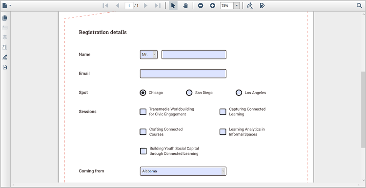

# Filling PDF Forms in WPF PDF Viewer
Filling PDF Forms in WPF PDF Viewer enables efficient entry and updating of form data in existing PDF documents. This functionality is supported through three distinct approaches:

1. [Form Filling Through User Interface](#fill-pdf-forms-through-the-user-interface)
2. [Filling Form Fields Programmatically](#fill-pdf-forms-programmatically)
3. [Importing Form Field Data](#fill-pdf-forms-through-import-data)

## Fill PDF forms through the User Interface

The Syncfusion WPF PDF Viewer enables PDF form fields to be filled directly through the built‑in user interface without requiring any code. Form fields can be selected and populated by entering text or choosing values based on the field type, providing a smooth and interactive form‑filling experience.

## Fill PDF forms programmatically 

WPF PDF Viewer allows PDF form fields to be filled or updated programmatically by accessing existing form fields and assigning values through APIs. This approach is useful when form data needs to be populated dynamically based on application logic or automated workflows.

The following example demonstrates how to update PDF form field values programmatically in the WPF PDF Viewer, including TextBox, CheckBox, ComboBox, ListBox, Signature field, and RadioButton form fields using the available APIs:




private void UpdateTextbox_Click(object sender, RoutedEventArgs e)
{
     if (pdfViewer.LoadedDocument.Form != null)
 {
     if (pdfViewer.LoadedDocument.Form.Fields[0] is PdfLoadedTextBoxField)
     {
        (pdfViewer.LoadedDocument.Form.Fields[0] as PdfLoadedTextBoxField).Text = "Syncfusion";
     }
     if(pdfViewer.LoadedDocument.Form.Fields[1] is PdfLoadedCheckBoxField)
     {
         (pdfViewer.LoadedDocument.Form.Fields[1] as PdfLoadedCheckBoxField).Checked = true;
     }
     if(pdfViewer.LoadedDocument.Form.Fields[2] is PdfLoadedComboBoxField)
     {
         (pdfViewer.LoadedDocument.Form.Fields[2] as PdfLoadedComboBoxField).SelectedIndex = 1;
     }
     if(pdfViewer.LoadedDocument.Form.Fields[3] is PdfLoadedListBoxField)
     {
         (pdfViewer.LoadedDocument.Form.Fields[3] as PdfLoadedListBoxField).SelectedIndex = new int[2] { 1, 2 };
     }
     if (pdfViewer.LoadedDocument.Form.Fields[4] is PdfLoadedSignatureField)
     {
         PdfLoadedPage page = pdfViewer.LoadedDocument.Pages[0] as PdfLoadedPage;
         FileStream certificateStream = new FileStream(@"PDF.pfx", FileMode.Open, FileAccess.Read);
         PdfCertificate certificate = new PdfCertificate(certificateStream, "syncfusion");

         //Load the signature field from field collection and fill this with certificate.
         PdfLoadedSignatureField loadedSignatureField = pdfViewer.LoadedDocument.Form.Fields[4] as PdfLoadedSignatureField;
         loadedSignatureField.Signature = new PdfSignature(pdfViewer.LoadedDocument, page, certificate, "Signature", loadedSignatureField);
         loadedSignatureField.Signature.Certificate = certificate;
         loadedSignatureField.Signature.Reason = "Reason";
         FileStream imageStream = new FileStream(System.IO.Path.GetFullPath(@"signature.jpg"), FileMode.Open, FileAccess.Read);

         //Load the image.
         PdfBitmap image = new PdfBitmap(imageStream);

         //Draw image in the signature appearance. 
         loadedSignatureField.Signature.Appearance.Normal.Graphics.DrawImage(image, new PointF(0, 0), new SizeF(loadedSignatureField.Bounds.Width, loadedSignatureField.Bounds.Height));
		 //To view the added signature in the output document
         pdfViewer.LoadedDocument.Save(System.IO.Path.GetFullPath(@"Output/Output.pdf"));
     }
     if (pdfViewer.LoadedDocument.Form.Fields[5] is PdfLoadedRadioButtonListField)
     {
         (pdfViewer.LoadedDocument.Form.Fields[5] as PdfLoadedRadioButtonListField).SelectedIndex = 1;
     }
 }
}




Private Sub UpdateTextbox_Click(sender As Object, e As RoutedEventArgs)
    If pdfViewer.LoadedDocument Is Nothing OrElse pdfViewer.LoadedDocument.Form Is Nothing Then
        Return
    End If

    Dim form = pdfViewer.LoadedDocument.Form

    ' TextBox (Field 0)
    Dim textBox = TryCast(form.Fields(0), PdfLoadedTextBoxField)
    If textBox IsNot Nothing Then
        textBox.Text = "Syncfusion"
    End If

    ' CheckBox (Field 1)
    Dim checkBox = TryCast(form.Fields(1), PdfLoadedCheckBoxField)
    If checkBox IsNot Nothing Then
        checkBox.Checked = True
    End If

    ' ComboBox (Field 2)
    Dim combo = TryCast(form.Fields(2), PdfLoadedComboBoxField)
    If combo IsNot Nothing Then
        combo.SelectedIndex = 1
    End If

    ' ListBox (Field 3)
    Dim listBox = TryCast(form.Fields(3), PdfLoadedListBoxField)
    If listBox IsNot Nothing Then
        listBox.SelectedIndex = New Integer() {1, 2}
    End If

    ' Signature Field (Field 4)
    Dim sigField = TryCast(form.Fields(4), PdfLoadedSignatureField)
    If sigField IsNot Nothing Then

        Dim page = TryCast(pdfViewer.LoadedDocument.Pages(0), PdfLoadedPage)

        ' Load certificate
        Using certificateStream As New FileStream("PDF.pfx", FileMode.Open, FileAccess.Read)

            Dim certificate As New PdfCertificate(certificateStream, "syncfusion")

            ' Create signature object
            Dim signature As New PdfSignature(pdfViewer.LoadedDocument, page, certificate, "Signature", sigField)
            signature.Certificate = certificate
            signature.Reason = "Reason"

            ' Load signature appearance image
            Using imageStream As New FileStream(Path.GetFullPath("signature.jpg"), FileMode.Open, FileAccess.Read)
                Dim image As New PdfBitmap(imageStream)

                signature.Appearance.Normal.Graphics.DrawImage(
                    image,
                    New PointF(0, 0),
                    New SizeF(sigField.Bounds.Width, sigField.Bounds.Height)
                )
            End Using

            ' Assign signature to field
            sigField.Signature = signature
        End Using

        ' To view the added signature in the output document
        pdfViewer.LoadedDocument.Save(Path.GetFullPath("Output/Output.pdf"))
    End If

    ' RadioButtonList (Field 5)
    Dim radioList = TryCast(form.Fields(5), PdfLoadedRadioButtonListField)
    If radioList IsNot Nothing Then
        radioList.SelectedIndex = 1
    End If

End Sub




N > For the signature to appear in the document, ensure that the loaded PDF document is saved after modification.

## Fill PDF forms through Export and Import Data 

In WPF PDF Viewer, exporting and importing form data simplifies working with PDF forms through both programmatic APIs and the built‑in user interface. Filled form data can be exported programmatically or through UI actions and stored in a database or file storage, preserving all entered values for later use. This capability helps save progress, share data between applications, and restore form states when needed.

The same exported data can be imported back into an existing PDF document using the [ImportFormData](https://help.syncfusion.com/cr/wpf/Syncfusion.Windows.PdfViewer.PdfDocumentView.html#Syncfusion_Windows_PdfViewer_PdfDocumentView_ImportFormData_System_String_Syncfusion_Pdf_Parsing_DataFormat_) API or supported UI options, allowing form fields to be pre-filled using external data sources without manual entry. During the import process, form data is automatically mapped to the corresponding form fields based on field names. Once imported, the populated values are displayed in the PDF Viewer and remain editable through the user interface if required.




private void button1_Click(object sender, RoutedEventArgs e)
{
    //Import PDF form data
    pdfviewer.ImportFormData("Import.fdf", Syncfusion.Pdf.Parsing.DataFormat.Fdf);
}




Private Sub button1_Click(sender As Object, e As RoutedEventArgs)
    'Import PDF form data
    pdfviewer.ImportFormData("Import.fdf", Syncfusion.Pdf.Parsing.DataFormat.Fdf)
End Sub




For more details, see [Import Form Data](./import-export-form-fields/import-form-fields).
For more details, see [Export Form Data](./import-export-form-fields/export-form-fields).

## See also

-  [Overview](./overview)
-  [Add form fields](./manage-form-fields/add-form-fields)
-  [Modify form fields values](./manage-form-fields/modify-form-fields) 
-  [Remove form fields](./manage-form-fields/remove-form-fields) 
-  [Form fields API](./form-fields-api)