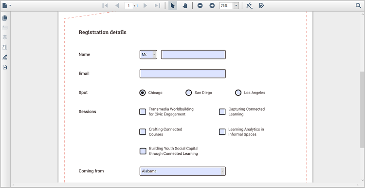

# Overview of Forms in WPF PDF Viewer

The Syncfusion WPF PDF Viewer delivers a complete, easy-to-use PDF forms experience. You can fill, edit, and delete form fields directly within your PDF documents. These actions are supported through both the intuitive user interface and powerful programmatic APIs.

The viewer also includes smooth import and export support for form data, making integration effortless. Developers benefit from extensive API control, while end users enjoy a clean and simple interface designed for a seamless and stress-free form-filling experience.

## Filling PDF Forms

Experience effortless PDF form filling through a clean, intuitive UI or automated workflows using powerful APIs. Flexible form data import and export support ensures smooth and efficient operations when working with PDF forms.

See the [Filling PDF Forms](./form-filling) page for full details.

1. [Programmatically Form fill](./form-filling## Fill PDF forms programmatically)
2. [Form Fill Using UI](./form-filling## Fill PDF forms through the User Interface)
3. [Import the Form data](./form-filling## Fill PDF forms through Import Data )

## Supported form field types

- [Textbox](./manage-form-fields/add-form-fields### Textbox)
- [Password](./manage-form-fields/add-form-fields### Password)
- [CheckBox](./manage-form-fields/add-form-fields### CheckBox)
- [RadioButton](./manage-form-fields/add-form-fields### RadioButton)
- [ListBox](./manage-form-fields/add-form-fields### ListBox)
- [ComboBox](./manage-form-fields/add-form-fields### ComboBox)
- [Signature field](./manage-form-fields/add-form-fields### Signature Field)
