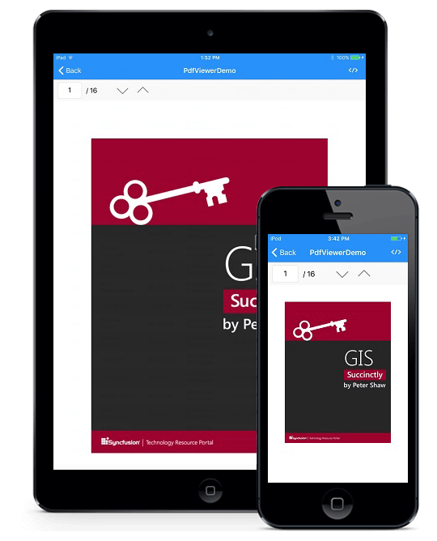

# About Syncfusion Xamarin.iOS PDF Viewer Control

PDF Viewer for Xamarin.iOS allows the user to view PDF documents within your Xamarin.iOS application. 

**Key features:**

The following list shows the key features available in PDF Viewer control.

* View PDF documents
* Search a text in PDF document
* Select text and copy it to clipboard
* Scroll, pan, zoom in and out
* Page navigation

N>PDF Viewer for Xamarin.iOS will be supported from iOS version 9.0 onwards.