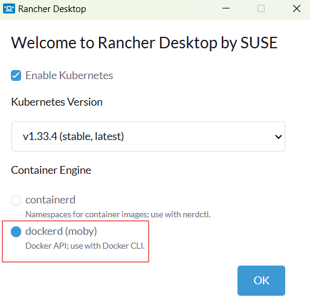
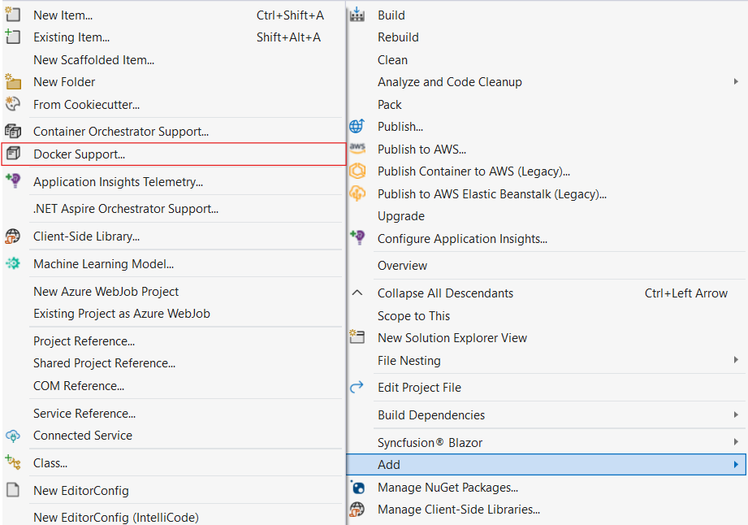
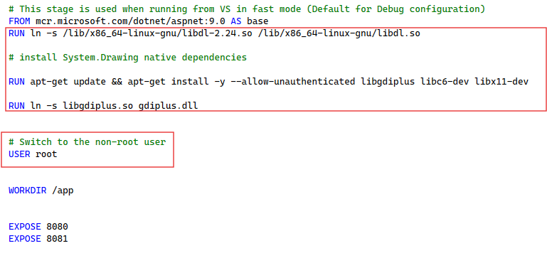
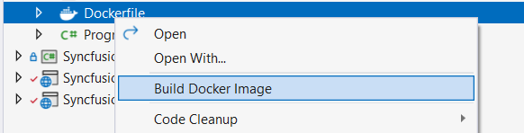

# Docker Image Hosting Guide for Blazor Web App

This article helps reduce deployment time and simplify publishing by using Docker images with a Blazor Smart PDF Viewer Web App. The [Syncfusion Document Processing API](https://hub.docker.com/r/syncfusion/document-processing-apis) is available as a ready-to-use Docker image for document processing scenarios and ensures a seamless experience for Docker users. The following sections describe how to publish Docker images for local validation.

## Deployment requirement
### Hardware requirement
The following hardware requirements are necessary to run document processing API:

- Windows
- CPU: 2-core
- Memory: 8 GB RAM
- Disk space: 8 GB or more

### Software requirements
The following software requirements are necessary to run document processing API:

- Application: Rancher Desktop
- Web browser: Microsoft Edge, Mozilla Firefox, or Google Chrome

## Steps to configure and run docker container

- **Step 1**: Install the Rancher desktop application from the official release page: [Rancher Desktop](https://github.com/rancher-sandbox/rancher-desktop/releases)

- **Step 2**: Open the Rancher Desktop application and select the displayed option.

- **Step 3**: Create a Smart Pdf Viewer web app sample by following the [documentation](https://help.syncfusion.com/document-processing/pdf/smart-pdf-viewer/blazor/getting-started/web-app).

- **Step 4**: Right-click the Smart PDF Viewer web app sample to add Docker support with Linux.

- **Step 5**: Once the Docker file is added, open the Docker file and add the following line.



FROM mcr.microsoft.com/dotnet/aspnet:9.0 AS base
RUN ln -s /lib/x86_64-linux-gnu/libdl-2.24.so /lib/x86_64-linux-gnu/libdl.so  

RUN apt-get update && apt-get install -y --allow-unauthenticated libgdiplus libc6-dev libx11-dev  

RUN ln -s libgdiplus.so gdiplus.dll  

USER root

WORKDIR /app

EXPOSE 8080
EXPOSE 8081
....



N> Remove the `User` if not needed or change the User type to `root` to provide elevated privileges.

- **Step 6**: Publish the image by building the DockerFile.

- **Step 7**: Open the command prompt or PowerShell and enter the following command to list the published Docker images.




docker image ls




- **Step 8**: To check the published images locally, run the below command which is in the format docker run -d -p 6001:{exposed Port} {Image ID}.




docker run -d -p 6001:8080 4eead1aaf7a5 




- **Step 9**: Ensure the published image runs as expected by navigating to the hosted link `http://localhost:6001/`.

## See also

* [Steps to deploy Docker Images from Container Registry to Azure App Services](https://learn.microsoft.com/en-us/azure/app-service/quickstart-custom-container?tabs=dotnet&pivots=container-linux-azure-portal).