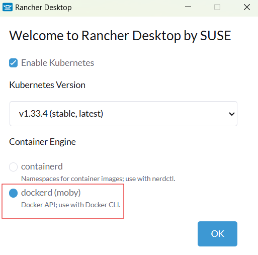
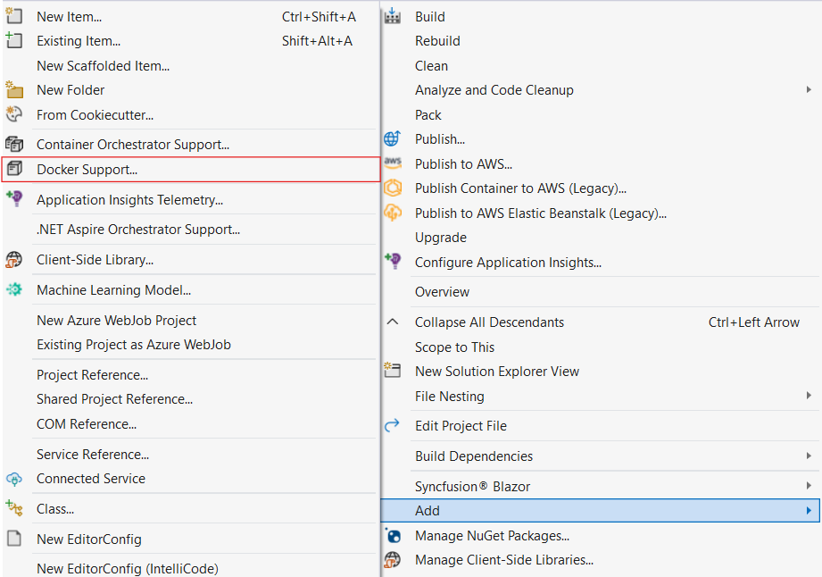
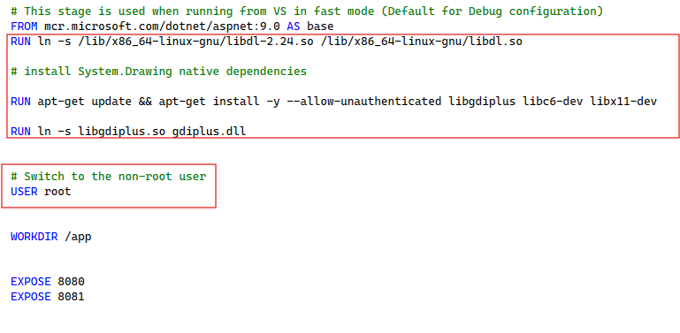
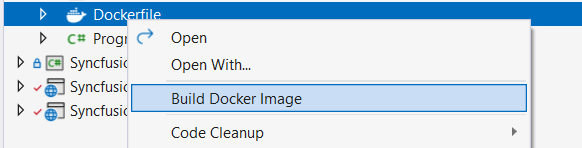

# Docker Image Hosting Guide for Blazor Web App

This article helps reduce deployment time and simplify publishing by using Docker images with a Blazor Smart PDF Viewer Web App. The [Syncfusion Document Processing API](https://hub.docker.com/r/syncfusion/document-processing-apis) is available as a ready-to-use Docker image for document processing scenarios and ensures a seamless experience for Docker users. The following sections describe how to build the Blazor Smart PDF Viewer Web App into a Docker image and host it locally for validation.

## Deployment requirement
### Hardware requirement
The following hardware requirements are necessary to run the document processing API:

- Windows
- CPU: 2-core
- Memory: 8 GB RAM
- Disk space: 8 GB or more

### Software requirements
The following software requirements are necessary to run the document processing API:

- Container runtime: Rancher Desktop (with the container runtime)
- Web browser: Microsoft Edge, Mozilla Firefox, or Google Chrome

## Steps to configure and run Docker container

- **Step 1**: Install the Rancher Desktop application from the official release page: [Rancher Desktop](https://github.com/rancher-sandbox/rancher-desktop/releases).

- **Step 2**: Open the Rancher Desktop application and select the container runtime.

- **Step 3**: Create a Smart PDF Viewer web app sample by following the [Getting Started documentation](../getting-started/web-app).

- **Step 4**: In Visual Studio, right-click the Smart PDF Viewer web app project and select **Add > Docker Support** to add Docker support targeting Linux.

- **Step 5**: Once the Dockerfile is added, open the Dockerfile and add the following lines.



FROM mcr.microsoft.com/dotnet/aspnet:9.0 AS base
RUN ln -s /lib/x86_64-linux-gnu/libdl-2.24.so /lib/x86_64-linux-gnu/libdl.so

RUN apt-get update && apt-get install -y --allow-unauthenticated libgdiplus libc6-dev libx11-dev

RUN ln -s libgdiplus.so gdiplus.dll

USER root

WORKDIR /app

EXPOSE 8080
EXPOSE 8081
....



N> Port `8080` is used for HTTP traffic and `8081` is used by the Blazor Server SignalR endpoint. The `EXPOSE` directive only documents the ports that the container listens on; the actual host-to-container port mapping is defined when running the container (see Step 8).

- **Step 6**: Build the image from the Dockerfile.

- **Step 7**: Open the command prompt or PowerShell and enter the following command to list the published Docker images. Note the **IMAGE ID** of the Blazor Smart PDF Viewer image for use in the next step.




docker image ls




- **Step 8**: To run the published image locally, use the following command in the format `docker run -d -p {Host Port}:{Container Port} {Image ID}`. Replace `{Host Port}` with a free port on your machine, `{Container Port}` with `8080` (or `8081` for the SignalR endpoint), and `{Image ID}` with the ID noted in Step 7.




docker run -d -p 6001:8080 4eead1aaf7a5




- **Step 9**: Verify that the Blazor Smart PDF Viewer web app loads successfully by navigating to the hosted link `http://localhost:6001/`.

## See also

* [Steps to deploy Docker Images from Container Registry to Azure App Services](https://learn.microsoft.com/en-us/azure/app-service/quickstart-custom-container?tabs=dotnet&pivots=container-linux-azure-portal).