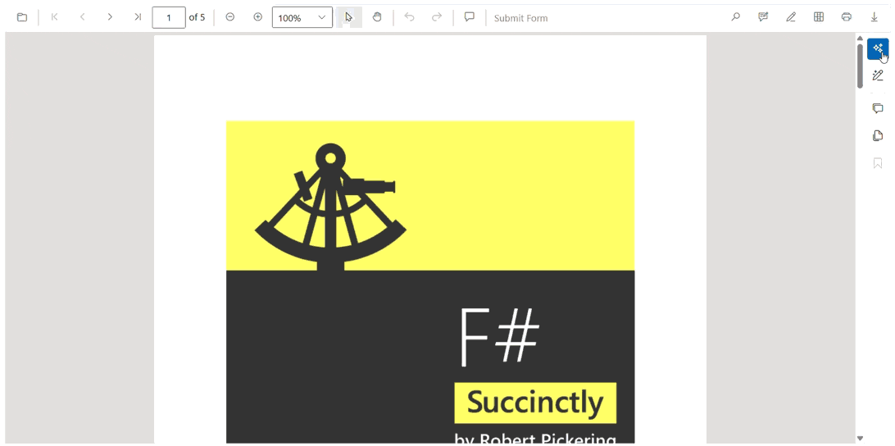
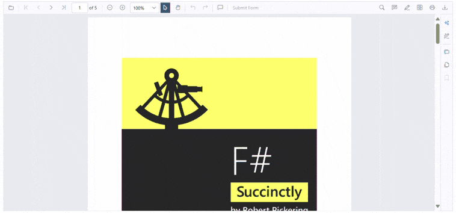
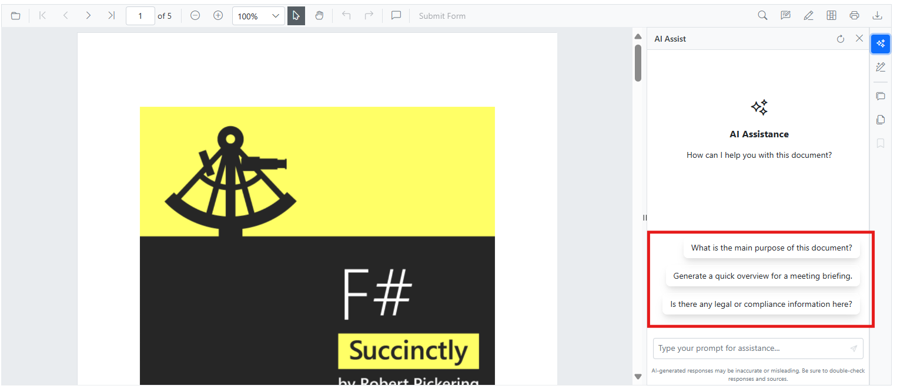
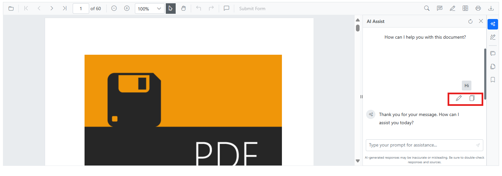
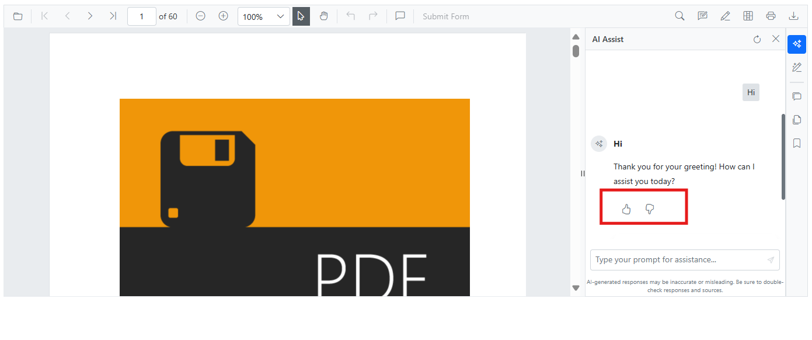
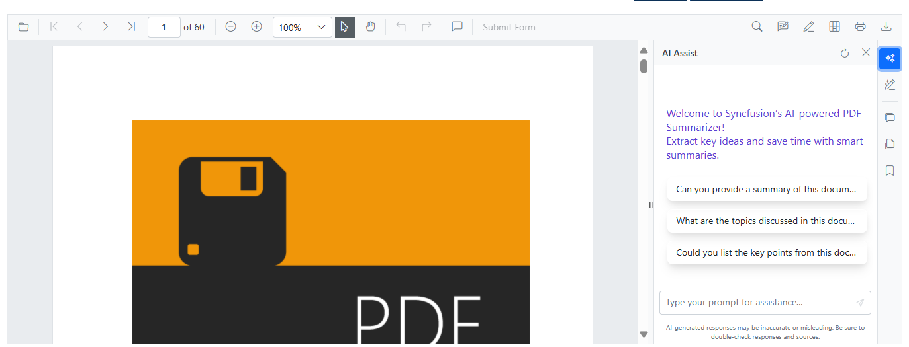

# Document Summaries in Blazor Smart PDF Viewer

The [`AssistViewSettings`](https://help.syncfusion.com/cr/blazor/Syncfusion.Blazor.SmartPdfViewer.AssistViewSettings.html) of [`SfSmartPdfViewer`](https://help.syncfusion.com/cr/blazor/Syncfusion.Blazor.SmartPdfViewer.SfSmartPdfViewer.html) enables AI-assisted interaction with PDF documents, including summarization and question answering.

The Assist view provides users with the ability to generate a summary of the PDF document and ask questions about its content. Users can activate the AI assistant by clicking the **AI AssistView** button at the bottom-right of the viewer. The assistant responds to user queries and offers AI-generated suggestions to guide exploration of the document.

## Component Usage




@* Initializes the Smart PDF Viewer with AI AssistView enabled for document summarization and Q&A *@

<SfSmartPdfViewer DocumentPath="https://cdn.syncfusion.com/content/pdf/pdf-succinctly.pdf">
    <AssistViewSettings/>
</SfSmartPdfViewer>




[View sample in GitHub](https://github.com/SyncfusionExamples/blazor-smart-pdf-viewer-examples/tree/master/DocumentSummarizer/AssistViewSettings)

## AssistViewSettings Parameters

### ShowPromptSuggestions
[`ShowPromptSuggestions`](https://help.syncfusion.com/cr/blazor/Syncfusion.Blazor.SmartPdfViewer.AssistViewSettings.html#Syncfusion_Blazor_SmartPdfViewer_AssistViewSettings_ShowPromptSuggestions) (type: `bool`) determines whether the Assist view displays a list of suggested prompts that users can click to initiate AI queries. The default value is `true`.




@* Enables display of suggested prompts in the Assist view to guide user queries *@

<SfSmartPdfViewer DocumentPath="https://cdn.syncfusion.com/content/pdf/pdf-succinctly.pdf">
    <AssistViewSettings ShowPromptSuggestions="true" />
</SfSmartPdfViewer>




### Prompt
The [`Prompt`](https://help.syncfusion.com/cr/blazor/Syncfusion.Blazor.SmartPdfViewer.AssistViewSettings.html#Syncfusion_Blazor_SmartPdfViewer_AssistViewSettings_Prompt) property (type: `string`) defines a query that guides the AI assistant within the Assist view panel. It supports two-way binding, so the prompt can be updated at runtime, for example from a button click event.




@* Updates the AI assistant's prompt at runtime through two-way binding *@

<button @onclick="ChangePrompt">Change Prompt</button>
<SfSmartPdfViewer DocumentPath="https://cdn.syncfusion.com/content/pdf/pdf-succinctly.pdf">
    <AssistViewSettings @bind-Prompt="@Prompts"></AssistViewSettings>
</SfSmartPdfViewer>

@code {
    private string Prompts { get; set; }
    private void ChangePrompt()
    {
        Prompts = "Explain this document";
    }
}




### PromptChanged
[`PromptChanged`](https://help.syncfusion.com/cr/blazor/Syncfusion.Blazor.SmartPdfViewer.AssistViewSettings.html#Syncfusion_Blazor_SmartPdfViewer_AssistViewSettings_PromptChanged) (type: `EventCallback<string>`) is raised whenever the user modifies the prompt text. The callback receives the updated prompt as a `string` argument, so the application can log the new prompt or trigger additional actions in response.




@* Handles changes to the prompt input, allowing dynamic response to user edits *@

<SfSmartPdfViewer DocumentPath="https://cdn.syncfusion.com/content/pdf/pdf-succinctly.pdf">
    <AssistViewSettings PromptChanged="@OnPromptChanged" />
</SfSmartPdfViewer>

@code {
    private void OnPromptChanged(string newPrompt)
    {
        Console.WriteLine($"Prompt changed: {newPrompt}");
    }
}




### Placeholder
The [`Placeholder`](https://help.syncfusion.com/cr/blazor/Syncfusion.Blazor.SmartPdfViewer.AssistViewSettings.html#Syncfusion_Blazor_SmartPdfViewer_AssistViewSettings_Placeholder) property (type: `string`) sets the placeholder text shown in the Assist view input field when it is empty. The default value is `Type your prompt for assistance...`.




@* Sets custom placeholder text in the Assist view input field to guide user input *@

<SfSmartPdfViewer DocumentPath="https://cdn.syncfusion.com/content/pdf/pdf-succinctly.pdf">
    <AssistViewSettings Placeholder="Enter your query..." />
</SfSmartPdfViewer>




### MinLength
[`MinLength`](https://help.syncfusion.com/cr/blazor/Syncfusion.Blazor.SmartPdfViewer.AssistViewSettings.html#Syncfusion_Blazor_SmartPdfViewer_AssistViewSettings_MinLength) (type: `int`) specifies the minimum number of characters the user must enter in the prompt input before AI processing is enabled. If the input is shorter than this threshold, an error message is shown and AI features are disabled. The default value is `100`.




@* Specifies the minimum character count required in the user prompt before AI features activate *@

<SfSmartPdfViewer DocumentPath="https://cdn.syncfusion.com/content/pdf/pdf-succinctly.pdf">
   <AssistViewSettings MinLength="100" />
</SfSmartPdfViewer>




### StreamResponse
[`StreamResponse`](https://help.syncfusion.com/cr/blazor/Syncfusion.Blazor.SmartPdfViewer.AssistViewSettings.html#Syncfusion_Blazor_SmartPdfViewer_AssistViewSettings_StreamResponse) (type: `bool`) streams AI responses to the user in real time. When enabled, users see the output as it is generated instead of waiting for the full response. The default value is `false`.




@* Enables real-time streaming of AI responses for a more dynamic user experience *@

<SfSmartPdfViewer DocumentPath="https://cdn.syncfusion.com/content/pdf/pdf-succinctly.pdf">
    <AssistViewSettings StreamResponse="true" />
</SfSmartPdfViewer>




### MaxRetryAttempts
[`MaxRetryAttempts`](https://help.syncfusion.com/cr/blazor/Syncfusion.Blazor.SmartPdfViewer.AssistViewSettings.html#Syncfusion_Blazor_SmartPdfViewer_AssistViewSettings_MaxRetryAttempts) (type: `int`) sets the maximum number of retry attempts for AI processing. If the assistant encounters an error, it retries the operation up to the specified number of times before showing an error message. The default value is `3`.




@* Sets the number of retry attempts for AI processing in case of transient errors *@

<SfSmartPdfViewer DocumentPath="https://cdn.syncfusion.com/content/pdf/pdf-succinctly.pdf">
   <AssistViewSettings MaxRetryAttempts="3" />
</SfSmartPdfViewer>




### Timeout
The [`Timeout`](https://help.syncfusion.com/cr/blazor/Syncfusion.Blazor.SmartPdfViewer.AssistViewSettings.html#Syncfusion_Blazor_SmartPdfViewer_AssistViewSettings_Timeout) property (type: `int`) defines the maximum duration, in seconds, that the AI assistant will wait for a response before timing out. If the response is not received within this period, the operation is aborted and an error is shown. The default value is `30`.




@* Defines the maximum wait time (in seconds) for AI response before showing a timeout error *@

<SfSmartPdfViewer DocumentPath="https://cdn.syncfusion.com/content/pdf/pdf-succinctly.pdf">
    <AssistViewSettings Timeout="30" />
</SfSmartPdfViewer>




### Enable
[`Enable`](https://help.syncfusion.com/cr/blazor/Syncfusion.Blazor.SmartPdfViewer.AssistViewSettings.html#Syncfusion_Blazor_SmartPdfViewer_AssistViewSettings_Enable) (type: `bool`) controls whether the Assist view and its features are available in the PDF viewer. When set to `false`, the AI assistant is disabled and the launch button is hidden from the toolbar. The default value is `true`.




@* Toggles the availability of the AI Assist view and its features in the PDF viewer *@

<SfSmartPdfViewer DocumentPath="https://cdn.syncfusion.com/content/pdf/pdf-succinctly.pdf">
    <AssistViewSettings Enable="true" />
</SfSmartPdfViewer>




## InitialPromptSettings – SmartPdfViewer

The [`InitialPromptSettings`](https://help.syncfusion.com/cr/blazor/Syncfusion.Blazor.SmartPdfViewer.InitialPromptSettings.html) class configures the initial behavior of the Assist view in the `SfSmartPdfViewer`. It guides the AI assistant by providing a predefined prompt, suggested queries, and a page range for summarization.

### InitialPromptSettings Parameters

#### Prompt
[`Prompt`](https://help.syncfusion.com/cr/blazor/Syncfusion.Blazor.SmartPdfViewer.InitialPromptSettings.html#Syncfusion_Blazor_SmartPdfViewer_InitialPromptSettings_Prompt) (type: `string`) sets the initial query shown in the input field when the Assist view opens. This directs the AI assistant to perform a specific task immediately.




@* Sets the initial prompt that appears in the Assist view input field when the viewer loads *@

<SfSmartPdfViewer DocumentPath="https://cdn.syncfusion.com/content/pdf/pdf-succinctly.pdf">
    <AssistViewSettings>
        <InitialPromptSettings Prompt="Explain this document." />
    </AssistViewSettings>
</SfSmartPdfViewer>




[View sample in GitHub](https://github.com/SyncfusionExamples/blazor-smart-pdf-viewer-examples/tree/master/DocumentSummarizer/InitialPromptSettings)

#### SuggestedPrompts
[`SuggestedPrompts`](https://help.syncfusion.com/cr/blazor/Syncfusion.Blazor.SmartPdfViewer.InitialPromptSettings.html#Syncfusion_Blazor_SmartPdfViewer_InitialPromptSettings_SuggestedPrompts) (type: `string[]`) provides a list of predefined prompts that guide the user and help the AI understand the document context.




@* Provides a list of suggested prompts to guide user interaction with the AI assistant *@

<SfSmartPdfViewer DocumentPath="https://cdn.syncfusion.com/content/pdf/pdf-succinctly.pdf">
    <AssistViewSettings>
        <InitialPromptSettings SuggestedPrompts="@CustomSuggestions" />
    </AssistViewSettings>
</SfSmartPdfViewer>

@code {
    string[] CustomSuggestions = new[] {
        "What is the main purpose of this document?",
        "Generate a quick overview for a meeting briefing.",
        "Is there any legal or compliance information here?",
    };
}




N> [View sample in GitHub](https://github.com/SyncfusionExamples/blazor-smart-pdf-viewer-examples/tree/master/DocumentSummarizer/SuggestedPrompts)

#### PageStart
[`PageStart`](https://help.syncfusion.com/cr/blazor/Syncfusion.Blazor.SmartPdfViewer.InitialPromptSettings.html#Syncfusion_Blazor_SmartPdfViewer_InitialPromptSettings_PageStart) (type: `int`) defines the starting page number (1-based) for the document overview. Use it together with `PageEnd` to focus AI analysis on a specific page range. The default starts at page `1`.




@* Defines the starting page number for AI analysis in the Assist view (starts from page 1) *@

<SfSmartPdfViewer DocumentPath="https://cdn.syncfusion.com/content/pdf/pdf-succinctly.pdf">
    <AssistViewSettings>
        <InitialPromptSettings PageStart="1" />
    </AssistViewSettings>
</SfSmartPdfViewer>




N> [View sample in GitHub](https://github.com/SyncfusionExamples/blazor-smart-pdf-viewer-examples/tree/master/DocumentSummarizer/InitialPromptSettings)

#### PageEnd
[`PageEnd`](https://help.syncfusion.com/cr/blazor/Syncfusion.Blazor.SmartPdfViewer.InitialPromptSettings.html#Syncfusion_Blazor_SmartPdfViewer_InitialPromptSettings_PageEnd) (type: `int`) defines the ending page number for the document overview. Use it together with `PageStart` to limit the scope of AI processing and manage performance.



@* Defines the ending page number for AI analysis in the Assist view to limit processing scope *@

<SfSmartPdfViewer DocumentPath="https://cdn.syncfusion.com/content/pdf/pdf-succinctly.pdf">
    <AssistViewSettings>
        <InitialPromptSettings PageEnd="5" />
    </AssistViewSettings>
</SfSmartPdfViewer>




N> [View sample in GitHub](https://github.com/SyncfusionExamples/blazor-smart-pdf-viewer-examples/tree/master/DocumentSummarizer/InitialPromptSettings)

## Customizing Assist View with PdfViewerTemplates – SmartPdfViewer

The [`PdfViewerTemplates`](https://help.syncfusion.com/cr/blazor/Syncfusion.Blazor.SmartPdfViewer.PdfViewerTemplates.html) class in Syncfusion's [`SmartPdfViewer`](https://help.syncfusion.com/cr/blazor/Syncfusion.Blazor.SmartPdfViewer.html) component customizes the layout and functionality of the Assist view. It includes templates for the prompt input toolbar, AI response toolbar, and banner section, enabling a more personalized and interactive user experience.

### PdfViewerTemplates Parameters

#### PromptTemplate
[`PromptTemplate`](https://help.syncfusion.com/cr/blazor/Syncfusion.Blazor.SmartPdfViewer.PdfViewerTemplates.html#Syncfusion_Blazor_SmartPdfViewer_PdfViewerTemplates_PromptTemplate) defines the toolbar layout within the prompt view. Developers can use [`PromptToolbar`](https://help.syncfusion.com/cr/blazor/Syncfusion.Blazor.InteractiveChat.PromptToolbar.html) and [`PromptToolbarItem`](https://help.syncfusion.com/cr/blazor/Syncfusion.Blazor.InteractiveChat.PromptToolbarItem.html#constructors) to add icons and actions that guide user input.




@* Customizes the prompt input area with toolbar icons to guide user interaction *@

@using Syncfusion.Blazor.InteractiveChat;

<SfSmartPdfViewer DocumentPath="https://cdn.syncfusion.com/content/pdf/pdf-succinctly.pdf">
    <AssistViewSettings>
        <PdfViewerTemplates>
            <PromptTemplate>
                <PromptToolbar>
                    <PromptToolbarItem IconCss="e-icons e-assist-edit"></PromptToolbarItem>
                    <PromptToolbarItem IconCss="e-icons e-assist-copy"></PromptToolbarItem>
                </PromptToolbar>
            </PromptTemplate>
        </PdfViewerTemplates>
    </AssistViewSettings>
</SfSmartPdfViewer>




N> [View sample in GitHub](https://github.com/SyncfusionExamples/blazor-smart-pdf-viewer-examples/tree/master/DocumentSummarizer/PdfViewerTemplates)

#### ResponseTemplate
[`ResponseTemplate`](https://help.syncfusion.com/cr/blazor/Syncfusion.Blazor.SmartPdfViewer.PdfViewerTemplates.html#Syncfusion_Blazor_SmartPdfViewer_PdfViewerTemplates_ResponseTemplate) customizes the toolbar shown in the response section. Using [`ResponseToolbar`](https://help.syncfusion.com/cr/blazor/Syncfusion.Blazor.InteractiveChat.ResponseToolbar.html) and [`ResponseToolbarItem`](https://help.syncfusion.com/cr/blazor/Syncfusion.Blazor.InteractiveChat.ResponseToolbarItem.html), developers can include feedback options like "like" or "dislike".




@* Adds a custom toolbar to the AI response section for feedback actions like 'like' and 'dislike' *@

@using Syncfusion.Blazor.InteractiveChat;

<SfSmartPdfViewer DocumentPath="https://cdn.syncfusion.com/content/pdf/pdf-succinctly.pdf">
    <AssistViewSettings>
        <PdfViewerTemplates>
            <ResponseTemplate>
                <ResponseToolbar>
                    <ResponseToolbarItem IconCss="e-icons e-assist-like"></ResponseToolbarItem>
                    <ResponseToolbarItem IconCss="e-icons e-assist-dislike"></ResponseToolbarItem>
                </ResponseToolbar>
            </ResponseTemplate>
        </PdfViewerTemplates>
    </AssistViewSettings>
</SfSmartPdfViewer>




N> [View sample in GitHub](https://github.com/SyncfusionExamples/blazor-smart-pdf-viewer-examples/tree/master/DocumentSummarizer/PdfViewerTemplates)

#### BannerTemplate
Use the [`BannerTemplate`](https://help.syncfusion.com/cr/blazor/Syncfusion.Blazor.SmartPdfViewer.PdfViewerTemplates.html#Syncfusion_Blazor_SmartPdfViewer_PdfViewerTemplates_BannerTemplate) to display a banner at the top of the Assist view. This can be used for branding, instructions, or welcome messages to enhance user engagement. The following example demonstrates BannerTemplate usage in the SfSmartPdfViewer component.




@* Displays a banner at the top of the Assist view for branding or instructional messaging *@

<SfSmartPdfViewer DocumentPath="https://cdn.syncfusion.com/content/pdf/pdf-succinctly.pdf">
    <AssistViewSettings>
        <PdfViewerTemplates>
            <BannerTemplate>
                

                    Welcome to Syncfusion’s AI-powered PDF Summarizer! 
                    Extract key ideas and save time with smart summaries.
                

            </BannerTemplate>
        </PdfViewerTemplates>
    </AssistViewSettings>
</SfSmartPdfViewer>




N> [View sample in GitHub](https://github.com/SyncfusionExamples/blazor-smart-pdf-viewer-examples/tree/master/DocumentSummarizer/PdfViewerTemplates)

## Integration Notes

To apply these templates, include them within the [`AssistViewSettings`](https://help.syncfusion.com/cr/blazor/Syncfusion.Blazor.SmartPdfViewer.AssistViewSettings.html) of the [`SfSmartPdfViewer`](https://help.syncfusion.com/cr/blazor/Syncfusion.Blazor.SmartPdfViewer.SfSmartPdfViewer.html). The following example combines `AssistViewSettings`, `InitialPromptSettings`, and `PdfViewerTemplates` in a single page.




@* Combines AssistViewSettings, InitialPromptSettings, and PdfViewerTemplates in a single SfSmartPdfViewer *@

@using Syncfusion.Blazor.InteractiveChat;
@using Syncfusion.Blazor.SmartPdfViewer;

<SfSmartPdfViewer DocumentPath="https://cdn.syncfusion.com/content/pdf/pdf-succinctly.pdf">
    <AssistViewSettings ShowPromptSuggestions="true"
                        Placeholder="Enter your query..."
                        StreamResponse="true"
                        Timeout="30"
                        MaxRetryAttempts="3"
                        MinLength="100"
                        Enable="true">
        <InitialPromptSettings Prompt="Explain this document."
                               PageStart="1"
                               PageEnd="5"
                               SuggestedPrompts="@CustomSuggestions" />
        <PdfViewerTemplates>
            <BannerTemplate>
                

                    Welcome to Syncfusion’s AI-powered PDF Summarizer!
                

            </BannerTemplate>
            <PromptTemplate>
                <PromptToolbar>
                    <PromptToolbarItem IconCss="e-icons e-assist-edit"></PromptToolbarItem>
                    <PromptToolbarItem IconCss="e-icons e-assist-copy"></PromptToolbarItem>
                </PromptToolbar>
            </PromptTemplate>
            <ResponseTemplate>
                <ResponseToolbar>
                    <ResponseToolbarItem IconCss="e-icons e-assist-like"></ResponseToolbarItem>
                    <ResponseToolbarItem IconCss="e-icons e-assist-dislike"></ResponseToolbarItem>
                </ResponseToolbar>
            </ResponseTemplate>
        </PdfViewerTemplates>
    </AssistViewSettings>
</SfSmartPdfViewer>

@code {
    private string[] CustomSuggestions = new[] {
        "What is the main purpose of this document?",
        "Generate a quick overview for a meeting briefing.",
        "Is there any legal or compliance information here?",
    };
}




## See also

* [Explore Blazor Smart PDF Viewer Document Summarization Demo](https://document.syncfusion.com/demos/pdf-viewer/blazor-server/smart-pdf-viewer/summarizer?theme=fluent2)
* [Smart Redaction in Blazor Smart PDF Viewer](./smart-redaction)
* [Smart Fill in Blazor Smart PDF Viewer](./smart-fill)

