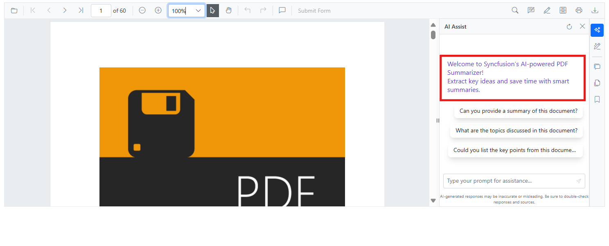

# Document Summaries in Blazor Smart PDF Viewer

The SmartPdfViewer [AssistViewSettings](https://help.syncfusion.com//cr/blazor/Syncfusion.Blazor.SmartPdfViewer.AssistViewSettings.html) allows seamless interaction with PDF documents by incorporating AI-assisted functionalities such as summarization and question answering.

The Assist view provides users with the ability to generate a summary of the PDF document and ask questions about its content. Users can activate the AI assistant by clicking the **AI AssistView** button at the bottom-right of the viewer. The assistant responds to user queries and offers AI-generated suggestions to guide exploration of the document.

## Component Usage




@* Initializes the Smart PDF Viewer with AI AssistView enabled for document summarization and Q&A *@

<SfSmartPdfViewer DocumentPath="https://cdn.syncfusion.com/content/pdf/pdf-succinctly.pdf">
    <AssistViewSettings/>
</SfSmartPdfViewer>




[View sample in GitHub](https://github.com/SyncfusionExamples/blazor-smart-pdf-viewer-examples/tree/master/DocumentSummarizer/AssistViewSettings)
## AssistViewSettings Parameters

### ShowPromptSuggestions
[ShowPromptSuggestions](https://help.syncfusion.com//cr/blazor/Syncfusion.Blazor.SmartPdfViewer.AssistViewSettings.html#Syncfusion_Blazor_SmartPdfViewer_AssistViewSettings_ShowPromptSuggestions) determines whether prompt suggestions are displayed to the user in the Assist view. When set to `true`, the interface will show a list of suggested prompts that users can click to initiate AI queries. This helps guide users who may not know what to ask and improves the overall usability of the assistant. The default value is `true`.




@* Enables display of suggested prompts in the Assist view to guide user queries *@

<SfSmartPdfViewer DocumentPath="https://cdn.syncfusion.com/content/pdf/pdf-succinctly.pdf">
    <AssistViewSettings ShowPromptSuggestions="true" />
</SfSmartPdfViewer>




### Prompt
The [Prompt](https://help.syncfusion.com//cr/blazor/Syncfusion.Blazor.SmartPdfViewer.AssistViewSettings.html#Syncfusion_Blazor_SmartPdfViewer_AssistViewSettings_Prompt) property defines a query that guides the AI assistant within the Assist view panel. If the user wants to change the prompt at runtime, developers can bind a custom prompt dynamically—for example, by using a button click event to update the prompt value. This allows flexible interaction and real-time customization of the assistant’s behavior based on user input.




<button @onclick="ChangePrompt">Change Prompt</button>
<SfSmartPdfViewer DocumentPath="https://cdn.syncfusion.com/content/pdf/pdf-succinctly.pdf">
<AssistViewSettings @bind-Prompt="@Prompts"></AssistViewSettings>
</SfSmartPdfViewer>
 
@code {
    string Prompts;
    void ChangePrompt()
    {
        Prompts = "Explain this document";
    }
}




### PromptChanged
[PromptChanged](https://help.syncfusion.com//cr/blazor/Syncfusion.Blazor.SmartPdfViewer.AssistViewSettings.html#Syncfusion_Blazor_SmartPdfViewer_AssistViewSettings_PromptChanged) is a callback that is triggered whenever the user modifies the prompt text. It allows developers to track changes in real time and respond to user input dynamically. For example, the application can log the new prompt or trigger additional actions based on the updated query.




@* Handles changes to the prompt input, allowing dynamic response to user edits *@

<SfSmartPdfViewer DocumentPath="https://cdn.syncfusion.com/content/pdf/pdf-succinctly.pdf">
    <AssistViewSettings PromptChanged="@OnPromptChanged" />
</SfSmartPdfViewer>

@code {
    private void OnPromptChanged(string newPrompt)
    {
        Console.WriteLine($"Prompt changed: {newPrompt}");
    }
}




### Placeholder
The [Placeholder](https://help.syncfusion.com//cr/blazor/Syncfusion.Blazor.SmartPdfViewer.AssistViewSettings.html#Syncfusion_Blazor_SmartPdfViewer_AssistViewSettings_Placeholder) property sets the placeholder text in the input field of the Assist view. This text appears when the field is empty and serves as a hint to the user about what kind of input is expected. The default value is "Type your prompt for assistance..." and can be customized to suit the application's tone and purpose.




@* Sets custom placeholder text in the Assist view input field to guide user input *@

<SfSmartPdfViewer DocumentPath="https://cdn.syncfusion.com/content/pdf/pdf-succinctly.pdf">
    <AssistViewSettings Placeholder="Enter your query..." />
</SfSmartPdfViewer>




### MinLength
[MinLength](https://help.syncfusion.com//cr/blazor/Syncfusion.Blazor.SmartPdfViewer.AssistViewSettings.html#Syncfusion_Blazor_SmartPdfViewer_AssistViewSettings_MinLength) specifies the minimum number of characters required for AI processing to be enabled. If fewer characters are available than the specified threshold, an error message is displayed and AI features are disabled. This ensures sufficient content for analysis and prevents unnecessary processing of trivial inputs. The default value is `100`.




@* Specifies minimum character count required in the document for AI features to activate *@

<SfSmartPdfViewer DocumentPath="https://cdn.syncfusion.com/content/pdf/pdf-succinctly.pdf">
   <AssistViewSettings MinLength="100" />
</SfSmartPdfViewer>




### StreamResponse
When [StreamResponse](https://help.syncfusion.com//cr/blazor/Syncfusion.Blazor.SmartPdfViewer.AssistViewSettings.html#Syncfusion_Blazor_SmartPdfViewer_AssistViewSettings_StreamResponse) is enabled, it allows AI responses to be streamed to the user in real time. Instead of waiting for the entire response to be generated, users see the output as it is being composed. This improves perceived performance and makes the interaction feel more dynamic. The default value is `false`.




@* Enables real-time streaming of AI responses for a more dynamic user experience *@

<SfSmartPdfViewer DocumentPath="https://cdn.syncfusion.com/content/pdf/pdf-succinctly.pdf">
    <AssistViewSettings StreamResponse="true" />
</SfSmartPdfViewer>




### MaxRetryAttempts
[MaxRetryAttempts](https://help.syncfusion.com//cr/blazor/Syncfusion.Blazor.SmartPdfViewer.AssistViewSettings.html#Syncfusion_Blazor_SmartPdfViewer_AssistViewSettings_MaxRetryAttempts) sets the maximum number of retry attempts for AI processing. If the assistant encounters an error, it will retry the operation up to the specified number of times before showing an error message. This helps improve reliability in cases where transient issues may affect AI response generation. The default value is `3`.




@* Sets the number of retry attempts for AI processing in case of transient errors *@

<SfSmartPdfViewer DocumentPath="https://cdn.syncfusion.com/content/pdf/pdf-succinctly.pdf">
   <AssistViewSettings MaxRetryAttempts="3" />
</SfSmartPdfViewer>




### Timeout
The [Timeout](https://help.syncfusion.com//cr/blazor/Syncfusion.Blazor.SmartPdfViewer.AssistViewSettings.html#Syncfusion_Blazor_SmartPdfViewer_AssistViewSettings_Timeout) property defines the maximum duration (in seconds) that the AI assistant will wait for a response before timing out. If the response is not received within this period, the operation is aborted and an error is shown. This prevents the application from hanging indefinitely and ensures timely feedback to the user. The default value is `30`.




@* Defines the maximum wait time (in seconds) for AI response before showing a timeout error *@

<SfSmartPdfViewer DocumentPath="https://cdn.syncfusion.com/content/pdf/pdf-succinctly.pdf">
    <AssistViewSettings Timeout="30" />
</SfSmartPdfViewer>




### Enable
[Enable](https://help.syncfusion.com//cr/blazor/Syncfusion.Blazor.SmartPdfViewer.AssistViewSettings.html#Syncfusion_Blazor_SmartPdfViewer_AssistViewSettings_Enable) controls whether the Assist view and its features are available in the PDF viewer. When set to `false`, the AI assistant is completely disabled, and the launch button is hidden from the toolbar. This is useful for scenarios where AI features are not required or need to be restricted. The default value is `true`.




@* Toggles the availability of the AI Assist view and its features in the PDF viewer *@

<SfSmartPdfViewer DocumentPath="https://cdn.syncfusion.com/content/pdf/pdf-succinctly.pdf">
    <AssistViewSettings Enable="true" />
</SfSmartPdfViewer>




## InitialPromptSettings – SmartPdfViewer
The [InitialPromptSettings](https://help.syncfusion.com//cr/blazor/Syncfusion.Blazor.SmartPdfViewer.InitialPromptSettings.html) allows developers to configure the initial behavior of the Assist view in the SfSmartPdfViewer. It helps guide the AI assistant by providing a predefined prompt, suggested queries, and page range for summarization. This improves the relevance and performance of AI responses, especially in structured document workflows.

## InitialPromptSetting Parameter

### Prompt
[Prompt](https://help.syncfusion.com//cr/blazor/Syncfusion.Blazor.SmartPdfViewer.InitialPromptSettings.html#Syncfusion_Blazor_SmartPdfViewer_InitialPromptSettings_Prompt) sets the initial query shown in the input field when the Assist view opens. This helps direct the AI assistant to perform a specific task immediately.




@* Sets the initial prompt that appears in the Assist view input field when the viewer loads *@

<SfSmartPdfViewer DocumentPath="https://cdn.syncfusion.com/content/pdf/pdf-succinctly.pdf">
    <AssistViewSettings>
        <InitialPromptSettings Prompt="Explain this document." />
    </AssistViewSettings>
</SfSmartPdfViewer>




[View sample in GitHub](https://github.com/SyncfusionExamples/blazor-smart-pdf-viewer-examples/tree/master/DocumentSummarizer/InitialPromptSettings)

### SuggestedPrompts
[SuggestedPrompts](https://help.syncfusion.com//cr/blazor/Syncfusion.Blazor.SmartPdfViewer.InitialPromptSettings.html#Syncfusion_Blazor_SmartPdfViewer_InitialPromptSettings_SuggestedPrompts) provides a list of predefined prompts that guide the user or help the AI understand the context better.




@* Provides a list of suggested prompts to guide user interaction with the AI assistant *@

<SfSmartPdfViewer DocumentPath="https://cdn.syncfusion.com/content/pdf/pdf-succinctly.pdf">
    <AssistViewSettings>
        <InitialPromptSettings SuggestedPrompts="@CustomSuggestions" />
    </AssistViewSettings>
</SfSmartPdfViewer>

@code {
    string[] CustomSuggestions = new[] {
        "What is the main purpose of this document?",
        "Generate a quick overview for a meeting briefing.",
        "Is there any legal or compliance information here?",
    };
}




N> [View sample in GitHub](https://github.com/SyncfusionExamples/blazor-smart-pdf-viewer-examples/tree/master/DocumentSummarizer/SuggestedPrompts)

### PageStart
[PageStart](https://help.syncfusion.com//cr/blazor/Syncfusion.Blazor.SmartPdfViewer.InitialPromptSettings.html#Syncfusion_Blazor_SmartPdfViewer_InitialPromptSettings_PageStart) defines the starting page number for the document overview. Useful for focusing AI analysis on specific sections.




@* Defines the starting page number for AI analysis in the Assist view (starts from page 1) *@

<SfSmartPdfViewer DocumentPath="https://cdn.syncfusion.com/content/pdf/pdf-succinctly.pdf">
    <AssistViewSettings>
        <InitialPromptSettings PageStart="1" />
    </AssistViewSettings>
</SfSmartPdfViewer>




N> [View sample in GitHub](https://github.com/SyncfusionExamples/blazor-smart-pdf-viewer-examples/tree/master/DocumentSummarizer/InitialPromptSettings)

### PageEnd
[PageEnd](https://help.syncfusion.com//cr/blazor/Syncfusion.Blazor.SmartPdfViewer.InitialPromptSettings.html#Syncfusion_Blazor_SmartPdfViewer_InitialPromptSettings_PageEnd) defines the ending page number for the document overview. Helps limit the scope of AI processing and manage performance.



@* Defines the ending page number for AI analysis in the Assist view to limit processing scope *@

<SfSmartPdfViewer DocumentPath="https://cdn.syncfusion.com/content/pdf/pdf-succinctly.pdf">
    <AssistViewSettings>
        <InitialPromptSettings PageEnd="5" />
    </AssistViewSettings>
</SfSmartPdfViewer>




N> [View sample in GitHub](https://github.com/SyncfusionExamples/blazor-smart-pdf-viewer-examples/tree/master/DocumentSummarizer/InitialPromptSettings)

## Customizing Assist View with PdfViewerTemplates – SmartPdfViewer

The [PdfViewerTemplates](https://help.syncfusion.com//cr/blazor/Syncfusion.Blazor.SmartPdfViewer.PdfViewerTemplates.html) class in Syncfusion's [SmartPdfViewer](https://help.syncfusion.com//cr/blazor/Syncfusion.Blazor.SmartPdfViewer.html) component allows developers to customize the layout and functionality of the Assist view. This includes defining templates for the prompt input toolbar, AI response toolbar, and banner section, enabling a more personalized and interactive user experience.

## Template Properties

### PromptTemplate
[PromptTemplate](https://help.syncfusion.com//cr/blazor/Syncfusion.Blazor.SmartPdfViewer.PdfViewerTemplates.html#Syncfusion_Blazor_SmartPdfViewer_PdfViewerTemplates_PromptTemplate) defines the toolbar layout within the prompt view. Developers can use [PromptToolbar](https://help.syncfusion.com/cr/blazor/Syncfusion.Blazor.InteractiveChat.PromptToolbar.html) and [PromptToolbarItem](https://help.syncfusion.com/cr/blazor/Syncfusion.Blazor.InteractiveChat.PromptToolbarItem.html#constructors) to add icons and actions that guide user input.




@* Customizes the prompt input area with toolbar icons to guide user interaction *@

@using Syncfusion.Blazor.InteractiveChat;

<SfSmartPdfViewer DocumentPath="https://cdn.syncfusion.com/content/pdf/pdf-succinctly.pdf">
    <AssistViewSettings>
        <PdfViewerTemplates>
            <PromptTemplate>
                <PromptToolbar>
                    <PromptToolbarItem IconCss="e-icons e-assist-edit"></PromptToolbarItem>
                    <PromptToolbarItem IconCss="e-icons e-assist-copy"></PromptToolbarItem>
                </PromptToolbar>
            </PromptTemplate>
        </PdfViewerTemplates>
    </AssistViewSettings>
</SfSmartPdfViewer>




N> [View sample in GitHub](https://github.com/SyncfusionExamples/blazor-smart-pdf-viewer-examples/tree/master/DocumentSummarizer/PdfViewerTemplates)

### ResponseTemplate
[ResponseTemplate](https://help.syncfusion.com//cr/blazor/Syncfusion.Blazor.SmartPdfViewer.PdfViewerTemplates.html#Syncfusion_Blazor_SmartPdfViewer_PdfViewerTemplates_ResponseTemplate) customizes the toolbar shown in the response section. Using [ResponseToolbar](https://help.syncfusion.com/cr/blazor/Syncfusion.Blazor.InteractiveChat.ResponseToolbar.html) and [ResponseToolbarItem](https://help.syncfusion.com/cr/blazor/Syncfusion.Blazor.InteractiveChat.ResponseToolbarItem.html), developers can include feedback options like "like" or "dislike".




@* Adds a custom toolbar to the AI response section for feedback actions like 'like' and 'dislike' *@

@using Syncfusion.Blazor.InteractiveChat;

<SfSmartPdfViewer DocumentPath="https://cdn.syncfusion.com/content/pdf/pdf-succinctly.pdf">
    <AssistViewSettings>
        <PdfViewerTemplates>
            <ResponseTemplate>
                <ResponseToolbar>
                    <ResponseToolbarItem IconCss="e-icons e-assist-like"></ResponseToolbarItem>
                    <ResponseToolbarItem IconCss="e-icons e-assist-dislike"></ResponseToolbarItem>
                </ResponseToolbar>
            </ResponseTemplate>
        </PdfViewerTemplates>
    </AssistViewSettings>
</SfSmartPdfViewer>




N> [View sample in GitHub](https://github.com/SyncfusionExamples/blazor-smart-pdf-viewer-examples/tree/master/DocumentSummarizer/PdfViewerTemplates)

### BannerTemplate
Use the [BannerTemplate](https://help.syncfusion.com//cr/blazor/Syncfusion.Blazor.SmartPdfViewer.PdfViewerTemplates.html#Syncfusion_Blazor_SmartPdfViewer_PdfViewerTemplates_BannerTemplate) to display a banner at the top of the Assist view. This can be used for branding, instructions, or welcome messages to enhance user engagement. The following example demonstrates BannerTemplate usage in the SfSmartPdfViewer component.




@* Displays a banner at the top of the Assist view for branding or instructional messaging *@

<SfSmartPdfViewer DocumentPath="https://cdn.syncfusion.com/content/pdf/pdf-succinctly.pdf">
    <AssistViewSettings>
        <PdfViewerTemplates>
            <BannerTemplate>
                

                    Welcome to Syncfusion’s AI-powered PDF Summarizer! 
                    Extract key ideas and save time with smart summaries.
                

            </BannerTemplate>
        </PdfViewerTemplates>
    </AssistViewSettings>
</SfSmartPdfViewer>




N> [View sample in GitHub](https://github.com/SyncfusionExamples/blazor-smart-pdf-viewer-examples/tree/master/DocumentSummarizer/PdfViewerTemplates)

## Integration Notes

To apply these templates, include them within the [AssistViewSettings]((https://help.syncfusion.com//cr/blazor/Syncfusion.Blazor.SmartPdfViewer.AssistViewSettings.html)) of the [SfSmartPdfViewer](https://help.syncfusion.com//cr/blazor/Syncfusion.Blazor.SmartPdfViewer.SfSmartPdfViewer.html). 

## See also

* [Explore Blazor Smart PDF Viewer Document Summarization Demo](https://document.syncfusion.com/demos/pdf-viewer/blazor-server/smart-pdf-viewer/summarizer?theme=fluent2)
* [Smart Redaction in Blazor Smart PDF Viewer](./smart-redaction)
* [Smart Fill in Blazor Smart PDF Viewer](./smart-fill)

