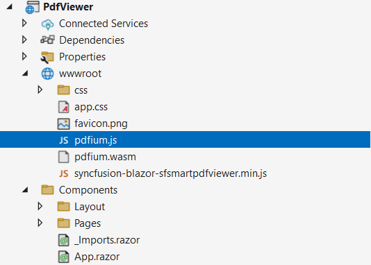

# Reference the SfSmartPdfViewer script in a Blazor application

You can include the SfSmartPdfViewer script in a Blazor application using any of the following methods.

## CDN reference

Reference the script using a CDN for a quick setup without hosting files locally. For guidance, see the [CDN reference](https://blazor.syncfusion.com/documentation/common/adding-script-references#cdn-reference).

## Static web assets

Reference the script from the installed NuGet package via static web assets. For guidance, see [Reference script from static web assets](https://blazor.syncfusion.com/documentation/common/adding-script-references#static-web-assets).

## Custom Resource Generator

To include custom scripts, use the [Custom Resource Generator](https://blazor.syncfusion.com/documentation/common/custom-resource-generator). The [pdfium.js](https://github.com/SyncfusionExamples/blazor-pdf-viewer-examples/blob/master/Common/Pdfium%20files/pdfium.js) and [pdfium.wasm](https://github.com/SyncfusionExamples/blazor-pdf-viewer-examples/blob/master/Common/Pdfium%20files/pdfium.wasm) binaries must be added to the application separately, typically under `wwwroot`. Ensure that the page can resolve their paths at runtime.

## Script and Pdfium files in the application

The following image shows the script and Pdfium files referenced in a Blazor SfSmartPdfViewer application.

## See also

* [Getting Started with Blazor Smart PDF Viewer in Web App Server](../getting-started/web-app)
