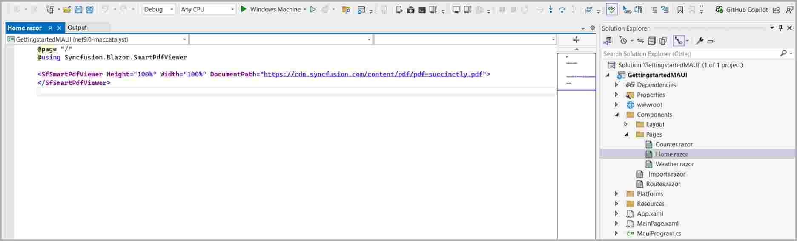
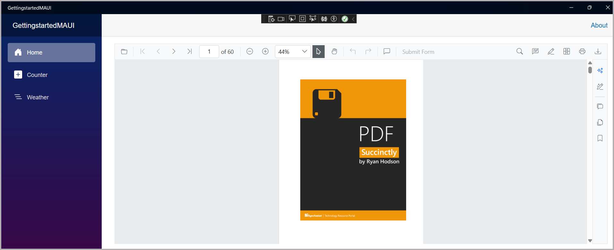
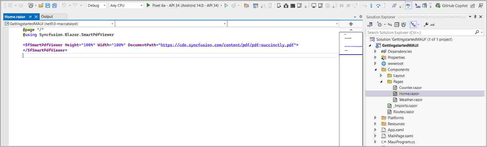
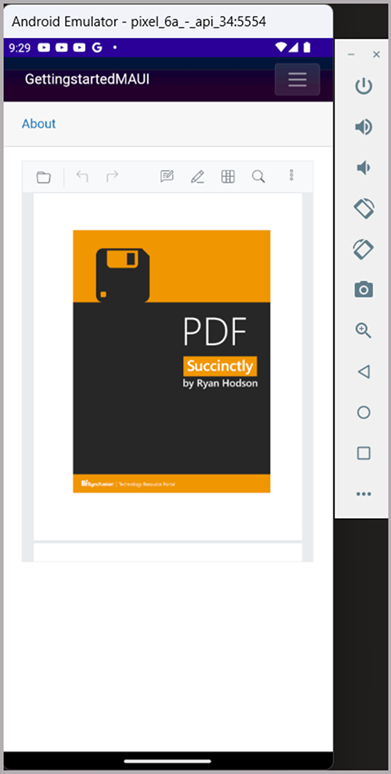

# Using Smart PDF Viewer Component in the Blazor MAUI app 

This article describes how to add the Syncfusion&reg; Blazor Smart PDF Viewer component to a .NET MAUI Blazor app and run it on Windows and Android.

## Prerequisites

To use MAUI project templates, install the Mobile development with .NET workload for Visual Studio. For detailed steps, see [Install .NET MAUI](https://learn.microsoft.com/en-us/dotnet/MAUI/get-started/installation?tabs=vswin) on Windows in the Microsoft documentation.

## Create a new Blazor MAUI App in Visual Studio

Create a new .NET MAUI Blazor App in Visual Studio by selecting the template named **.NET MAUI Blazor Hybrid APP**.

## Install Smart PDF Viewer NuGet package in Blazor Maui App

To add NuGet packages into the Blazor Maui app, open the NuGet package manager in Visual Studio (Tools → NuGet Package Manager → Manage NuGet Packages for Solution), search and install [Syncfusion.Blazor.SfSmartPdfViewer](https://www.nuget.org/packages/Syncfusion.Blazor.SfSmartPdfViewer) and [Syncfusion.Blazor.Themes](https://www.nuget.org/packages/Syncfusion.Blazor.Themes/).

Alternatively, you can utilize the following package manager command to achieve the same.




Install-Package Syncfusion.Blazor.SfSmartPdfViewer -Version {{ site.releaseversion }}
Install-Package Syncfusion.Blazor.Themes -Version {{ site.releaseversion }}




## Register Syncfusion<sup style="font-size:70%">&reg;</sup> Blazor Service

* In the **~/_Imports.razor** file, add the following namespaces:




@using Syncfusion.Blazor 
@using Syncfusion.Blazor.SmartPdfViewer




* Register the Syncfusion<sup style="font-size:70%">&reg;</sup> Blazor Service in the **~/MauiProgram.cs** file.




using Microsoft.Extensions.Logging;
using MauiBlazorWindow.Data;
using Syncfusion.Blazor;

namespace MauiBlazorWindow;

public static class MauiProgram
{
    public static MauiApp CreateMauiApp()
    {
        var builder = MauiApp.CreateBuilder();
        builder
            .UseMauiApp<App>()
            .ConfigureFonts(fonts =>
            {
                fonts.AddFont("OpenSans-Regular.ttf", "OpenSansRegular");
            });

        builder.Services.AddMauiBlazorWebView();
        builder.Services.AddMemoryCache();

#if DEBUG
        builder.Services.AddBlazorWebViewDeveloperTools();
        builder.Logging.AddDebug();
#endif

        builder.Services.AddSingleton<WeatherForecastService>();
        builder.Services.AddSyncfusionBlazor();
        
        return builder.Build();
    }
}




N> Ensure the Syncfusion license is registered in the application before using Syncfusion components.

## To Configure Azure OpenAI Service

This article is required only when enabling AI-powered features in Smart PDF Viewer (such as document summarization, smart redaction, or smart fill). It is not required for basic PDF rendering.

In **Visual Studio**, Go to Tools → NuGet Package Manager → Package Manager Console. Run these commands one by one:




Install-Package Azure.AI.OpenAI
Install-Package Microsoft.Extensions.AI
Install-Package Microsoft.Extensions.AI.OpenAI -Version 9.8.0-preview.1.25412.6




In **Visual Studio Code**, open the terminal and run these commands:




dotnet add package Azure.AI.OpenAI
dotnet add package Microsoft.Extensions.AI
dotnet add package Microsoft.Extensions.AI.OpenAI --version 9.8.0-preview.1.25412.6




To configure the AI service, add the following settings to the **~/MauiProgram.cs** file in your Blazor Server app. 




using Azure.AI.OpenAI;
using Microsoft.Extensions.AI;
using Sample.Components;
using Syncfusion.Blazor;
using Syncfusion.Blazor.AI;
using System.ClientModel;

var builder = WebApplication.CreateBuilder(args);

string azureOpenAiKey = "api-key";
string azureOpenAiEndpoint = "endpoint URL";
string azureOpenAiModel = "deployment-name";
AzureOpenAIClient azureOpenAIClient = new AzureOpenAIClient(new Uri(azureOpenAiEndpoint), new ApiKeyCredential(azureOpenAiKey));
IChatClient azureOpenAiChatClient = azureOpenAIClient.GetChatClient(azureOpenAiModel).AsIChatClient();
builder.Services.AddChatClient(azureOpenAiChatClient);

builder.Services.AddSingleton<IChatInferenceService, SyncfusionAIService>();

var app = builder.Build();
....




Here,
* **apiKey**: “Azure OpenAI API Key”
* **deploymentName**: “Azure OpenAI deployment name”
* **endpoint**: “Azure OpenAI deployment endpoint URL”

For **Azure OpenAI**, first [deploy an Azure OpenAI Service resource and model](https://learn.microsoft.com/en-us/azure/ai-foundry/openai/how-to/create-resource?pivots=web-portal), then the values for `apiKey`, `deploymentName`, and `endpoint` will be available.

## Adding stylesheet and script

Add the following stylesheet and script to the head section of the **~/wwwroot/index.html** file.




<head>
    ....
    <!-- Syncfusion Blazor Smart PDF Viewer control's theme style sheet -->
    <link href="_content/Syncfusion.Blazor.Themes/fluent2.css" rel="stylesheet" />
</head>
<body>
    ....
    <!-- Syncfusion Blazor Smart PDF Viewer control's scripts -->
    <script src="_content/Syncfusion.Blazor.SfSmartPdfViewer/scripts/syncfusion-blazor-sfsmartpdfviewer.min.js" type="text/javascript"></script>
</body>




## Add Smart PDF Viewer component

Add the Syncfusion Blazor Smart PDF Viewer component in the **~/Pages/Index.razor** file.




@page "/"

<SfSmartPdfViewer Height="100%" Width="100%" DocumentPath="https://cdn.syncfusion.com/content/pdf/http-succinctly.pdf">
</SfSmartPdfViewer>




## Run on Windows

Run the sample in Windows Machine mode. The application will run the Blazor MAUI app targeting Windows.



After the application launches, the PDF Viewer component renders the specified PDF document within its interface.



## Run on Android

To run the PDF Viewer in a Blazor Android MAUI application using the Android emulator, follow these steps. These steps are required only when using local embeddings for AI features; they are not needed for basic PDF viewing.

1. Add the following asset files to the project by creating an Assets folder (Platforms → Android → Assets):  
   [model](https://github.com/SyncfusionExamples/blazor-smart-pdf-viewer-examples/blob/master/Common/LocalEmbeddingsModel/model.onnx) and [vocab](https://github.com/SyncfusionExamples/blazor-smart-pdf-viewer-examples/blob/master/Common/LocalEmbeddingsModel/vocab.txt).
	
2. Right-click the added files and set Properties → Build Action to AndroidAsset.
3. Add the following entries to the project .csproj file:
```
<ItemGroup>
	<AndroidAsset Include="Platforms\Android\Assets\model.onnx" />
	<AndroidAsset Include="Platforms\Android\Assets\vocab.txt" />
</ItemGroup>
```
4. Add the following code in **MauiProgram.cs**:




public static class MauiProgram
{
    public static MauiApp CreateMauiApp()
    {
       ...
       builder.Services.AddSyncfusionBlazor();
#if ANDROID	   
       EnsureModelExistsAsync();
#endif	   
       return builder.Build();
    }
    private static async void EnsureModelExistsAsync()
    {
        string[] requiredFiles = { "model.onnx", "vocab.txt" };
        string targetDir = Path.Combine(FileSystem.AppDataDirectory, "LocalEmbeddingsModel/default");
        Directory.CreateDirectory(targetDir);
        foreach (string fileName in requiredFiles)
        {
            string targetPath = Path.Combine(targetDir, fileName);
            if (!File.Exists(targetPath))
            {
                using Stream assetStream = await FileSystem.OpenAppPackageFileAsync(fileName);
                using FileStream fileStream = File.Create(targetPath);
                await assetStream.CopyToAsync(fileStream);
            }
        }
    }
}





Refer [here](https://learn.microsoft.com/en-us/dotnet/maui/android/emulator/device-manager#android-device-manager-on-windows) to Set up the Android emulator with Android Device Manager.

N> If any errors occur while using the Android Emulator, see [Troubleshooting the Android Emulator](https://learn.microsoft.com/en-us/dotnet/maui/android/emulator/troubleshooting).



>[View Sample in GitHub](https://github.com/SyncfusionExamples/blazor-smart-pdf-viewer-examples/tree/master/Getting%20Started/MAUI%20Blazor%20App).

## See also

* [Document Summarizer in Blazor Smart PDF Viewer](../document-summarizer)
* [Smart Redaction in Blazor Smart PDF Viewer](../smart-redaction)
* [Smart Fill in Blazor Smart PDF Viewer](../smart-fill)