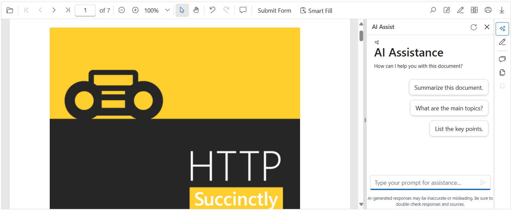

# Getting Started with Smart PDF Viewer

This section briefly explains how to include [Blazor Smart PDF Viewer](https://www.syncfusion.com/blazor-components) component in your Blazor Server App using [Visual Studio](https://visualstudio.microsoft.com/vs/) and Visual Studio code.





## Prerequisites

* [System requirements for Blazor components](https://blazor.syncfusion.com/documentation/system-requirements)
* [Azure OpenAI Account](https://learn.microsoft.com/en-us/azure/ai-foundry/openai/how-to/create-resource?pivots=web-portal)

N> Syncfusion&reg; Blazor Smart PDF Viewer Component is compatible with both `OpenAI` and `Azure OpenAI`, and fully support Server Interactivity mode apps.

## Create a new Blazor App in Visual Studio

You can create a **Blazor Server App** using Visual Studio 2022 via [Microsoft Templates](https://learn.microsoft.com/en-us/aspnet/core/blazor/tooling?view=aspnetcore-8.0&pivots=vs) or the [Syncfusion&reg; Blazor Extension](https://blazor.syncfusion.com/documentation/visual-studio-integration/template-studio).

## Install Syncfusion&reg; Blazor Smart PDF Viewer and Themes NuGet in the App

To add **Blazor Smart PDF Viewer** component in the app, open the NuGet package manager in Visual Studio (Tools → NuGet Package Manager → Manage NuGet Packages for Solution), search and install [Syncfusion.Blazor.SfSmartPdfViewer](https://www.nuget.org/packages/Syncfusion.Blazor.SfSmartPdfViewer/) and [Syncfusion.Blazor.Themes](https://www.nuget.org/packages/Syncfusion.Blazor.Themes/).

Alternatively, you can utilize the following package manager command to achieve the same.




Install-Package Syncfusion.Blazor.SfSmartPdfViewer -Version 31.2.*
Install-Package Syncfusion.Blazor.Themes -Version 31.2.*




N> Syncfusion&reg; Blazor components are available in [nuget.org](https://www.nuget.org/packages?q=syncfusion.blazor). Refer to NuGet packages topic for available [NuGet packages](https://blazor.syncfusion.com/documentation/nuget-packages) list with component details.





## Prerequisites

* [System requirements for Blazor components](https://blazor.syncfusion.com/documentation/system-requirements)
* [Azure OpenAI Account](https://learn.microsoft.com/en-us/azure/ai-foundry/openai/how-to/create-resource?pivots=web-portal)

N> Syncfusion&reg; Blazor Smart PDF Viewer Component is compatible with both `OpenAI` and `Azure OpenAI`, and fully support Server Interactivity mode apps.

## Create a new Blazor App in Visual Studio Code

You can create a **Blazor Server App** using Visual Studio 2022 via [Microsoft Templates](https://learn.microsoft.com/en-us/aspnet/core/blazor/tooling?view=aspnetcore-8.0&pivots=vs) or the [Syncfusion&reg; Blazor Extension](https://blazor.syncfusion.com/documentation/visual-studio-integration/template-studio).

Alternatively, you can create a Server application using the following command in the terminal(Ctrl+`).




dotnet new blazorserver -o BlazorApp
cd BlazorApp




## Install Syncfusion&reg; Blazor Smart PDF Viewer and Themes NuGet in the App

* Press Ctrl+` to open the integrated terminal in Visual Studio Code.
* Ensure you’re in the project root directory where your `.csproj` file is located.
* Run the following command to install a [Syncfusion.Blazor.SfSmartPdfViewer](https://www.nuget.org/packages/Syncfusion.Blazor.SfSmartPdfViewer/) and [Syncfusion.Blazor.Themes](https://www.nuget.org/packages/Syncfusion.Blazor.Themes/) NuGet package and ensure all dependencies are installed.




dotnet add package Syncfusion.Blazor.SfSmartPdfViewer -v 31.2.*
dotnet add package Syncfusion.Blazor.Themes -v 31.2.*
dotnet restore




N> Syncfusion&reg; Blazor components are available in [nuget.org](https://www.nuget.org/packages?q=syncfusion.blazor). Refer to NuGet packages topic for available [NuGet packages](https://blazor.syncfusion.com/documentation/nuget-packages) list with component details.





## Register Syncfusion&reg; Blazor Service

Import the `Syncfusion.Blazor` and `Syncfusion.Blazor.SfSmartPdfViewer` namespace.




@using Syncfusion.Blazor
@using Syncfusion.Blazor.SfSmartPdfViewer




Now, register the Syncfusion&reg; Blazor Service in the **~/Program.cs** file of your Blazor Server App.




using Syncfusion.Blazor;

var builder = WebApplication.CreateBuilder(args);

// Add service to the container.
builder.Services.AddSyncfusionBlazor();

var app = builder.Build();
....




## Configure AI Service

In Visual Studio, Go to Tools → NuGet Package Manager → Package Manager Console. Run these commands one by one:




Install-Package Azure.AI.OpenAI
Install-Package Microsoft.Extensions.AI
Install-Package Microsoft.Extensions.AI.OpenAI -Version 9.8.0-preview.1.25412.6




In Visual Studio Code, Open terminal in VS Code. Run these commands:




dotnet add package Azure.AI.OpenAI
dotnet add package Microsoft.Extensions.AI
dotnet add package Microsoft.Extensions.AI.OpenAI --version 9.8.0-preview.1.25412.6




To configure the AI service, add the following settings to the **~/Program.cs** file in your Blazor Server app. 




using Azure.AI.OpenAI;
using Microsoft.Extensions.AI;
using Sample.Components;
using Syncfusion.Blazor;
using Syncfusion.Blazor.AI;
using System.ClientModel;

var builder = WebApplication.CreateBuilder(args);

builder.Services.AddSignalR(o => { o.MaximumReceiveMessageSize = 102400000; });

builder.Services.AddMemoryCache();

string apiKey = "api-key";
string deploymentName = "deployment-name";
string endpoint = "endpoint URL";

string azureOpenAiKey = apiKey;
string azureOpenAiEndpoint = endpoint;
string azureOpenAiModel = deploymentName;
AzureOpenAIClient azureOpenAIClient = new AzureOpenAIClient(new Uri(azureOpenAiEndpoint), new ApiKeyCredential(azureOpenAiKey));
IChatClient azureOpenAiChatClient = azureOpenAIClient.GetChatClient(azureOpenAiModel).AsIChatClient();
builder.Services.AddChatClient(azureOpenAiChatClient);

builder.Services.AddSingleton<IChatInferenceService, SyncfusionAIService>();

var app = builder.Build();
....




Here,
* **apiKey**: “Azure OpenAI API Key”;
* **deploymentName**: “Azure OpenAI deployment name”;
* **endpoint**: “Azure OpenAI deployment end point URL”;

For **Azure OpenAI**, first [deploy an Azure OpenAI Service resource and model](https://learn.microsoft.com/en-us/azure/ai-foundry/openai/how-to/create-resource?pivots=web-portal), then values for `apiKey`, `deploymentName` and `endpoint` will all be provided to you.

## Configuring Ollama for Self-Hosted AI Models

In Visual Studio, Go to Tools → NuGet Package Manager → Package Manager Console. Run these commands one by one:




Install-Package OllamaSharp -Version 5.3.6




In Visual Studio Code, Open terminal in VS Code. Run these commands:




dotnet add package OllamaSharp --version 5.3.6




Add the following settings to the **~/Program.cs** file in your Blazor Server app.




...
var builder = WebApplication.CreateBuilder(args);

string aiModel = "llama2";
IChatClient chatClient = new OllamaApiClient("http://localhost:11434", aiModel);
builder.Services.AddChatClient(chatClient);
builder.Services.AddSingleton<IChatInferenceService, SyncfusionAIService>();

var app = builder.Build();
...




## Add stylesheet and script resources

The theme stylesheet and script can be accessed from NuGet through [Static Web Assets](https://blazor.syncfusion.com/documentation/appearance/themes#static-web-assets). Include the stylesheet and script reference in the `<head>` of the main page as follows:

* For **.NET 6** Blazor Server app, include it in **~/Pages/_Layout.cshtml** file.
* For **.NET 9** and .NET 8 Blazor Server app, include it in the **~/Components/App.razor** file.



<head>
    ....
    <link href="_content/Syncfusion.Blazor.Themes/fluent2.css" rel="stylesheet" />
</head>

<body>
    ....
    
</body>



N> Check out the [Blazor Themes](https://blazor.syncfusion.com/documentation/appearance/themes) topic to discover various methods ([Static Web Assets](https://blazor.syncfusion.com/documentation/appearance/themes#static-web-assets), [CDN](https://blazor.syncfusion.com/documentation/appearance/themes#cdn-reference), and [CRG](https://blazor.syncfusion.com/documentation/common/custom-resource-generator)) for referencing themes in your Blazor application. Also, check out the [Adding Script Reference](https://blazor.syncfusion.com/documentation/common/adding-script-references) topic to learn different approaches for adding script references in your Blazor application.

## Add Syncfusion&reg; Blazor Smart PDF Viewer component

Add the Syncfusion&reg; Blazor Smart PDF Viewer component in the **~/Pages/Index.razor** file.




@using Syncfusion.Blazor.SfSmartPdfViewer

<SfSmartPdfViewer Height="100%" Width="100%" DocumentPath="wwwroot/Fsharp_Succinctly.pdf">
</SfSmartPdfViewer>




* Press Ctrl+F5 (Windows) or ⌘+F5 (macOS) to launch the application. This will render the Syncfusion&reg; Blazor Smart PDF Viewer component in your default web browser.

N> [View Sample in GitHub]().