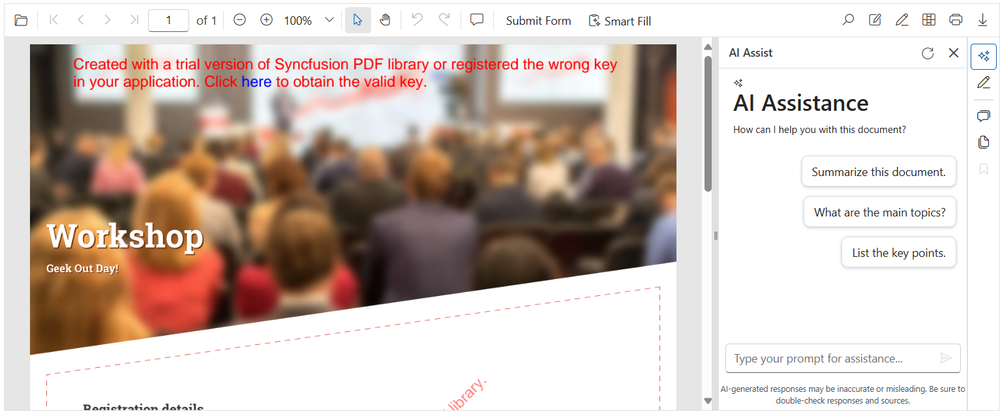

# Getting Started with Smart PDF Viewer

This article briefly explains how to include [Blazor Smart PDF Viewer](https://www.syncfusion.com/pdf-viewer-sdk/blazor-smart-pdf-viewer) component in your Blazor Web App using [Visual Studio](https://visualstudio.microsoft.com/vs/) and Visual Studio Code.





## Prerequisites

* [System requirements for Blazor components](https://blazor.syncfusion.com/documentation/system-requirements)
* [Azure OpenAI Account](https://learn.microsoft.com/en-us/azure/ai-foundry/openai/how-to/create-resource?pivots=web-portal)

N> Syncfusion<sup style="font-size:70%">&reg;</sup> Blazor Smart PDF Viewer component is compatible with both `OpenAI` and `Azure OpenAI`, and supports Server interactivity mode apps.

## Create a new Blazor Web App in Visual Studio

Create a **Blazor Web App** using Visual Studio 2022 via [Microsoft Templates](https://learn.microsoft.com/en-us/aspnet/core/blazor/tooling?view=aspnetcore-8.0&pivots=vs) or the [Syncfusion<sup style="font-size:70%">&reg;</sup> Blazor Extension](https://blazor.syncfusion.com/documentation/visual-studio-integration/template-studio).

## Install Syncfusion<sup style="font-size:70%">&reg;</sup> Blazor Smart PDF Viewer and Themes NuGet in the App

To add the **Blazor Smart PDF Viewer** component, open the NuGet Package Manager in Visual Studio (Tools → NuGet Package Manager → Manage NuGet Packages for Solution), search for and install [Syncfusion.Blazor.SfSmartPdfViewer](https://www.nuget.org/packages/Syncfusion.Blazor.SfSmartPdfViewer) and [Syncfusion.Blazor.Themes](https://www.nuget.org/packages/Syncfusion.Blazor.Themes/).

Alternatively, use the following package manager commands.




Install-Package Syncfusion.Blazor.SfSmartPdfViewer -Version {{ site.releaseversion }}
Install-Package Syncfusion.Blazor.Themes -Version {{ site.releaseversion }}




N> Syncfusion<sup style="font-size:70%">&reg;</sup> Blazor components are available on [nuget.org](https://www.nuget.org/packages?q=syncfusion.blazor). Refer to the [NuGet packages](https://blazor.syncfusion.com/documentation/nuget-packages) topic for the full package list and component details. A valid Syncfusion license key must be registered in the application.





## Prerequisites

* [System requirements for Blazor components](https://blazor.syncfusion.com/documentation/system-requirements)
* [Azure OpenAI Account](https://learn.microsoft.com/en-us/azure/ai-foundry/openai/how-to/create-resource?pivots=web-portal)

N> Syncfusion<sup style="font-size:70%">&reg;</sup> Blazor Smart PDF Viewer component is compatible with both `OpenAI` and `Azure OpenAI`, and supports Server interactivity mode apps. Azure OpenAI is required only for AI-assisted features.

## Create a new Blazor Web App in Visual Studio Code

Create a **Blazor Web App** using Visual Studio Code via [Microsoft Templates](https://learn.microsoft.com/en-us/aspnet/core/blazor/tooling?view=aspnetcore-8.0&pivots=vsc) or the [Syncfusion<sup style="font-size:70%">&reg;</sup> Blazor Extension](https://blazor.syncfusion.com/documentation/visual-studio-integration/template-studio).

Configure the appropriate [Interactive render mode](https://learn.microsoft.com/en-us/aspnet/core/blazor/components/render-modes?view=aspnetcore-8.0#render-modes) and [Interactivity location](https://learn.microsoft.com/en-us/aspnet/core/blazor/tooling?view=aspnetcore-8.0&pivots=vsc) when creating the Blazor Web App.

For example, in a Blazor Web App with the `Server` interactive render mode, use the following commands.




dotnet new blazor -o BlazorWebApp -int Server
cd BlazorWebApp
cd BlazorWebApp.Client




N> For more information on creating a Blazor Web App with various interactive modes and locations, refer to this [guide](https://blazor.syncfusion.com/documentation/getting-started/blazor-web-app?tabcontent=visual-studio-code#render-interactive-modes).

## Install Syncfusion<sup style="font-size:70%">&reg;</sup> Blazor Smart PDF Viewer and Themes NuGet in the App

When using the `Server` render mode in a Blazor Web App, install the Syncfusion<sup style="font-size:70%">&reg;</sup> Blazor component packages in the server project where the components execute.

* Press Ctrl+` to open the integrated terminal in Visual Studio Code.
* Ensure the current directory contains the project `.csproj` file.
* Run the following commands to install `Syncfusion.Blazor.SfSmartPdfViewer` and [Syncfusion.Blazor.Themes](https://www.nuget.org/packages/Syncfusion.Blazor.Themes/), then restore the solution.




dotnet add package Syncfusion.Blazor.SfSmartPdfViewer -v 31.2.*
dotnet add package Syncfusion.Blazor.Themes -v 31.2.*
dotnet restore




N> Syncfusion<sup style="font-size:70%">&reg;</sup> Blazor components are available on [nuget.org](https://www.nuget.org/packages?q=syncfusion.blazor). Refer to the [NuGet packages](https://blazor.syncfusion.com/documentation/nuget-packages) topic for the full package list and component details.





## Register Syncfusion<sup style="font-size:70%">&reg;</sup> Blazor Service

| Interactive Render Mode | Description |
| -- | -- |
| Server | Open **~/_Imports.razor** file, which is located in the `Components` folder.|

Import the [Syncfusion.Blazor](https://help.syncfusion.com/cr/blazor/Syncfusion.Blazor.html) and [Syncfusion.Blazor.SmartPdfViewer](https://help.syncfusion.com/cr/blazor/Syncfusion.Blazor.SmartPdfViewer.html) namespaces.




@using Syncfusion.Blazor
@using Syncfusion.Blazor.SmartPdfViewer




If the **Interactive Render Mode** is set to `Server`, the project contains a single **~/Program.cs** file. Register the Syncfusion<sup style="font-size:70%">&reg;</sup> Blazor service in that **~/Program.cs** file. The configured SignalR maximum message size and memory cache support large document streaming and caching for better performance. Ensure the Syncfusion license is registered during application startup.




using Syncfusion.Blazor;

var builder = WebApplication.CreateBuilder(args);

builder.Services.AddSignalR(o => { o.MaximumReceiveMessageSize = 102400000; });

builder.Services.AddMemoryCache();

// Add service to the container.
builder.Services.AddSyncfusionBlazor();

var app = builder.Build();
....




## To Configure Azure OpenAI Service

In **Visual Studio**, Go to Tools → NuGet Package Manager → Package Manager Console. Run these commands one by one:




Install-Package Azure.AI.OpenAI
Install-Package Microsoft.Extensions.AI
Install-Package Microsoft.Extensions.AI.OpenAI -Version 9.8.0-preview.1.25412.6




In **Visual Studio Code**, open the terminal in VS Code and run the following commands:




dotnet add package Azure.AI.OpenAI
dotnet add package Microsoft.Extensions.AI
dotnet add package Microsoft.Extensions.AI.OpenAI --version 9.8.0-preview.1.25412.6




To configure the AI service, add the following settings to the **~/Program.cs** file in the Blazor Server app.




using Azure.AI.OpenAI;
using Microsoft.Extensions.AI;
using Sample.Components;
using Syncfusion.Blazor;
using Syncfusion.Blazor.AI;
using System.ClientModel;

var builder = WebApplication.CreateBuilder(args);

string azureOpenAiKey = "api-key";
string azureOpenAiEndpoint = "endpoint URL";
string azureOpenAiModel = "deployment-name";
AzureOpenAIClient azureOpenAIClient = new AzureOpenAIClient(new Uri(azureOpenAiEndpoint), new ApiKeyCredential(azureOpenAiKey));
IChatClient azureOpenAiChatClient = azureOpenAIClient.GetChatClient(azureOpenAiModel).AsIChatClient();
builder.Services.AddChatClient(azureOpenAiChatClient);

builder.Services.AddSingleton<IChatInferenceService, SyncfusionAIService>();

var app = builder.Build();
....




Here,
* **apiKey**: Azure OpenAI API key.
* **deploymentName**: Azure OpenAI deployment name.
* **endpoint**: Azure OpenAI deployment endpoint URL.

For **Azure OpenAI**, first [deploy an Azure OpenAI Service resource and model](https://learn.microsoft.com/en-us/azure/ai-foundry/openai/how-to/create-resource?pivots=web-portal); then the values for `apiKey`, `deploymentName`, and `endpoint` will be provided.

## To Configure Ollama for Self-Hosted AI Models

To use Ollama for running self-hosted models:

* **Download and install Ollama**  
Install the application for your operating system from [Ollama’s official website](https://ollama.com/).

* **Install the desired model from the Ollama library**  
Explore available models in the [Ollama Library](https://ollama.com/library) (for example, llama2:13b, llama2:7b, mistral:7b).

To download and run a model (for example, llama2:7b), run the following command:

```bash
ollama run llama2:7b
```

In **Visual Studio**, Go to Tools → NuGet Package Manager → Package Manager Console. Run this command:




Install-Package OllamaSharp -Version 5.3.6




In **Visual Studio Code**, open the terminal in VS Code and run this command:




dotnet add package OllamaSharp --version 5.3.6




Add the following settings to the **~/Program.cs** file in the Blazor Server app.




using Microsoft.Extensions.AI;
using OllamaSharp;
using Syncfusion.Blazor;
using Syncfusion.Blazor.AI;
...
var builder = WebApplication.CreateBuilder(args);
...
builder.Services.AddSyncfusionBlazor();

// Define the name of the AI model to use from Ollama (e.g., llama2:13b, mistral:7b, etc.)
string aiModel = "llama2:7b";

// By default, Ollama runs on port 11434, you can also customize this port manually.
HttpClient httpClient = new HttpClient
{
    BaseAddress = new Uri("http://localhost:11434"), // Ollama server address
    Timeout = Timeout.InfiniteTimeSpan // Supports extended processing time for AI responses
};

// Initialize the chat client using the Ollama API and the specified model
IChatClient chatClient = new OllamaApiClient(httpClient, aiModel);
builder.Services.AddChatClient(chatClient);
builder.Services.AddSingleton<IChatInferenceService, SyncfusionAIService>();

var app = builder.Build();
...




N> Running Ollama locally may lead to slower response times due to system resource usage. To accommodate this, the Syncfusion Smart PDF Viewer can disable timeout for AI Assist view operations by setting the timeout to 0. [Learn more](https://help.syncfusion.com/document-processing/pdf/smart-pdf-viewer/blazor/document-summarizer#timeout)

### To Check the Installed Model and Its Details in Ollama
- To verify which models are currently installed and available on the local Ollama server (for example, running on port 11434), run the following command in a terminal or command prompt:

```bash

curl http://localhost:11434/api/tags

```

## Add stylesheet and script resources

The theme stylesheet and script can be accessed from NuGet through [Static Web Assets](https://blazor.syncfusion.com/documentation/appearance/themes#static-web-assets). Include the stylesheet reference in the `<head>` section and the script reference at the end of the `<body>` in the ~/Components/App.razor file as shown below.


```html
<head>
    ....
    <!-- Syncfusion Blazor Smart PDF Viewer control's theme style sheet -->
    <link href="_content/Syncfusion.Blazor.Themes/fluent2.css" rel="stylesheet" />
</head>

<body>
    ....
    <!-- Syncfusion Blazor Smart PDF Viewer control's scripts -->
    <script src="_content/Syncfusion.Blazor.SfSmartPdfViewer/scripts/syncfusion-blazor-sfsmartpdfviewer.min.js" type="text/javascript"></script>
</body>
```

N> Review the [Blazor Themes](https://blazor.syncfusion.com/documentation/appearance/themes) topic to discover various methods ([Static Web Assets](https://blazor.syncfusion.com/documentation/appearance/themes#static-web-assets), [CDN](https://blazor.syncfusion.com/documentation/appearance/themes#cdn-reference), and [CRG](https://blazor.syncfusion.com/documentation/common/custom-resource-generator)) for referencing themes in a Blazor application. Also see [Adding script reference](https://blazor.syncfusion.com/documentation/common/adding-script-references) for different approaches to include scripts.

## Add Syncfusion<sup style="font-size:70%">&reg;</sup> Blazor Smart PDF Viewer component

Add the Syncfusion<sup style="font-size:70%">&reg;</sup> Blazor Smart PDF Viewer component in the **~Pages/Home.razor** file.




@page "/"

<SfSmartPdfViewer Height="100%" Width="100%" DocumentPath="https://cdn.syncfusion.com/content/pdf/http-succinctly.pdf">
</SfSmartPdfViewer>




* Press Ctrl+F5 (Windows) or ⌘+F5 (macOS) to launch the application. This renders the Syncfusion<sup style="font-size:70%">&reg;</sup> Blazor Smart PDF Viewer component in the default web browser.



N> [View sample in GitHub](https://github.com/SyncfusionExamples/blazor-smart-pdf-viewer-examples/tree/master/Getting%20Started/Blazor%20Web%20App).

## See also

* [Custom AI Service Integration in Blazor Smart PDF Viewer](../custom-ai-service)
* [Document Summarizer in Blazor Smart PDF Viewer](../document-summarizer)
* [Smart Redaction in Blazor Smart PDF Viewer](../smart-redaction)
* [Smart Fill in Blazor Smart PDF Viewer](../smart-fill)
