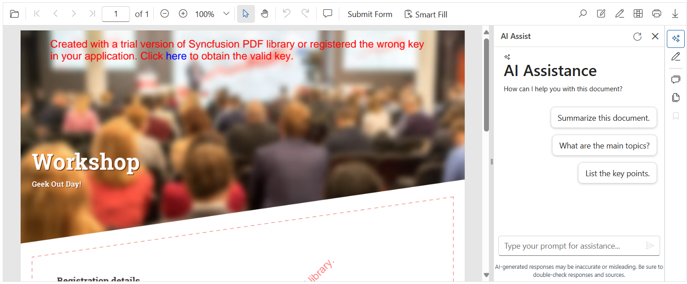

# Getting Started with Smart PDF Viewer

This section explains how to include [Blazor Smart PDF Viewer](https://www.syncfusion.com/pdf-viewer-sdk/blazor-smart-pdf-viewer) component in your Blazor Web App using [Visual Studio](https://visualstudio.microsoft.com/vs/) and Visual Studio Code.

Check out the following video to learn how to get started with the Blazor Smart PDF Viewer.






## Prerequisites

* [System requirements for Blazor components](https://blazor.syncfusion.com/documentation/system-requirements)
* [Azure OpenAI Account](https://learn.microsoft.com/en-us/azure/ai-foundry/openai/how-to/create-resource?pivots=web-portal)

N> Blazor Smart PDF Viewer component is compatible with both `OpenAI` and `Azure OpenAI`, and supports Server interactivity mode apps.

## Create a new Blazor Web App in Visual Studio

Create a **Blazor Web App** using Visual Studio 2022 via [Microsoft Templates](https://learn.microsoft.com/en-us/aspnet/core/blazor/tooling?view=aspnetcore-8.0&pivots=vs) or the [Syncfusion&reg; Blazor Extension](https://blazor.syncfusion.com/documentation/visual-studio-integration/template-studio).

## Install Blazor Smart PDF Viewer and Themes NuGet in the App

To add the **Blazor Smart PDF Viewer** component, open the NuGet Package Manager in Visual Studio (Tools → NuGet Package Manager → Manage NuGet Packages for Solution), search for and install [Syncfusion.Blazor.SfSmartPdfViewer](https://www.nuget.org/packages/Syncfusion.Blazor.SfSmartPdfViewer) and [Syncfusion.Blazor.Themes](https://www.nuget.org/packages/Syncfusion.Blazor.Themes/).

Alternatively, use the following package manager commands.




Install-Package Syncfusion.Blazor.SfSmartPdfViewer -Version {{ site.releaseversion }}
Install-Package Syncfusion.Blazor.Themes -Version {{ site.releaseversion }}




N> Syncfusion&reg; Blazor components are available on [nuget.org](https://www.nuget.org/packages?q=syncfusion.blazor). Refer to the [NuGet packages](https://blazor.syncfusion.com/documentation/nuget-packages) topic for the full package list and component details. A valid Syncfusion license key must be registered in the application.





## Prerequisites

* [System requirements for Blazor components](https://blazor.syncfusion.com/documentation/system-requirements)
* [Azure OpenAI Account](https://learn.microsoft.com/en-us/azure/ai-foundry/openai/how-to/create-resource?pivots=web-portal)

N> Blazor Smart PDF Viewer component is compatible with both `OpenAI` and `Azure OpenAI`, and supports Server interactivity mode apps. Azure OpenAI is required only for AI-assisted features.

## Create a new Blazor Web App in Visual Studio Code

Create a **Blazor Web App** using Visual Studio Code via [Microsoft Templates](https://learn.microsoft.com/en-us/aspnet/core/blazor/tooling?view=aspnetcore-8.0&pivots=vsc) or the [Syncfusion&reg; Blazor Extension](https://blazor.syncfusion.com/documentation/visual-studio-integration/template-studio).

Configure the appropriate [Interactive render mode](https://learn.microsoft.com/en-us/aspnet/core/blazor/components/render-modes?view=aspnetcore-8.0#render-modes) and [Interactivity location](https://learn.microsoft.com/en-us/aspnet/core/blazor/tooling?view=aspnetcore-8.0&pivots=vsc) when creating the Blazor Web App.

For example, in a Blazor Web App with the `Server` interactive render mode, use the following commands.




dotnet new blazor -o BlazorWebApp -int Server
cd BlazorWebApp




N> For more information on creating a Blazor Web App with various interactive modes and locations, refer to this [guide](https://blazor.syncfusion.com/documentation/getting-started/blazor-web-app?tabcontent=visual-studio-code#render-interactive-modes).

## Install Blazor Smart PDF Viewer and Themes NuGet in the App

When using the `Server` render mode in a Blazor Web App, install the Syncfusion&reg; Blazor component packages in the server project where the components execute.

* Press Ctrl+` to open the integrated terminal in Visual Studio Code.
* Ensure the current directory contains the project `.csproj` file.
* Run the following commands to install [Syncfusion.Blazor.SfSmartPdfViewer](https://www.nuget.org/packages/Syncfusion.Blazor.SfSmartPdfViewer) and [Syncfusion.Blazor.Themes](https://www.nuget.org/packages/Syncfusion.Blazor.Themes/), then restore the solution.




dotnet add package Syncfusion.Blazor.SfSmartPdfViewer -v {{ site.releaseversion }}
dotnet add package Syncfusion.Blazor.Themes -v {{ site.releaseversion }}
dotnet restore




N> Syncfusion&reg; Blazor components are available on [nuget.org](https://www.nuget.org/packages?q=syncfusion.blazor). Refer to the [NuGet packages](https://blazor.syncfusion.com/documentation/nuget-packages) topic for the full package list and component details.





## Prerequisites

Install the latest version of [.NET SDK](https://dotnet.microsoft.com/en-us/download). If you previously installed the SDK, you can determine the installed version by executing the following command in a command prompt (Windows) or terminal (macOS) or command shell (Linux).




dotnet --version




## Create a new Blazor Web App using .NET CLI

Run the following command to create a new Blazor Web App in a command prompt (Windows) or terminal (macOS) or command shell (Linux). For detailed instructions, refer to the [Blazor Web App Getting Started](https://blazor.syncfusion.com/documentation/getting-started/blazor-web-app?tabcontent=.net-cli) documentation.

For example, in a Blazor Web App with the `Server` interactive render mode, use the following commands:




dotnet new blazor -o BlazorWebApp -int Server
cd BlazorWebApp




## Install Syncfusion&reg; Blazor SfSmartPdfViewer and Themes NuGet in the App

* Open a command prompt, terminal, or shell.
* Ensure you’re in the project root directory where your `.csproj` file is located (or the Client project if applicable).
* Run the following command to install a [Syncfusion.Blazor.SfSmartPdfViewer](https://www.nuget.org/packages/Syncfusion.Blazor.SfSmartPdfViewer) and [Syncfusion.Blazor.Themes](https://www.nuget.org/packages/Syncfusion.Blazor.Themes/) NuGet package and ensure all dependencies are installed.





dotnet add package Syncfusion.Blazor.SfSmartPdfViewer -v {{ site.releaseversion }}
dotnet add package Syncfusion.Blazor.Themes -v {{ site.releaseversion }}
dotnet restore









## Register Syncfusion&reg; Blazor Service

| Interactive Render Mode | Description |
| -- | -- |
| Server | Open `~/_Imports.razor` file, which is located in the `Components` folder.|

Import the [Syncfusion.Blazor](https://help.syncfusion.com/cr/blazor/Syncfusion.Blazor.html) and [Syncfusion.Blazor.SmartPdfViewer](https://help.syncfusion.com/cr/blazor/Syncfusion.Blazor.SmartPdfViewer.html) namespaces.




@using Syncfusion.Blazor
@using Syncfusion.Blazor.SmartPdfViewer




If the **Interactive Render Mode** is set to `Server`, the project contains a single `~/Program.cs` file. Register the Syncfusion&reg; Blazor service in that `~/Program.cs` file. The configured SignalR maximum message size and memory cache support large document streaming and caching for better performance. Ensure the Syncfusion license is registered during application startup.

Add the `Syncfusion.Blazor` namespace to the `Program.cs` file.




using Syncfusion.Blazor;




Register the Syncfusion&reg; Blazor service in the `~/Program.cs` file after the **builder** is created in the Blazor Web App.




// Configure SignalR (with increased message size) and enable memory caching
builder.Services.AddSignalR(o => { o.MaximumReceiveMessageSize = 102400000; });
builder.Services.AddMemoryCache();
// Register Syncfusion Blazor service
builder.Services.AddSyncfusionBlazor();




## To Configure Azure OpenAI Service

In **Visual Studio**, Go to Tools → NuGet Package Manager → Package Manager Console. Run these commands one by one:




Install-Package Azure.AI.OpenAI
Install-Package Microsoft.Extensions.AI
Install-Package Microsoft.Extensions.AI.OpenAI




In **Visual Studio Code**, open the terminal in VS Code and run the following commands:




dotnet add package Azure.AI.OpenAI
dotnet add package Microsoft.Extensions.AI
dotnet add package Microsoft.Extensions.AI.OpenAI




Add the AI service namespace to the `Program.cs` file.




using Azure.AI.OpenAI;
using Microsoft.Extensions.AI;
using Syncfusion.Blazor.AI;
using System.ClientModel;




To configure the AI service, add the following settings to the `~/Program.cs` file in the Blazor Server app.




// Azure OpenAI configuration values
string azureOpenAiKey = "api-key";
string azureOpenAiEndpoint = "endpoint URL";
string azureOpenAiModel = "deployment-name";
// Configure Azure OpenAI client and register chat with Syncfusion AI services
AzureOpenAIClient azureOpenAIClient = new AzureOpenAIClient(new Uri(azureOpenAiEndpoint), new ApiKeyCredential(azureOpenAiKey));
IChatClient azureOpenAiChatClient = azureOpenAIClient.GetChatClient(azureOpenAiModel).AsIChatClient();
builder.Services.AddChatClient(azureOpenAiChatClient);
builder.Services.AddSingleton<IChatInferenceService, SyncfusionAIService>();




Here,
* **apiKey**: Azure OpenAI API key.
* **deploymentName**: Azure OpenAI deployment name.
* **endpoint**: Azure OpenAI deployment endpoint URL.

For **Azure OpenAI**, first [deploy an Azure OpenAI Service resource and model](https://learn.microsoft.com/en-us/azure/ai-foundry/openai/how-to/create-resource?pivots=web-portal); then the values for `apiKey`, `deploymentName`, and `endpoint` will be provided.

## Add stylesheet and script resources

The theme stylesheet and script can be accessed from NuGet through [Static Web Assets](https://blazor.syncfusion.com/documentation/appearance/themes#static-web-assets). 

Include the stylesheet reference in the `<head>` section in the `~/Components/App.razor` file.




<!-- Syncfusion Blazor Smart PDF Viewer control's theme style sheet -->
<link href="_content/Syncfusion.Blazor.Themes/fluent2.css" rel="stylesheet" />




Add script reference at the end of the `<body>` in the `~/Components/App.razor` file as shown below.




<!-- Syncfusion Blazor Smart PDF Viewer control's scripts -->




N> Review the [Blazor Themes](https://blazor.syncfusion.com/documentation/appearance/themes) topic to discover various methods ([Static Web Assets](https://blazor.syncfusion.com/documentation/appearance/themes#static-web-assets), [CDN](https://blazor.syncfusion.com/documentation/appearance/themes#cdn-reference), and [CRG](https://blazor.syncfusion.com/documentation/common/custom-resource-generator)) for referencing themes in a Blazor application. Also see [Adding script reference](https://blazor.syncfusion.com/documentation/common/adding-script-references) for different approaches to include scripts.

## Add Blazor Smart PDF Viewer component

N> If the interactivity location is set to Global and the render mode is set to Auto, WebAssembly, or Server, the render mode is configured in the `App.razor` file by default.

If the interactivity location is set to Per page/component, define a render mode at the top of the ~Pages/.razor component as follows:




@* Your App render mode define here *@
@rendermode InteractiveServer




Add the Blazor Smart PDF Viewer component in the `~Pages/Home.razor` file.



@rendermode InteractiveServer

<SfSmartPdfViewer Height="100%" Width="100%" DocumentPath="https://cdn.syncfusion.com/content/pdf/http-succinctly.pdf">
</SfSmartPdfViewer>




* Press Ctrl+F5 (Windows) or ⌘+F5 (macOS) to launch the application. This renders the Blazor Smart PDF Viewer component in the default web browser.

> [View sample in GitHub](https://github.com/SyncfusionExamples/blazor-smart-pdf-viewer-examples/tree/master/Getting%20Started/Blazor%20Web%20App).

## See also

* [Custom AI Service Integration in Blazor Smart PDF Viewer](../custom-ai-service)
* [Document Summarizer in Blazor Smart PDF Viewer](../document-summarizer)
* [Smart Redaction in Blazor Smart PDF Viewer](../smart-redaction)
* [Smart Fill in Blazor Smart PDF Viewer](../smart-fill)
