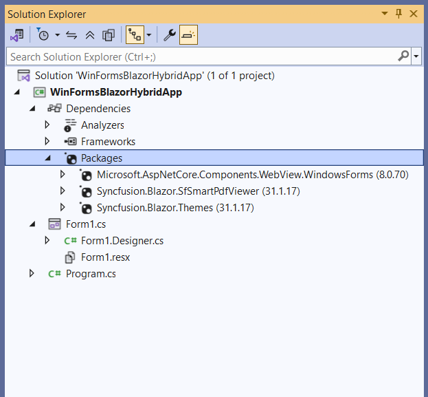
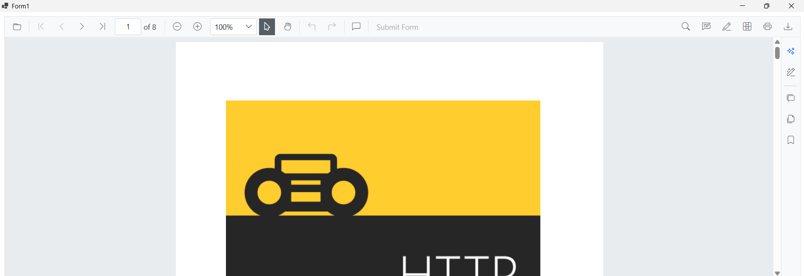

# Using Smart PDF Viewer Component in the WinForms app

This section explains how to add the Syncfusion&reg; Blazor Smart PDF Viewer component to a WinForms Blazor Hybrid App using [Visual Studio](https://visualstudio.microsoft.com/vs/) or Visual Studio Code. The result is a desktop application (WinForms) that hosts Blazor UI inside a BlazorWebView control.





## Prerequisites

* [System requirements for Blazor components](https://blazor.syncfusion.com/documentation/system-requirements)

## Create a new WinForms app in Visual Studio

Create a WinForms application using Visual Studio 2022 with the WinForms project template. The app will later host Blazor components via BlazorWebView. For reference, see [Microsoft Blazor tooling](https://learn.microsoft.com/en-us/aspnet/core/blazor/tooling?view=aspnetcore-8.0&pivots=windows) or the [Syncfusion&reg; Blazor Extension](https://blazor.syncfusion.com/documentation/visual-studio-integration/template-studio).

## Install Blazor Smart PDF Viewer NuGet package in WinForms App

To add the **Blazor Smart PDF Viewer** component to the app, open the NuGet Package Manager in Visual Studio (*Tools → NuGet Package Manager → Manage NuGet Packages for Solution*), search for and install

* [Syncfusion.Blazor.SfSmartPdfViewer](https://www.nuget.org/packages/Syncfusion.Blazor.SfSmartPdfViewer) 
* [Syncfusion.Blazor.Themes](https://www.nuget.org/packages/Syncfusion.Blazor.Themes)
* [Microsoft.AspNetCore.Components.WebView.WindowsForms](https://www.nuget.org/packages/Microsoft.AspNetCore.Components.WebView.WindowsForms)

N> Ensure that the package `Microsoft.AspNetCore.Components.WebView.WindowsForms` updated to version `8.0.16`.





## Prerequisites

* [System requirements for Blazor components](https://blazor.syncfusion.com/documentation/system-requirements)

## Create a new WinForms app in Visual Studio Code

Create a WinForms desktop project (not a WinForms Blazor Hybrid App) using the .NET CLI in Visual Studio Code. This WinForms project will host Blazor UI through BlazorWebView. For guidance, see [Microsoft templates](https://learn.microsoft.com/en-us/aspnet/core/blazor/tooling?view=aspnetcore-8.0&pivots=vsc) or the [Syncfusion&reg; Blazor Extension](https://blazor.syncfusion.com/documentation/visual-studio-code-integration/create-project).




dotnet new winforms -n WinFormsBlazorHybridApp




## Install Blazor Smart PDF Viewer and Themes NuGet packages in the app

Install the required NuGet packages in the WinForms project that will host the Blazor UI.

* Press <kbd>Ctrl</kbd>+<kbd>`</kbd> to open the integrated terminal in Visual Studio Code.
* Ensure the current directory contains the WinForms project `.csproj` file.
* Run the following commands to install [Syncfusion.Blazor.SfSmartPdfViewer](https://www.nuget.org/packages/Syncfusion.Blazor.SfSmartPdfViewer), [Syncfusion.Blazor.Themes](https://www.nuget.org/packages/Syncfusion.Blazor.Themes/), and [Microsoft.AspNetCore.Components.WebView.WindowsForms](https://www.nuget.org/packages/Microsoft.AspNetCore.Components.WebView.WindowsForms). These packages add the Smart PDF Viewer, theme, and the BlazorWebView host control to the project.





dotnet add package Syncfusion.Blazor.SfSmartPdfViewer -v {{ site.releaseversion }}
dotnet add package Syncfusion.Blazor.Themes -v {{ site.releaseversion }}
dotnet add package Microsoft.AspNetCore.Components.WebView.WindowsForms

dotnet restore





N> Syncfusion&reg; Blazor components are available on [nuget.org](https://www.nuget.org/packages?q=syncfusion.blazor). See [NuGet packages](https://blazor.syncfusion.com/documentation/nuget-packages) for the list of available packages and component details.

N> Ensure that the package `Microsoft.AspNetCore.Components.WebView.WindowsForms` updated to version `8.0.16`.





## Register Syncfusion&reg; Blazor service

The WinForms project must target Windows and enable WinForms. A typical project file looks like the following.

 


<Project Sdk="Microsoft.NET.Sdk.Razor">

    ....

</Project>

 


Create a `Components` folder, add an `_Imports.razor` file in it, and include the required component namespaces within that folder.




@using Microsoft.AspNetCore.Components.Web
@using Syncfusion.Blazor.SmartPdfViewer




## Create wwwroot folder and index.html file 

* Create a new folder named wwwroot in the WinForms project root.

* Inside wwwroot, create an index.html host page for the Blazor UI. This host page is required by BlazorWebView to initialize the Blazor runtime and load static assets (themes and scripts). Use the following index.html:

 


<!DOCTYPE html>
<html>
<head>
    <meta charset="utf-8" />
    <meta name="viewport" content="width=device-width, initial-scale=1.0" />
    <title>WinForms Blazor Hybrid App</title>
    <base href="/" />
    <link href="_content/Syncfusion.Blazor.Themes/bootstrap5.css" rel="stylesheet" />
</head>
<body>
    
Loading...

    
    
</body>
</html>




N> Ensure that the Smart PDF Viewer static assets (themes and scripts) are loaded properly.

## Configure Azure OpenAI Service

This section is required only when enabling AI-powered features in Smart PDF Viewer (such as document summarization, smart redaction, or smart fill). It is not required for basic PDF rendering.

In **Visual Studio**, Go to Tools → NuGet Package Manager → Package Manager Console. Run the following commands:




Install-Package Azure.AI.OpenAI
Install-Package Microsoft.Extensions.AI
Install-Package Microsoft.Extensions.AI.OpenAI




In **Visual Studio Code**, open the terminal and run these commands:




dotnet add package Azure.AI.OpenAI
dotnet add package Microsoft.Extensions.AI
dotnet add package Microsoft.Extensions.AI.OpenAI




Add the `Syncfusion.Blazor` namespace to the `~/Form1.cs` file.




using Microsoft.AspNetCore.Components.WebView.WindowsForms;
using Microsoft.Extensions.DependencyInjection;
using Azure.AI.OpenAI;
using Microsoft.Extensions.AI;
using Syncfusion.Blazor;
using Syncfusion.Blazor.AI;
using System.ClientModel;
using WinFormsBlazorHybridApp.Components;




Register Syncfusion Blazor services and BlazorWebView in `~/Form1.cs` after the BlazorWebView is initialized so that the WinForms window can host Blazor components.




ServiceCollection services = new ServiceCollection();
services.AddWindowsFormsBlazorWebView();
services.AddMemoryCache();
services.AddSyncfusionBlazor();
string azureOpenAiKey = "api-key";
string azureOpenAiEndpoint = "endpoint URL";
string azureOpenAiModel = "deployment-name";
AzureOpenAIClient azureOpenAIClient = new AzureOpenAIClient(new Uri(azureOpenAiEndpoint), new ApiKeyCredential(azureOpenAiKey));
IChatClient azureOpenAiChatClient = azureOpenAIClient.GetChatClient(azureOpenAiModel).AsIChatClient();
services.AddChatClient(azureOpenAiChatClient);
services.AddSingleton<IChatInferenceService, SyncfusionAIService>();
BlazorWebView blazorWebView = new BlazorWebView()
{
    HostPage = "wwwroot/index.html",
    Services = services.BuildServiceProvider(),
    Dock = DockStyle.Fill
};
blazorWebView.RootComponents.Add<YourRazorFileName>("#app");
// Replace 'YourRazorFileName' with the actual Razor component class (e.g., Main) in your project's namespace
this.Controls.Add(blazorWebView);




## Adding Blazor Smart PDF Viewer component

Create a Razor component (for example, SmartPDFViewer.razor) in the project and add the Syncfusion&reg; Smart PDF Viewer component to it within the `Components` folder




@using Syncfusion.Blazor.SmartPdfViewer

<SfSmartPdfViewer Height="100%" Width="100%" DocumentPath="https://cdn.syncfusion.com/content/pdf/http-succinctly.pdf">
</SfSmartPdfViewer>




## Run the application

Run the WinForms application. The Syncfusion&reg; Blazor Smart PDF Viewer renders inside the WinForms window.

> [View the sample on GitHub](https://github.com/SyncfusionExamples/blazor-smart-pdf-viewer-examples/tree/master/Getting%20Started/WinForms%20Blazor%20App).

## See also

* [Getting Started with Blazor Smart PDF Viewer Component in Blazor Web App](./web-app)
* [Getting Started with Blazor Smart PDF Viewer Component in WPF Blazor Hybrid App](./wpf-blazor-app)
* [Getting Started with Blazor Smart PDF Viewer Component in MAUI Blazor App](./maui-blazor-app)
* [Document Summarizer in Blazor Smart PDF Viewer](../document-summarizer)
* [Smart Redaction in Blazor Smart PDF Viewer](../smart-redaction)
* [Smart Fill in Blazor Smart PDF Viewer](../smart-fill).