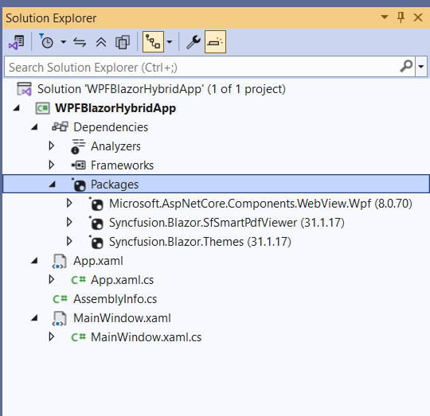

# Using Smart PDF Viewer Component in the WPF app 

This article explains how to add the Syncfusion&reg; Blazor Smart PDF Viewer component to a WPF Blazor Hybrid App using [Visual Studio](https://visualstudio.microsoft.com/vs/) or Visual Studio Code. The result is a desktop application (WPF) that hosts Blazor UI inside a BlazorWebView control.





## Prerequisites

* [System requirements for Blazor components](https://blazor.syncfusion.com/documentation/system-requirements)

## Create a new WPF app in Visual Studio

Create a WPF application using Visual Studio 2022 with the WPF project template. The app will later host Blazor components via BlazorWebView. For reference, see [Microsoft Blazor tooling](https://learn.microsoft.com/en-us/aspnet/core/blazor/tooling?view=aspnetcore-8.0&pivots=windows) or the [Syncfusion&reg; Blazor Extension](https://blazor.syncfusion.com/documentation/visual-studio-integration/template-studio).

## Install Blazor Smart PDF Viewer NuGet package in WPF App

To add **Blazor Smart PDF Viewer** component in the app, open the NuGet package manager in Visual Studio (*Tools → NuGet Package Manager → Manage NuGet Packages for Solution*), search and install

* [Syncfusion.Blazor.SfSmartPdfViewer](https://www.nuget.org/packages/Syncfusion.Blazor.SfSmartPdfViewer) 
* [Syncfusion.Blazor.Themes](https://www.nuget.org/packages/Syncfusion.Blazor.Themes)
* [Microsoft.AspNetCore.Components.WebView.Wpf](https://www.nuget.org/packages/Microsoft.AspNetCore.Components.WebView.Wpf)

N> Ensure that the package `Microsoft.AspNetCore.Components.WebView.Wpf` updated to version `8.0.16`.





## Prerequisites

* [System requirements for Blazor components](https://blazor.syncfusion.com/documentation/system-requirements)

## Create a new WPF app in Visual Studio Code

Create a WPF desktop project (not a WPF Blazor HybridApp) using the .NET CLI in Visual Studio Code. This WPF project will host Blazor UI through BlazorWebView. For guidance, see [Microsoft templates](https://learn.microsoft.com/en-us/aspnet/core/blazor/tooling?view=aspnetcore-8.0&pivots=vsc) or the [Syncfusion&reg; Blazor Extension](https://blazor.syncfusion.com/documentation/visual-studio-code-integration/create-project).




dotnet new wpf -n WPFBlazorHybridApp




## Install Syncfusion&reg; Blazor Smart PDF Viewer and Themes NuGet packages in the app

Install the required NuGet packages in the WPF project that will host the Blazor UI.

* Press <kbd>Ctrl</kbd>+<kbd>`</kbd> to open the integrated terminal in Visual Studio Code.
* Ensure the current directory contains the WPF project `.csproj` file.
* Run the following commands to install [Syncfusion.Blazor.SfSmartPdfViewer](https://www.nuget.org/packages/Syncfusion.Blazor.SfSmartPdfViewer), [Syncfusion.Blazor.Themes](https://www.nuget.org/packages/Syncfusion.Blazor.Themes/), and [Microsoft.AspNetCore.Components.WebView.Wpf](https://www.nuget.org/packages/Microsoft.AspNetCore.Components.WebView.Wpf). This adds the Smart PDF Viewer, theme, and the BlazorWebView host control.





dotnet add package Syncfusion.Blazor.SfSmartPdfViewer -v {{ site.releaseversion }}
dotnet add package Syncfusion.Blazor.Themes -v {{ site.releaseversion }}
dotnet add package Microsoft.AspNetCore.Components.WebView.Wpf
dotnet restore





N> Syncfusion&reg; Blazor components are available on [nuget.org](https://www.nuget.org/packages?q=syncfusion.blazor). See [NuGet packages](https://blazor.syncfusion.com/documentation/nuget-packages) for the list of available packages and component details.

N> Ensure that the package `Microsoft.AspNetCore.Components.WebView.Wpf` updated to version `8.0.16`.





## Register Syncfusion&reg; Blazor service

The WPF project must target Windows and enable WPF. A typical project file looks like the following.

 


<Project Sdk="Microsoft.NET.Sdk.Razor">

    ....

</Project>

 


Create an `_Imports.razor` and add the component namespace




@using Microsoft.AspNetCore.Components.Web
@using Syncfusion.Blazor.SmartPdfViewer




## To Configure Azure OpenAI Service

This section is required only when enabling AI-powered features in Smart PDF Viewer (such as document summarization, smart redaction, or smart fill). It is not required for basic PDF rendering.

In **Visual Studio**, Go to Tools → NuGet Package Manager → Package Manager Console. Run these commands one by one:




Install-Package Azure.AI.OpenAI
Install-Package Microsoft.Extensions.AI
Install-Package Microsoft.Extensions.AI.OpenAI -Version 9.8.0-preview.1.25412.6




In **Visual Studio Code**, open the terminal and run these commands:




dotnet add package Azure.AI.OpenAI
dotnet add package Microsoft.Extensions.AI
dotnet add package Microsoft.Extensions.AI.OpenAI --version 9.8.0-preview.1.25412.6




Register Syncfusion Blazor services, AI services and BlazorWebView in **~/MainWindow.xaml.cs** so that the WPF window can host Blazor components.




....
using Microsoft.Extensions.DependencyInjection;
using Azure.AI.OpenAI;
using Microsoft.Extensions.AI;
using Syncfusion.Blazor;
using Syncfusion.Blazor.AI;
using System.ClientModel;
....
            InitializeComponent();
            ServiceCollection serviceCollection = new ServiceCollection();
            serviceCollection.AddWpfBlazorWebView();
            serviceCollection.AddMemoryCache();
            serviceCollection.AddSyncfusionBlazor();
            string azureOpenAiKey = "api-key";
            string azureOpenAiEndpoint = "endpoint URL";
            string azureOpenAiModel = "deployment-name";
            AzureOpenAIClient azureOpenAIClient = new AzureOpenAIClient(new Uri(azureOpenAiEndpoint), new ApiKeyCredential(azureOpenAiKey));
            IChatClient azureOpenAiChatClient = azureOpenAIClient.GetChatClient(azureOpenAiModel).AsIChatClient();
            serviceCollection.AddChatClient(azureOpenAiChatClient);
            serviceCollection.AddSingleton<IChatInferenceService, SyncfusionAIService>();
            Resources.Add("services", serviceCollection.BuildServiceProvider());
....




Here,
* **apiKey**: “Azure OpenAI API Key”
* **deploymentName**: “Azure OpenAI deployment name”
* **endpoint**: “Azure OpenAI deployment endpoint URL”

For **Azure OpenAI**, first [deploy an Azure OpenAI Service resource and model](https://learn.microsoft.com/en-us/azure/ai-foundry/openai/how-to/create-resource?pivots=web-portal), then the values for `apiKey`, `deploymentName`, and `endpoint` will be available.

## Create wwwroot folder and index.html file 

* Create a new folder named wwwroot in the WPF project root.

* Inside wwwroot, create an index.html host page for the Blazor UI. This host page is required by BlazorWebView to initialize the Blazor runtime and load static assets (themes and scripts). A basic index.html might look like the following:

 


<!DOCTYPE html>
<html>
<head>
    <meta charset="utf-8" />
    <meta name="viewport" content="width=device-width, initial-scale=1.0" />
    <title>WPF Blazor Hybrid App</title>
    <base href="/" />
    <link href="_content/Syncfusion.Blazor.Themes/bootstrap5.css" rel="stylesheet" />
</head>
<body>
    
Loading...

    
    
</body>
</html>




N> Ensure that the Smart PDF Viewer static assets (themes and scripts) are loaded properly.

## Adding Blazor Smart PDF Viewer component

Create a Razor component (for example, Main.razor) in the project and add the Syncfusion&reg; Smart PDF Viewer component to it.




@using Syncfusion.Blazor.SmartPdfViewer;

<SfSmartPdfViewer Height="100%" Width="100%" DocumentPath="https://cdn.syncfusion.com/content/pdf/http-succinctly.pdf">
</SfSmartPdfViewer>




## Integrate Blazor into MainWindow.xaml

* Open MainWindow.xaml.
* Add the Microsoft.AspNetCore.Components.WebView.Wpf namespace.
* Embed the BlazorWebView control, set HostPage to wwwroot/index.html, and map a RootComponent that matches the Razor component type and the selector in index.html (#app).

 


<Window x:Class="WPFBlazorHybridApp.MainWindow"
        ....
        xmlns:blazor="clr-namespace:Microsoft.AspNetCore.Components.WebView.Wpf;assembly=Microsoft.AspNetCore.Components.WebView.Wpf"
        ....
        Title="MainWindow" Height="450" Width="800">
    <Grid>
        <blazor:BlazorWebView HostPage="wwwroot\index.html" Services="{DynamicResource services}">
            <blazor:BlazorWebView.RootComponents>
                <blazor:RootComponent Selector="#app" ComponentType="{x:Type local:YourRazorFileName}" />
                <!-- Replace 'YourRazorFileName' with the actual Razor component class (e.g., Main) in your project's namespace -->
            </blazor:BlazorWebView.RootComponents>
        </blazor:BlazorWebView>
    </Grid>
</Window>

 


## Run the application

Run the WPF application. The Syncfusion&reg; Blazor Smart PDF Viewer renders inside the WPF window.

>[View the sample on GitHub](https://github.com/SyncfusionExamples/blazor-smart-pdf-viewer-examples/tree/master/Getting%20Started/WPF%20Blazor%20App).

## See also

* [Getting Started with Blazor Smart PDF Viewer Component in Blazor Web App](./web-app)
* [Getting Started with Blazor Smart PDF Viewer Component in WinForms Blazor Hybrid App](./winforms-blazor-app)
* [Getting Started with Blazor Smart PDF Viewer Component in MAUI Blazor App](./maui-blazor-app)
* [Document Summarizer in Blazor Smart PDF Viewer](../document-summarizer)
* [Smart Redaction in Blazor Smart PDF Viewer](../smart-redaction)
* [Smart Fill in Blazor Smart PDF Viewer](../smart-fill).