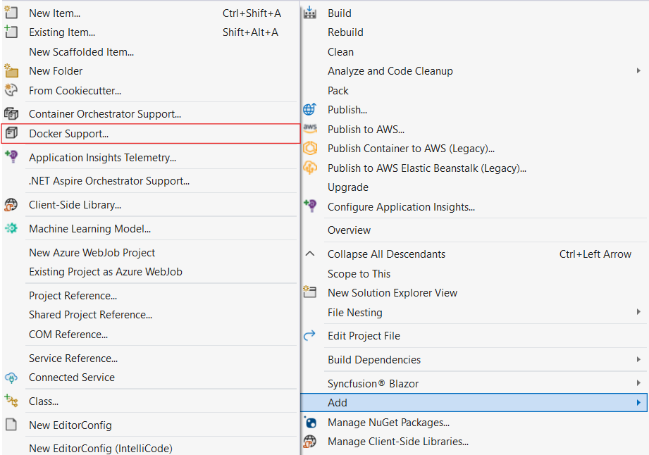
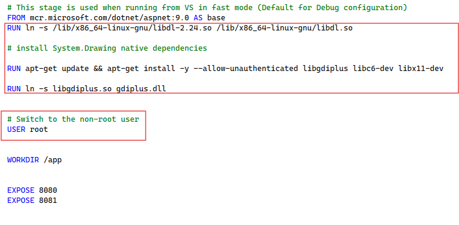
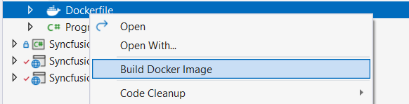

# Docker Image Hosting Guide for Blazor Web App

We aim to assist developers in reducing deployment time and simplifying the publishing process using Docker images. The [Syncfusion Document Processing API](https://hub.docker.com/r/syncfusion/document-processing-apis) is available as a ready-to-use Docker image for document processing APIs that ensures a seamless experience for Docker users. The following sections will guide you on how to publish docker images.

## Deployment requirement
### Hardware requirement
The following hardware requirements are necessary to run document processing API

Windows
CPU: 2-core
Memory: 8GB RAM
Disk space: 8GB or more

### Software requirements
The following software requirements are necessary to run document processing API

Application: Rancher Desktop.
Web Browser: Microsoft Edge, Mozilla Firefox, and Chrome.

## Steps to configure and run docker container
### Step1:
Install the Rancher desktop application [Rancher Desktop](https://github.com/rancher-sandbox/rancher-desktop/releases)

### Step2:
Open the rancher desktop application Select the displayed option.

### Step3:
Create a Smart Pdf Viewer web app sample using the following [documentation](https://help.syncfusion.com/document-processing/pdf/smart-pdf-viewer/blazor/getting-started/web-app).

### Step4:
Right-click Smart PDF Viewer web app sample to add the docker support with Linux.
.

### Step5:
Once the docker file is added open the docker file and add the following line



FROM mcr.microsoft.com/dotnet/aspnet:9.0 AS base
RUN ln -s /lib/x86_64-linux-gnu/libdl-2.24.so /lib/x86_64-linux-gnu/libdl.so  

RUN apt-get update && apt-get install -y --allow-unauthenticated libgdiplus libc6-dev libx11-dev  

RUN ln -s libgdiplus.so gdiplus.dll  

 
USER root

WORKDIR /app

EXPOSE 8080
EXPOSE 8081
....



.
N> Remove the `User` if not needed or change the User type to  `root` for providing elevated privileges.

### Step6:
Publish the image by building the DockerFile
.

### Step7:
Open the comment prompt or power shell and enter the following command to list the published docker images.




docker image ls




### Step8:
To check the published images locally, run the below command which is in the format docker run -d -p 6001:{exposed Port} {Image ID}.




docker run -d -p 6001:8080 4eead1aaf7a5 




### Step9:
Ensure the published image is as per requirement in the hosted link `http://localhost:6001/`

## See also

* [Steps to deploy Docker Images from Container Registry to Azure App Services](https://learn.microsoft.com/en-us/azure/app-service/quickstart-custom-container?tabs=dotnet&pivots=container-linux-azure-portal).

