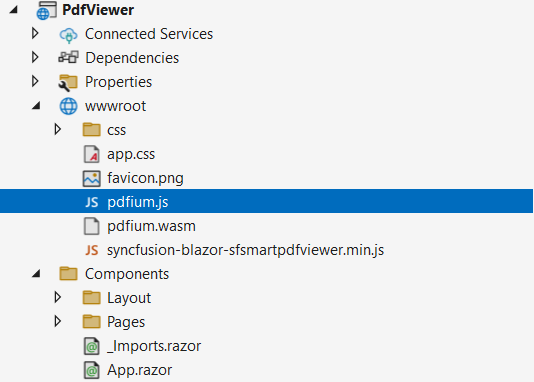

# Reference the SfSmartPdfViewer script in a Blazor application

* Reference the script using a CDN for a quick setup without local files. For guidance, see the [CDN reference](https://blazor.syncfusion.com/documentation/common/adding-script-references#cdn-reference).

* Reference the script from the installed NuGet package via static web assets. For guidance, see [Reference script from static web assets](https://blazor.syncfusion.com/documentation/common/adding-script-references#static-web-assets).

* To include custom scripts, use the [Custom Resource Generator](https://blazor.syncfusion.com/documentation/common/custom-resource-generator). Ensure that [pdfium.js](https://github.com/SyncfusionExamples/blazor-pdf-viewer-examples/blob/master/Common/Pdfium%20files/pdfium.js) and [pdfium.wasm](https://github.com/SyncfusionExamples/blazor-pdf-viewer-examples/blob/master/Common/Pdfium%20files/pdfium.wasm) are added to the application (typically under wwwroot) and that the page can resolve their paths at runtime.

The following image shows the script and Pdfium files referenced in a Blazor application.

## See also

* [Getting Started with Blazor Smart PDF Viewer in Web App Server](../getting-started/web-app)
