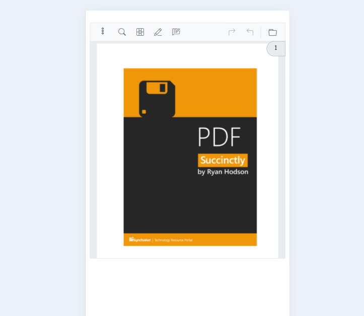

# RTL in Blazor Smart PDF Viewer

The Blazor Smart PDF Viewer supports Right-to-Left (RTL) rendering to accommodate languages that are read from right to left, such as Arabic and Hebrew. By default, RTL support is disabled. You can enable it by setting the `EnableRtl` property to `true`.

## Example

```cshtml
<SfSmartPdfViewer DocumentPath="https://cdn.syncfusion.com/content/pdf/pdf-succinctly.pdf" EnableRtl="true">
</SfSmartPdfViewer>
```

## RTL View in Desktop and Mobile Modes
### RTL View in Desktop Mode

###  RTL View in Mobile Mode


In this example, the `EnableRtl` property is set to `true`, enabling RTL layout for the PDF viewer.