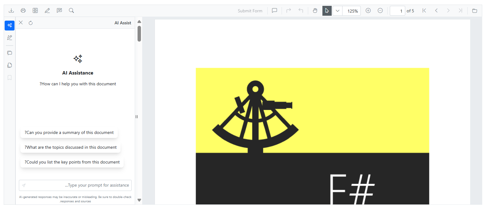

# RTL in Blazor Smart PDF Viewer

The Blazor Smart PDF Viewer supports Right-to-Left (RTL) layout for languages that are read from right to left, such as Arabic and Hebrew. RTL affects the viewer UI, toolbar alignment, and content flow. RTL is disabled by default and can be enabled by setting the [EnableRtl](https://help.syncfusion.com//cr/blazor/Syncfusion.Blazor.SfPdfViewer.PdfViewerBase.html#Syncfusion_Blazor_SfPdfViewer_PdfViewerBase_EnableRtl) property to `true`.

## Example




@* Enables Right-to-Left layout support for languages like Arabic and Hebrew *@

<SfSmartPdfViewer DocumentPath="https://cdn.syncfusion.com/content/pdf/pdf-succinctly.pdf"
EnableRtl="true">
</SfSmartPdfViewer>




N> [View sample in GitHub](https://github.com/SyncfusionExamples/blazor-smart-pdf-viewer-examples/tree/master/RTL)

In this example, the [EnableRtl](https://help.syncfusion.com//cr/blazor/Syncfusion.Blazor.SfPdfViewer.PdfViewerBase.html#Syncfusion_Blazor_SfPdfViewer_PdfViewerBase_EnableRtl) property is set to `true`, enabling RTL layout for the PDF viewer.

## See also

* [Getting Started with Blazor Smart PDF Viewer in Server Web App](./getting-started/web-app)