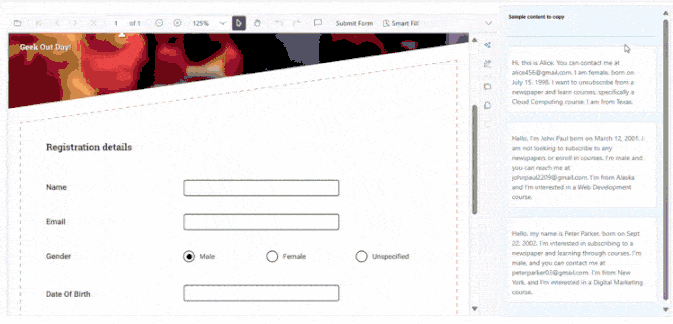

# Smart Fill in Blazor Smart PDF Viewer
This feature accelerates completion of PDF forms by using AI to detect fields and populate them from clipboard or specified data, reducing manual input and errors. The Smart Fill option is available only when the loaded PDF contains form fields and can be enabled or disabled via the Enable property. Users can review and adjust the populated values before finalizing.

Check out the following video to learn how to implement Smart Filling in Blazor Smart PDF Viewer.


## Component Usage
Add the following code in the **~Pages/Home.razor** file to enable and try the Smart Fill feature in Smart PDF Viewer.




@* Enables AI-powered automatic form filling to reduce manual input and improve accuracy *@

<SfSmartPdfViewer DocumentPath="https://cdn.syncfusion.com/content/pdf/pdf-succinctly.pdf">
     <SmartFillSettings/>
</SfSmartPdfViewer>




N> [View sample in GitHub](https://github.com/SyncfusionExamples/blazor-smart-pdf-viewer-examples/tree/master/SmartFill)

## Smart Fill Settings in Blazor Smart PDF Viewer
The [`SmartFillSettings`](https://help.syncfusion.com/cr/blazor/Syncfusion.Blazor.SmartPdfViewer.SmartFillSettings.html) class configures the Smart Fill feature in the Smart PDF Viewer. It provides options for integrating AI-powered, context-aware form filling that automates the population of PDF form fields using clipboard or specified data.

## SmartFillSettings Properties

### Enable
- The [`Enable`](https://help.syncfusion.com/cr/blazor/Syncfusion.Blazor.SmartPdfViewer.SmartFillSettings.html#Syncfusion_Blazor_SmartPdfViewer_SmartFillSettings_Enable) property controls whether the Smart Fill button is enabled in the toolbar. The default value is `true`.
- The button is active only when the loaded PDF document contains form fields.
- Can be toggled dynamically based on user roles, document content, or application logic.




@* Disables the Smart Fill feature in the toolbar *@

<SfSmartPdfViewer DocumentPath="https://cdn.syncfusion.com/content/pdf/pdf-succinctly.pdf">
    <SmartFillSettings Enable="false" />
</SfSmartPdfViewer>




## Integration
To integrate Smart Fill into a PDF viewer workflow, nest the [`SmartFillSettings`](https://help.syncfusion.com/cr/blazor/Syncfusion.Blazor.SmartPdfViewer.SmartFillSettings.html) tag within the [`SfSmartPdfViewer`](https://help.syncfusion.com/cr/blazor/Syncfusion.Blazor.SmartPdfViewer.SfSmartPdfViewer.html) tag. Ensure that the PDF document contains form fields to use AI-powered filling.

## See also

* [Explore Blazor Smart PDF Viewer Smart Fill Demo](https://document.syncfusion.com/demos/pdf-viewer/blazor-server/smart-pdf-viewer/smartfill?theme=fluent2)
* [Document Summaries in Blazor Smart PDF Viewer](./document-summarizer)
* [Smart Redaction in Blazor Smart PDF Viewer](./smart-redaction)