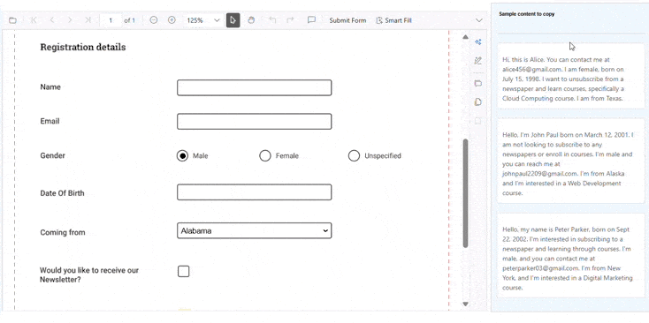

# Smart Fill in Blazor Smart PDF Viewer
This feature accelerates completion of PDF forms by using AI to detect fields and populate them from clipboard or specified data, reducing manual input and errors. The Smart Fill option is available only when the loaded PDF contains form fields and can be enabled or disabled via the Enable parameter. Users can review and adjust the populated values before finalizing. Ensure the Syncfusion Blazor PDF Viewer package is installed and the viewer is configured in the application.

## Component Usage
Add the following code in the **~Pages/Home.razor** file to enable and try the Smart Fill feature in Smart PDF Viewer.




@* Enables AI-powered automatic form filling to reduce manual input and improve accuracy *@

<SfSmartPdfViewer DocumentPath="https://cdn.syncfusion.com/content/pdf/pdf-succinctly.pdf">
     <SmartFillSettings/>
</SfSmartPdfViewer>




N> [View sample in GitHub](https://github.com/SyncfusionExamples/blazor-smart-pdf-viewer-examples/tree/master/SmartFill)

## Smart Fill Settings in Syncfusion Blazor Smart PDF Viewer
- The [SmartFillSettings](https://help.syncfusion.com//cr/blazor/Syncfusion.Blazor.SmartPdfViewer.SmartFillSettings.html) class configures the Smart Fill feature in the Smart PDF Viewer. It leverages AI to automate the population of PDF form fields using clipboard or specified data.

- The [SmartFillSettings](https://help.syncfusion.com//cr/blazor/Syncfusion.Blazor.SmartPdfViewer.SmartFillSettings.html) API provides options and hooks for integrating AI-powered, context-aware form filling into a PDF viewer workflow.

## SmartFillSettings Parameter

### Enable
- The [Enable](https://help.syncfusion.com//cr/blazor/Syncfusion.Blazor.SmartPdfViewer.SmartFillSettings.html#Syncfusion_Blazor_SmartPdfViewer_SmartFillSettings_Enable) property controls whether the Smart Fill button appears in the toolbar and whether the feature is accessible. The default value is `true`.
- The button is active only when the loaded PDF document contains form fields.
- Keeps the UI clean by hiding or disabling the feature when not applicable.
- Can be toggled dynamically based on user roles, document content, or application logic.




@* Controls visibility and accessibility of the Smart Fill feature based on document content or app logic *@

<SfSmartPdfViewer DocumentPath="https://cdn.syncfusion.com/content/pdf/pdf-succinctly.pdf">
    <SmartFillSettings Enable="false" />
</SfSmartPdfViewer>




## Integration
To integrate Smart Fill into a PDF viewer workflow, include the [SmartFillSettings](https://help.syncfusion.com//cr/blazor/Syncfusion.Blazor.SmartPdfViewer.SmartFillSettings.html) component within the [SfSmartPdfViewer](https://help.syncfusion.com//cr/blazor/Syncfusion.Blazor.SmartPdfViewer.SfSmartPdfViewer.html) tag. Ensure that the PDF document contains form fields to use AI-powered filling.

## See also

* [Explore Blazor Smart PDF Viewer Smart Fill Demo](https://document.syncfusion.com/demos/pdf-viewer/blazor-server/smart-pdf-viewer/smartfill?theme=fluent2)
* [Document Summaries in Blazor Smart PDF Viewer](./document-summarizer)
* [Smart Redaction in Blazor Smart PDF Viewer](./smart-redaction)