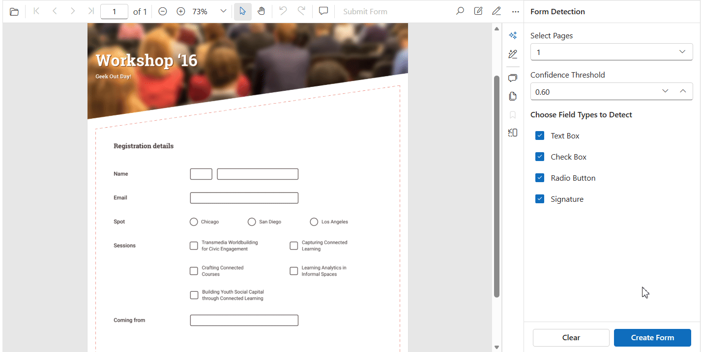

# Smart Form Recognizer in Blazor Smart PDF Viewer

The Smart Form Recognizer feature helps detect and add form fields automatically from scanned or image-based PDF documents. It analyzes the document layout and recognizes form elements such as text boxes, check boxes, radio buttons, and signature fields, then adds corresponding interactive form fields to the PDF Viewer.

This helps you convert static forms into editable, fillable PDF forms without manually creating each field, saving time and improving productivity.



## Prerequisites

The Smart Form Recognizer feature depends on the Syncfusion Smart Form Recognition library.

Install the required NuGet package and import the namespace in your application.




Install-Package Syncfusion.SmartFormRecognizer.NET -Version {{ site.releaseversion }}




```cs
@using Syncfusion.SmartFormRecognizer
```

For package installation details, refer to the following:

* [Smart Form Recognizer NuGet packages](https://help.syncfusion.com/document-processing/data-extraction/net/nuget-packages-required#smart-form-recognizer)

## Component Usage

The following example demonstrates how to use Smart Form Recognizer in the Smart PDF Viewer.




@page "/form-recognizer"
@using Syncfusion.Blazor.SmartPdfViewer
@using Syncfusion.SmartFormRecognizer

<button @onclick="DetectAndAddFormFields">
    Detect & Add Form Fields
</button>

<button @onclick="ExtractFormFields">
    Extract Form Fields As JSON
</button>

<SfSmartPdfViewer @ref="smartPdfViewer"
                  Height="100%"
                  Width="100%"
                  DocumentPath="https://cdn.syncfusion.com/content/pdf/form-designer.pdf">
</SfSmartPdfViewer>

@code {

    SfSmartPdfViewer? smartPdfViewer;

    private async Task DetectAndAddFormFields()
    {
        if (smartPdfViewer != null)
        {
            FormRecognizer formRecognizer = new FormRecognizer();

            SmartFormRecognizerOptions options =
                new SmartFormRecognizerOptions
                {
                    ConfidenceThreshold = 0.5,
                    DetectCheckboxes = true,
                    DetectRadioButtons = true,
                    DetectSignatures = true,
                    DetectTextboxes = true,
                    PageRange = null
                };

            await smartPdfViewer.DetectAndAddFormFieldsAsync(
                formRecognizer,
                options);
        }
    }

    private async Task ExtractFormFields()
    {
        if (smartPdfViewer != null)
        {
            FormRecognizer formRecognizer = new FormRecognizer();

            SmartFormRecognizerOptions options =
                new SmartFormRecognizerOptions
                {
                    ConfidenceThreshold = 0.5,
                    DetectCheckboxes = true,
                    DetectRadioButtons = true,
                    DetectSignatures = true,
                    DetectTextboxes = true,
                    PageRange = null
                };

            string formFieldsJson =
                await smartPdfViewer.ExtractFormFieldsAsync(
                    formRecognizer,
                    options);
        }
    }
}




N> [View sample in GitHub](https://github.com/SyncfusionExamples/blazor-smart-pdf-viewer-examples)

## Detect and Add Form Fields

The `DetectAndAddFormFieldsAsync` method analyzes the currently loaded PDF document, detects form elements, and automatically adds interactive form fields to the PDF Viewer.

### Example

```csharp
FormRecognizer formRecognizer = new FormRecognizer();

await smartPdfViewer.DetectAndAddFormFieldsAsync(
    formRecognizer,
    options);
```

After detection, the generated fields work like manually created form fields and support editing, movement, resizing, and deletion.

## Extract Form Fields as JSON

The `ExtractFormFieldsAsync` method detects form fields from the loaded document and returns the extracted field information as a JSON string.

### Example

```csharp
FormRecognizer formRecognizer = new FormRecognizer();

string json =
    await smartPdfViewer.ExtractFormFieldsAsync(
        formRecognizer,
        options);
```

The returned JSON contains details such as field type, page number, bounds, and the recognition metadata for each detected field.

## SmartFormRecognizerOptions

The `SmartFormRecognizerOptions` class provides configuration options that control the form recognition process.

### Properties

| Property | Type | Description |
|-----------|------|-------------|
| ConfidenceThreshold | double | Specifies the minimum confidence score required for a detected field. Values range from `0.0` to `1.0`. |
| PageRange | int[,] | Specifies the document pages to process. When set to `null`, all pages are analyzed. |
| DetectCheckboxes | bool | Enables or disables check box detection. |
| DetectRadioButtons | bool | Enables or disables radio button detection. |
| DetectTextboxes | bool | Enables or disables text box detection. |
| DetectSignatures | bool | Enables or disables signature field detection. |

### Configure Detection Options

```csharp
SmartFormRecognizerOptions options =
    new SmartFormRecognizerOptions
    {
        ConfidenceThreshold = 0.6,
        DetectCheckboxes = true,
        DetectRadioButtons = true,
        DetectSignatures = true,
        DetectTextboxes = true
    };
```

## Process Specific Pages

You can restrict form recognition to selected pages by using the `PageRange` property.

The following example processes pages 1 through 3:

```csharp
SmartFormRecognizerOptions options =
    new SmartFormRecognizerOptions
    {
        PageRange = new int[,]
        {
            { 1, 3 }
        }
    };
```

When the `PageRange` property is not specified, all pages in the document are processed.

## Supported Form Field Types

Smart Form Recognizer can detect the following form field types:

* Text box
* Check box
* Radio button
* Signature field

## See also

* [Smart Data Extractor Form Recognition](https://help.syncfusion.com/document-processing/data-extraction/net/working-with-form-recognition)
* [Smart Fill in Blazor Smart PDF Viewer](./smart-fill)
* [Document Summaries in Blazor Smart PDF Viewer](./document-summarizer)
* [Smart Redaction in Blazor Smart PDF Viewer](./smart-redaction)
