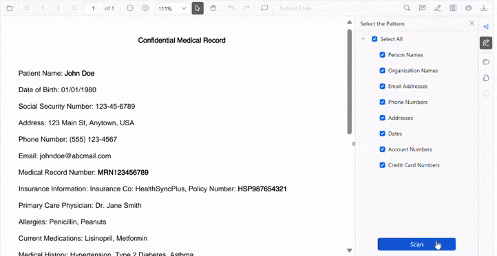
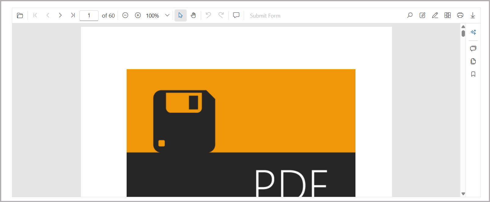
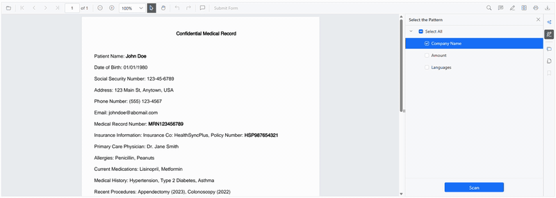

# Smart Redaction in Blazor Smart PDF Viewer

The [Smart PDF Viewer](https://help.syncfusion.com//cr/blazor/Syncfusion.Blazor.SmartPdfViewer.html) enables intelligent redaction of sensitive information in PDF documents with AI-assisted capabilities. The Smart Redaction feature detects and enables redaction of personally identifiable information (PII), financial data, and other confidential content.

Smart Redaction allows selecting detection patterns (emails, names, phone numbers, and more) and automatically identifies matching content throughout the document. Users can activate the Smart Redaction feature by selecting the **Smart Redaction** button in the side toolbar, review detected items, and apply redaction selectively.

## Component Usage
Add the following code to the **~Pages/Home.razor** file to enable and evaluate Smart Redaction in the Smart PDF Viewer. Ensure the SfSmartPdfViewer package is installed and the component is added to the page.




<SfSmartPdfViewer DocumentPath="https://cdn.syncfusion.com/content/pdf/pdf-succinctly.pdf">
    <SmartRedactSettings/>
</SfSmartPdfViewer>




## SmartRedactSettings Parameters

### Enable
This [Enable](https://help.syncfusion.com/cr/blazor/Syncfusion.Blazor.SmartPdfViewer.SmartRedactSettings.html#Syncfusion_Blazor_SmartPdfViewer_SmartRedactSettings_Enable) property controls whether Smart Redaction is available in the PDF viewer. When set to `false`, the Smart Redaction button in the side toolbar is hidden and all related functionality is disabled. Use this setting to restrict access based on context, role, or compliance requirements. The default value is `true`.




<SfSmartPdfViewer DocumentPath="https://cdn.syncfusion.com/content/pdf/pdf-succinctly.pdf">
    <SmartRedactSettings Enable="false" />
</SfSmartPdfViewer>




### RedactPatterns
This property allows you to configure a collection of custom text patterns for identifying sensitive information during smart redaction. Use this property to extend the default detection with application-specific expressions such as ID types, personal keywords, or custom data markers. By supplying redaction patterns, you can tailor the redaction process to match specific business, regulatory, or organizational needs.

The default patterns include:
- Person Names
- Organization Names  
- Email Addresses
- Phone Numbers
- Addresses
- Dates
- Account Numbers
- Credit Card Numbers




<SfSmartPdfViewer DocumentPath="https://cdn.syncfusion.com/content/pdf/pdf-succinctly.pdf">
    <SmartRedactSettings RedactPatterns="@redactPatterns" />
</SfSmartPdfViewer>

@code {
    string[] redactPatterns = new string[] {
        "Company Name", 
        "Amount",
        "Languages"
    };
}




The output shows the Smart Redaction feature in action, where AI automatically detects the specified sensitive information patterns throughout the document.

To apply these settings, include them within the [SmartRedactSettings](https://help.syncfusion.com/cr/blazor/Syncfusion.Blazor.SmartPdfViewer.SmartRedactSettings.html) of the [SfSmartPdfViewer](https://help.syncfusion.com/cr/blazor/Syncfusion.Blazor.SmartPdfViewer.SfSmartPdfViewer.html) component. Smart Redaction combines AI-assisted detection with user control to ensure accurate, compliant removal of sensitive information.

N> [View sample in GitHub](https://github.com/SyncfusionExamples/blazor-smart-pdf-viewer-examples/tree/master/Smart%20Redaction)

## Important Redaction Behaviors and Limitations

Smart Redaction is irreversible. After applying redaction, the original content cannot be recovered. Undo and redo are not supported for redaction, and the underlying text, images, and metadata are permanently removed. Review all detected content before applying redaction.

N> For details about redaction annotations in the Blazor PDF Viewer, refer to the [Redaction annotations documentation](./../../../PDF/PDF-Viewer/blazor/annotation/redaction-annotation).

## Security and Compliance Considerations

Smart Redaction ensures complete removal of sensitive content from the PDF document, and redacted content cannot be recovered through text selection, search, or other methods. Maintain backup copies of original documents when required by policy, and test redaction patterns on sample documents before using them in production environments.

N> A confirmation dialog appears before applying redaction to confirm awareness that the process is permanent and irreversible.

## AI Detection Accuracy and Manual Review Requirements

Smart Redaction uses AI to detect sensitive information, and manual review is required. Detection may not be 100% accurate. Verify all detected items before applying permanent redaction. Test custom redaction patterns thoroughly before use.

## See also

* [Explore Blazor Smart PDF Viewer Smart Redaction Demo](https://document.syncfusion.com/demos/pdf-viewer/blazor-server/smart-pdf-viewer/smartredact?theme=fluent2)
* [Document Summaries in Blazor Smart PDF Viewer](./document-summarizer)
* [Smart Fill in Blazor Smart PDF Viewer](./smart-fill)