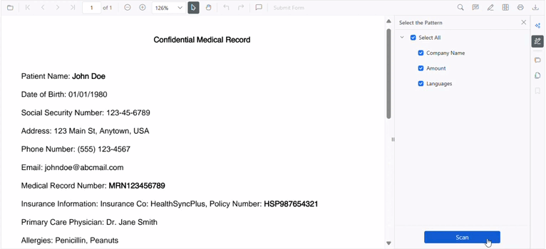

# Smart Redaction in Blazor Smart PDF Viewer

The [SmartPdfViewer](https://help.syncfusion.com//cr/blazor/Syncfusion.Blazor.SmartPdfViewer.html) enables intelligent redaction of sensitive information in PDF documents by incorporating AI-assisted functionalities. The Smart Redaction feature automatically detects and allows users to redact sensitive data such as personally identifiable information (PII), financial data, and other confidential content.


The AI-powered Smart Redaction provides users with the ability to select specific patterns (emails, names, phone numbers, etc.) and automatically identify sensitive information throughout the document. Users can activate the smart redaction feature by clicking the **Smart Redaction** button in the side toolbar. The system can detect various types of sensitive content and allows users to review and selectively redact identified information.

## Component Usage

```cshtml
<SfSmartPdfViewer DocumentPath="https://cdn.syncfusion.com/content/pdf/pdf-succinctly.pdf">
    <SmartRedactSettings/>
</SfSmartPdfViewer>
```

## SmartRedactSettings Parameters

### Enable
This [Enable](https://help.syncfusion.com//cr/blazor/Syncfusion.Blazor.SmartPdfViewer.SmartRedactSettings.html#Syncfusion_Blazor_SmartPdfViewer_SmartRedactSettings_Enable) property controls whether the Smart Redaction feature is enabled in the PDF viewer. When set to `false`, the Smart Redact button in the side toolbar will be hidden and all redaction functionalities will be inaccessible to users. This setting is helpful when you want to restrict or disable access to advanced redaction tools based on context, role, or compliance requirements. The default value is `true`.

```cshtml
<SfSmartPdfViewer DocumentPath="https://cdn.syncfusion.com/content/pdf/pdf-succinctly.pdf">
    <SmartRedactSettings Enable="true" />
</SfSmartPdfViewer>
```

### RedactPatterns
This property allows you to configure a collection of custom text patterns for identifying sensitive information during smart redaction. Use this property to extend the default detection with application-specific expressions such as ID types, personal keywords, or custom data markers. By supplying redaction patterns, you can tailor the redaction process to match specific business, regulatory, or organizational needs.

The default patterns include:
- Person Names
- Organization Names  
- Email Addresses
- Phone Numbers
- Addresses
- Dates
- Account Numbers
- Credit Card Numbers

```cshtml
<SfSmartPdfViewer DocumentPath="https://cdn.syncfusion.com/content/pdf/pdf-succinctly.pdf">
    <SmartRedactSettings RedactPatterns="@redactPatterns" />
</SfSmartPdfViewer>

@code {
    string[] redactPatterns = new string[] {
        "Company Name", 
        "Amount",
        "Languages"
    };
}
```
The output shows the Smart Redaction feature in action, where AI automatically detects the specified sensitive information patterns throughout the document.



To apply these settings, include them within the [SmartRedactSettings](https://help.syncfusion.com//cr/blazor/Syncfusion.Blazor.SmartPdfViewer.SmartRedactSettings.html) of the [SfSmartPdfViewer](https://help.syncfusion.com//cr/blazor/Syncfusion.Blazor.SmartPdfViewer.SfSmartPdfViewer.html) component. The Smart Redaction feature combines the power of AI with user control to ensure accurate and compliant redaction of sensitive information in PDF documents.

[View sample in GitHub](https://github.com/SyncfusionExamples/blazor-smart-pdf-viewer-examples/tree/master/Smart%20Redaction)

## Important Redaction Behaviors and Limitations

Smart Redaction is an irreversible process where once redaction is applied, the original content cannot be recovered through any means. The redaction process does not support undo or redo operations, and all original text, images, and metadata are permanently removed from the document. Users must carefully review AI-detected content before applying permanent redaction as the process cannot be reversed.

N> For detailed information about redaction annotations in the Blazor PDF Viewer, refer to the [Redaction Annotations documentation](./../../../PDF/PDF-Viewer/blazor/annotation/redaction-annotation).

## Security and Compliance Considerations

Smart Redaction ensures complete removal of sensitive content from the PDF document, and redacted content cannot be recovered through text selection, search, or any other method. Organizations should maintain backup copies of original documents when required by policy and thoroughly test redaction patterns on sample documents before using in environments.

N> A confirmation dialog is displayed before applying redaction to ensure users are aware that the redaction process is permanent and irreversible.

## AI Detection Accuracy and Manual Review Requirements

The Smart Redaction feature uses AI to detect sensitive information, but manual review is essential. AI detection may not be 100% accurate, and users should verify all detected items before applying permanent redaction. Once applied, the redaction process cannot be reversed. Users should review AI-detected sensitive content carefully, test custom redaction patterns thoroughly before use.

## See also

* [Explore Blazor Smart PDF Viewer Smart Redaction Demo](https://document.syncfusion.com/demos/pdf-viewer/blazor-server/smart-pdf-viewer/smartredact?theme=fluent2)
* [Document Summaries in Blazor Smart PDF Viewer](./document-summarizer)
* [Smart Fill in Blazor Smart PDF Viewer](./smart-fill)