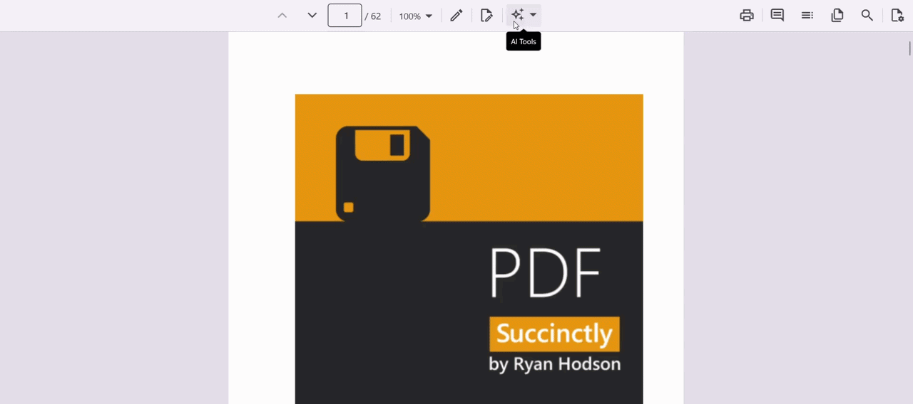

# Document Summaries and Q&A in .NET MAUI Smart PDF Viewer

The [`AssistViewSettings`](https://help.syncfusion.com/cr/maui/Syncfusion.Maui.SmartPdfViewer.AssistViewSettings.html) of [`SfSmartPdfViewer`](https://help.syncfusion.com/cr/maui/Syncfusion.Maui.SmartPdfViewer.SfSmartPdfViewer.html) enables AI-assisted interaction with PDF documents, including summarization and question answering.

The AI Assist View feature of the Smart PDF Viewer is a panel that displays AI-generated content such as summaries and Q&A responses. It provides users with the ability to generate a summary of the PDF document and ask questions about its content. Users can activate the AI assistant by selecting the **AI Assist** button in the viewer toolbar (or from the **AI Tools** menu). The assistant responds to user queries and offers AI-generated suggestions to guide exploration of the document.

N> The AI service must be configured before using the AI Assist feature. Refer to [Getting Started](./getting-started) to learn how to register a chat client in `MauiProgram.cs`.

## Component usage

Initialize the Smart PDF Viewer with the `AssistViewSettings` to enable the document summarization and Q&A features. The `IsAssistViewVisible` property shows or hides the Assist View panel.




<ContentPage
    . . .
    xmlns:syncfusion="clr-namespace:Syncfusion.Maui.SmartPdfViewer;assembly=Syncfusion.Maui.SmartPdfViewer">

    <syncfusion:SfSmartPdfViewer x:Name="pdfViewer"
                                 DocumentSource="{Binding PdfDocumentStream}"
                                 IsAssistViewVisible="True">
        <syncfusion:SfSmartPdfViewer.AssistViewSettings>
            <syncfusion:AssistViewSettings />
        </syncfusion:SfSmartPdfViewer.AssistViewSettings>
    </syncfusion:SfSmartPdfViewer>
</ContentPage>




using Syncfusion.Maui.SmartPdfViewer;
. . .

SfSmartPdfViewer pdfViewer = new SfSmartPdfViewer
{
    IsAssistViewVisible = true,
    AssistViewSettings = new AssistViewSettings()
};
pdfViewer.SetBinding(SfSmartPdfViewer.DocumentSourceProperty, "PdfDocumentStream");
this.Content = pdfViewer;




## SfSmartPdfViewer properties

### IsAssistViewVisible

The [`IsAssistViewVisible`](https://help.syncfusion.com/cr/maui/Syncfusion.Maui.SmartPdfViewer.SfSmartPdfViewer.html#Syncfusion_Maui_SmartPdfViewer_SfSmartPdfViewer_IsAssistViewVisible) property (type: `bool`, default: `false`) gets or sets a value indicating whether the AI Assist View panel is visible in the Smart PDF Viewer. When set to `true`, the Assist View panel is displayed, allowing users to interact with AI-powered document assistance features such as document summaries, question answering, and contextual document analysis. When set to `false`, the Assist View panel is hidden from the user interface. The Assist View feature remains enabled and can be shown again by setting this property to `true`. This property controls only the visibility of the Assist View panel and does not disable the underlying Assist View functionality or settings.




<syncfusion:SfSmartPdfViewer x:Name="pdfViewer" IsAssistViewVisible="True" />




// Toggle the Assist View panel visibility at runtime.
pdfViewer.IsAssistViewVisible = !pdfViewer.IsAssistViewVisible;




## AssistViewSettings properties

### IsEnabled

The [`IsEnabled`](https://help.syncfusion.com/cr/maui/Syncfusion.Maui.SmartPdfViewer.AssistViewSettings.html#Syncfusion_Maui_SmartPdfViewer_AssistViewSettings_IsEnabled) property (type: `bool`) controls whether the Assist View and its features are available in the PDF viewer. When set to `false`, the Assist View UI and related AI interactions are disabled. The default value is `true`.




<syncfusion:SfSmartPdfViewer x:Name="pdfViewer">
    <syncfusion:SfSmartPdfViewer.AssistViewSettings>
        <syncfusion:AssistViewSettings IsEnabled="False" />
    </syncfusion:SfSmartPdfViewer.AssistViewSettings>
</syncfusion:SfSmartPdfViewer>




SfSmartPdfViewer pdfViewer = new SfSmartPdfViewer
{
    AssistViewSettings = new AssistViewSettings
    {
        IsEnabled = false
    }
};




### ShowPromptSuggestions

[`ShowPromptSuggestions`](https://help.syncfusion.com/cr/maui/Syncfusion.Maui.SmartPdfViewer.AssistViewSettings.html#Syncfusion_Maui_SmartPdfViewer_AssistViewSettings_ShowPromptSuggestions) (type: `bool`) determines whether the Assist view displays a list of suggested prompts that users can tap to initiate AI queries. The default value is `true`.




<syncfusion:SfSmartPdfViewer x:Name="pdfViewer">
    <syncfusion:SfSmartPdfViewer.AssistViewSettings>
        <syncfusion:AssistViewSettings ShowPromptSuggestions="True" />
    </syncfusion:SfSmartPdfViewer.AssistViewSettings>
</syncfusion:SfSmartPdfViewer>




### Prompt

The [`Prompt`](https://help.syncfusion.com/cr/maui/Syncfusion.Maui.SmartPdfViewer.AssistViewSettings.html#Syncfusion_Maui_SmartPdfViewer_AssistViewSettings_Prompt) property (type: `string`) defines a query that guides the AI assistant within the Assist view panel. It can be updated at runtime, for example, from a button click event.




<syncfusion:SfSmartPdfViewer x:Name="pdfViewer">
    <syncfusion:SfSmartPdfViewer.AssistViewSettings>
        <syncfusion:AssistViewSettings Prompt="Summarize this document." />
    </syncfusion:SfSmartPdfViewer.AssistViewSettings>
</syncfusion:SfSmartPdfViewer>




private void ChangePrompt(object sender, EventArgs e)
{
    pdfViewer.AssistViewSettings.Prompt = "Explain this document.";
}




### PromptChanged

[`PromptChanged`](https://help.syncfusion.com/cr/maui/Syncfusion.Maui.SmartPdfViewer.AssistViewSettings.html#Syncfusion_Maui_SmartPdfViewer_AssistViewSettings_PromptChanged) (type: `EventHandler<string>`) is raised whenever the user modifies the prompt text. The event receives the updated prompt as a `string` argument, so the application can log the new prompt or trigger additional actions in response.




pdfViewer.AssistViewSettings.PromptChanged += OnPromptChanged;

private void OnPromptChanged(object? sender, string newPrompt)
{
    Console.WriteLine($"Prompt changed: {newPrompt}");
}




### Placeholder

The [`Placeholder`](https://help.syncfusion.com/cr/maui/Syncfusion.Maui.SmartPdfViewer.AssistViewSettings.html#Syncfusion_Maui_SmartPdfViewer_AssistViewSettings_Placeholder) property (type: `string`) sets the placeholder text shown in the Assist view input field when it is empty. The default value is `Type your prompt for assistance...`.




<syncfusion:SfSmartPdfViewer x:Name="pdfViewer">
    <syncfusion:SfSmartPdfViewer.AssistViewSettings>
        <syncfusion:AssistViewSettings Placeholder="Enter your query..." />
    </syncfusion:SfSmartPdfViewer.AssistViewSettings>
</syncfusion:SfSmartPdfViewer>




### MinimumDocumentLength

[`MinimumDocumentLength`](https://help.syncfusion.com/cr/maui/Syncfusion.Maui.SmartPdfViewer.AssistViewSettings.html#Syncfusion_Maui_SmartPdfViewer_AssistViewSettings_MinimumDocumentLength) (type: `int`) specifies the minimum number of characters the user must enter in the prompt input before AI processing is enabled. If the input is shorter than this threshold, an error message is shown and AI features are disabled. The default value is `100`.




<syncfusion:SfSmartPdfViewer x:Name="pdfViewer">
    <syncfusion:SfSmartPdfViewer.AssistViewSettings>
        <syncfusion:AssistViewSettings MinimumDocumentLength="100" />
    </syncfusion:SfSmartPdfViewer.AssistViewSettings>
</syncfusion:SfSmartPdfViewer>




### StreamResponse

[`StreamResponse`](https://help.syncfusion.com/cr/maui/Syncfusion.Maui.SmartPdfViewer.AssistViewSettings.html#Syncfusion_Maui_SmartPdfViewer_AssistViewSettings_StreamResponse) (type: `bool`) streams AI responses to the user in real time. When enabled, users see the output as it is generated instead of waiting for the full response. The default value is `true`.




<syncfusion:SfSmartPdfViewer x:Name="pdfViewer">
    <syncfusion:SfSmartPdfViewer.AssistViewSettings>
        <syncfusion:AssistViewSettings StreamResponse="True" />
    </syncfusion:SfSmartPdfViewer.AssistViewSettings>
</syncfusion:SfSmartPdfViewer>




### MaxRetryAttempts

[`MaxRetryAttempts`](https://help.syncfusion.com/cr/maui/Syncfusion.Maui.SmartPdfViewer.AssistViewSettings.html#Syncfusion_Maui_SmartPdfViewer_AssistViewSettings_MaxRetryAttempts) (type: `int`) sets the maximum number of retry attempts for AI processing. If the assistant encounters an error, it retries the operation up to the specified number of times before showing an error message. The default value is `3`.




<syncfusion:SfSmartPdfViewer x:Name="pdfViewer">
    <syncfusion:SfSmartPdfViewer.AssistViewSettings>
        <syncfusion:AssistViewSettings MaxRetryAttempts="3" />
    </syncfusion:SfSmartPdfViewer.AssistViewSettings>
</syncfusion:SfSmartPdfViewer>




### Timeout

The [`Timeout`](https://help.syncfusion.com/cr/maui/Syncfusion.Maui.SmartPdfViewer.AssistViewSettings.html#Syncfusion_Maui_SmartPdfViewer_AssistViewSettings_Timeout) property (type: `int`) defines the maximum duration, in seconds, that the AI assistant will wait for a response before timing out. If the response is not received within this period, the operation is aborted and an error is shown. The default value is `30`.




<syncfusion:SfSmartPdfViewer x:Name="pdfViewer">
    <syncfusion:SfSmartPdfViewer.AssistViewSettings>
        <syncfusion:AssistViewSettings Timeout="30" />
    </syncfusion:SfSmartPdfViewer.AssistViewSettings>
</syncfusion:SfSmartPdfViewer>




## InitialPromptSettings

The `InitialPromptSettings` class configures the initial behavior of the Assist view in the `SfSmartPdfViewer`. It guides the AI assistant by providing a predefined prompt, suggested queries, and a page range for summarization.

### Prompt

`Prompt` (type: `string`) sets the initial query shown in the input field when the Assist view opens. This directs the AI assistant to perform a specific task immediately.




<syncfusion:SfSmartPdfViewer x:Name="pdfViewer">
    <syncfusion:SfSmartPdfViewer.AssistViewSettings>
        <syncfusion:AssistViewSettings>
            <syncfusion:AssistViewSettings.InitialPromptSettings>
                <syncfusion:InitialPromptSettings Prompt="Explain this document." />
            </syncfusion:AssistViewSettings.InitialPromptSettings>
        </syncfusion:AssistViewSettings>
    </syncfusion:SfSmartPdfViewer.AssistViewSettings>
</syncfusion:SfSmartPdfViewer>




N> In XAML, nested property-element syntax (for example, `syncfusion:AssistViewSettings.InitialPromptSettings`) is required to nest a settings class inside another settings class.

### SuggestedPrompts

`SuggestedPrompts` (type: `string[]`) provides a list of predefined prompts that guide the user and help the AI understand the document context. The default prompts include "Can you provide a summary of this document?", "What are the topics discussed in this document?", and "Could you list the key points from this document?".




<syncfusion:SfSmartPdfViewer x:Name="pdfViewer">
    <syncfusion:SfSmartPdfViewer.AssistViewSettings>
        <syncfusion:AssistViewSettings InitialPromptSettings SuggestedPrompts="..." />
    </syncfusion:SfSmartPdfViewer.AssistViewSettings>
</syncfusion:SfSmartPdfViewer>




pdfViewer.AssistViewSettings.InitialPromptSettings.SuggestedPrompts = new string[]
{
    "What is the main purpose of this document?",
    "Generate a quick overview for a meeting briefing.",
    "Is there any legal or compliance information here?"
};




N> Since `SuggestedPrompts` is an array, it is easier to set it from code-behind, as shown in the C# tab, rather than in XAML.

### PageStart

[`PageStart`](https://help.syncfusion.com/cr/maui/Syncfusion.Maui.SmartPdfViewer.InitialPromptSettings.html#Syncfusion_Maui_SmartPdfViewer_InitialPromptSettings_PageStart) (type: `int`) defines the starting page number (1-based) for the document overview. Use it together with `PageEnd` to focus AI analysis on a specific page range. The default starts at page `1`.




<syncfusion:SfSmartPdfViewer x:Name="pdfViewer">
    <syncfusion:SfSmartPdfViewer.AssistViewSettings>
        <syncfusion:AssistViewSettings>
            <syncfusion:AssistViewSettings.InitialPromptSettings>
                <syncfusion:InitialPromptSettings PageStart="1" PageEnd="5" />
            </syncfusion:AssistViewSettings.InitialPromptSettings>
        </syncfusion:AssistViewSettings>
    </syncfusion:SfSmartPdfViewer.AssistViewSettings>
</syncfusion:SfSmartPdfViewer>




### PageEnd

[`PageEnd`](https://help.syncfusion.com/cr/maui/Syncfusion.Maui.SmartPdfViewer.InitialPromptSettings.html#Syncfusion_Maui_SmartPdfViewer_InitialPromptSettings_PageEnd) (type: `int`) defines the ending page number for the document overview. Use it together with `PageStart` to limit the scope of AI processing and manage performance. The default value is `10`.




pdfViewer.AssistViewSettings.InitialPromptSettings.PageEnd = 5;




## Retrieving the Assist View prompts

The `GetPrompts` method of the [SfSmartPdfViewer](https://help.syncfusion.com/cr/maui/Syncfusion.Maui.SmartPdfViewer.SfSmartPdfViewer.html) class returns the list of prompts available in the Assist View, as `IReadOnlyList<AssistItem>` objects. If the Assist View is not yet populated, an empty list is returned.




private void OnGetPromptsClicked(object sender, EventArgs e)
{
    IReadOnlyList<AssistItem> prompts = pdfViewer.GetPrompts();
}




## Customizing Assist View with PdfViewerAssistViewTemplates

The [`PdfViewerAssistViewTemplates`](https://help.syncfusion.com/cr/maui/Syncfusion.Maui.SmartPdfViewer.PdfViewerAssistViewTemplates.html) class customizes the Assist view UI. It provides the [`BannerTemplate`](https://help.syncfusion.com/cr/maui/Syncfusion.Maui.SmartPdfViewer.PdfViewerAssistViewTemplates.html#Syncfusion_Maui_SmartPdfViewer_PdfViewerAssistViewTemplates_BannerTemplate) property, a `DataTemplate` that replaces the default banner displayed at the top of the AI Assist View panel. This can be used for branding, instructions, or welcome messages to enhance user engagement. When no template is provided, the built-in banner is displayed.




<syncfusion:SfSmartPdfViewer x:Name="pdfViewer">
    <syncfusion:SfSmartPdfViewer.AssistViewSettings>
        <syncfusion:AssistViewSettings>
            <syncfusion:AssistViewSettings.PdfViewerAssistViewTemplates>
                <syncfusion:PdfViewerAssistViewTemplates>
                    <syncfusion:PdfViewerAssistViewTemplates.BannerTemplate>
                        <DataTemplate>
                            <Grid Padding="10" BackgroundColor="#F7F2FB">
                                <Label Text="Welcome to Syncfusion's AI-powered PDF Summarizer!"
                                       FontSize="14"
                                       TextColor="#5D3FD3" />
                            </Grid>
                        </DataTemplate>
                    </syncfusion:PdfViewerAssistViewTemplates.BannerTemplate>
                </syncfusion:PdfViewerAssistViewTemplates>
            </syncfusion:AssistViewSettings.PdfViewerAssistViewTemplates>
        </syncfusion:AssistViewSettings>
    </syncfusion:SfSmartPdfViewer.AssistViewSettings>
</syncfusion:SfSmartPdfViewer>




DataTemplate bannerTemplate = new DataTemplate(() =>
{
    Label label = new Label
    {
        Text = "Welcome to Syncfusion's AI-powered PDF Summarizer!",
        FontSize = 14,
        TextColor = Color.FromArgb("#5D3FD3")
    };
    Grid grid = new Grid { Padding = 10, BackgroundColor = Color.FromArgb("#F7F2FB") };
    grid.Add(label);
    return grid;
});

pdfViewer.AssistViewSettings.PdfViewerAssistViewTemplates.BannerTemplate = bannerTemplate;




## Integration notes

To apply these settings, assign them through the `AssistViewSettings` property of `SfSmartPdfViewer`. The following example combines the `AssistViewSettings`, `InitialPromptSettings`, and `PdfViewerAssistViewTemplates` in a single page.




<ContentPage xmlns:syncfusion="clr-namespace:Syncfusion.Maui.SmartPdfViewer;assembly=Syncfusion.Maui.SmartPdfViewer">
    <syncfusion:SfSmartPdfViewer x:Name="pdfViewer"
                                 DocumentSource="{Binding PdfDocumentStream}"
                                 IsAssistViewVisible="True">
        <syncfusion:SfSmartPdfViewer.AssistViewSettings>
            <syncfusion:AssistViewSettings ShowPromptSuggestions="True"
                                           Placeholder="Enter your query..."
                                           StreamResponse="True"
                                           Timeout="30"
                                           MaxRetryAttempts="3"
                                           MinimumDocumentLength="100"
                                           IsEnabled="True">
                <syncfusion:AssistViewSettings.InitialPromptSettings>
                    <syncfusion:InitialPromptSettings Prompt="Explain this document."
                                                     PageStart="1"
                                                     PageEnd="5" />
                </syncfusion:AssistViewSettings.InitialPromptSettings>
                <syncfusion:AssistViewSettings.PdfViewerAssistViewTemplates>
                    <syncfusion:PdfViewerAssistViewTemplates>
                        <syncfusion:PdfViewerAssistViewTemplates.BannerTemplate>
                            <DataTemplate>
                                <Label Text="Welcome to Syncfusion's AI-powered PDF Summarizer!"
                                       FontSize="14" TextColor="#5D3FD3" />
                            </DataTemplate>
                        </syncfusion:PdfViewerAssistViewTemplates.BannerTemplate>
                    </syncfusion:PdfViewerAssistViewTemplates>
                </syncfusion:AssistViewSettings.PdfViewerAssistViewTemplates>
            </syncfusion:AssistViewSettings>
        </syncfusion:SfSmartPdfViewer.AssistViewSettings>
    </syncfusion:SfSmartPdfViewer>
</ContentPage>




## Error handling

If the AI request fails (for example, due to authentication failure, rate limiting, model unavailability, or a network error), the Smart PDF Viewer shows an **AI Failure Warning** dialog with the reason, and offers options to retry or cancel. Retries are governed by the `MaxRetryAttempts` and `Timeout` properties of the `AssistViewSettings` class.

## See also

* [.NET MAUI Smart PDF Viewer Overview](./overview)
* [Getting Started with .NET MAUI Smart PDF Viewer](./getting-started)
* [Smart Redaction in .NET MAUI Smart PDF Viewer](./smart-redaction)
* [Smart Fill in .NET MAUI Smart PDF Viewer](./smart-fill)
* [Localization in .NET MAUI Smart PDF Viewer](./localization)