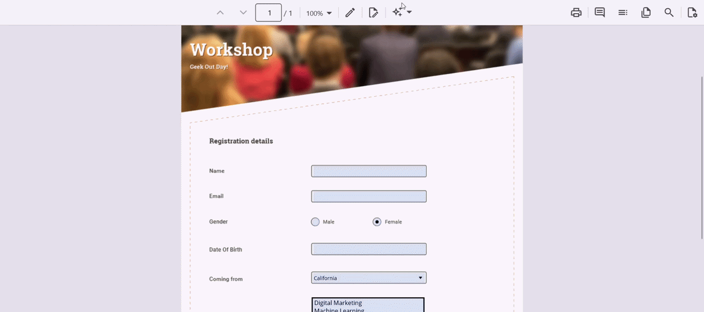

# Smart Fill in .NET MAUI Smart PDF Viewer

Smart Fill accelerates completion of PDF forms by using AI to detect fields and populate them from clipboard content or specified data, reducing manual input and errors. The Smart Fill option is available only when the loaded PDF contains form fields and can be enabled or disabled via the [`IsEnabled`](#isenabled) property. Users can review and adjust the populated values before finalizing.

Users can trigger Smart Fill by selecting the **Smart Fill** button from the **AI Tools** menu in the viewer toolbar. The feature analyzes the current clipboard content (or the data passed programmatically) and maps the extracted values to the corresponding form fields — including text boxes, combo boxes, radio buttons, and list boxes — in the loaded PDF document.

N> The AI service must be configured before using the Smart Fill feature. Refer to [Getting Started](./getting-started) to learn how to register a chat client in `MauiProgram.cs`.

## Component usage

Add the following code in the `MainPage.xaml` file to enable and try the Smart Fill feature in the Smart PDF Viewer.




<ContentPage
    . . .
    xmlns:syncfusion="clr-namespace:Syncfusion.Maui.SmartPdfViewer;assembly=Syncfusion.Maui.SmartPdfViewer">

    <syncfusion:SfSmartPdfViewer x:Name="pdfViewer"
                                 DocumentSource="{Binding PdfDocumentStream}">
        <syncfusion:SfSmartPdfViewer.SmartFillSettings>
            <syncfusion:SmartFillSettings />
        </syncfusion:SfSmartPdfViewer.SmartFillSettings>
    </syncfusion:SfSmartPdfViewer>
</ContentPage>




using Syncfusion.Maui.SmartPdfViewer;
. . .

SfSmartPdfViewer pdfViewer = new SfSmartPdfViewer
{
    SmartFillSettings = new SmartFillSettings()
};
pdfViewer.SetBinding(SfSmartPdfViewer.DocumentSourceProperty, "PdfDocumentStream");
this.Content = pdfViewer;




## SmartFillSettings properties

The [`SmartFillSettings`](https://help.syncfusion.com/cr/maui/Syncfusion.Maui.SmartPdfViewer.SmartFillSettings.html) class configures the Smart Fill feature in the Smart PDF Viewer. It provides options for integrating AI-powered, context-aware form filling that automates the population of PDF form fields using clipboard or specified data.

### IsEnabled

The [`IsEnabled`](https://help.syncfusion.com/cr/maui/Syncfusion.Maui.SmartPdfViewer.SmartFillSettings.html#Syncfusion_Maui_SmartPdfViewer_SmartFillSettings_IsEnabled) property (type: `bool`, default: `true`) gets or sets a value indicating whether Smart Fill is available in the PDF Viewer. When enabled, AI-assisted form filling features are available to users. It can be toggled dynamically based on user roles, document content, or application logic.

* The Smart Fill button is active only when the loaded PDF document contains form fields.




<syncfusion:SfSmartPdfViewer x:Name="pdfViewer">
    <syncfusion:SfSmartPdfViewer.SmartFillSettings>
        <syncfusion:SmartFillSettings IsEnabled="False" />
    </syncfusion:SfSmartPdfViewer.SmartFillSettings>
</syncfusion:SfSmartPdfViewer>




SfSmartPdfViewer pdfViewer = new SfSmartPdfViewer
{
    SmartFillSettings = new SmartFillSettings
    {
        IsEnabled = false
    }
};




## Applying Smart Fill programmatically

Besides the built-in toolbar button, Smart Fill can be invoked programmatically using the `ApplySmartFillAsync` method of the [SfSmartPdfViewer](https://help.syncfusion.com/cr/maui/Syncfusion.Maui.SmartPdfViewer.SfSmartPdfViewer.html) class. The operation can be cancelled while it is in progress by using the cancellation token.

### Fill from the clipboard

The `ApplySmartFillAsync(CancellationToken)` method returns a `Task` and initiates the Smart Fill process using the extracted form field names and the current clipboard data. When executed, this method uses AI to analyze the clipboard content and map the extracted values to the corresponding form fields in the loaded PDF document. The operation can be cancelled while it is in progress.




private async void OnSmartFillClicked(object sender, EventArgs e)
{
    await pdfViewer.ApplySmartFillAsync(new CancellationToken());
}




N> The `Microsoft.Maui.ApplicationModel.DataTransfer.Clipboard` API reads the clipboard text. If the clipboard is empty, the operation is skipped.

### Fill from specified data

The `ApplySmartFillAsync(string, CancellationToken)` method returns a `Task` and initiates the Smart Fill process using the specified string data instead of clipboard content. The `data` parameter specifies the custom text input used by the AI to identify and populate the matching form fields in the loaded PDF document, and the `cancellationToken` parameter specifies a token that can be used to cancel the Smart Fill operation. The operation can be cancelled while it is in progress.




private async void OnSmartFillClicked(object sender, EventArgs e)
{
    string data = "Name: John Doe\nEmail: john.doe@syncfusion.com\nPhone: +1 555 0100";
    await pdfViewer.ApplySmartFillAsync(data, new CancellationToken());
}




## Integration

To integrate Smart Fill into a PDF viewer workflow, assign the [`SmartFillSettings`](https://help.syncfusion.com/cr/maui/Syncfusion.Maui.SmartPdfViewer.SmartFillSettings.html) through the `SmartFillSettings` property of [`SfSmartPdfViewer`](https://help.syncfusion.com/cr/maui/Syncfusion.Maui.SmartPdfViewer.SfSmartPdfViewer.html). Ensure that the PDF document contains form fields to use AI-powered filling.

The Smart Fill button state is automatically updated when the document is loaded or unloaded — the button remains disabled until form fields are detected in the loaded document.

## See also

* [.NET MAUI Smart PDF Viewer Overview](./overview)
* [Getting Started with .NET MAUI Smart PDF Viewer](./getting-started)
* [Document Summaries in .NET MAUI Smart PDF Viewer](./document-summarizer)
* [Smart Redaction in .NET MAUI Smart PDF Viewer](./smart-redaction)
* [Form Filling Overview in .NET MAUI PDF Viewer](https://help.syncfusion.com/document-processing/pdf/pdf-viewer/maui/form-filling-overview)