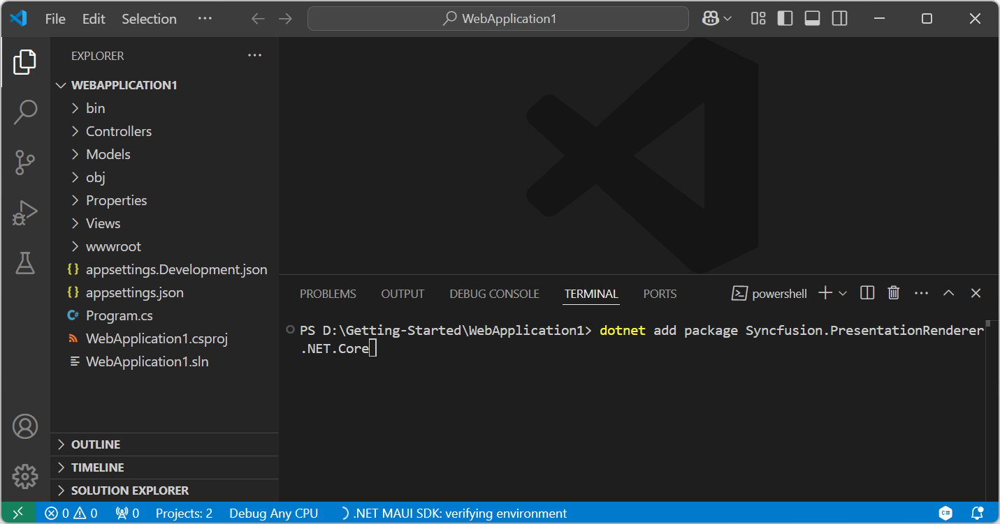

# Convert PowerPoint to Image in ASP.NET Core

Syncfusion<sup>&reg;</sup> PowerPoint is a [.NET Core PowerPoint library](https://www.syncfusion.com/document-processing/powerpoint-framework/net-core) used to create, read, edit and **convert PowerPoint presentation** programmatically without **Microsoft PowerPoint** or interop dependencies. Using this library, you can **convert a PowerPoint to image in ASP.NET Core**.

## Steps to convert PowerPoint to Image programmatically





**Prerequisites:**

* Visual Studio 2022.
* Install [.NET 8 SDK](https://dotnet.microsoft.com/en-us/download/dotnet/8.0) or later.

Step 1: Create a new C# ASP.NET Core web application project.


Step 2: Install the [Syncfusion.PresentationRenderer.Net.Core](https://www.nuget.org/packages/Syncfusion.PresentationRenderer.Net.Core) NuGet package as reference to your .NET Standard applications from [NuGet.org](https://www.nuget.org/).




N> Starting with v16.2.0.x, if you reference Syncfusion<sup>&reg;</sup> assemblies from trial setup or from the NuGet feed, you also have to add "Syncfusion.Licensing" assembly reference and include a license key in your projects. Please refer to this [link](https://help.syncfusion.com/common/essential-studio/licensing/overview) to know about registering Syncfusion<sup>&reg;</sup> license key in your application to use our components.
Step 3: Include the following namespaces in **HomeController.cs**.




using Syncfusion.Presentation;
using Syncfusion.PresentationRenderer;




Step 4: A default action method named Index will be present in **HomeController.cs**. Right click on Index method and select **Go To View** where you will be directed to its associated view page **Index.cshtml**.

Step 5: Add a new button in the **Index.cshtml** as shown below.




@{
    Html.BeginForm("ConvertPPTXtoImage", "Home", FormMethod.Get);
    {
        <div>
            <input type="submit" value="Convert PPTX to Image" style="width:200px;height:27px" />
        </div>
    }
    Html.EndForm();
}




Step 6: Add a new action method **ConvertPPTXtoImage** in HomeController.cs and include the below code snippet to **convert a PowerPoint to image in ASP.NET Core**.




//Open the file as Stream.
using (FileStream fileStream = new FileStream(Data/Input.pptx", FileMode.Open, FileAccess.Read))
{
    //Open the existing PowerPoint presentation.
    using (IPresentation pptxDoc = Presentation.Open(fileStream))
    {
        //Initialize the PresentationRenderer to perform image conversion.
        pptxDoc.PresentationRenderer = new PresentationRenderer();
        //Convert PowerPoint slide to image as stream.
        Stream stream = pptxDoc.Slides[0].ConvertToImage(ExportImageFormat.Jpeg);
        //Reset the stream position.
        stream.Position = 0;
        //Download image in the browser.
        return File(stream, "application/jpeg", "PPTXtoImage.Jpeg");
    }
}    




Step 7: Build the project.

Click on Build → Build Solution or press <kbd>Ctrl</kbd>+<kbd>Shift</kbd>+<kbd>B</kbd> to build the project.

Step 8: Run the project.

Click the Start button (green arrow) or press <kbd>F5</kbd> to run the app.

You can download a complete working sample from [GitHub](https://github.com/SyncfusionExamples/PowerPoint-Examples/tree/master/PPTX-to-Image-conversion/Convert-PowerPoint-presentation-to-Image/ASP.NET-Core).

By executing the program, you will get the **image** as follows.




**Prerequisites:**

* Visual Studio Code.
* Install [.NET 8 SDK](https://dotnet.microsoft.com/en-us/download/dotnet/8.0) or later.
* Open Visual Studio Code and install the [C# for Visual Studio Code extension](https://marketplace.visualstudio.com/items?itemName=ms-dotnettools.csharp) from the Extensions Marketplace.

Step 1: Create a new ASP.NET Core Web application project.
1. Open the command palette by pressing <kbd>Ctrl</kbd>+<kbd>Shift</kbd>+<kbd>P</kbd> and type **.NET:New Project** and enter.
2. Choose the **ASP.NET Core Web App( Model-View-Controller) MVC** template.


3. Select the project location, type the project name and press enter.
4. Then choose **Create project**.

Step 2: To **convert a PowerPoint document to image in ASP.NET Core Web app**, install [Syncfusion.PresentationRenderer.Net.Core](https://www.nuget.org/packages/Syncfusion.PresentationRenderer.Net.Core) to the ASP.NET Core project.
1. Press <kbd>Ctrl</kbd> + <kbd>`</kbd> (backtick) to open the integrated terminal in Visual Studio Code.
2. Ensure you're in the project root directory where your .csproj file is located.
3. Run the command `dotnet add package Syncfusion.PresentationRenderer.Net.Core` to install the NuGet package.



N> Starting with v16.2.0.x, if you reference Syncfusion<sup>&reg;</sup> assemblies from trial setup or from the NuGet feed, you also have to add "Syncfusion.Licensing" assembly reference and include a license key in your projects. Please refer to this [link](https://help.syncfusion.com/common/essential-studio/licensing/overview) to know about registering Syncfusion<sup>&reg;</sup> license key in your application to use our components.
Step 3: Include the following namespaces in **HomeController.cs**.




using Syncfusion.Presentation;
using Syncfusion.PresentationRenderer;




Step 4: A default action method named Index will be present in **HomeController.cs**. Right click on Index method and select **Go To View** where you will be directed to its associated view page **Index.cshtml**.

Step 5: Add a new button in the **Index.cshtml** as shown below.




@{
    Html.BeginForm("ConvertPPTXtoImage", "Home", FormMethod.Get);
    {
        <div>
            <input type="submit" value="Convert PPTX to Image" style="width:200px;height:27px" />
        </div>
    }
    Html.EndForm();
}




Step 6: Add a new action method **ConvertPPTXtoImage** in HomeController.cs and include the below code snippet to **convert a PowerPoint to image in ASP.NET Core**.




//Open the file as Stream.
using (FileStream fileStream = new FileStream(Data/Input.pptx", FileMode.Open, FileAccess.Read))
{
    //Open the existing PowerPoint presentation.
    using (IPresentation pptxDoc = Presentation.Open(fileStream))
    {
        //Initialize the PresentationRenderer to perform image conversion.
        pptxDoc.PresentationRenderer = new PresentationRenderer();
        //Convert PowerPoint slide to image as stream.
        Stream stream = pptxDoc.Slides[0].ConvertToImage(ExportImageFormat.Jpeg);
        //Reset the stream position.
        stream.Position = 0;
        //Download image in the browser.
        return File(stream, "application/jpeg", "PPTXtoImage.Jpeg");
    }
}    




Step 7: Build the project.

Run the following command in terminal to build the project.

```
dotnet build
```

Step 8: Run the project.

Run the following command in terminal to build the project.

```
dotnet run
```

You can download a complete working sample from [GitHub](https://github.com/SyncfusionExamples/PowerPoint-Examples/tree/master/PPTX-to-Image-conversion/Convert-PowerPoint-presentation-to-Image/ASP.NET-Core).

By executing the program, you will get the **image** as follows.



 


Click [here](https://www.syncfusion.com/document-processing/powerpoint-framework/net-core) to explore the rich set of Syncfusion<sup>&reg;</sup> PowerPoint Library (Presentation) features. 

An online sample link to [convert PowerPoint Presentation to image](https://ej2.syncfusion.com/aspnetcore/PowerPoint/PPTXToImage#/material3) in ASP.NET Core. 
