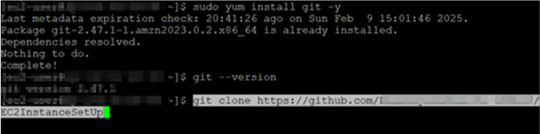

--- 
title: Convert PPTX to Image in AWS Linux EC2 | Syncfusion
description: Learn how to convert PowerPoint to image in AWS Linux EC2 using .NET Core PowerPoint library(Presentation) in C#. 
platform: document-processing
control: PowerPoint 
documentation: UG 
--- 

# Convert PowerPoint to Image in Amazon Linux EC2

Syncfusion<sup>&reg;</sup> [.NET Core PowerPoint library](https://www.syncfusion.com/document-processing/powerpoint-framework/net-core) (Presentation) is used to create, read, edit and convert PowerPoint documents programmatically without **Microsoft PowerPoint** or interop dependencies. Using this library, you can **convert PowerPoint to image in Amazon Linux EC2** within a few lines of code.

N> To run the sample without manually providing credentials, attach an IAM role with S3 access to your EC2 instance. The AWS SDK will automatically use this role, allowing secure access to S3 without storing access keys.

**Prerequisites**

* AWS S3 bucket for storing input and output files.
* Amazon Linux EC2 instance.
* Install [Putty](https://www.putty.org/) for Linux VM.
* GitHub repository.

## AWS S3 Bucket Configuration

* Create an S3 bucket in your AWS account.
* Inside the bucket, create an input folder and upload the required PowerPoint files.
* Create an output folder in the S3 bucket where the converted images will be saved.

## Create application to convert PowerPoint to images

### Step 1: Create a .NET Core console application

Create a new .NET Core console application in Visual Studio.


### Step 2: Install required NuGet packages

Install the following NuGet packages from [NuGet.org](https://www.nuget.org/).

* [Syncfusion.PresentationRenderer.Net.Core](https://www.nuget.org/packages/Syncfusion.PresentationRenderer.Net.Core)
* [AWSSDK.S3](https://www.nuget.org/packages/AWSSDK.S3)
* [Microsoft.VisualStudio.Azure.Containers.Tools.Targets](https://www.nuget.org/packages/Microsoft.VisualStudio.Azure.Containers.Tools.Targets)
* [SkiaSharp.NativeAssets.Linux.NoDependencies](https://www.nuget.org/packages/SkiaSharp.NativeAssets.Linux.NoDependencies)


N> Starting with v16.2.0.x, if you reference Syncfusion<sup>&reg;</sup> assemblies from trial setup or from the NuGet feed, you also have to add "Syncfusion.Licensing" assembly reference and include a license key in your projects. Please refer to this [link](https://help.syncfusion.com/common/essential-studio/licensing/overview) to know about registering Syncfusion<sup>&reg;</sup> license key in your application to use our components.

### Step 3: Include required namespaces

Add the following namespaces in Program.cs




using Amazon.S3;
using Amazon;
using Amazon.S3.Model;
using Syncfusion.Presentation;
using Syncfusion.PresentationRenderer;




### Step 4: Process PowerPoint files from AWS S3
 
Include the following code snippet in Program.cs to convert PowerPoint presentations into images.




private static readonly RegionEndpoint bucketRegion = RegionEndpoint.USEast1;
private static IAmazonS3 s3Client;
static async Task Main()
{
    var config = new AmazonS3Config
    {
        RegionEndpoint = bucketRegion
    };
    s3Client = new AmazonS3Client(config);
    Console.WriteLine("Kindly enter the S3 bucket name: ");
    string bucketName = Console.ReadLine();
    Console.WriteLine("Kindly enter the input folder name that has the input PowerPoints: ");
    string inputFolderName = Console.ReadLine();
    Console.WriteLine("Kindly enter the output folder name in which the output images should be stored: ");
    string outputFolderName = Console.ReadLine();
    //Gets the list of imput files from the input folder.
    List<string> inputFileNames = await ListFilesAsync(inputFolderName, bucketName);

    for (int i = 0; i < inputFileNames.Count; i++)
    {
        //Converts PPTX to Image.
        await ConvertPptxToImage(inputFileNames[i], inputFolderName, bucketName, outputFolderName);
    }
}




### Step 5: Download Input files from AWS S3

Include the following method to retrieve files from the specified S3 bucket.




private static async Task<List<string>> ListFilesAsync(string inputFolderName, string bucketName)
{
    List<string> files = new List<string>();
    try
    {
        var request = new ListObjectsV2Request
        {
            BucketName = bucketName,
            Prefix = $"{inputFolderName}/",
            Delimiter = "/"
        };
        ListObjectsV2Response response;
        do
        {
            response = await s3Client.ListObjectsV2Async(request);
            foreach (S3Object entry in response.S3Objects)
            {
                // Skip the "folder" itself
                if (entry.Key.EndsWith("/"))
                    continue;

                // Extract the filename by removing the folder path prefix
                string fileName = entry.Key.Substring(inputFolderName.Length);
                files.Add(fileName);
            }
            request.ContinuationToken = response.NextContinuationToken;
        } while (response.IsTruncated);
        return files;
    }
    catch (AmazonS3Exception e)
    {
        Console.WriteLine("Error encountered on server. Message:'{0}' when listing objects", e.Message);
        return null;
    }
    catch (Exception e)
    {
        Console.WriteLine("Unknown encountered on server. Message:'{0}' when listing objects", e.Message);
        return null;
    }
}




### Step 6: Convert PowerPoint slides to images

Include the following method to convert PPTX to images.




static async Task ConvertPptxToImage(string inputFileName, string inputFolderName, string bucketName, string outputFolderName)
{
    try
    {
        //Download the file from S3 into the MemoryStream
        var response = await s3Client.GetObjectAsync(new Amazon.S3.Model.GetObjectRequest
        {
            BucketName = bucketName,
            Key = inputFolderName+inputFileName
        });
        using (Stream responseStream = response.ResponseStream)
        {
            MemoryStream fileStream = new MemoryStream();
            await responseStream.CopyToAsync(fileStream);
            //Open the existing PowerPoint presentation.
            using (IPresentation pptxDoc = Presentation.Open(fileStream))
            {
                //Initialize PresentationRenderer.
                pptxDoc.PresentationRenderer = new PresentationRenderer();
                //Convert the PowerPoint presentation as image streams.
                Stream[] images = pptxDoc.RenderAsImages(ExportImageFormat.Png);
                //Gets the file name without extension.
                string fileNameWithoutExt = Path.GetFileNameWithoutExtension(inputFileName);
                //Save the image streams to file.
                for (int i = 0; i < images.Length; i++)
                {
                    using (Stream stream = images[i])
                    {
                        //Uploads the image to the S3 bucket.
                        await UploadImageAsync(stream, $"{fileNameWithoutExt}" + i + ".png", bucketName, outputFolderName);
                    }
                }
            }
        }
    }
    catch (AmazonS3Exception e)
    {
        Console.WriteLine($"Error encountered on server. Message:'{e.Message}'");
    }
    catch (Exception e)
    {
        Console.WriteLine($"Unknown error encountered. Message:'{e.Message}'");
    }
}




### Step 7: Upload images to S3 Bucket

Include the following method to upload images to S3 bucket.




public static async Task UploadImageAsync(Stream imageStream, string outputFileName, string bucketName, string outputFolderName)
{
    try
    {
        var key = $"{outputFolderName}/{outputFileName}"; // e.g., "images/your-image.png"

        var request = new PutObjectRequest
        {
            BucketName = bucketName,
            Key = key,
            InputStream = imageStream,
            ContentType = "image/png" // Adjust based on your image type
        };
        var response = await s3Client.PutObjectAsync(request);

        if (response.HttpStatusCode == System.Net.HttpStatusCode.OK)
        {
            Console.WriteLine("Image uploaded successfully.");
        }
        else
        {
            Console.WriteLine($"Failed to upload image. HTTP Status Code: {response.HttpStatusCode}");
        }
    }
    catch (AmazonS3Exception ex)
    {
        Console.WriteLine($"Error encountered on server. Message:'{ex.Message}'");
    }
    catch (Exception ex)
    {
        Console.WriteLine($"Unknown error encountered. Message:'{ex.Message}'");
    }
}




### Step 8: Create a Dockerfile

Create a Dockerfile parallel to the .csproj file and add the following code.

```

# This stage is used when running from VS in fast mode (Default for Debug configuration)
FROM mcr.microsoft.com/dotnet/runtime:8.0 AS base
RUN apt-get update -y && apt-get install libfontconfig -y
USER $APP_UID
WORKDIR /app


# This stage is used to build the service project
FROM mcr.microsoft.com/dotnet/sdk:8.0 AS build
ARG BUILD_CONFIGURATION=Release
WORKDIR /src
COPY ["AWSConsoleApp.csproj", "."]
RUN dotnet restore "./AWSConsoleApp.csproj"
COPY . .
WORKDIR "/src/."
RUN dotnet build "./AWSConsoleApp.csproj" -c $BUILD_CONFIGURATION -o /app/build

# This stage is used to publish the service project to be copied to the final stage
FROM build AS publish
ARG BUILD_CONFIGURATION=Release
RUN dotnet publish "./AWSConsoleApp.csproj" -c $BUILD_CONFIGURATION -o /app/publish /p:UseAppHost=false

# This stage is used in production or when running from VS in regular mode (Default when not using the Debug configuration)
FROM base AS final
WORKDIR /app
COPY --from=publish /app/publish .
ENTRYPOINT ["dotnet", "AWSConsoleApp.dll"]

```
### Step 9: Upload to GitHub

Create a new private GitHub repository and upload the project. Refer to [documentation](https://docs.github.com/en/get-started/start-your-journey/uploading-a-project-to-github) for guidance.

## Connect to an EC2 instance using PuTTY

Step 1: Open **PuTTY** and enter the IP address.


Step 2: Go to **Credentials** category, **Connections → SSH → Auth → Credentials**.

Step 3: Click the **Browse** button in the **Private key file for authentication** and add the .ppk file in it. 


Step 4: Click **Open** button. It will be connected to the EC2 instance .


## Deploy the sample on an AWS Linux EC2 Instance

Step 1: Enter the username to login.


Step 2: Install the **Microsoft package repository** using below command.

```
sudo rpm -Uvh https://packages.microsoft.com/config/centos/7/packages-microsoft-prod.rpm
```


Step 3: Install the **.NET SDK or Runtime** using below command.
```
sudo yum install dotnet-sdk-8.0
```


Step 4:	Install the **Git** in the EC2 instance using below command.
```
sudo yum install git -y
```


Step 5:	Check whether the **Git** is installed properly using below command.
```
git –version
```


Step 6:	Clone the **Git Repository** in the instance using below command.
```
git clone https://github.com/your-username/your-repository.git
```



Step 7: Once cloned, move into the **Project Folder** using the command below.
```
cd samplename
```


Step 8:	Build and **Publish** your .NET Core application using below command.
```
dotnet publish -c Release
```


Step 9:	Navigate to the **Publish Directory** using below command.
```
cd bin/Release/net8.0/publish
```


Step 10: Run your **Application** using the command below.
```
dotnet your-application.dll --urls http://0.0.0.0:5000
```


Step 11: Enter the **Bucket Name**, **Input Folder Name**, and **Output Folder Name** to convert and add images.


You can download samples demonstrating how to convert a PowerPoint presentation to an image in Amazon Linux EC2 with AWS S3 integration in two ways:

* [Sample with credentials](https://github.com/SyncfusionExamples/PowerPoint-Examples/tree/master/PPTX-to-Image-conversion/Convert-PowerPoint-presentation-to-Image/AWS/AWS-EC2/PPTXtoImage_withCredentials/) – Requires access keys to authenticate the S3 bucket (for ex: the user must provide an access key and secret key).
* [Sample without credentials](https://github.com/SyncfusionExamples/PowerPoint-Examples/tree/master/PPTX-to-Image-conversion/Convert-PowerPoint-presentation-to-Image/AWS/AWS-EC2/PPTXtoImage_withoutCredentials/) – Uses default account authentication (for ex: relying on IAM roles or AWS environment credentials).
 
Click [here](https://www.syncfusion.com/document-processing/powerpoint-framework/net-core) to explore the rich set of Syncfusion<sup>&reg;</sup> PowerPoint Library (Presentation) features. 

An online sample link to [convert PowerPoint Presentation to image](https://document.syncfusion.com/demos/powerpoint/pptxtoimage#/tailwind) in ASP.NET Core. 