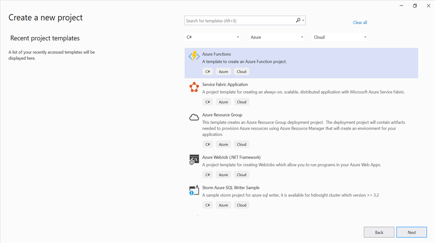
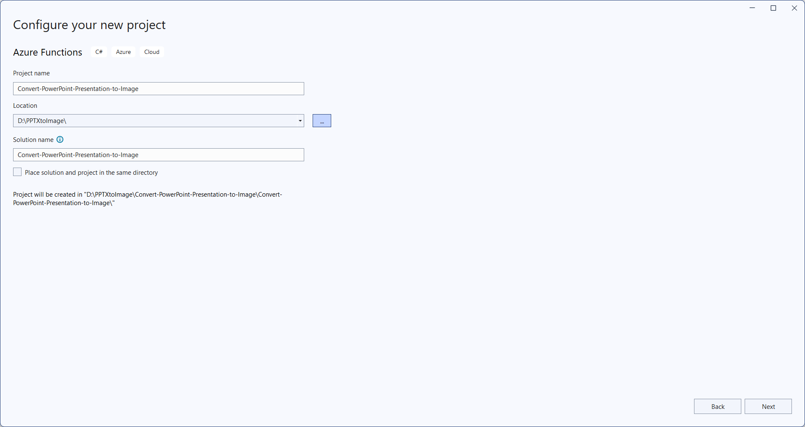
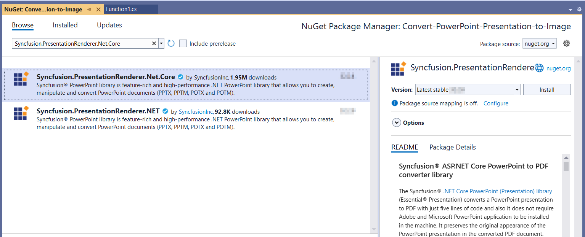
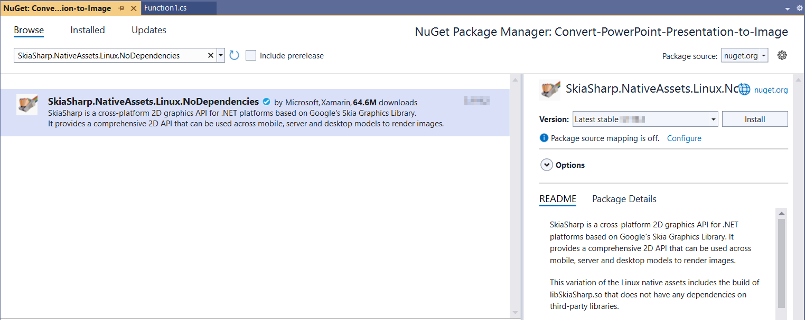
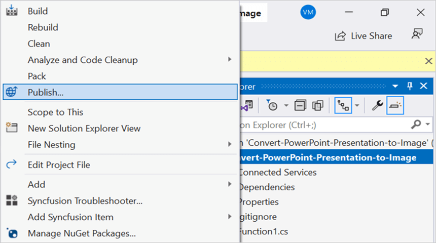
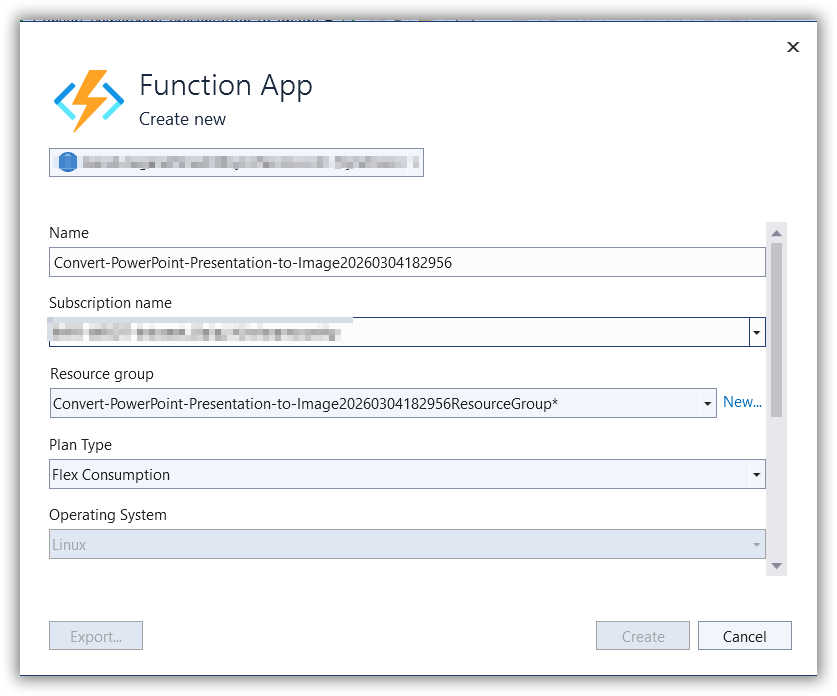
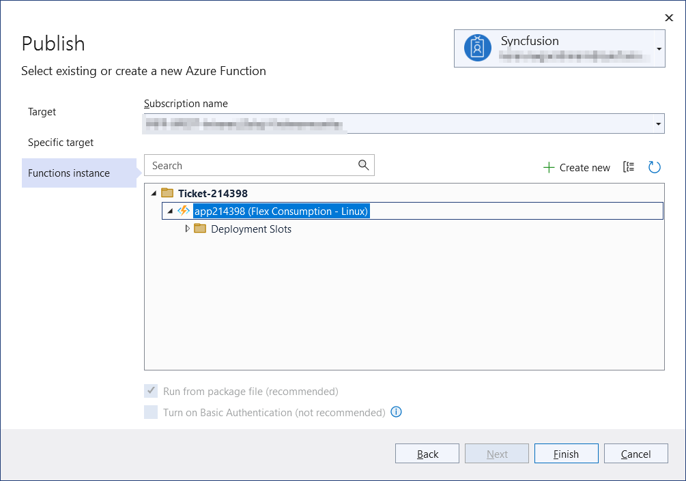
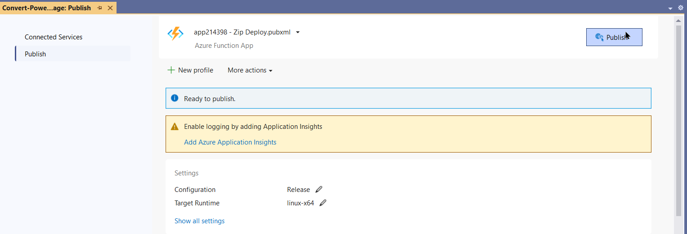
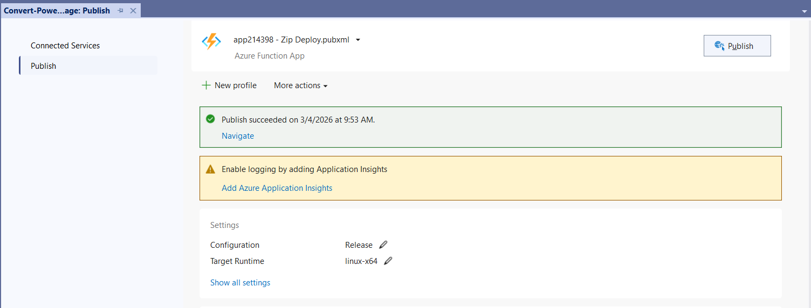
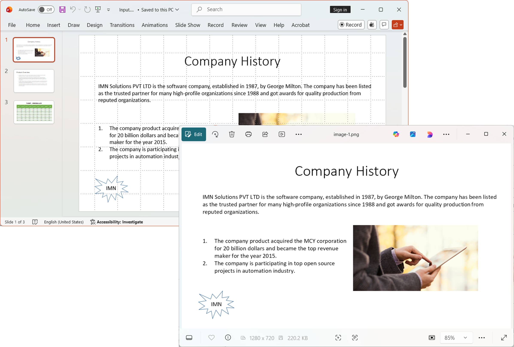

# Convert PPTX to Image in Azure Functions (Flex Consumption)

Syncfusion&reg; PowerPoint is a [.NET Core PowerPoint library](https://www.syncfusion.com/document-processing/powerpoint-framework/net-core) used to create, read, edit and **convert PowerPoint documents** programmatically without **Microsoft PowerPoint** or interop dependencies. Using this library, you can **convert a PowerPoint Presentation to image in Azure Functions deployed on Flex (Consumption) plan**.

## Steps to convert a PowerPoint Presentation to Image in Azure Functions (Flex Consumption)

Step 1: Create a new Azure Functions project.

Step 2: Create a project name and select the location.

Step 3: Select function worker as **.NET 8.0 (Long Term Support)** (isolated worker) and target Flex/Consumption hosting suitable for isolated worker.

Step 4: Install the [Syncfusion.PresentationRenderer.Net.Core](https://www.nuget.org/packages/Syncfusion.PresentationRenderer.Net.Core) and [SkiaSharp.NativeAssets.Linux.NoDependencies v3.119.1](https://www.nuget.org/packages/SkiaSharp.NativeAssets.Linux.NoDependencies/3.119.1) NuGet packages as references to your project from [NuGet.org](https://www.nuget.org/).

N> Starting with v16.2.0.x, if you reference Syncfusion&reg; assemblies from trial setup or from the NuGet feed, you also have to add "Syncfusion.Licensing" assembly reference and include a license key in your projects. Please refer to this [link](https://help.syncfusion.com/common/essential-studio/licensing/overview) to know about registering Syncfusion&reg; license key in your application to use our components.

Step 5: Include the following namespaces in the **Function1.cs** file.




using Syncfusion.Presentation;
using Syncfusion.PresentationRenderer;
using SkiaSharp;




Step 6: Add the following code snippet in **Run** method of **Function1** class to perform **PowerPoint Presentation to image conversion** in Azure Functions and return the resultant **image** to client end.




public async Task<IActionResult> Run([HttpTrigger(AuthorizationLevel.Function, "post")] HttpRequest req)
    {
        try
        {
            // Create a memory stream to hold the incoming request body (PowerPoint Presentation bytes)
            await using MemoryStream inputStream = new MemoryStream();
            // Copy the request body into the memory stream
            await req.Body.CopyToAsync(inputStream);
            // Check if the stream is empty (no file content received)
            if (inputStream.Length == 0)
                return new BadRequestObjectResult("No file content received in request body.");
            // Reset stream position to the beginning for reading
            inputStream.Position = 0;
            // Load the PowerPoint Presentation from the stream
            using IPresentation pptxDoc = Presentation.Open(inputStream);
            // Attach font substitution handler to manage missing fonts
            pptxDoc.FontSettings.SubstituteFont += FontSettings_SubstituteFont;
            // Initialize the PresentationRenderer to perform image conversion.
            pptxDoc.PresentationRenderer = new PresentationRenderer();
            // Convert PowerPoint slide to image as stream.
            Stream imageStream = pptxDoc.Slides[0].ConvertToImage(ExportImageFormat.Png);
            // Reset the stream position.
            imageStream.Position = 0;
            // Create a memory stream to hold the Image output
            await using MemoryStream outputStream = new MemoryStream();
            // Copy the contents of the image stream to the memory stream.
            await imageStream.CopyToAsync(outputStream);
            // Convert the Image stream to a byte array
            var imageBytes = outputStream.ToArray();
            //Reset the stream position.
            imageStream.Position = 0;
            // Reset stream position to the beginning for reading
            outputStream.Position = 0;
            // Create a file result to return the PNG as a downloadable file
            return new FileContentResult(imageBytes, "image/png")
            {
                FileDownloadName = "slide-1.png"
            };
        }
        catch (Exception ex)
        {
            // Log the error with details for troubleshooting
            _logger.LogError(ex, "Error converting PPTX to Image.");
            // Prepare error message including exception details
            var msg = $"Exception: {ex.Message}\n\n{ex}";
            // Return a 500 Internal Server Error response with the message
            return new ContentResult { StatusCode = 500, Content = msg, ContentType = "text/plain; charset=utf-8" };
        }
    }
    /// 

    /// Event handler for font substitution during Image conversion
    /// 

    /// <param name="sender"></param>
    /// <param name="args"></param>
    private void FontSettings_SubstituteFont(object sender, SubstituteFontEventArgs args)
    {
        // Define the path to the Fonts folder in the application base directory
        string fontsFolder = Path.Combine(AppContext.BaseDirectory, "Fonts");
        // If the original font is Calibri, substitute with calibri-regular.ttf
        if (args.OriginalFontName == "Calibri")
        {
            args.AlternateFontStream = File.OpenRead(Path.Combine(fontsFolder, "calibri-regular.ttf"));
        }
        // Otherwise, substitute with Times New Roman
        else
        {
            args.AlternateFontStream = File.OpenRead(Path.Combine(fontsFolder, "Times New Roman.ttf"));
        }
    }
	



Step 7: Right click the project and select **Publish**. Then, create a new profile in the Publish Window.

Step 8: Select the target as **Azure** and click **Next** button.

Step 9: Select the specific target as **Azure Function App** and click **Next** button.

Step 10: Select the **Create new** button.

Step 11: Click **Create** button. 

Step 12: After creating app service then click **Finish** button. 

Step 13: Click the **Publish** button.

Step 14: Publish has been succeed.

Step 15: Now, go to Azure portal and select the App Services. After running the service, click **Get function URL by copying it**. Then, paste it in the below client sample (which will request the Azure Functions, to perform **PowerPoint Presentation to image conversion** using the template PowerPoint document). You will get the output **image** as follows.

## Steps to post the request to Azure Functions

Step 1: Create a console application to request the Azure Functions API.

Step 2: Add the following code snippet into Main method to post the request to Azure Functions with template PowerPoint document and get the resultant image.




static async Task Main()
    {
        try
        {
            Console.Write("Please enter your Azure Functions URL : ");
            string url = Console.ReadLine();
            if (string.IsNullOrEmpty(url)) return;
            // Create a new HttpClient instance for sending HTTP requests
            using var http = new HttpClient();
            // Read all bytes from the input PowerPoint file 
            byte[] bytes = await File.ReadAllBytesAsync(@"Data/Input.pptx");
            // Wrap the file bytes into a ByteArrayContent object for HTTP transmission
            using var content = new ByteArrayContent(bytes);
            // Set the content type header to indicate binary data
            content.Headers.ContentType = new System.Net.Http.Headers.MediaTypeHeaderValue("application/octet-stream");
            // Send a POST request to the provided Azure Functions URL with the file content
            using var res = await http.PostAsync(url, content);
            // Read the response body as a byte array
            var resBytes = await res.Content.ReadAsByteArrayAsync();
            // Extract the media type from the response headers (e.g., "image/png")
            string mediaType = res.Content.Headers.ContentType?.MediaType ?? string.Empty;
            // Decide the output file path the response is an image or txt         
            string outputPath = mediaType.Contains("image", StringComparison.OrdinalIgnoreCase)
                ? Path.GetFullPath(@"../../../Output/image-1.png")
                : Path.GetFullPath(@"../../../function-error.txt");
            // Write the response bytes to the output file 
            await File.WriteAllBytesAsync(outputPath, resBytes);
            Console.WriteLine($"Saved: {outputPath}");
        }
        catch (Exception ex)
        {
            throw;
        }        
    }




From GitHub, you can download the [console application](https://github.com/SyncfusionExamples/PowerPoint-Examples/tree/master/PPTX-to-Image-conversion/Convert-PowerPoint-presentation-to-Image/Azure/Azure_Functions/Console_App_Flex_Consumption) and [Azure Functions Flex Consumption](https://github.com/SyncfusionExamples/PowerPoint-Examples/tree/master/PPTX-to-Image-conversion/Convert-PowerPoint-presentation-to-Image/Azure/Azure_Functions/Azure_Function_Flex_Consumption).

Click [here](https://www.syncfusion.com/document-processing/powerpoint-framework/net-core) to explore the rich set of Syncfusion&reg; PowerPoint Library (Presentation) features. 

An online sample link to [convert PowerPoint Presentation to image](https://document.syncfusion.com/demos/powerpoint/pptxtoimage#/tailwind) in ASP.NET Core.