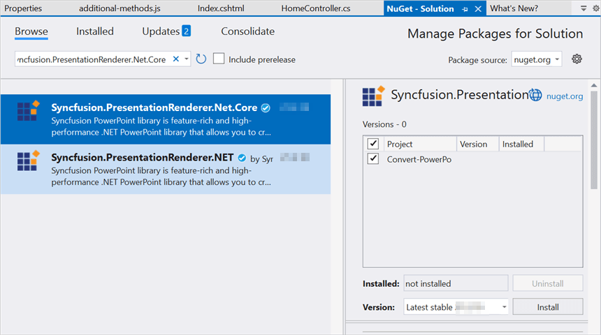
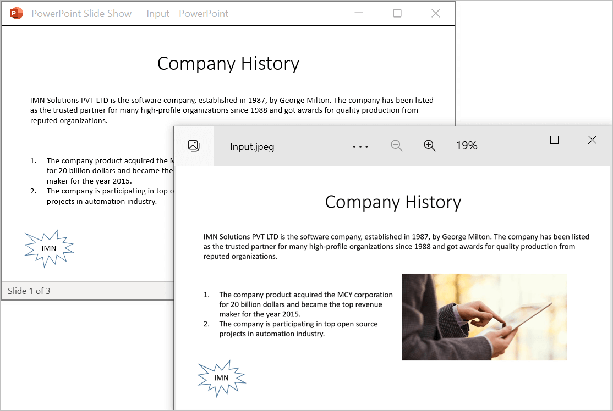
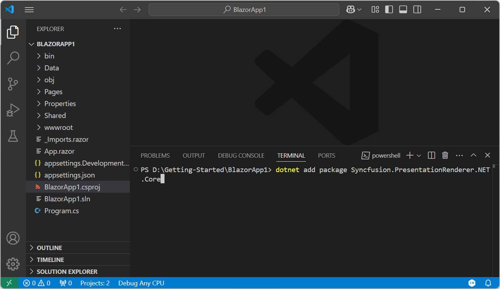
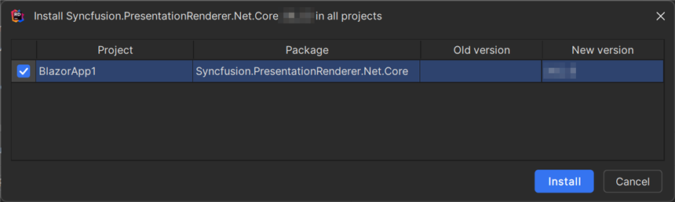
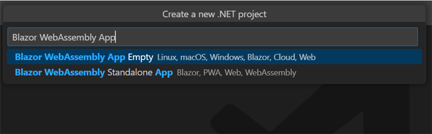
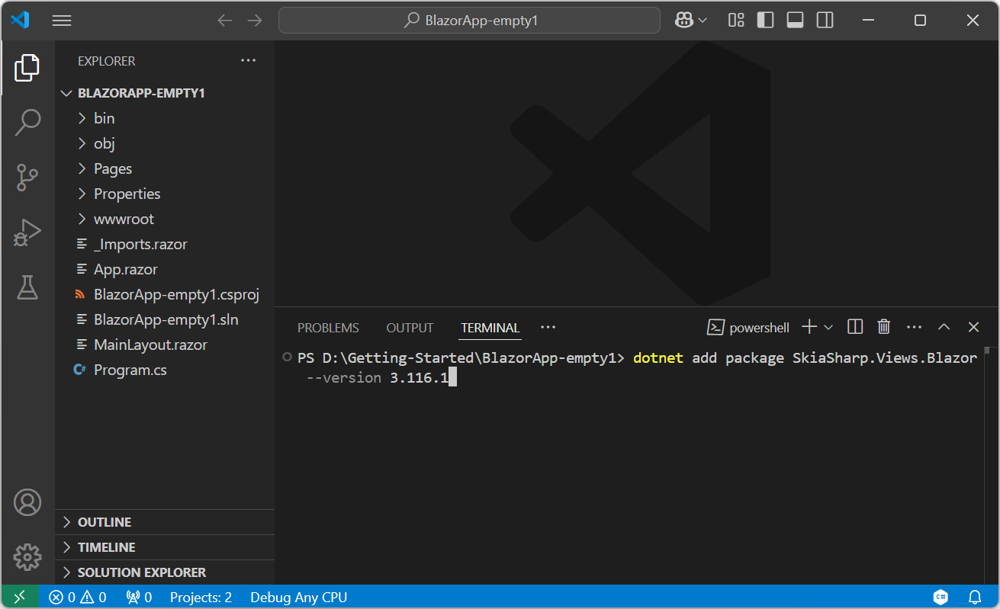
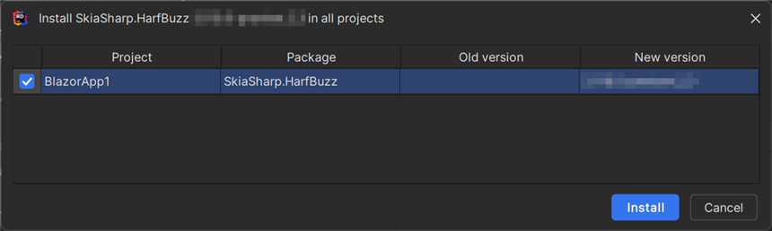

# Convert PowerPoint to Image in Blazor

Syncfusion<sup>&reg;</sup> PowerPoint is a [.NET Core PowerPoint library](https://www.syncfusion.com/document-processing/powerpoint-framework/net-core) used to create, read, edit and convert PowerPoint presentation programmatically without **Microsoft PowerPoint** or interop dependencies. Using this library, you can **convert a PowerPoint to image in Blazor**.

## Server app





**Prerequisites:**

* Visual Studio 2022.
* Install [.NET 8 SDK](https://dotnet.microsoft.com/en-us/download/dotnet/8.0) or later.

Step 1: Create a new C# Blazor Server app project. Select Blazor Server App from the template and click the Next button.


Step 2: Install the [Syncfusion.PresentationRenderer.Net.Core](https://www.nuget.org/packages/Syncfusion.PresentationRenderer.Net.Core) NuGet package as reference to your project from [NuGet.org](https://www.nuget.org/).



N> 1. If you're deploying the application in a Linux environment, refer to the [documentation](https://help.syncfusion.com/document-processing/powerpoint/conversions/powerpoint-to-image/net/nuget-packages-required-for-pptxtoimage-conversion#additional-nuget-packages-required-for-linux) for the required additional NuGet packages.
N> 2. Starting with v16.2.0.x, if you reference Syncfusion<sup>&reg;</sup> assemblies from trial setup or from the NuGet feed, you also have to add "Syncfusion.Licensing" assembly reference and include a license key in your projects. Please refer to this [link](https://help.syncfusion.com/common/essential-studio/licensing/overview) to know about registering Syncfusion<sup>&reg;</sup> license key in your application to use our components.

Step 3: Create a razor file with name as **Presentation** under **Pages** folder and include the following namespaces in the file.




@page "/presentation"
@using System.IO;
@using Convert_PowerPoint_Presentation_to_Image;
@inject Convert_PowerPoint_Presentation_to_Image.Data.PresentationService service
@inject Microsoft.JSInterop.IJSRuntime JS




Step 4: Add the following code to create a new button.




<h2>Syncfusion PowerPoint (Presentation) library</h2>
<p>Syncfusion PowerPoint (Presentation) library is used to create, read, edit, and convert PowerPoint files in your applications without Microsoft Office dependencies.</p>
<button class="btn btn-primary" @onclick="@ConvertPPTXtoImage">Convert PPTX to Image</button>




Step 5: Add the following code in **Presentation.razor** file to **convert PowerPoint to image** and download the **image file**.




@code {
    MemoryStream documentStream;
    /// <summary>
    /// Download the image file.
    /// </summary>
    protected async void ConvertPPTXtoImage()
    {
        documentStream = service.ConvertPPTXtoImage();
        await JS.SaveAs("PPTXtoImage.Jpeg", documentStream.ToArray());
    }
}




Step 6: Create a new cs file with name as **PowerPointService** under Data folder and include the following namespaces in the file.




using Syncfusion.Presentation;
using Syncfusion.PresentationRenderer;




Step 7: Create a new MemoryStream method with name as **ConvertPPTXToImage** in **PowerPointService** class and include the following code snippet to **convert a PowerPoint to image in Blazor Server app**.




//Open the file as Stream.
using (FileStream sourceStreamPath = new FileStream(@"wwwroot/Input.pptx", FileMode.Open, FileAccess.Read, FileShare.ReadWrite))
{
    //Open the existing PowerPoint presentation with loaded stream.
    using (IPresentation pptxDoc = Presentation.Open(sourceStreamPath))
    {
        //Initialize the PresentationRenderer to perform image conversion.
        pptxDoc.PresentationRenderer = new PresentationRenderer();
        //Convert PowerPoint slide to image as stream.
        using (Stream stream = pptxDoc.Slides[0].ConvertToImage(ExportImageFormat.Jpeg))
        {
            //Save the converted image file to MemoryStream.
            MemoryStream Stream = new MemoryStream();
            stream.CopyTo(Stream);
            Stream.Position = 0;
            //Download image file in the browser.
            return Stream;
        }
    }
}  




Step 8: Add the following line to the Program.cs file to register the PresentationService as a scoped service in your Blazor application.




builder.Services.AddSingleton<PresentationService>();



            
Step 9: Create a new class file in the project, with name as FileUtils and add the following code to invoke the JavaScript action to download the file in the browser.




public static class FileUtils
{
    public static ValueTask<object> SaveAs(this IJSRuntime js, string filename, byte[] data)
        => js.InvokeAsync<object>(
             "saveAsFile",
             filename,
             Convert.ToBase64String(data));
}




Step 10: Add the following JavaScript function in the **_Host.cshtml** in the Pages folder.




<script type="text/javascript">
    function saveAsFile(filename, bytesBase64) 
    {
        if (navigator.msSaveBlob) 
        {
            //Download document in Edge browser
            var data = window.atob(bytesBase64);
            var bytes = new Uint8Array(data.length);
            for (var i = 0; i < data.length; i++) {
                bytes[i] = data.charCodeAt(i);
            }
            var blob = new Blob([bytes.buffer], { type: "application/octet-stream" });
            navigator.msSaveBlob(blob, filename);
        }
        else 
        {
            var link = document.createElement('a');
            link.download = filename;
            link.href = "data:application/octet-stream;base64," + bytesBase64;
            document.body.appendChild(link); // Needed for Firefox
            link.click();
            document.body.removeChild(link);
        }
    }
</script>




Step 11: Add the following code snippet in the razor file of Navigation menu in the Shared folder.





 <li class="nav-item px-3">
    <NavLink class="nav-link" href="presentation">
        <span class="oi oi-list-rich" aria-hidden="true"></span> Generate Presentation
    </NavLink>
</li>





Step 12: Build the project.

Click on Build → Build Solution or press <kbd>Ctrl</kbd>+<kbd>Shift</kbd>+<kbd>B</kbd> to build the project.

Step 13: Run the project.

Click the Start button (green arrow) or press <kbd>F5</kbd> to run the app.

You can download a complete working sample from [GitHub](https://github.com/SyncfusionExamples/PowerPoint-Examples/tree/master/PPTX-to-Image-conversion/Convert-PowerPoint-presentation-to-Image/Blazor/Server-app).

By executing the program, you will get the **image** as follows.




 


**Prerequisites:**

* Visual Studio Code.
* Install [.NET 8 SDK](https://dotnet.microsoft.com/en-us/download/dotnet/8.0) or later.
* Open Visual Studio Code and install the [C# for Visual Studio Code extension](https://marketplace.visualstudio.com/items?itemName=ms-dotnettools.csharp) from the Extensions Marketplace.

Step 1: Create a new C# Blazor Server app project.
* Open the command palette by pressing <kbd>Ctrl</kbd>+<kbd>Shift</kbd>+<kbd>P</kbd> and type **.NET:New Project** and enter.
* Choose the **Blazor Server App** template.


* Select the project location, type the project name and press enter.
* Then choose **Create project**.

Step 2: To **convert a PowerPoint to image in server app**, install [Syncfusion.PresentationRenderer.Net.Core](https://www.nuget.org/packages/Syncfusion.PresentationRenderer.Net.Core) to the Blazor project.
* Press <kbd>Ctrl</kbd> + <kbd>`</kbd> (backtick) to open the integrated terminal in Visual Studio Code.
* Ensure you're in the project root directory where your .csproj file is located.
* Run the command `dotnet add package Syncfusion.PresentationRenderer.Net.Core` to install the NuGet package.



N> 1. If you're deploying the application in a Linux environment, refer to the [documentation](https://help.syncfusion.com/document-processing/powerpoint/conversions/powerpoint-to-image/net/nuget-packages-required-for-pptxtoimage-conversion#additional-nuget-packages-required-for-linux) for the required additional NuGet packages.
N> 2. Starting with v16.2.0.x, if you reference Syncfusion<sup>&reg;</sup> assemblies from trial setup or from the NuGet feed, you also have to add "Syncfusion.Licensing" assembly reference and include a license key in your projects. Please refer to this [link](https://help.syncfusion.com/common/essential-studio/licensing/overview) to know about registering Syncfusion<sup>&reg;</sup> license key in your application to use our components.

Step 3: Create a razor file with name as **Presentation** under **Pages** folder and include the following namespaces in the file.




@page "/presentation"
@using System.IO;
@using Convert_PowerPoint_Presentation_to_Image;
@inject Convert_PowerPoint_Presentation_to_Image.Data.PresentationService service
@inject Microsoft.JSInterop.IJSRuntime JS




Step 4: Add the following code to create a new button.




<h2>Syncfusion PowerPoint (Presentation) library</h2>
<p>Syncfusion PowerPoint (Presentation) library is used to create, read, edit, and convert PowerPoint files in your applications without Microsoft Office dependencies.</p>
<button class="btn btn-primary" @onclick="@ConvertPPTXtoImage">Convert PPTX to Image</button>




Step 5: Add the following code in **Presentation.razor** file to **convert PowerPoint to image** and download the **image file**.




@code {
    MemoryStream documentStream;
    /// <summary>
    /// Download the image file.
    /// </summary>
    protected async void ConvertPPTXtoImage()
    {
        documentStream = service.ConvertPPTXtoImage();
        await JS.SaveAs("PPTXtoImage.Jpeg", documentStream.ToArray());
    }
}




Step 6: Create a new cs file with name as **PowerPointService** under Data folder and include the following namespaces in the file.




using Syncfusion.Presentation;
using Syncfusion.PresentationRenderer;




Step 7: Create a new MemoryStream method with name as **ConvertPPTXToImage** in **PowerPointService** class and include the following code snippet to **convert a PowerPoint to image in Blazor Server app**.




//Open the file as Stream.
using (FileStream sourceStreamPath = new FileStream(@"wwwroot/Input.pptx", FileMode.Open, FileAccess.Read, FileShare.ReadWrite))
{
    //Open the existing PowerPoint presentation with loaded stream.
    using (IPresentation pptxDoc = Presentation.Open(sourceStreamPath))
    {
        //Initialize the PresentationRenderer to perform image conversion.
        pptxDoc.PresentationRenderer = new PresentationRenderer();
        //Convert PowerPoint slide to image as stream.
        using (Stream stream = pptxDoc.Slides[0].ConvertToImage(ExportImageFormat.Jpeg))
        {
            //Save the converted image file to MemoryStream.
            MemoryStream Stream = new MemoryStream();
            stream.CopyTo(Stream);
            Stream.Position = 0;
            //Download image file in the browser.
            return Stream;
        }
    }
}  




Step 8: Add the following line to the Program.cs file to register the PresentationService as a scoped service in your Blazor application.




builder.Services.AddSingleton<PresentationService>();



            
Step 9: Create a new class file in the project, with name as FileUtils and add the following code to invoke the JavaScript action to download the file in the browser.




public static class FileUtils
{
    public static ValueTask<object> SaveAs(this IJSRuntime js, string filename, byte[] data)
        => js.InvokeAsync<object>(
             "saveAsFile",
             filename,
             Convert.ToBase64String(data));
}




Step 10: Add the following JavaScript function in the **_Host.cshtml** in the Pages folder.




<script type="text/javascript">
    function saveAsFile(filename, bytesBase64) 
    {
        if (navigator.msSaveBlob) 
        {
            //Download document in Edge browser
            var data = window.atob(bytesBase64);
            var bytes = new Uint8Array(data.length);
            for (var i = 0; i < data.length; i++) {
                bytes[i] = data.charCodeAt(i);
            }
            var blob = new Blob([bytes.buffer], { type: "application/octet-stream" });
            navigator.msSaveBlob(blob, filename);
        }
        else 
        {
            var link = document.createElement('a');
            link.download = filename;
            link.href = "data:application/octet-stream;base64," + bytesBase64;
            document.body.appendChild(link); // Needed for Firefox
            link.click();
            document.body.removeChild(link);
        }
    }
</script>




Step 11: Add the following code snippet in the razor file of Navigation menu in the Shared folder.





 <li class="nav-item px-3">
    <NavLink class="nav-link" href="presentation">
        <span class="oi oi-list-rich" aria-hidden="true"></span> Generate Presentation
    </NavLink>
</li>





Step 12: Build the project.

Run the following command in terminal to build the project.

```
dotnet build
```

Step 13: Run the project.

Run the following command in terminal to run the project.

```
dotnet run
```

You can download a complete working sample from [GitHub](https://github.com/SyncfusionExamples/PowerPoint-Examples/tree/master/PPTX-to-Image-conversion/Convert-PowerPoint-presentation-to-Image/Blazor/Server-app).

By executing the program, you will get the **image** as follows.






**Prerequisites:**

* JetBrains Rider.
* Install .NET 8 SDK or later.

Step 1. Open JetBrains Rider and create a new Blazor Server app project.
* Launch JetBrains Rider.
* Click new solution on the welcome screen.


* In the new Solution dialog, select Project Type as Web.
* Select the target framework (e.g., .NET 8.0, .NET 9.0).
* Choose template as **Blazor Web App**.
* Enter a project name and specify the location.
* Click create.


Step 2: Install the NuGet package from [NuGet.org](https://www.nuget.org/).
* Click the NuGet icon in the Rider toolbar and type [Syncfusion.PresentationRenderer.Net.Core](https://www.nuget.org/packages/Syncfusion.PresentationRenderer.Net.Core) in the search bar.
* Ensure that "nuget.org" is selected as the package source.
* Select the latest Syncfusion.PresentationRenderer.Net.Core NuGet package from the list.
* Click the + (Add) button to add the package.


* Click the Install button to complete the installation.



N> 1. If you're deploying the application in a Linux environment, refer to the [documentation](https://help.syncfusion.com/document-processing/powerpoint/conversions/powerpoint-to-image/net/nuget-packages-required-for-pptxtoimage-conversion#additional-nuget-packages-required-for-linux) for the required additional NuGet packages.
N> 2. Starting with v16.2.0.x, if you reference Syncfusion assemblies from trial setup or from the NuGet feed, you also have to add "Syncfusion.Licensing" assembly reference and include a license key in your projects. Please refer to this [link](https://help.syncfusion.com/common/essential-studio/licensing/overview) to know about registering Syncfusion license key in your application to use our components.

Step 3: Create a razor file with name as **Presentation** under **Pages** folder and include the following namespaces in the file.




@page "/presentation"
@using System.IO;
@using Convert_PowerPoint_Presentation_to_Image;
@inject Convert_PowerPoint_Presentation_to_Image.Data.PresentationService service
@inject Microsoft.JSInterop.IJSRuntime JS




Step 4: Add the following code to create a new button.




<h2>Syncfusion PowerPoint (Presentation) library</h2>
<p>Syncfusion PowerPoint (Presentation) library is used to create, read, edit, and convert PowerPoint files in your applications without Microsoft Office dependencies.</p>
<button class="btn btn-primary" @onclick="@ConvertPPTXtoImage">Convert PPTX to Image</button>




Step 5: Add the following code in **Presentation.razor** file to **convert PowerPoint to image** and download the **image file**.




@code {
    MemoryStream documentStream;
    /// <summary>
    /// Download the image file.
    /// </summary>
    protected async void ConvertPPTXtoImage()
    {
        documentStream = service.ConvertPPTXtoImage();
        await JS.SaveAs("PPTXtoImage.Jpeg", documentStream.ToArray());
    }
}




Step 6: Create a new cs file with name as **PowerPointService** under Data folder and include the following namespaces in the file.




using Syncfusion.Presentation;
using Syncfusion.PresentationRenderer;




Step 7: Create a new MemoryStream method with name as **ConvertPPTXToImage** in **PowerPointService** class and include the following code snippet to **convert a PowerPoint to image in Blazor Server app**.




//Open the file as Stream.
using (FileStream sourceStreamPath = new FileStream(@"wwwroot/Input.pptx", FileMode.Open, FileAccess.Read, FileShare.ReadWrite))
{
    //Open the existing PowerPoint presentation with loaded stream.
    using (IPresentation pptxDoc = Presentation.Open(sourceStreamPath))
    {
        //Initialize the PresentationRenderer to perform image conversion.
        pptxDoc.PresentationRenderer = new PresentationRenderer();
        //Convert PowerPoint slide to image as stream.
        using (Stream stream = pptxDoc.Slides[0].ConvertToImage(ExportImageFormat.Jpeg))
        {
            //Save the converted image file to MemoryStream.
            MemoryStream Stream = new MemoryStream();
            stream.CopyTo(Stream);
            Stream.Position = 0;
            //Download image file in the browser.
            return Stream;
        }
    }
}  




Step 8: Add the following line to the Program.cs file to register the PresentationService as a scoped service in your Blazor application.




builder.Services.AddSingleton<PresentationService>();



            
Step 9: Create a new class file in the project, with name as FileUtils and add the following code to invoke the JavaScript action to download the file in the browser.




public static class FileUtils
{
    public static ValueTask<object> SaveAs(this IJSRuntime js, string filename, byte[] data)
        => js.InvokeAsync<object>(
             "saveAsFile",
             filename,
             Convert.ToBase64String(data));
}




Step 10: Add the following JavaScript function in the **_Host.cshtml** in the Pages folder.




<script type="text/javascript">
    function saveAsFile(filename, bytesBase64) 
    {
        if (navigator.msSaveBlob) 
        {
            //Download document in Edge browser
            var data = window.atob(bytesBase64);
            var bytes = new Uint8Array(data.length);
            for (var i = 0; i < data.length; i++) {
                bytes[i] = data.charCodeAt(i);
            }
            var blob = new Blob([bytes.buffer], { type: "application/octet-stream" });
            navigator.msSaveBlob(blob, filename);
        }
        else 
        {
            var link = document.createElement('a');
            link.download = filename;
            link.href = "data:application/octet-stream;base64," + bytesBase64;
            document.body.appendChild(link); // Needed for Firefox
            link.click();
            document.body.removeChild(link);
        }
    }
</script>




Step 11: Add the following code snippet in the razor file of Navigation menu in the Shared folder.





 <li class="nav-item px-3">
    <NavLink class="nav-link" href="presentation">
        <span class="oi oi-list-rich" aria-hidden="true"></span> Generate Presentation
    </NavLink>
</li>





Step 12: Build the project.

Click the **Build** button in the toolbar or press <kbd>Ctrl</kbd>+<kbd>Shift</kbd>+<kbd>B</kbd> to build the project.

Step 13: Run the project.

Click the **Run** button (green arrow) in the toolbar or press <kbd>F5</kbd> to run the app.

You can download a complete working sample from [GitHub](https://github.com/SyncfusionExamples/PowerPoint-Examples/tree/master/PPTX-to-Image-conversion/Convert-PowerPoint-presentation-to-Image/Blazor/Server-app).

By executing the program, you will get the **image** as follows.






Click [here](https://www.syncfusion.com/document-processing/powerpoint-framework/blazor) to explore the rich set of Syncfusion<sup>&reg;</sup> PowerPoint Library (Presentation) features.

An online sample link to [convert PowerPoint Presentation to image](https://document.syncfusion.com/demos/powerpoint/pptxtoimage#/tailwind) in ASP.NET Core.  

## WASM app





**Prerequisites:**

* Visual Studio 2022.
* Install [.NET 8 SDK](https://dotnet.microsoft.com/en-us/download/dotnet/8.0) or later.

Step 1: Create a new C# Blazor WASM app project. Select Blazor WebAssembly App from the template and click the Next button.


Step 2: Install the following **Nuget packages** in your application from [Nuget.org](https://www.nuget.org/).

* [Syncfusion.PresentationRenderer.Net.Core](https://www.nuget.org/packages/Syncfusion.PresentationRenderer.Net.Core) 
* [SkiaSharp.Views.Blazor v3.116.1](https://www.nuget.org/packages/SkiaSharp.Views.Blazor/3.116.1)


N> 1. If you're deploying the application in a Linux environment, refer to the [documentation](https://help.syncfusion.com/document-processing/powerpoint/conversions/powerpoint-to-image/net/nuget-packages-required-for-pptxtoimage-conversion#additional-nuget-packages-required-for-linux) for the required additional NuGet packages.
N> 2. Starting with v16.2.0.x, if you reference Syncfusion<sup>&reg;</sup> assemblies from trial setup or from the NuGet feed, you also have to add "Syncfusion.Licensing" assembly reference and include a license key in your projects. Please refer to this [link](https://help.syncfusion.com/common/essential-studio/licensing/overview) to know about registering Syncfusion<sup>&reg;</sup> license key in your application to use our components.
N> 3. Install this wasm-tools and wasm-tools-net6 by using the "dotnet workload install wasm-tools" and "dotnet workload install wasm-tools-net6" commands in your command prompt respectively if you are facing issues related to Skiasharp during runtime. After installing wasm tools using the above commands, please restart your machine.

Step 3: Create a razor file with name as ``Presentation`` under ``Pages`` folder and add the following namespaces in the file.




@page "/presentation"
@inject Microsoft.JSInterop.IJSRuntime JS
@inject HttpClient client
@using System.IO
@using Syncfusion.Presentation
@using Syncfusion.PresentationRenderer




Step 4: Add the following code to create a new button.




<h2>Syncfusion PowerPoint library (Essential Presentation)</h2>
<p>Syncfusion Blazor PowerPoint library (Essential Presentation) used to create, read, edit, and convert PowerPoint files in your applications without Microsoft Office dependencies.</p>
<button class="btn btn-primary" @onclick="@PPTXToImage">Convert PPTX to image</button>




Step 5: Create a new async method with name as ``PPTXToImage`` and include the following code snippet to **convert a PowerPoint to image in Blazor WASM app**.




//Input data file is inside the wwwroot folder.
using (Stream inputStream = await client.GetStreamAsync("sample-data/Input.pptx"))
{
    //Open an existing PowerPoint Presentation file.
    using (IPresentation pptxDoc = Syncfusion.Presentation.Presentation.Open(inputStream))
    {
        //Initialize the PresentationRenderer to perform image conversion.
        pptxDoc.PresentationRenderer = new PresentationRenderer();
        //Convert the entire Presentation to images.
        Stream[] imageStreams = pptxDoc.RenderAsImages(ExportImageFormat.Jpeg);
        for (int i = 0; i < imageStreams.Length; i++)
        {
            imageStreams[i].Position = 0;
            //Download image file in the browser.
            await JS.SaveAs("PPTXToImage_" + i + ".jpeg", (imageStreams[i] as MemoryStream).ToArray());
        }
    }
}




Step 6: To download the PowerPoint presentation in browser, create a class file with FileUtils name and add the following code to invoke the JavaScript action to download the file in the browser.




public static class FileUtils
{
    public static ValueTask<object> SaveAs(this IJSRuntime js, string filename, byte[] data)
         => js.InvokeAsync<object>(
            "saveAsFile",
            filename,
            Convert.ToBase64String(data));
}




Step 7: Add the following JavaScript function in the **Index.html** file present under ``wwwroot``.




<script type="text/javascript">
    function saveAsFile(filename, bytesBase64) {
        if (navigator.msSaveBlob) {
            //Download document in Edge browser
            var data = window.atob(bytesBase64);
            var bytes = new Uint8Array(data.length);
            for (var i = 0; i < data.length; i++) {
                bytes[i] = data.charCodeAt(i);
            }
            var blob = new Blob([bytes.buffer], { type: "application/octet-stream" });
            navigator.msSaveBlob(blob, filename);
        }
        else {
            var link = document.createElement('a');
            link.download = filename;
            link.href = "data:application/octet-stream;base64," + bytesBase64;
            document.body.appendChild(link); // Needed for Firefox
            link.click();
            document.body.removeChild(link);
        }
    }
</script>




Step 8: Add the following code snippet in the razor file of Navigation menu in the Shared folder.





 <li class="nav-item px-3">
    <NavLink class="nav-link" href="presentation">
        <span class="oi oi-list-rich" aria-hidden="true"></span> Generate Presentation
    </NavLink>
</li>





Step 9: Build the project.

Click on Build → Build Solution or press <kbd>Ctrl</kbd>+<kbd>Shift</kbd>+<kbd>B</kbd> to build the project.

Step 10: Run the project.

Click the Start button (green arrow) or press <kbd>F5</kbd> to run the app.

You can download a complete working sample from [GitHub](https://github.com/SyncfusionExamples/PowerPoint-Examples/tree/master/PPTX-to-Image-conversion/Convert-PowerPoint-presentation-to-Image/Blazor/WASM-app).

By executing the program, you will get the **image** as follows.


N> Even though PowerPoint library works in WASM app, it is recommended to use server deployment. Since the WASM app deployment increases the application payload size.


 



**Prerequisites:**

* Visual Studio Code.
* Install [.NET 8 SDK](https://dotnet.microsoft.com/en-us/download/dotnet/8.0) or later.
* Open Visual Studio Code and install the [C# for Visual Studio Code extension](https://marketplace.visualstudio.com/items?itemName=ms-dotnettools.csharp) from the Extensions Marketplace.

Step 1: Create a new C# Blazor WASM app project.
* Open the command palette by pressing <kbd>Ctrl</kbd>+<kbd>Shift</kbd>+<kbd>P</kbd> and type **.NET:New Project** and enter.
* Choose the **Blazor WebAssembly App** template.



* Select the project location, type the project name and press enter.
* Then choose **Create project**.

Step 2: To **convert a PowerPoint to Image in Blazor WASM app**, install [Syncfusion.PresentationRenderer.Net.Core](https://www.nuget.org/packages/Syncfusion.PresentationRenderer.Net.Core) and [SkiaSharp.Views.Blazor v3.116.1](https://www.nuget.org/packages/SkiaSharp.Views.Blazor/3.116.1) to the Blazor project.
* Press <kbd>Ctrl</kbd> + <kbd>`</kbd> (backtick) to open the integrated terminal in Visual Studio Code.
* Ensure you're in the project root directory where your .csproj file is located.
* Run the command `dotnet add package Syncfusion.PresentationRenderer.Net.Core` and `dotnet add package SkiaSharp.Views.Blazor --version 3.116.1` to install the NuGet package.




N> 1. If you're deploying the application in a Linux environment, refer to the [documentation](https://help.syncfusion.com/document-processing/powerpoint/conversions/powerpoint-to-image/net/nuget-packages-required-for-pptxtoimage-conversion#additional-nuget-packages-required-for-linux) for the required additional NuGet packages.
N> 2. Starting with v16.2.0.x, if you reference Syncfusion<sup>&reg;</sup> assemblies from trial setup or from the NuGet feed, you also have to add "Syncfusion.Licensing" assembly reference and include a license key in your projects. Please refer to this [link](https://help.syncfusion.com/common/essential-studio/licensing/overview) to know about registering Syncfusion<sup>&reg;</sup> license key in your application to use our components.
N> 3. If you face issues related to SkiaSharp during runtime, install the necessary WebAssembly tools by running the following commands in the terminal:
N> ```
N> dotnet workload install wasm-tools
N> dotnet workload install wasm-tools-net6
N> ```
N> After completing the installation, restart Visual Studio Code to ensure proper integration of the tools.

Step 3: Create a razor file with name as ``Presentation`` under ``Pages`` folder and add the following namespaces in the file.




@page "/presentation"
@inject Microsoft.JSInterop.IJSRuntime JS
@inject HttpClient client
@using System.IO
@using Syncfusion.Presentation
@using Syncfusion.PresentationRenderer




Step 4: Add the following code to create a new button.




<h2>Syncfusion PowerPoint library (Essential Presentation)</h2>
<p>Syncfusion Blazor PowerPoint library (Essential Presentation) used to create, read, edit, and convert PowerPoint files in your applications without Microsoft Office dependencies.</p>
<button class="btn btn-primary" @onclick="@PPTXToImage">Convert PPTX to image</button>




Step 5: Create a new async method with name as ``PPTXToImage`` and include the following code snippet to **convert a PowerPoint to image in Blazor WASM app**.




//Input data file is inside the wwwroot folder.
using (Stream inputStream = await client.GetStreamAsync("sample-data/Input.pptx"))
{
    //Open an existing PowerPoint Presentation file.
    using (IPresentation pptxDoc = Syncfusion.Presentation.Presentation.Open(inputStream))
    {
        //Initialize the PresentationRenderer to perform image conversion.
        pptxDoc.PresentationRenderer = new PresentationRenderer();
        //Convert the entire Presentation to images.
        Stream[] imageStreams = pptxDoc.RenderAsImages(ExportImageFormat.Jpeg);
        for (int i = 0; i < imageStreams.Length; i++)
        {
            imageStreams[i].Position = 0;
            //Download image file in the browser.
            await JS.SaveAs("PPTXToImage_" + i + ".jpeg", (imageStreams[i] as MemoryStream).ToArray());
        }
    }
}




Step 6: To download the PowerPoint presentation in browser, create a class file with FileUtils name and add the following code to invoke the JavaScript action to download the file in the browser.




public static class FileUtils
{
    public static ValueTask<object> SaveAs(this IJSRuntime js, string filename, byte[] data)
         => js.InvokeAsync<object>(
            "saveAsFile",
            filename,
            Convert.ToBase64String(data));
}




Step 7: Add the following JavaScript function in the **Index.html** file present under ``wwwroot``.




<script type="text/javascript">
    function saveAsFile(filename, bytesBase64) {
        if (navigator.msSaveBlob) {
            //Download document in Edge browser
            var data = window.atob(bytesBase64);
            var bytes = new Uint8Array(data.length);
            for (var i = 0; i < data.length; i++) {
                bytes[i] = data.charCodeAt(i);
            }
            var blob = new Blob([bytes.buffer], { type: "application/octet-stream" });
            navigator.msSaveBlob(blob, filename);
        }
        else {
            var link = document.createElement('a');
            link.download = filename;
            link.href = "data:application/octet-stream;base64," + bytesBase64;
            document.body.appendChild(link); // Needed for Firefox
            link.click();
            document.body.removeChild(link);
        }
    }
</script>




Step 8: Add the following code snippet in the razor file of Navigation menu in the Shared folder.





 <li class="nav-item px-3">
    <NavLink class="nav-link" href="presentation">
        <span class="oi oi-list-rich" aria-hidden="true"></span> Generate Presentation
    </NavLink>
</li>





Step 9: Build the project.

Run the following command in terminal to build the project.

```
dotnet build
```

Step 10: Run the project.

Run the following command in terminal to run the project.

```
dotnet run
```

You can download a complete working sample from [GitHub](https://github.com/SyncfusionExamples/PowerPoint-Examples/tree/master/PPTX-to-Image-conversion/Convert-PowerPoint-presentation-to-Image/Blazor/WASM-app).

By executing the program, you will get the **image** as follows.


N> Even though PowerPoint library works in WASM app, it is recommended to use server deployment. Since the WASM app deployment increases the application payload size.





**Prerequisites:**

* JetBrains Rider.
* Install .NET 8 SDK or later.

Step 1. Open JetBrains Rider and create a new Blazor WASM app project.
* Launch JetBrains Rider.
* Click new solution on the welcome screen.


* In the new Solution dialog, select Project Type as Web.
* Select the target framework (e.g., .NET 8.0, .NET 9.0).
* Choose template as **Blazor WebAssembly Standalone App**.
* Enter a project name and specify the location.
* Click create.


Step 2: Install the NuGet package from [NuGet.org](https://www.nuget.org/).
* Click the NuGet icon in the Rider toolbar and type [Syncfusion.PresentationRenderer.Net.Core](https://www.nuget.org/packages/Syncfusion.PresentationRenderer.Net.Core) in the search bar.
* Ensure that "nuget.org" is selected as the package source.
* Select the latest Syncfusion.PresentationRenderer.Net.Core NuGet package from the list.
* Click the + (Add) button to add the package.


* Click the Install button to complete the installation.


* Similarly install the [SkiaSharp.Views.Blazor](https://www.nuget.org/packages/SkiaSharp.Views.Blazor/) NuGet package from [NuGet.org](https://www.nuget.org/)



N> 1. If you're deploying the application in a Linux environment, refer to the [documentation](https://help.syncfusion.com/document-processing/powerpoint/conversions/powerpoint-to-image/net/nuget-packages-required-for-pptxtoimage-conversion#additional-nuget-packages-required-for-linux) for the required additional NuGet packages.
N> 2. Starting with v16.2.0.x, if you reference Syncfusion<sup>&reg;</sup> assemblies from trial setup or from the NuGet feed, you also have to add "Syncfusion.Licensing" assembly reference and include a license key in your projects. Please refer to this [link](https://help.syncfusion.com/common/essential-studio/licensing/overview) to know about registering Syncfusion<sup>&reg;</sup> license key in your application to use our components.
N> 3. Install this wasm-tools and wasm-tools-net6 by using the "dotnet workload install wasm-tools" and "dotnet workload install wasm-tools-net6" commands in your command prompt respectively if you are facing issues related to Skiasharp during runtime. After installing wasm tools using the above commands, please restart your machine.

Step 3: Create a razor file with name as ``Presentation`` under ``Pages`` folder and add the following namespaces in the file.




@page "/presentation"
@inject Microsoft.JSInterop.IJSRuntime JS
@inject HttpClient client
@using System.IO
@using Syncfusion.Presentation
@using Syncfusion.PresentationRenderer




Step 4: Add the following code to create a new button.




<h2>Syncfusion PowerPoint library (Essential Presentation)</h2>
<p>Syncfusion Blazor PowerPoint library (Essential Presentation) used to create, read, edit, and convert PowerPoint files in your applications without Microsoft Office dependencies.</p>
<button class="btn btn-primary" @onclick="@PPTXToImage">Convert PPTX to image</button>




Step 5: Create a new async method with name as ``PPTXToImage`` and include the following code snippet to **convert a PowerPoint to image in Blazor WASM app**.




//Input data file is inside the wwwroot folder.
using (Stream inputStream = await client.GetStreamAsync("sample-data/Input.pptx"))
{
    //Open an existing PowerPoint Presentation file.
    using (IPresentation pptxDoc = Syncfusion.Presentation.Presentation.Open(inputStream))
    {
        //Initialize the PresentationRenderer to perform image conversion.
        pptxDoc.PresentationRenderer = new PresentationRenderer();
        //Convert the entire Presentation to images.
        Stream[] imageStreams = pptxDoc.RenderAsImages(ExportImageFormat.Jpeg);
        for (int i = 0; i < imageStreams.Length; i++)
        {
            imageStreams[i].Position = 0;
            //Download image file in the browser.
            await JS.SaveAs("PPTXToImage_" + i + ".jpeg", (imageStreams[i] as MemoryStream).ToArray());
        }
    }
}




Step 6: To download the PowerPoint presentation in browser, create a class file with FileUtils name and add the following code to invoke the JavaScript action to download the file in the browser.




public static class FileUtils
{
    public static ValueTask<object> SaveAs(this IJSRuntime js, string filename, byte[] data)
         => js.InvokeAsync<object>(
            "saveAsFile",
            filename,
            Convert.ToBase64String(data));
}




Step 7: Add the following JavaScript function in the **Index.html** file present under ``wwwroot``.




<script type="text/javascript">
    function saveAsFile(filename, bytesBase64) {
        if (navigator.msSaveBlob) {
            //Download document in Edge browser
            var data = window.atob(bytesBase64);
            var bytes = new Uint8Array(data.length);
            for (var i = 0; i < data.length; i++) {
                bytes[i] = data.charCodeAt(i);
            }
            var blob = new Blob([bytes.buffer], { type: "application/octet-stream" });
            navigator.msSaveBlob(blob, filename);
        }
        else {
            var link = document.createElement('a');
            link.download = filename;
            link.href = "data:application/octet-stream;base64," + bytesBase64;
            document.body.appendChild(link); // Needed for Firefox
            link.click();
            document.body.removeChild(link);
        }
    }
</script>




Step 8: Add the following code snippet in the razor file of Navigation menu in the Shared folder.





 <li class="nav-item px-3">
    <NavLink class="nav-link" href="presentation">
        <span class="oi oi-list-rich" aria-hidden="true"></span> Generate Presentation
    </NavLink>
</li>





Step 9: Build the project.

Click the **Build** button in the toolbar or press <kbd>Ctrl</kbd>+<kbd>Shift</kbd>+<kbd>B</kbd> to build the project.

Step 10: Run the project.

Click the **Run** button (green arrow) in the toolbar or press <kbd>F5</kbd> to run the app.

You can download a complete working sample from [GitHub](https://github.com/SyncfusionExamples/PowerPoint-Examples/tree/master/PPTX-to-Image-conversion/Convert-PowerPoint-presentation-to-Image/Blazor/WASM-app).

By executing the program, you will get the **image** as follows.


N> Even though PowerPoint library works in WASM app, it is recommended to use server deployment. Since the WASM app deployment increases the application payload size.





Click [here](https://www.syncfusion.com/document-processing/powerpoint-framework/blazor) to explore the rich set of Syncfusion<sup>&reg;</sup> PowerPoint Library (Presentation) features.  

An online sample link to [convert PowerPoint Presentation to image](https://document.syncfusion.com/demos/powerpoint/pptxtoimage#/tailwind) in ASP.NET Core.
