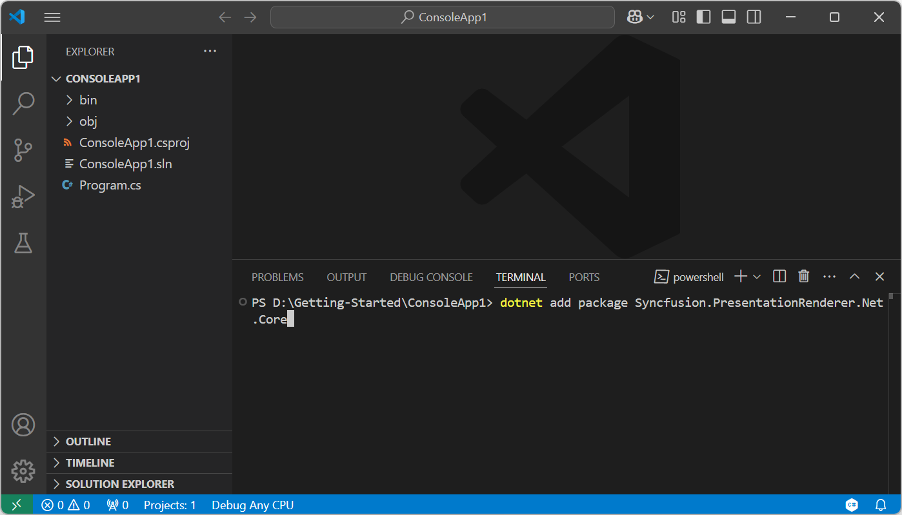
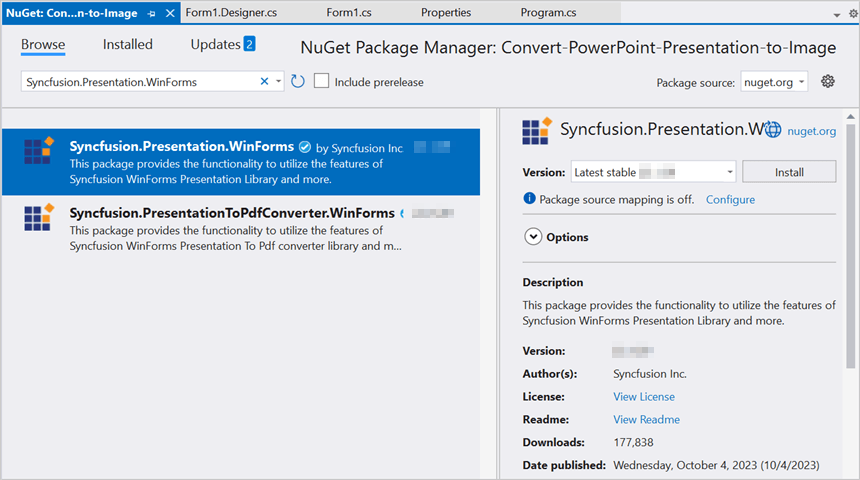

# Convert PowerPoint to Image in Console application

Syncfusion<sup>&reg;</sup> PowerPoint is a [.NET PowerPoint library](https://www.syncfusion.com/document-processing/powerpoint-framework/net) used to create, read, edit and **convert PowerPoint presentation** programmatically without **Microsoft PowerPoint** or interop dependencies. Using this library, you can **convert a PowerPoint to image in Console application**.

## Convert PowerPoint to Image using .NET Core and Latest





Step 1: Create a new **.NET Core console application** project.


Step 2: Install the [Syncfusion.PresentationRenderer.Net.Core](https://www.nuget.org/packages/Syncfusion.PresentationRenderer.Net.Core) NuGet package as a reference to your project from [NuGet.org](https://www.nuget.org/).


N> Starting with v16.2.0.x, if you reference Syncfusion<sup>&reg;</sup> assemblies from trial setup or from the NuGet feed, you also have to add "Syncfusion.Licensing" assembly reference and include a license key in your projects. Please refer to this [link](https://help.syncfusion.com/common/essential-studio/licensing/overview) to know about registering Syncfusion<sup>&reg;</sup> license key in your application to use our components.

Step 3: Include the following namespaces in **Program.cs** file.




using Syncfusion.Presentation;
using Syncfusion.PresentationRenderer;




Step 4: Include the below code snippet in **Program.cs** to **convert PowerPoint to image**.




//Open the file as Stream.
using (FileStream fileStream = new FileStream("Data/Input.pptx", FileMode.Open, FileAccess.Read))
{
    //Open the existing PowerPoint presentation.
    using (IPresentation pptxDoc = Presentation.Open(fileStream))
    {
        //Initialize the PresentationRenderer to perform image conversion.
        pptxDoc.PresentationRenderer = new PresentationRenderer();
        //Convert PowerPoint slide to image as stream.
        Stream stream = pptxDoc.Slides[0].ConvertToImage(Syncfusion.Presentation.ExportImageFormat.Jpeg);
        //Reset the stream position.
        stream.Position = 0;
        //Create the output image file stream.
        using (FileStream fileStreamOutput = File.Create(Path.GetFullPath("Data/PPTXToImage.jpeg")))
        {
            //Copy the converted image stream into created output stream.
            stream.CopyTo(fileStreamOutput);
        }
    }
}




Step 5: Build the project.

Click on Build → Build Solution or press <kbd>Ctrl</kbd>+<kbd>Shift</kbd>+<kbd>B</kbd> to build the project.

Step 6: Run the project.

Click the Start button (green arrow) or press <kbd>F5</kbd> to run the app.

You can download a complete working sample from [GitHub](https://github.com/SyncfusionExamples/PowerPoint-Examples/tree/master/PPTX-to-Image-conversion/Convert-PowerPoint-presentation-to-Image/.NET).

By executing the program, you will get the **Image** as follows.



 


Prerequisites:**

* Visual Studio Code.
* Install [.NET 8 SDK](https://dotnet.microsoft.com/en-us/download/dotnet/8.0) or later.
* Open Visual Studio Code and install the [C# for Visual Studio Code extension](https://marketplace.visualstudio.com/items?itemName=ms-dotnettools.csharp) from the Extensions Marketplace.

Step 1: Create a new .NET Core console application project.
1. Open the command palette by pressing <kbd>Ctrl</kbd>+<kbd>Shift</kbd>+<kbd>P</kbd> and type **.NET:New Project** and enter.
2. Choose the **Console App** template.


3. Select the project location, type the project name and press enter.
4. Then choose **Create project**.

Step 2: To **convert a PowerPoint document to image in console app**, install [Syncfusion.PresentationRenderer.Net.Core](https://www.nuget.org/packages/Syncfusion.PresentationRenderer.Net.Core) to the project.
1. Press <kbd>Ctrl</kbd> + <kbd>`</kbd> (backtick) to open the integrated terminal in Visual Studio Code.
2. Ensure you're in the project root directory where your .csproj file is located.
3. Run the command `dotnet add package Syncfusion.PresentationRenderer.NET.Core` to install the NuGet package.

 

N> Starting with v16.2.0.x, if you reference Syncfusion<sup>&reg;</sup> assemblies from trial setup or from the NuGet feed, you also have to add "Syncfusion.Licensing" assembly reference and include a license key in your projects. Please refer to this [link](https://help.syncfusion.com/common/essential-studio/licensing/overview) to know about registering Syncfusion<sup>&reg;</sup> license key in your application to use our components.

Step 3: Include the following namespaces in **Program.cs** file.




using Syncfusion.Presentation;
using Syncfusion.PresentationRenderer;




Step 4: Include the below code snippet in **Program.cs** to **convert PowerPoint to image**.




//Open the file as Stream.
using (FileStream fileStream = new FileStream("Data/Input.pptx", FileMode.Open, FileAccess.Read))
{
    //Open the existing PowerPoint presentation.
    using (IPresentation pptxDoc = Presentation.Open(fileStream))
    {
        //Initialize the PresentationRenderer to perform image conversion.
        pptxDoc.PresentationRenderer = new PresentationRenderer();
        //Convert PowerPoint slide to image as stream.
        Stream stream = pptxDoc.Slides[0].ConvertToImage(Syncfusion.Presentation.ExportImageFormat.Jpeg);
        //Reset the stream position.
        stream.Position = 0;
        //Create the output image file stream.
        using (FileStream fileStreamOutput = File.Create(Path.GetFullPath("Data/PPTXToImage.jpeg")))
        {
            //Copy the converted image stream into created output stream.
            stream.CopyTo(fileStreamOutput);
        }
    }
}




Step 5: Build the project.

Run the following command in terminal to build the project.

```
dotnet build
```

Step 6: Run the project.

Run the following command in terminal to build the project.

```
dotnet run
```

You can download a complete working sample from [GitHub](https://github.com/SyncfusionExamples/PowerPoint-Examples/tree/master/PPTX-to-Image-conversion/Convert-PowerPoint-presentation-to-Image/.NET).

By executing the program, you will get the **Image** as follows.



 


## Convert PowerPoint to Image in .NET Framework

The below steps illustrates **convert PowerPoint to image** in console application using **.NET Framework**.

Step 1: Create a new **.NET FrameWork console application** project.


Step 2: Install [Syncfusion.Presentation.WinForms](https://www.nuget.org/packages/Syncfusion.Presentation.WinForms) NuGet package as a reference to your Windows Forms application from the [NuGet.org](https://www.nuget.org/).



N> 1. The [Syncfusion.Presentation.WinForms](https://www.nuget.org/packages/Syncfusion.Presentation.WinForms) is a dependency for Syncfusion<sup>&reg;</sup> Windows Forms GUI controls and is named with the suffix "WinForms". It contains platform-independent .NET Framework assemblies (compatible with versions 4.0, 4.5, 4.5.1, and 4.6) for the PowerPoint library and does not include any Windows Forms-related references or code. Therefore, we recommend using this package for .NET Framework Console applications.
N> 2. Starting with v16.2.0.x, if you reference Syncfusion<sup>&reg;</sup> assemblies from trial setup or from the NuGet feed, you also have to add "Syncfusion.Licensing" assembly reference and include a license key in your projects. Please refer to this [link](https://help.syncfusion.com/common/essential-studio/licensing/overview) to know about registering Syncfusion<sup>&reg;</sup> license key in your application to use our components.

Step 3: Include the following namespaces in **Program.cs** file.




using Syncfusion.Presentation;




Step 5: Include the below code snippet in **Program.cs** to **convert PowerPoint to image**.




//Open an existing PowerPoint Presentation.
using (IPresentation pptxDoc = Presentation.Open("Data/Input.pptx"))
{
    //Convert the first slide into image.
    Image image = pptxDoc.Slides[0].ConvertToImage(Syncfusion.Drawing.ImageType.Metafile);
    //Save the image file.
    image.Save("PPTXtoImage.Jpeg");
}




You can download a complete working sample from [GitHub](https://github.com/SyncfusionExamples/PowerPoint-Examples/tree/master/PPTX-to-Image-conversion/Convert-PowerPoint-presentation-to-Image/.NET-Framework).

By executing the program, you will get the **image** as follows.


