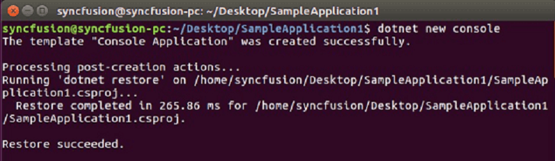
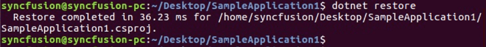
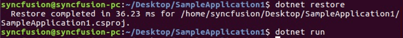
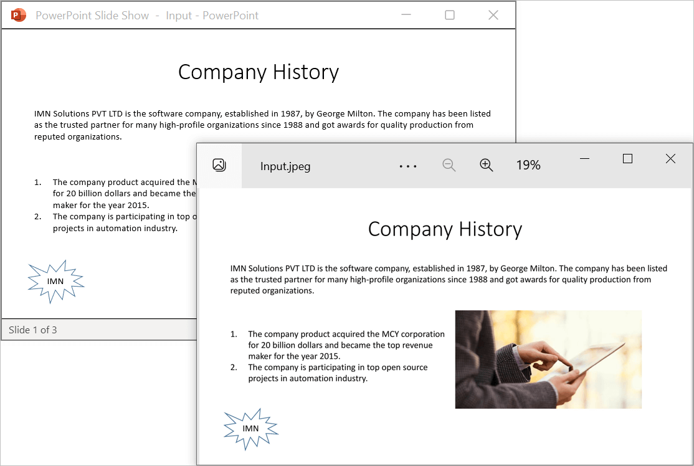
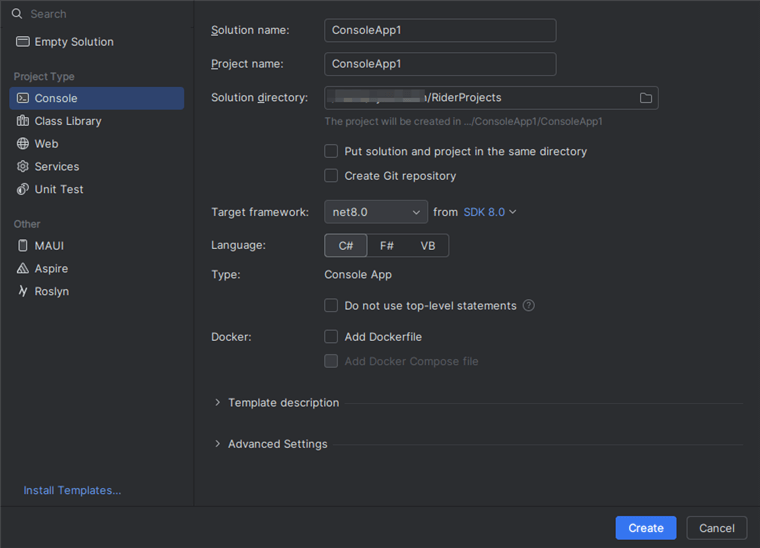
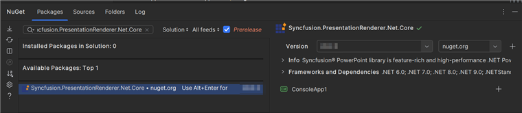
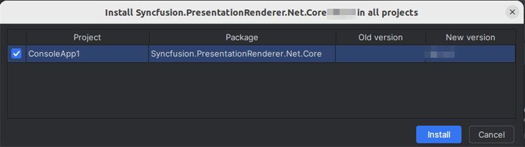

# Convert PowerPoint to Image in Linux

Syncfusion&reg; PowerPoint is a [.NET Core PowerPoint library](https://www.syncfusion.com/document-processing/powerpoint-framework/net-core) used to create, read, edit and **convert PowerPoint presentation** programmatically without **Microsoft PowerPoint** or interop dependencies. Using this library, you can **convert a PowerPoint to image in .NET Core application on Linux**.

## Steps to convert PowerPoint to Image in .NET Core application on Linux





**Prerequisites:**

* Visual Studio 2022.
* Install [.NET 8 SDK](https://dotnet.microsoft.com/en-us/download/dotnet/8.0) or later.

Step 1: Execute the following command in **Linux terminal** to create a new .NET Core Console application.




dotnet new console




Step 2: Install the following **Nuget packages** in your application from [Nuget.org](https://www.nuget.org/) by execute the following command.

* [Syncfusion.PresentationRenderer.Net.Core](https://www.nuget.org/packages/Syncfusion.PresentationRenderer.Net.Core) 
* [SkiaSharp.NativeAssets.Linux v3.119.1](https://www.nuget.org/packages/SkiaSharp.NativeAssets.Linux/3.119.1)
* [HarfBuzzSharp.NativeAssets.Linux v8.3.1.2](https://www.nuget.org/packages/HarfBuzzSharp.NativeAssets.Linux/8.3.1.2)




dotnet add package Syncfusion.PresentationRenderer.Net.Core -v 22.1.38 -s https://www.nuget.org/
dotnet add package SkiaSharp.NativeAssets.Linux -v 3.119.1 -s https://www.nuget.org/
dotnet add package HarfBuzzSharp.NativeAssets.Linux -v 8.3.1.2 -s https://www.nuget.org/




N> 1. For other Linux environments, refer to the [documentation](https://help.syncfusion.com/document-processing/powerpoint/conversions/powerpoint-to-image/net/nuget-packages-required-for-pptxtoimage-conversion#additional-nuget-packages-required-for-linux) for detailed information on the additional NuGet packages required. 
N> 2. Starting with v16.2.0.x, if you reference Syncfusion&reg; assemblies from trial setup or from the NuGet feed, you also have to add "Syncfusion.Licensing" assembly reference and include a license key in your projects. Please refer to this [link](https://help.syncfusion.com/common/essential-studio/licensing/overview) to know about registering Syncfusion&reg; license key in your applications to use our components.

Step 3: Add the following Namespaces in **Program.cs** file.




using Syncfusion.Presentation;
using Syncfusion.PresentationRenderer;




Step 4: Add the following code snippet in **Program.cs** file.




 //Open the file as Stream.
 using (FileStream fileStreamInput = new FileStream("Data/Input.pptx", FileMode.Open, FileAccess.Read))
 {
     //Open the existing PowerPoint presentation with loaded stream.
     using (IPresentation pptxDoc = Presentation.Open(fileStreamInput))
     {
         //Initialize the PresentationRenderer to perform image conversion.
         pptxDoc.PresentationRenderer = new PresentationRenderer();
         //Convert PowerPoint slide to image as stream.
         using (Stream stream = pptxDoc.Slides[0].ConvertToImage(ExportImageFormat.Jpeg))
         {
             //Reset the stream position.
             stream.Position = 0;
             //Create FileStream to save the image file.
             using (FileStream outputStream = new FileStream("PPTXtoImage.Jpeg", FileMode.Create, FileAccess.ReadWrite, FileShare.ReadWrite))
             {
                 //Save the image file.
                 stream.CopyTo(outputStream);
             }
         }
     }
 }




Step 5: Execute the following command to **restore** the NuGet packages.




dotnet restore




Step 6: Execute the following command in **terminal** to **run the application**.




dotnet run




You can download a complete working sample from [GitHub](https://github.com/SyncfusionExamples/PowerPoint-Examples/tree/master/PPTX-to-Image-conversion/Convert-PowerPoint-presentation-to-Image/Linux/Convert-PowerPoint-Presentation-to-Image).

By executing the program, you will get the **image** as follows. The output will be saved in **bin** folder.





**Prerequisites:**

* JetBrains Rider.
* Install .NET 8 SDK or later.

Step 1: Open JetBrains Rider and create a new .NET Core console application project.
* Launch JetBrains Rider.
* Click **New solution** on the welcome screen.

* In the New Solution dialog, select **Project Type** as **Console**.
* Select the target framework (e.g., .NET 8.0, .NET 9.0).
* Enter a project name and specify the location.
* Click create.

Step 2: Install the NuGet package from [NuGet.org](https://www.nuget.org/).
* Click the NuGet icon in the Rider toolbar and type [Syncfusion.PresentationRenderer.Net.Core](https://www.nuget.org/packages/Syncfusion.PresentationRenderer.Net.Core) in the search bar.
* Ensure that nuget.org is selected as the package source.
* Select the latest Syncfusion.PresentationRenderer.Net.Core NuGet package from the list.
* Click the + (Add) button to add the package.

* Click the **Install** button to complete the installation.

N> 1. For other Linux environments, refer to the [documentation](https://help.syncfusion.com/document-processing/powerpoint/conversions/powerpoint-to-image/net/nuget-packages-required-for-pptxtoimage-conversion#additional-nuget-packages-required-for-linux) for detailed information on the additional NuGet packages required. 
N> 2. Starting with v16.2.0.x, if you reference Syncfusion assemblies from trial setup or from the NuGet feed, you also have to add "Syncfusion.Licensing" assembly reference and include a license key in your projects. Please refer to this [link](https://help.syncfusion.com/common/essential-studio/licensing/overview) to know about registering Syncfusion license key in your application to use our components.

Step 3: Add the following Namespaces in **Program.cs** file.




using Syncfusion.Presentation;
using Syncfusion.PresentationRenderer;




Step 4: Add the following code snippet in **Program.cs** file.




 //Open the file as Stream.
 using (FileStream fileStreamInput = new FileStream("Data/Input.pptx", FileMode.Open, FileAccess.Read))
 {
     //Open the existing PowerPoint presentation with loaded stream.
     using (IPresentation pptxDoc = Presentation.Open(fileStreamInput))
     {
         //Initialize the PresentationRenderer to perform image conversion.
         pptxDoc.PresentationRenderer = new PresentationRenderer();
         //Convert PowerPoint slide to image as stream.
         using (Stream stream = pptxDoc.Slides[0].ConvertToImage(ExportImageFormat.Jpeg))
         {
             //Reset the stream position.
             stream.Position = 0;
             //Create FileStream to save the image file.
             using (FileStream outputStream = new FileStream("PPTXtoImage.Jpeg", FileMode.Create, FileAccess.ReadWrite, FileShare.ReadWrite))
             {
                 //Save the image file.
                 stream.CopyTo(outputStream);
             }
         }
     }
 }




Step 5: Build the project.

Click the **Build** button in the toolbar or press <kbd>Ctrl</kbd>+<kbd>Shift</kbd>+<kbd>B</kbd> to build the project.

Step 6: Run the project.

Click the **Run** button (green arrow) in the toolbar or press <kbd>F5</kbd> to run the app.

You can download a complete working sample from [GitHub](https://github.com/SyncfusionExamples/PowerPoint-Examples/tree/master/PPTX-to-Image-conversion/Convert-PowerPoint-presentation-to-Image/Linux/Convert-PowerPoint-Presentation-to-Image).

By executing the program, you will get the **image** as follows. The output will be saved in **bin** folder.





Click [here](https://www.syncfusion.com/document-processing/powerpoint-framework/net-core) to explore the rich set of Syncfusion&reg; PowerPoint Library (Presentation) features. 

An online sample link to [convert PowerPoint Presentation to image](https://document.syncfusion.com/demos/powerpoint/pptxtoimage#/tailwind) in ASP.NET Core. 
