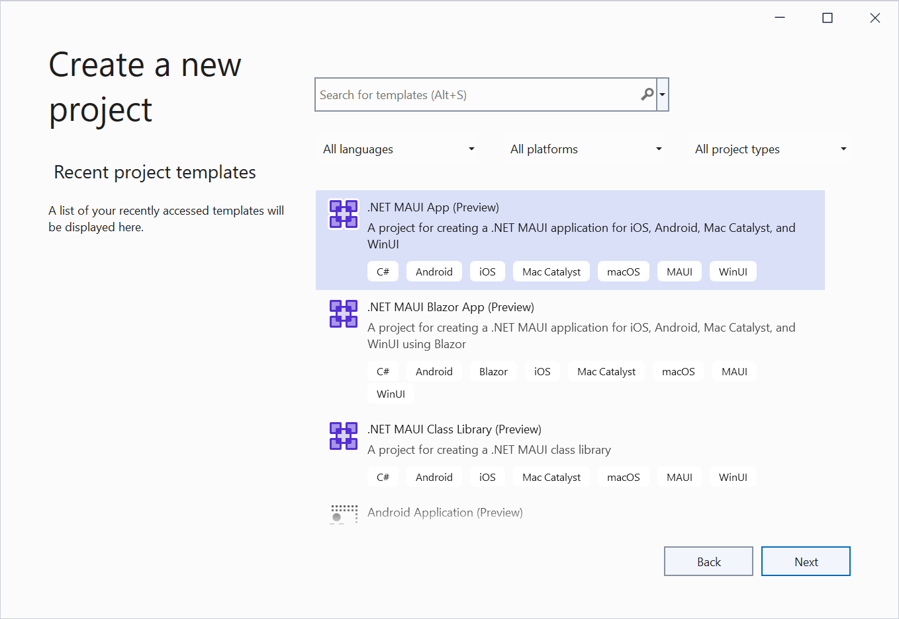
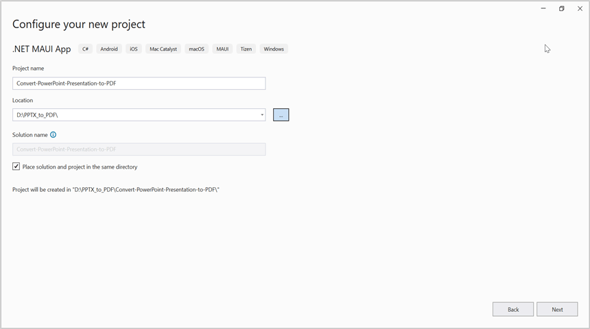
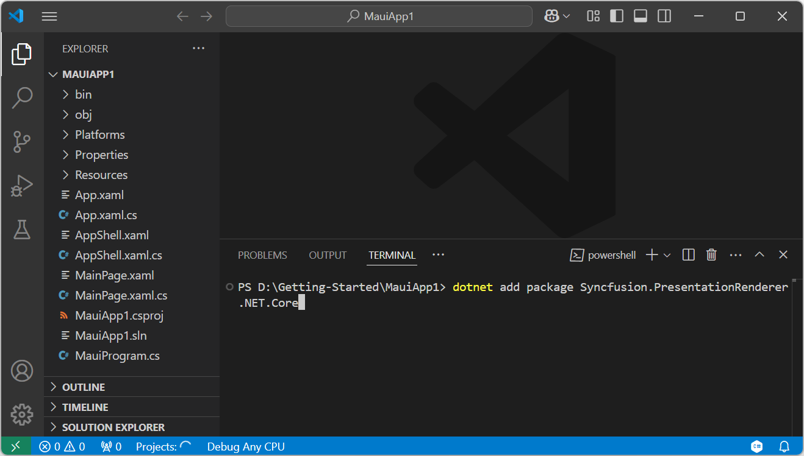

# Convert PowerPoint to Image in .NET MAUI

Syncfusion&reg; PowerPoint is a [.NET MAUI PowerPoint library](https://www.syncfusion.com/document-processing/powerpoint-framework/maui/powerpoint-library) used to create, read, edit and convert PowerPoint presentation programmatically without **Microsoft PowerPoint** or interop dependencies. Using this library, you can **convert a PowerPoint to image in .NET MAUI**.

## Steps to convert PowerPoint to Image programmatically





**Prerequisites:**

* Visual Studio 2022.
* Install [.NET 8 SDK](https://dotnet.microsoft.com/en-us/download/dotnet/8.0) or later.
* For more details about installation, refer [here](https://learn.microsoft.com/en-us/dotnet/maui/get-started/installation?view=net-maui-7.0&tabs=vswin).

Step 1: Create a new C# .NET MAUI app. Select **.NET MAUI App (Preview)** from the template and click the **Next** button.

Step 2: Enter the project name and click **Create**.

Step 3: Install the [Syncfusion.PresentationRenderer.NET](https://www.nuget.org/packages/Syncfusion.PresentationRenderer.NET) NuGet package as a reference to your project from [NuGet.org](https://www.nuget.org/).

N> Starting with v16.2.0.x, if you reference Syncfusion&reg; assemblies from trial setup or from the NuGet feed, you also have to add "Syncfusion.Licensing" assembly reference and include a license key in your projects. Please refer to this [link](https://help.syncfusion.com/common/essential-studio/licensing/overview) to know about registering Syncfusion&reg; license key in your application to use our components.

Step 4: Add a new button to the **MainPage.xaml** as shown below.




<?xml version="1.0" encoding="utf-8" ?>
<ContentPage xmlns="http://schemas.microsoft.com/dotnet/2021/maui"
             xmlns:x="http://schemas.microsoft.com/winfx/2009/xaml"
             x:Class="Convert_PowerPoint_Presentation_to_Image.MainPage">

    <ScrollView>
        <Grid RowSpacing="25" RowDefinitions="Auto,Auto,Auto,Auto,*"
            Padding="{OnPlatform iOS='30,60,30,30', Default='30'}">
            <Button 
                Text="Convert PPTX to Image"
                FontAttributes="Bold"
                Grid.Row="0"
                SemanticProperties.Hint="Convert PPTX to Image"
                Clicked="ConvertPPTXtoImage"
                HorizontalOptions="Center" />
        </Grid>
    </ScrollView>
</ContentPage>




Step 5: Include the following namespaces in the **MainPage.xaml.cs** file.




using Syncfusion.Presentation;
using Syncfusion.PresentationRenderer;




Step 6: Add a new action method **ConvertPPTXtoImage** in MainPage.xaml.cs and include the below code snippet to **convert a PowerPoint to Image in .NET MAUI**.




//Loading an existing PowerPoint presentation.
Assembly assembly = typeof(App).GetTypeInfo().Assembly;
//Open the existing PowerPoint presentation with loaded stream.
using (IPresentation pptxDoc = Presentation.Open(assembly.GetManifestResourceStream("Convert_PowerPoint_Presentation_to_Image.Assets.Input.pptx")))
{
    //Initialize the PresentationRenderer.
    pptxDoc.PresentationRenderer = new PresentationRenderer();
    //Converts the first slide into image.
    Stream stream= pptxDoc.Slides[0].ConvertToImage(ExportImageFormat.Jpeg);
    //Reset the stream position.
    stream.Position = 0;
    //save and Launch the image file.
    SaveService saveService = new();
    saveService.SaveAndView("PPTXtoImage.Jpeg", "application/jpeg", stream as MemoryStream);
}




Step 7: Run the Application.

1. Select the target framework, device or emulator.
2. Press <kbd>F5</kbd> to run the application.

You can download a complete working sample from [GitHub](https://github.com/SyncfusionExamples/PowerPoint-Examples/tree/master/PPTX-to-Image-conversion/Convert-PowerPoint-presentation-to-Image/.NET-MAUI).

By executing the program, you will get the **image** as follows.

## Helper files for .NET MAUI

Refer the below helper files and add them into the mentioned project. These helper files allow you to save the stream as a physical file and open the file for viewing.

<table>
  <tr>
  <td>
    <b>Folder Name</b>
  </td>
  <td>
    <b>File Name</b>
  </td>
  <td>
    <b>Summary</b>
  </td>
  </tr>
  <tr>
  <td>
    {{'[.NET MAUI Project](https://github.com/SyncfusionExamples/PowerPoint-Examples/tree/master/PPTX-to-Image-conversion/Convert-PowerPoint-presentation-to-Image/.NET-MAUI/Convert-PowerPoint-to-Image)'| markdownify }}
  </td>
  <td>
    {{'[SaveService.cs](https://github.com/SyncfusionExamples/PowerPoint-Examples/blob/master/PPTX-to-Image-conversion/Convert-PowerPoint-presentation-to-Image/.NET-MAUI/Convert-PowerPoint-to-Image/SaveServices/SaveService.cs)'| markdownify }}
  </td>
  <td>Represent the base class for save operation.
  </td>
  </tr>
  <tr>
  <td>
    {{'[Windows](https://github.com/SyncfusionExamples/PowerPoint-Examples/tree/master/PPTX-to-Image-conversion/Convert-PowerPoint-presentation-to-Image/.NET-MAUI/Convert-PowerPoint-to-Image/Platforms/Windows)'| markdownify }}
  </td>
  <td>
    {{'[SaveWindows.cs](https://github.com/SyncfusionExamples/PowerPoint-Examples/blob/master/PPTX-to-Image-conversion/Convert-PowerPoint-presentation-to-Image/.NET-MAUI/Convert-PowerPoint-to-Image/Platforms/Windows/SaveWindows.cs)'| markdownify }}
  </td>
  <td>Save implementation for Windows.
  </td>
  </tr>
  <tr>
  <td>
    {{'[Android](https://github.com/SyncfusionExamples/PowerPoint-Examples/blob/master/PPTX-to-Image-conversion/Convert-PowerPoint-presentation-to-Image/.NET-MAUI/Convert-PowerPoint-to-Image/Platforms/Windows/SaveWindows.cs)'| markdownify }}
  </td>
  <td>
    {{'[SaveAndroid.cs](https://github.com/SyncfusionExamples/PowerPoint-Examples/blob/master/PPTX-to-Image-conversion/Convert-PowerPoint-presentation-to-Image/.NET-MAUI/Convert-PowerPoint-to-Image/Platforms/Android/SaveAndroid.cs)'| markdownify }}
  </td>
  <td>Save implementation for Android device.
  </td>
  </tr>
  <tr>
  <td>
    {{'[Mac Catalyst](https://github.com/SyncfusionExamples/PowerPoint-Examples/tree/master/PPTX-to-Image-conversion/Convert-PowerPoint-presentation-to-Image/.NET-MAUI/Convert-PowerPoint-to-Image/Platforms/MacCatalyst)'| markdownify }}
  </td>
  <td>
    {{'[SaveMac.cs](https://github.com/SyncfusionExamples/PowerPoint-Examples/blob/master/PPTX-to-Image-conversion/Convert-PowerPoint-presentation-to-Image/.NET-MAUI/Convert-PowerPoint-to-Image/Platforms/MacCatalyst/SaveMac.cs)'| markdownify }}
  </td>
  <td>Save implementation for Mac Catalyst device.
  </td>
  </tr>
  <tr>
  <td rowspan="2">
    {{'[iOS](https://github.com/SyncfusionExamples/PowerPoint-Examples/tree/master/PPTX-to-Image-conversion/Convert-PowerPoint-presentation-to-Image/.NET-MAUI/Convert-PowerPoint-to-Image/Platforms/iOS)'| markdownify }}
  </td>
  <td>
    {{'[SaveIOS.cs](https://github.com/SyncfusionExamples/PowerPoint-Examples/blob/master/PPTX-to-Image-conversion/Convert-PowerPoint-presentation-to-Image/.NET-MAUI/Convert-PowerPoint-to-Image/Platforms/iOS/SaveIOS.cs)'| markdownify }}
  </td>
  <td>
    Save implementation for iOS device
  </td>
  </tr>
  <tr>
  <td>
    {{'[PreviewControllerDS.cs](https://github.com/SyncfusionExamples/PowerPoint-Examples/blob/master/PPTX-to-Image-conversion/Convert-PowerPoint-presentation-to-Image/.NET-MAUI/Convert-PowerPoint-to-Image/Platforms/iOS/PreviewControllerDS.cs)'| markdownify }} {{'[QLPreviewItemFileSystem.cs](https://github.com/SyncfusionExamples/PowerPoint-Examples/blob/master/PPTX-to-Image-conversion/Convert-PowerPoint-presentation-to-Image/.NET-MAUI/Convert-PowerPoint-to-Image/Platforms/iOS/QLPreviewItemFileSystem.cs)'| markdownify }}
  </td>
  <td>
    Helper classes for viewing the <b>PowerPoint Presenatation</b> in iOS device
  </td>
  </tr>
</table>


 


**Prerequisites:**

* Install the latest .NET SDK and Visual Studio Code.
* Open Visual Studio Code and install the [.NET MAUI for Visual Studio Code extension](https://marketplace.visualstudio.com/items?itemName=ms-dotnettools.dotnet-maui) from the Extensions Marketplace.
* Follow the step-by-step setup guide:
  - [Set up .NET MAUI with Visual Studio Code](https://learn.microsoft.com/en-us/dotnet/maui/get-started/installation?view=net-maui-9.0&tabs=visual-studio-code)
  - [Steps for each platform](https://learn.microsoft.com/en-us/dotnet/maui/get-started/first-app?pivots=devices-windows&view=net-maui-9.0&tabs=visual-studio-code) 

Step 1: Create a new C# .NET MAUI app project.
* Open the command palette by pressing <kbd>Ctrl</kbd>+<kbd>Shift</kbd>+<kbd>P</kbd> and type **.NET:New Project** and enter.
* Choose the **.NET MAUI App** template.

* Select the project location, type the project name and press enter.
* Then choose **Create project**.

Step 2: To **convert a PowerPoint document to image in .NET MAUI app**, install [Syncfusion.PresentationRenderer.NET.Core](https://www.nuget.org/packages/Syncfusion.PresentationRenderer.NET.Core) to the MAUI project.
* Press <kbd>Ctrl</kbd> + <kbd>`</kbd> (backtick) to open the integrated terminal in Visual Studio Code.
* Ensure you're in the project root directory where your .csproj file is located.
* Run the command `dotnet add package Syncfusion.PresentationRenderer.NET.Core` to install the NuGet package.

N> Starting with v16.2.0.x, if you reference Syncfusion&reg; assemblies from trial setup or from the NuGet feed, you also have to add "Syncfusion.Licensing" assembly reference and include a license key in your projects. Please refer to this [link](https://help.syncfusion.com/common/essential-studio/licensing/overview) to know about registering Syncfusion&reg; license key in your application to use our components.

Step 3: Add a new button to the **MainPage.xaml** as shown below.




<?xml version="1.0" encoding="utf-8" ?>
<ContentPage xmlns="http://schemas.microsoft.com/dotnet/2021/maui"
             xmlns:x="http://schemas.microsoft.com/winfx/2009/xaml"
             x:Class="Convert_PowerPoint_Presentation_to_Image.MainPage">

    <ScrollView>
        <Grid RowSpacing="25" RowDefinitions="Auto,Auto,Auto,Auto,*"
            Padding="{OnPlatform iOS='30,60,30,30', Default='30'}">
            <Button 
                Text="Convert PPTX to Image"
                FontAttributes="Bold"
                Grid.Row="0"
                SemanticProperties.Hint="Convert PPTX to Image"
                Clicked="ConvertPPTXtoImage"
                HorizontalOptions="Center" />
        </Grid>
    </ScrollView>
</ContentPage>




Step 4: Include the following namespaces in the **MainPage.xaml.cs** file.




using Syncfusion.Presentation;
using Syncfusion.PresentationRenderer;




Step 5: Add a new action method **ConvertPPTXtoImage** in MainPage.xaml.cs and include the below code snippet to **convert a PowerPoint to Image in .NET MAUI**.




//Loading an existing PowerPoint presentation.
Assembly assembly = typeof(App).GetTypeInfo().Assembly;
//Open the existing PowerPoint presentation with loaded stream.
using (IPresentation pptxDoc = Presentation.Open(assembly.GetManifestResourceStream("Convert_PowerPoint_Presentation_to_Image.Assets.Input.pptx")))
{
    //Initialize the PresentationRenderer.
    pptxDoc.PresentationRenderer = new PresentationRenderer();
    //Converts the first slide into image.
    Stream stream= pptxDoc.Slides[0].ConvertToImage(ExportImageFormat.Jpeg);
    //Reset the stream position.
    stream.Position = 0;
    //save and Launch the image file.
    SaveService saveService = new();
    saveService.SaveAndView("PPTXtoImage.Jpeg", "application/jpeg", stream as MemoryStream);
}




Step 6: Run the Application.

1. Select the target framework, device or emulator.
2. Press <kbd>F5</kbd> to run the application.

You can download a complete working sample from [GitHub](https://github.com/SyncfusionExamples/PowerPoint-Examples/tree/master/PPTX-to-Image-conversion/Convert-PowerPoint-presentation-to-Image/.NET-MAUI).

By executing the program, you will get the **image** as follows.

## Helper files for .NET MAUI

Refer the below helper files and add them into the mentioned project. These helper files allow you to save the stream as a physical file and open the file for viewing.

<table>
  <tr>
  <td>
    <b>Folder Name</b>
  </td>
  <td>
    <b>File Name</b>
  </td>
  <td>
    <b>Summary</b>
  </td>
  </tr>
  <tr>
  <td>
    {{'[.NET MAUI Project](https://github.com/SyncfusionExamples/PowerPoint-Examples/tree/master/PPTX-to-Image-conversion/Convert-PowerPoint-presentation-to-Image/.NET-MAUI/Convert-PowerPoint-to-Image)'| markdownify }}
  </td>
  <td>
    {{'[SaveService.cs](https://github.com/SyncfusionExamples/PowerPoint-Examples/blob/master/PPTX-to-Image-conversion/Convert-PowerPoint-presentation-to-Image/.NET-MAUI/Convert-PowerPoint-to-Image/SaveServices/SaveService.cs)'| markdownify }}
  </td>
  <td>Represent the base class for save operation.
  </td>
  </tr>
  <tr>
  <td>
    {{'[Windows](https://github.com/SyncfusionExamples/PowerPoint-Examples/tree/master/PPTX-to-Image-conversion/Convert-PowerPoint-presentation-to-Image/.NET-MAUI/Convert-PowerPoint-to-Image/Platforms/Windows)'| markdownify }}
  </td>
  <td>
    {{'[SaveWindows.cs](https://github.com/SyncfusionExamples/PowerPoint-Examples/blob/master/PPTX-to-Image-conversion/Convert-PowerPoint-presentation-to-Image/.NET-MAUI/Convert-PowerPoint-to-Image/Platforms/Windows/SaveWindows.cs)'| markdownify }}
  </td>
  <td>Save implementation for Windows.
  </td>
  </tr>
  <tr>
  <td>
    {{'[Android](https://github.com/SyncfusionExamples/PowerPoint-Examples/blob/master/PPTX-to-Image-conversion/Convert-PowerPoint-presentation-to-Image/.NET-MAUI/Convert-PowerPoint-to-Image/Platforms/Windows/SaveWindows.cs)'| markdownify }}
  </td>
  <td>
    {{'[SaveAndroid.cs](https://github.com/SyncfusionExamples/PowerPoint-Examples/blob/master/PPTX-to-Image-conversion/Convert-PowerPoint-presentation-to-Image/.NET-MAUI/Convert-PowerPoint-to-Image/Platforms/Android/SaveAndroid.cs)'| markdownify }}
  </td>
  <td>Save implementation for Android device.
  </td>
  </tr>
  <tr>
  <td>
    {{'[Mac Catalyst](https://github.com/SyncfusionExamples/PowerPoint-Examples/tree/master/PPTX-to-Image-conversion/Convert-PowerPoint-presentation-to-Image/.NET-MAUI/Convert-PowerPoint-to-Image/Platforms/MacCatalyst)'| markdownify }}
  </td>
  <td>
    {{'[SaveMac.cs](https://github.com/SyncfusionExamples/PowerPoint-Examples/blob/master/PPTX-to-Image-conversion/Convert-PowerPoint-presentation-to-Image/.NET-MAUI/Convert-PowerPoint-to-Image/Platforms/MacCatalyst/SaveMac.cs)'| markdownify }}
  </td>
  <td>Save implementation for Mac Catalyst device.
  </td>
  </tr>
  <tr>
  <td rowspan="2">
    {{'[iOS](https://github.com/SyncfusionExamples/PowerPoint-Examples/tree/master/PPTX-to-Image-conversion/Convert-PowerPoint-presentation-to-Image/.NET-MAUI/Convert-PowerPoint-to-Image/Platforms/iOS)'| markdownify }}
  </td>
  <td>
    {{'[SaveIOS.cs](https://github.com/SyncfusionExamples/PowerPoint-Examples/blob/master/PPTX-to-Image-conversion/Convert-PowerPoint-presentation-to-Image/.NET-MAUI/Convert-PowerPoint-to-Image/Platforms/iOS/SaveIOS.cs)'| markdownify }}
  </td>
  <td>
    Save implementation for iOS device
  </td>
  </tr>
  <tr>
  <td>
    {{'[PreviewControllerDS.cs](https://github.com/SyncfusionExamples/PowerPoint-Examples/blob/master/PPTX-to-Image-conversion/Convert-PowerPoint-presentation-to-Image/.NET-MAUI/Convert-PowerPoint-to-Image/Platforms/iOS/PreviewControllerDS.cs)'| markdownify }} {{'[QLPreviewItemFileSystem.cs](https://github.com/SyncfusionExamples/PowerPoint-Examples/blob/master/PPTX-to-Image-conversion/Convert-PowerPoint-presentation-to-Image/.NET-MAUI/Convert-PowerPoint-to-Image/Platforms/iOS/QLPreviewItemFileSystem.cs)'| markdownify }}
  </td>
  <td>
    Helper classes for viewing the <b>PowerPoint Presenatation</b> in iOS device
  </td>
  </tr>
</table>





**Prerequisites:**

* JetBrains Rider.
* Install .NET 8 SDK or later.
* For more details about installation, refer [here](https://www.jetbrains.com/help/rider/MAUI.html).

Step 1. Open JetBrains Rider and create a new .NET MAUI App project.
* Launch JetBrains Rider.
* Click **New solution** on the welcome screen.

* In the New Solution dialog, select **Project Type** as **MAUI**.
* Select the target framework (e.g., .NET 8.0, .NET 9.0).
* Choose **Type** as **App**.
* Enter a project name and specify the location.
* Click create.

Step 2: Install the NuGet package from [NuGet.org](https://www.nuget.org/).
* Click the NuGet icon in the Rider toolbar and type [Syncfusion.PresentationRenderer.Net.Core](https://www.nuget.org/packages/Syncfusion.PresentationRenderer.Net.Core) in the search bar.
* Ensure that nuget.org is selected as the package source.
* Select the latest Syncfusion.PresentationRenderer.Net.Core NuGet package from the list.
* Click the + (Add) button to add the package.

* Click the **Install** button to complete the installation.

N> Starting with v16.2.0.x, if you reference Syncfusion assemblies from trial setup or from the NuGet feed, you also have to add "Syncfusion.Licensing" assembly reference and include a license key in your projects. Please refer to this [link](https://help.syncfusion.com/common/essential-studio/licensing/overview) to know about registering Syncfusion license key in your application to use our components.

Step 3: Add a new button to the **MainPage.xaml** as shown below.




<?xml version="1.0" encoding="utf-8" ?>
<ContentPage xmlns="http://schemas.microsoft.com/dotnet/2021/maui"
             xmlns:x="http://schemas.microsoft.com/winfx/2009/xaml"
             x:Class="Convert_PowerPoint_Presentation_to_Image.MainPage">

    <ScrollView>
        <Grid RowSpacing="25" RowDefinitions="Auto,Auto,Auto,Auto,*"
            Padding="{OnPlatform iOS='30,60,30,30', Default='30'}">
            <Button 
                Text="Convert PPTX to Image"
                FontAttributes="Bold"
                Grid.Row="0"
                SemanticProperties.Hint="Convert PPTX to Image"
                Clicked="ConvertPPTXtoImage"
                HorizontalOptions="Center" />
        </Grid>
    </ScrollView>
</ContentPage>




Step 4: Include the following namespaces in the **MainPage.xaml.cs** file.




using Syncfusion.Presentation;
using Syncfusion.PresentationRenderer;




Step 5: Add a new action method **ConvertPPTXtoImage** in MainPage.xaml.cs and include the below code snippet to **convert a PowerPoint to Image in .NET MAUI**.




//Loading an existing PowerPoint presentation.
Assembly assembly = typeof(App).GetTypeInfo().Assembly;
//Open the existing PowerPoint presentation with loaded stream.
using (IPresentation pptxDoc = Presentation.Open(assembly.GetManifestResourceStream("Convert_PowerPoint_Presentation_to_Image.Assets.Input.pptx")))
{
    //Initialize the PresentationRenderer.
    pptxDoc.PresentationRenderer = new PresentationRenderer();
    //Converts the first slide into image.
    Stream stream= pptxDoc.Slides[0].ConvertToImage(ExportImageFormat.Jpeg);
    //Reset the stream position.
    stream.Position = 0;
    //save and Launch the image file.
    SaveService saveService = new();
    saveService.SaveAndView("PPTXtoImage.Jpeg", "application/jpeg", stream as MemoryStream);
}




Step 6: Build the project.

Click the **Build** button in the toolbar or press <kbd>Ctrl</kbd>+<kbd>Shift</kbd>+<kbd>B</kbd> to build the project.

Step 7: Run the project.

Select the target platform in the Run configuration dropdown, then click Run.

You can download a complete working sample from [GitHub](https://github.com/SyncfusionExamples/PowerPoint-Examples/tree/master/PPTX-to-Image-conversion/Convert-PowerPoint-presentation-to-Image/.NET-MAUI).

By executing the program, you will get the **image** as follows.

## Helper files for .NET MAUI

Refer the below helper files and add them into the mentioned project. These helper files allow you to save the stream as a physical file and open the file for viewing.

<table>
  <tr>
  <td>
    <b>Folder Name</b>
  </td>
  <td>
    <b>File Name</b>
  </td>
  <td>
    <b>Summary</b>
  </td>
  </tr>
  <tr>
  <td>
    {{'[.NET MAUI Project](https://github.com/SyncfusionExamples/PowerPoint-Examples/tree/master/PPTX-to-Image-conversion/Convert-PowerPoint-presentation-to-Image/.NET-MAUI/Convert-PowerPoint-to-Image)'| markdownify }}
  </td>
  <td>
    {{'[SaveService.cs](https://github.com/SyncfusionExamples/PowerPoint-Examples/blob/master/PPTX-to-Image-conversion/Convert-PowerPoint-presentation-to-Image/.NET-MAUI/Convert-PowerPoint-to-Image/SaveServices/SaveService.cs)'| markdownify }}
  </td>
  <td>Represent the base class for save operation.
  </td>
  </tr>
  <tr>
  <td>
    {{'[Windows](https://github.com/SyncfusionExamples/PowerPoint-Examples/tree/master/PPTX-to-Image-conversion/Convert-PowerPoint-presentation-to-Image/.NET-MAUI/Convert-PowerPoint-to-Image/Platforms/Windows)'| markdownify }}
  </td>
  <td>
    {{'[SaveWindows.cs](https://github.com/SyncfusionExamples/PowerPoint-Examples/blob/master/PPTX-to-Image-conversion/Convert-PowerPoint-presentation-to-Image/.NET-MAUI/Convert-PowerPoint-to-Image/Platforms/Windows/SaveWindows.cs)'| markdownify }}
  </td>
  <td>Save implementation for Windows.
  </td>
  </tr>
  <tr>
  <td>
    {{'[Android](https://github.com/SyncfusionExamples/PowerPoint-Examples/blob/master/PPTX-to-Image-conversion/Convert-PowerPoint-presentation-to-Image/.NET-MAUI/Convert-PowerPoint-to-Image/Platforms/Windows/SaveWindows.cs)'| markdownify }}
  </td>
  <td>
    {{'[SaveAndroid.cs](https://github.com/SyncfusionExamples/PowerPoint-Examples/blob/master/PPTX-to-Image-conversion/Convert-PowerPoint-presentation-to-Image/.NET-MAUI/Convert-PowerPoint-to-Image/Platforms/Android/SaveAndroid.cs)'| markdownify }}
  </td>
  <td>Save implementation for Android device.
  </td>
  </tr>
  <tr>
  <td>
    {{'[Mac Catalyst](https://github.com/SyncfusionExamples/PowerPoint-Examples/tree/master/PPTX-to-Image-conversion/Convert-PowerPoint-presentation-to-Image/.NET-MAUI/Convert-PowerPoint-to-Image/Platforms/MacCatalyst)'| markdownify }}
  </td>
  <td>
    {{'[SaveMac.cs](https://github.com/SyncfusionExamples/PowerPoint-Examples/blob/master/PPTX-to-Image-conversion/Convert-PowerPoint-presentation-to-Image/.NET-MAUI/Convert-PowerPoint-to-Image/Platforms/MacCatalyst/SaveMac.cs)'| markdownify }}
  </td>
  <td>Save implementation for Mac Catalyst device.
  </td>
  </tr>
  <tr>
  <td rowspan="2">
    {{'[iOS](https://github.com/SyncfusionExamples/PowerPoint-Examples/tree/master/PPTX-to-Image-conversion/Convert-PowerPoint-presentation-to-Image/.NET-MAUI/Convert-PowerPoint-to-Image/Platforms/iOS)'| markdownify }}
  </td>
  <td>
    {{'[SaveIOS.cs](https://github.com/SyncfusionExamples/PowerPoint-Examples/blob/master/PPTX-to-Image-conversion/Convert-PowerPoint-presentation-to-Image/.NET-MAUI/Convert-PowerPoint-to-Image/Platforms/iOS/SaveIOS.cs)'| markdownify }}
  </td>
  <td>
    Save implementation for iOS device
  </td>
  </tr>
  <tr>
  <td>
    {{'[PreviewControllerDS.cs](https://github.com/SyncfusionExamples/PowerPoint-Examples/blob/master/PPTX-to-Image-conversion/Convert-PowerPoint-presentation-to-Image/.NET-MAUI/Convert-PowerPoint-to-Image/Platforms/iOS/PreviewControllerDS.cs)'| markdownify }} {{'[QLPreviewItemFileSystem.cs](https://github.com/SyncfusionExamples/PowerPoint-Examples/blob/master/PPTX-to-Image-conversion/Convert-PowerPoint-presentation-to-Image/.NET-MAUI/Convert-PowerPoint-to-Image/Platforms/iOS/QLPreviewItemFileSystem.cs)'| markdownify }}
  </td>
  <td>
    Helper classes for viewing the <b>PowerPoint Presenatation</b> in iOS device
  </td>
  </tr>
</table>





Click [here](https://www.syncfusion.com/document-processing/powerpoint-framework/maui/powerpoint-library) to explore the rich set of Syncfusion&reg; PowerPoint Library (Presentation) features. 

An online sample link to [convert PowerPoint Presentation to image](https://document.syncfusion.com/demos/powerpoint/pptxtoimage#/tailwind) in ASP.NET Core. 