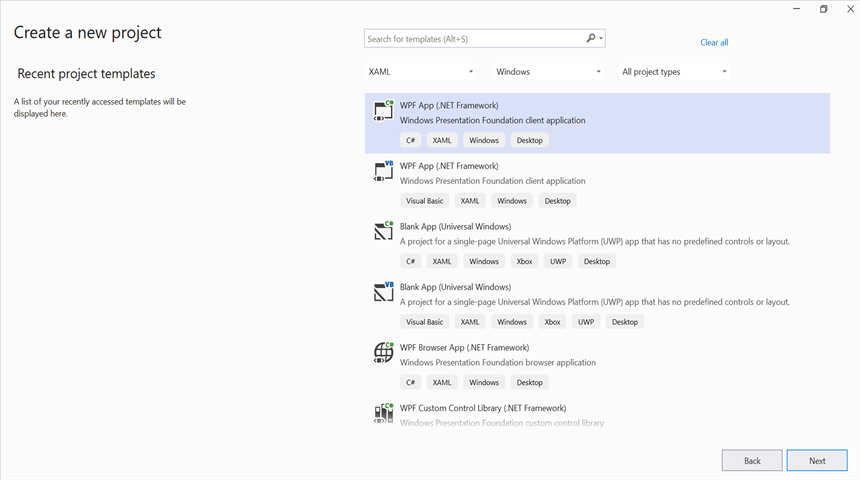
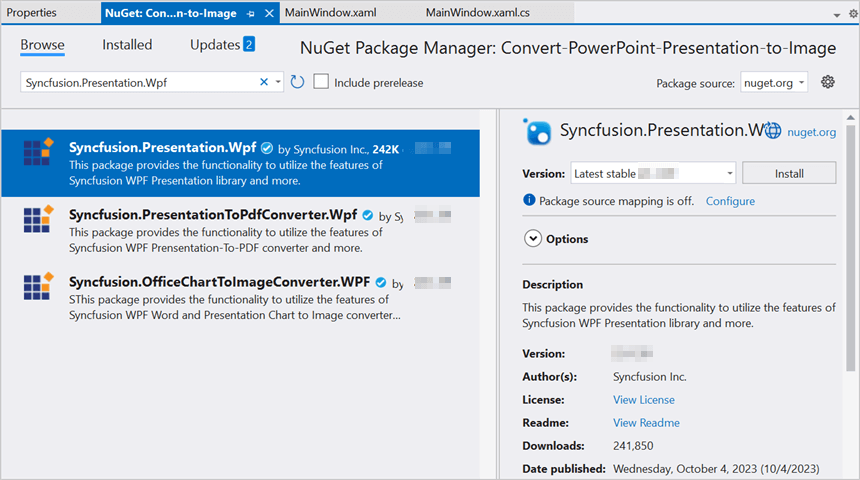
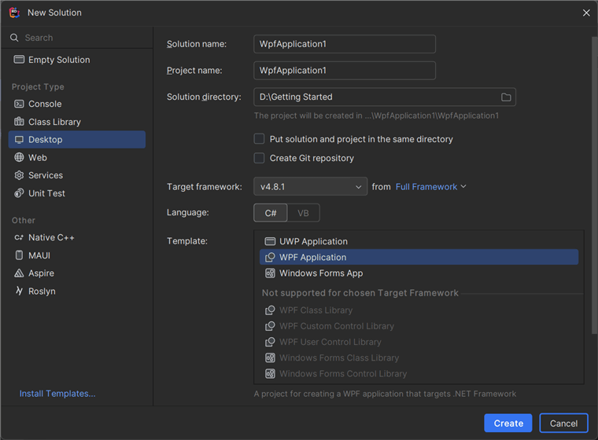
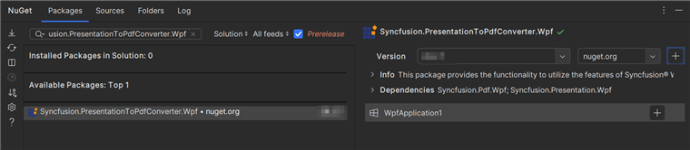
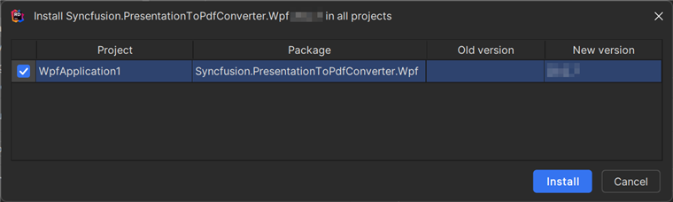

# Convert PowerPoint to Image in WPF

Syncfusion&reg; PowerPoint is a [.NET PowerPoint library](https://www.syncfusion.com/document-processing/powerpoint-framework/net) used to create, read, edit and convert PowerPoint presentation programmatically without **Microsoft PowerPoint** or interop dependencies. Using this library, you can **convert a PowerPoint to image in WPF**.

## Steps to convert PowerPoint to Image programmatically





**Prerequisites:**

* Visual Studio 2022.
* Install **.NET desktop development** workload with necessary .NET Framework SDK.

Step 1: Create a new C# WPF application project.

Step 2: Install the [Syncfusion.Presentation.Wpf](https://www.nuget.org/packages/Syncfusion.Presentation.Wpf) NuGet package as reference to your .NET Standard applications from [NuGet.org](https://www.nuget.org/).

N> Starting with v16.2.0.x, if you reference Syncfusion&reg; assemblies from trial setup or from the NuGet feed, you also have to add "Syncfusion.Licensing" assembly reference and include a license key in your projects. Please refer to this [link](https://help.syncfusion.com/common/essential-studio/licensing/overview) to know about registering Syncfusion&reg; license key in your application to use our components.

Step 3: Add a new button in the **MainWindow.xaml** as shown below.




<Window x:Class="Convert_PowerPoint_Presentation_to_Image.MainWindow"
        xmlns="http://schemas.microsoft.com/winfx/2006/xaml/presentation"
        xmlns:x="http://schemas.microsoft.com/winfx/2006/xaml"
        xmlns:d="http://schemas.microsoft.com/expression/blend/2008"
        xmlns:mc="http://schemas.openxmlformats.org/markup-compatibility/2006"
        xmlns:local="clr-namespace:Convert_PowerPoint_Presentation_to_Image"
        mc:Ignorable="d"
        Title="MainWindow" Height="450" Width="800">
    <Grid>
        <Button Click="btnConvert_Click" VerticalAlignment="Center" Height="19" BorderBrush="LightBlue" HorizontalAlignment="Center" Width="130">
            <Button.Background>
                <LinearGradientBrush EndPoint="0.5,-0.04" StartPoint="0.5,1.04">
                    <GradientStop Color="#FFD9E9F7" Offset="0"/>
                    <GradientStop Color="#FFEFF8FF" Offset="1"/>
                </LinearGradientBrush>
            </Button.Background>
            <StackPanel Orientation="Horizontal" Height="20" VerticalAlignment="Center" HorizontalAlignment="Left" Width="150">
                <Image Name="image2" Margin="2" HorizontalAlignment="Center" VerticalAlignment="Center" />
                <TextBlock Text="Convert PPTX to Image" Height="19" Width="125" />
            </StackPanel>
        </Button>
    </Grid>
</Window>




Step 4: Include the following namespaces in the **MainWindow.xaml.cs** file.




using Syncfusion.Presentation;




Step 5: Add the following code in **btnConvert_Click** to **convert PowerPoint to image in WPF**.




//Open a PowerPoint Presentation.
using (IPresentation pptxDoc = Presentation.Open("Data/Input.pptx"))
{
    //Converts the first slide into image.
    System.Drawing.Image image = pptxDoc.Slides[0].ConvertToImage(Syncfusion.Drawing.ImageType.Metafile);
    //Save the image as jpeg.
    image.Save("PPTXtoImage.Jpeg");
}




Step 6: Build the project.

Click on Build → Build Solution or press <kbd>Ctrl</kbd>+<kbd>Shift</kbd>+<kbd>B</kbd> to build the project.

Step 7: Run the project.

Click the Start button (green arrow) or press <kbd>F5</kbd> to run the app.

You can download a complete working sample from [GitHub](https://github.com/SyncfusionExamples/PowerPoint-Examples/tree/master/PPTX-to-Image-conversion/Convert-PowerPoint-presentation-to-Image/WPF).

By executing the program, you will get the **image** as follows.





**Prerequisites:**

* JetBrains Rider.
* Install .NET Framework Developer Pack.

Step 1. Open JetBrains Rider and create a new WPF application project.
* Launch JetBrains Rider.
* Click **New Solution** on the welcome screen.

* In the New Solution dialog, select **Project Type** as **Desktop**.
* Enter a project name and specify the location.
* Select the target framework as **Full Framework** and choose the desired version.
* Select **Template** as **WPF Application**.
* Click create.

Step 2: Install the NuGet package from [NuGet.org](https://www.nuget.org/).
* Click the NuGet icon in the Rider toolbar and type [Syncfusion.PresentationToPdfConverter.Wpf](https://www.nuget.org/packages/Syncfusion.PresentationToPdfConverter.Wpf/) in the search bar.
* Ensure that nuget.org is selected as the package source.
* Select the latest Syncfusion.PresentationToPdfConverter.Wpf NuGet package from the list.
* Click the + (Add) button to add the package.

* Click the Install button to complete the installation.

N> Starting with v16.2.0.x, if you reference Syncfusion assemblies from trial setup or from the NuGet feed, you also have to add "Syncfusion.Licensing" assembly reference and include a license key in your projects. Please refer to this [link](https://help.syncfusion.com/common/essential-studio/licensing/overview) to know about registering Syncfusion license key in your application to use our components.

Step 3: Add a new button in the **MainWindow.xaml** as shown below.




<Window x:Class="Convert_PowerPoint_Presentation_to_Image.MainWindow"
        xmlns="http://schemas.microsoft.com/winfx/2006/xaml/presentation"
        xmlns:x="http://schemas.microsoft.com/winfx/2006/xaml"
        xmlns:d="http://schemas.microsoft.com/expression/blend/2008"
        xmlns:mc="http://schemas.openxmlformats.org/markup-compatibility/2006"
        xmlns:local="clr-namespace:Convert_PowerPoint_Presentation_to_Image"
        mc:Ignorable="d"
        Title="MainWindow" Height="450" Width="800">
    <Grid>
        <Button Click="btnConvert_Click" VerticalAlignment="Center" Height="19" BorderBrush="LightBlue" HorizontalAlignment="Center" Width="130">
            <Button.Background>
                <LinearGradientBrush EndPoint="0.5,-0.04" StartPoint="0.5,1.04">
                    <GradientStop Color="#FFD9E9F7" Offset="0"/>
                    <GradientStop Color="#FFEFF8FF" Offset="1"/>
                </LinearGradientBrush>
            </Button.Background>
            <StackPanel Orientation="Horizontal" Height="20" VerticalAlignment="Center" HorizontalAlignment="Left" Width="150">
                <Image Name="image2" Margin="2" HorizontalAlignment="Center" VerticalAlignment="Center" />
                <TextBlock Text="Convert PPTX to Image" Height="19" Width="125" />
            </StackPanel>
        </Button>
    </Grid>
</Window>




Step 4: Include the following namespaces in the **MainWindow.xaml.cs** file.




using Syncfusion.Presentation;




Step 5: Add the following code in **btnConvert_Click** to **convert PowerPoint to image in WPF**.




//Open a PowerPoint Presentation.
using (IPresentation pptxDoc = Presentation.Open("Data/Input.pptx"))
{
    //Converts the first slide into image.
    System.Drawing.Image image = pptxDoc.Slides[0].ConvertToImage(Syncfusion.Drawing.ImageType.Metafile);
    //Save the image as jpeg.
    image.Save("PPTXtoImage.Jpeg");
}




Step 6: Build the project.

Click the **Build** button in the toolbar or press <kbd>Ctrl</kbd>+<kbd>Shift</kbd>+<kbd>B</kbd> to build the project.

Step 7: Run the project.

Click the **Run** button (green arrow) in the toolbar or press <kbd>F5</kbd> to run the app.

You can download a complete working sample from [GitHub](https://github.com/SyncfusionExamples/PowerPoint-Examples/tree/master/PPTX-to-Image-conversion/Convert-PowerPoint-presentation-to-Image/WPF).

By executing the program, you will get the **image** as follows.





Click [here](https://www.syncfusion.com/document-processing/powerpoint-framework/net) to explore the rich set of Syncfusion&reg; PowerPoint Library (Presentation) features. 

An online sample link to [convert PowerPoint Presentation to image](https://document.syncfusion.com/demos/powerpoint/pptxtoimage#/tailwind) in ASP.NET Core. 