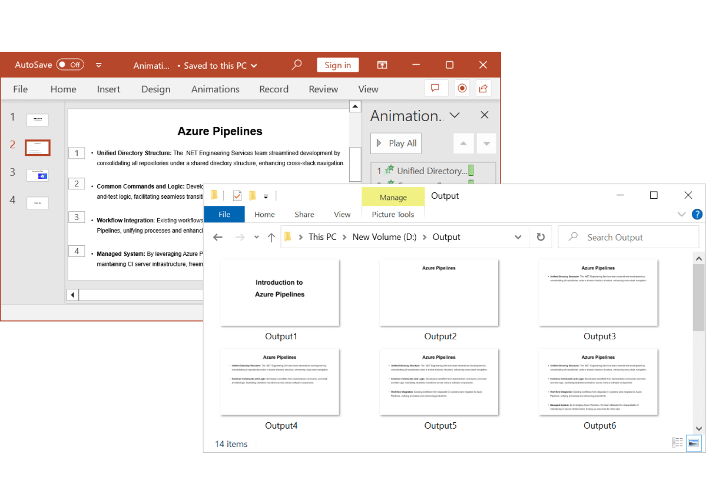

# Convert PowerPoint to Image using Syncfusion&reg; PowerPoint library

Syncfusion&reg; PowerPoint library (Presentation) allows you to convert PowerPoint Presentation document to Image within a few lines of code in .NET applications and also it does not require Microsoft PowerPoint application to be installed in the machine. Using this, you can create an input PowerPoint Presentation document from scratch or load an existing PowerPoint Presentation document and then easily convert to Image.

The Syncfusion&reg; PowerPoint to Image converter offers high versatility and seamless performance across various .NET platforms, including [Windows Forms](https://help.syncfusion.com/document-processing/powerpoint/conversions/powerpoint-to-image/net/convert-powerpoint-to-image-in-windows-forms), [WPF](https://help.syncfusion.com/document-processing/powerpoint/conversions/powerpoint-to-image/net/convert-powerpoint-to-image-in-wpf), [ASP.NET](https://help.syncfusion.com/document-processing/powerpoint/conversions/powerpoint-to-image/net/convert-powerpoint-to-image-in-asp-net), [ASP.NET MVC](https://help.syncfusion.com/document-processing/powerpoint/conversions/powerpoint-to-image/net/convert-powerpoint-to-image-in-asp-net-mvc), [ASP.NET Core](https://help.syncfusion.com/document-processing/powerpoint/conversions/powerpoint-to-image/net/convert-powerpoint-to-image-in-asp-net-core), [Blazor](https://help.syncfusion.com/document-processing/powerpoint/conversions/powerpoint-to-image/net/convert-powerpoint-to-image-in-blazor), [Xamarin](https://help.syncfusion.com/document-processing/powerpoint/conversions/powerpoint-to-image/net/convert-powerpoint-to-image-in-xamarin), [WinUI](https://help.syncfusion.com/document-processing/powerpoint/conversions/powerpoint-to-image/net/convert-powerpoint-to-image-in-winui), [.NET MAUI](https://help.syncfusion.com/document-processing/powerpoint/conversions/powerpoint-to-image/net/convert-powerpoint-to-image-in-maui). Also, in different environments like [Azure](https://help.syncfusion.com/document-processing/powerpoint/conversions/powerpoint-to-image/net/convert-powerpoint-to-image-in-azure), [AWS](https://help.syncfusion.com/document-processing/powerpoint/conversions/powerpoint-to-image/net/convert-powerpoint-to-image-in-aws), [Google Cloud](https://help.syncfusion.com/document-processing/powerpoint/conversions/powerpoint-to-image/net/convert-powerpoint-to-image-in-google-cloud-platform), [Linux](https://help.syncfusion.com/document-processing/powerpoint/conversions/powerpoint-to-image/net/convert-powerpoint-to-image-in-linux), and [macOS](https://help.syncfusion.com/document-processing/powerpoint/conversions/powerpoint-to-image/net/convert-powerpoint-to-image-in-mac). 

## Key Features

* Ability to convert [entire PowerPoint Presentation document to images](https://help.syncfusion.com/document-processing/powerpoint/conversions/powerpoint-to-image/net/presentation-to-image#convert-powerpoint-presentation-to-images).
* Support to convert [specific slide](https://help.syncfusion.com/document-processing/powerpoint/conversions/powerpoint-to-image/net/presentation-to-image#convert-a-slide-to-image) of PowerPoint Presentation document to image.
* Set [fallback fonts](https://help.syncfusion.com/document-processing/powerpoint/conversions/powerpoint-to-image/net/fallback-fonts-in-pptxtoimage-conversion) for characters when glyphs are not available.
* Support for [font substitution](https://help.syncfusion.com/document-processing/powerpoint/conversions/powerpoint-to-image/net/font-substitution-in-pptxtoimage-conversion) when fonts are not available during PowerPoint to image conversion.

## Assemblies and NuGet packages required

Refer to the following links for assemblies required based on platforms to convert the PowerPoint document to image.

* [PowerPoint to image conversion assemblies](https://help.syncfusion.com/document-processing/powerpoint/conversions/powerpoint-to-image/net/assembly-required-for-pptxtoimage-conversion)
* [PowerPoint to image conversion NuGet packages](https://help.syncfusion.com/document-processing/powerpoint/conversions/powerpoint-to-image/net/nuget-packages-required-for-pptxtoimage-conversion)

To quickly start converting a PowerPoint Presentation to an Image using .NET PowerPoint library, please check out this video:


## Convert PowerPoint to Image

The following namespaces are required to compile the code in this topic.




using Syncfusion.Presentation;
using Syncfusion.PresentationRenderer;
using System.IO;



using Syncfusion.Presentation;
using Syncfusion.OfficeChartToImageConverter;
using System.IO;
using Syncfusion.Drawing;



Imports Syncfusion.Presentation
Imports Syncfusion.OfficeChartToImageConverter
Imports Syncfusion.Drawing
Imports System.IO




### Convert PowerPoint Presentation to Images

The following code example demonstrates the conversion of an entire Presentation to images.




//Open the PowerPoint file stream.
using (FileStream fileStream = new FileStream("Sample.pptx", FileMode.Open, FileAccess.Read))
{
   //Open the existing PowerPoint presentation.
   using (IPresentation pptxDoc = Presentation.Open(fileStream))
   {
       //Initialize PresentationRenderer.
       pptxDoc.PresentationRenderer = new PresentationRenderer();
       //Convert the PowerPoint presentation as image streams.
       Stream[] images = pptxDoc.RenderAsImages(ExportImageFormat.Jpeg);
       //Save the image streams to file.
       for (int i = 0; i < images.Length; i++)
       {
           using (Stream stream = images[i])
           {
               using (FileStream fileStreamOutput = File.Create("Output" + i + ".jpg")))
               {
                   stream.CopyTo(fileStreamOutput);
               }
           }
       }
   }
}



//Loads the PowerPoint Presentation
IPresentation pptxDoc = Presentation.Open("Sample.pptx");
//Creates instance of ChartToImageConverter
pptxDoc.ChartToImageConverter = new ChartToImageConverter();
//Sets the scaling mode as best
pptxDoc.ChartToImageConverter.ScalingMode = Syncfusion.OfficeChart.ScalingMode.Best;
//Converts entire Presentation to images
Image[] images = pptxDoc.RenderAsImages(Syncfusion.Drawing.ImageType.Metafile);
//Save the image streams to file.
for (int i = 0; i < images.Length; i++)
{ 
    images[i].Save("Output" + i + ".png");
}



'Loads the PowerPoint Presentation
Dim pptxDoc As IPresentation = Presentation.Open("Sample.pptx")
'Creates instance of ChartToImageConverter
pptxDoc.ChartToImageConverter = New ChartToImageConverter()
'Sets the scaling mode as best
pptxDoc.ChartToImageConverter.ScalingMode = Syncfusion.OfficeChart.ScalingMode.Best
'Converts entire Presentation to images
Dim images As Image() = pptxDoc.RenderAsImages(Syncfusion.Drawing.ImageType.Metafile)
'Save the image streams to file.
For i As Integer = 0 To images.Length - 1
    images(i).Save("ImageOutput" & i & ".png")
Next




You can download a complete working sample from [GitHub](https://github.com/SyncfusionExamples/PowerPoint-Examples/tree/master/PPTX-to-Image-conversion/Convert-PowerPoint-presentation-to-Image).

### Convert a Slide to Image

T> When converting a slide to image, use 'Metafile' format for good image resolution.

The following code example demonstrates how to convert a slide to image.




//Namespaces to perform PPTX to Image conversion
using Syncfusion.Presentation;
using Syncfusion.PresentationRenderer;
using System.IO;

//Open the existing PowerPoint presentation with stream.
using (IPresentation pptxDoc = Presentation.Open(fileStreamInput))
{
    //Initialize PresentationRenderer.
    pptxDoc.PresentationRenderer = new PresentationRenderer();
    //Convert the PowerPoint slide as an image stream.
    using (Stream stream = pptxDoc.Slides[0].ConvertToImage(ExportImageFormat.Jpeg))
    {
        //Save the image stream to a file.
        using (FileStream fileStreamOutput = File.Create("Output.jpg"))
        {
            stream.CopyTo(fileStreamOutput);
        }
    }
}



//Namespaces to perform PPTX to Image conversion
using Syncfusion.Presentation;
using Syncfusion.OfficeChartToImageConverter;
using System.IO;
using Syncfusion.Drawing;

//Opens a PowerPoint Presentation file
IPresentation pptxDoc = Presentation.Open(fileName);
//Creates an instance of ChartToImageConverter
pptxDoc.ChartToImageConverter = new ChartToImageConverter();
//Sets the scaling mode as best
pptxDoc.ChartToImageConverter.ScalingMode = Syncfusion.OfficeChart.ScalingMode.Best;
//Converts the first slide into image
Image image = pptxDoc.Slides[0].ConvertToImage(Syncfusion.Drawing.ImageType.Metafile);
//Saves the image as file
image.Save("slide1.png");
//Disposes the image
image.Dispose();
//Closes the Presentation instance
pptxDoc.Close();



'Namespaces to perform PPTX to Image conversion
Imports Syncfusion.Presentation
Imports Syncfusion.OfficeChartToImageConverter
Imports Syncfusion.Drawing
Imports System.IO

'Opens a PowerPoint Presentation file
Dim pptxDoc As IPresentation = Presentation.Open(fileName)
'Creates an instance of ChartToImageConverter
pptxDoc.ChartToImageConverter = New ChartToImageConverter()
'Sets the scaling mode as best
pptxDoc.ChartToImageConverter.ScalingMode = Syncfusion.OfficeChart.ScalingMode.Best
'Converts the first slide into image
Dim image As Image = pptxDoc.Slides(0).ConvertToImage(Syncfusion.Drawing.ImageType.Metafile)
'Saves the image as file
image.Save("slide1.png")
'Disposes the image
image.Dispose()
'Closes the Presentation instance
Presentation_1.Close()




You can download a complete working sample from [GitHub](https://github.com/SyncfusionExamples/PowerPoint-Examples/tree/master/PPTX-to-Image-conversion/Convert-PowerPoint-slide-to-Image/.NET).

## Supported image formats in .NET Framework

The supported image formats are listed as follows.

* BMP
* EMF
* JPG
* JPEG
* PNG

## Image resolution

The following code snippet demonstrates how to convert a PowerPoint slide to image using custom image resolution.




//Loads the PowerPoint presentation
IPresentation pptxDoc = Presentation.Open("Output.pptx");
//Declare variables to hold custom width and height
int customWidth = 1500;
int customHeight = 1000;
//Converts the slide as image and returns the image stream
Stream stream = pptxDoc.Slides[0].ConvertToImage(Syncfusion.Drawing.ImageFormat.Emf);
//Creates a bitmap of specific width and height
Bitmap bitmap = new Bitmap(customWidth, customHeight, PixelFormat.Format32bppPArgb);
//Gets the graphics from image
Graphics graphics = Graphics.FromImage(bitmap);
//Sets the resolution
bitmap.SetResolution(graphics.DpiX, graphics.DpiY);
//Recreates the image in custom size
graphics.DrawImage(System.Drawing.Image.FromStream(stream), new Rectangle(0, 0, bitmap.Width, bitmap.Height));
//Saves the image as bitmap 
bitmap.Save("ImageOutput" + Guid.NewGuid().ToString() + ".jpeg");
//Closes the presentation
pptxDoc.Close();



'Loads the PowerPoint presentation
Dim pptxDoc As IPresentation = Presentation.Open("Output.pptx")
'Declare variables to hold custom width and height
Dim customWidth As Integer = 1500
Dim customHeight As Integer = 1000
'Converts the slide as image and returns the image stream
Dim stream As Stream = pptxDoc.Slides(0).ConvertToImage(Syncfusion.Drawing.ImageFormat.Emf)
'Creates a bitmap of specific width and height
Dim bitmap As New Bitmap(customWidth, customHeight, PixelFormat.Format32bppPArgb)
'Gets the graphics from image
Dim imageGraphics As Graphics = Graphics.FromImage(bitmap)
'Sets the resolution
bitmap.SetResolution(imageGraphics.DpiX, imageGraphics.DpiY)
'Recreates the image in custom size
imageGraphics.DrawImage(System.Drawing.Image.FromStream(stream), New Rectangle(0, 0, bitmap.Width, bitmap.Height))
'Saves the image as bitmap
bitmap.Save("ImageOutput" + Guid.NewGuid().ToString() + ".jpeg")
'Closes the presentation
pptxDoc.Close()




You can download a complete working sample from [GitHub](https://github.com/SyncfusionExamples/PowerPoint-Examples/tree/master/PPTX-to-Image-conversion/Change-resolution-of-converted-image).

## Convert PowerPoint Animations to Images

The .NET PowerPoint Library (Presentation) allows you to convert PowerPoint slides into images based on the sequence of entrance animation effects applied to each element.

For instance, if a slide includes bulleted paragraphs, each having entrance animation effects, the Presentation library converts every bulleted paragraph into a separate image.

N> 1. Only entrance animation effects are considered for generating separate images. Other animation effects and non-animated elements will be converted into images within the first image itself.
N> 2. Converting PowerPoint animations to images is not supported in the UWP platform. 

The following code example shows how to convert PowerPoint slides to images based on the sequence of animation effects using the [PresentationAnimationConverter](https://help.syncfusion.com/cr/document-processing/Syncfusion.Presentation.PresentationAnimationConverter.html) API.




//Open a PowerPoint Presentation.
IPresentation pptxDoc = Presentation.Open("Input.pptx");

//Initialize the PresentationAnimationConverter to perform slide to image conversion based on animation order.
using (PresentationAnimationConverter animationConverter = new PresentationAnimationConverter())
{
    int i = 0;
    foreach (ISlide slide in pptxDoc.Slides)
    {
        //Convert the PowerPoint slide to a series of images based on entrance animation effects.
        Stream[] imageStreams = animationConverter.Convert(slide, ExportImageFormat.Png);

        //Save the image stream.
        foreach (Stream stream in imageStreams)
        {
            i++;
            //Reset the stream position.
            stream.Position = 0;

            //Create the output image file stream.
            using (FileStream fileStreamOutput = File.Create("Output" + i + ".png"))
            {
                //Copy the converted image stream into created output stream.
                stream.CopyTo(fileStreamOutput);
            }
        }
    }
}



//Open a PowerPoint Presentation.
IPresentation pptxDoc = Presentation.Open("Input.pptx");

//Initialize the PresentationAnimationConverter to perform slide to image conversion based on animation order.
using (PresentationAnimationConverter animationConverter = new PresentationAnimationConverter())
{
    int i = 0;
    foreach (ISlide slide in pptxDoc.Slides)
    {
        //Convert the PowerPoint slide to a series of images based on entrance animation effects.
        Stream[] imageStreams = animationConverter.Convert(slide, Syncfusion.Drawing.ImageFormat.Png);

        //Save the image stream.
        foreach (Stream stream in imageStreams)
        {
            i++;
            //Reset the stream position.
            stream.Position = 0;

            //Create the output image file stream.
            using (FileStream fileStreamOutput = File.Create("Output" + i + ".png"))
            {
                //Copy the converted image stream into created output stream.
                stream.CopyTo(fileStreamOutput);
            }
        }
    }
}



' Open a PowerPoint Presentation.
Dim pptxDoc As IPresentation = Presentation.Open("Input.pptx")

' Initialize the PresentationAnimationConverter to perform slide to image conversion based on animation order.
Using animationConverter As New PresentationAnimationConverter()
    Dim i As Integer = 0
    For Each slide As ISlide In pptxDoc.Slides
        ' Convert the PowerPoint slide to a series of images based on entrance animation effects.
        Dim imageStreams As Stream() = animationConverter.Convert(slide, Syncfusion.Drawing.ImageFormat.Png)

        ' Save the image stream.
        For Each stream As Stream In imageStreams
            i += 1
            ' Reset the stream position.
            stream.Position = 0

            ' Create the output image file stream.
            Using fileStreamOutput As FileStream = File.Create("Output" & i & ".png")
                ' Copy the converted image stream into created output stream.
                stream.CopyTo(fileStreamOutput)
            End Using
        Next
    Next
End Using




You can download a complete working sample from [GitHub](https://github.com/SyncfusionExamples/PowerPoint-Examples/tree/master/PPTX-to-Image-conversion/Based-on-Entrance-animation-effects/.NET).

T> With this, you can showcase the converted images as a slideshow in your [custom PowerPoint Viewer](https://ej2.syncfusion.com/aspnetcore/PowerPoint/AnimationConverter#/material).

## UWP

PowerPoint slides can be converted to images in UWP platform by using Essential&reg; Presentation library. For further information, click [here](https://help.syncfusion.com/document-processing/powerpoint/conversions/powerpoint-to-image/net/pptxtoimage-in-uwp).

## Font Substitution

When a font used in a PowerPoint presentation is unavailable in the environment where it is converted to image, then the library substitutes the ‘Microsoft Sans Serif’ as a default font for text rendering. This leads to a difference in text layouts of PowerPoint presentation and the converted image. 

To avoid this, the Essential&reg; Presentation library allows you to set an alternate font for the missing font used in the PowerPoint presentation. For further information, click [here](https://help.syncfusion.com/document-processing/powerpoint/conversions/powerpoint-to-image/net/font-substitution-in-pptxtoimage-conversion).

## Fallback fonts

During PowerPoint to Image conversions, if a glyph of the input text is unavailable in the specified font, the text will not be rendered properly. To address this, the Syncfusion&reg; PowerPoint (Presentation) library allows users to specify fallback fonts. When a glyph is missing, the library will use one of the fallback fonts to render the text correctly in the output image. For further information, click [here](https://help.syncfusion.com/document-processing/powerpoint/conversions/powerpoint-to-image/net/fallback-fonts-in-pptxtoimage-conversion).

## Online Demo

* Explore how to convert the PowerPoint presentation to an image using the .NET PowerPoint Library (Presentation) in a live demo [here](https://ej2.syncfusion.com/aspnetcore/powerpoint/pptxtoimage#/bootstrap5).

## See Also

* [How to convert PPTX to Image in Blazor WebAssembly (WASM)?](https://support.syncfusion.com/kb/article/12122/how-to-convert-pptx-to-image-in-blazor-webassembly-wasm)
* [How custom resolution supported in WinForms PowerPoint slide to image conversion?](https://support.syncfusion.com/kb/article/6685/how-custom-resolution-supported-in-winforms-powerpoint-slide-to-image-conversion)
* [How to convert and replace EMF image to PNG with same size during PowerPoint to PDF conversion?](https://support.syncfusion.com/kb/article/15641/how-to-convert-and-replace-emf-image-to-png-with-same-size-during-powerpoint-to-pdf-conversion)