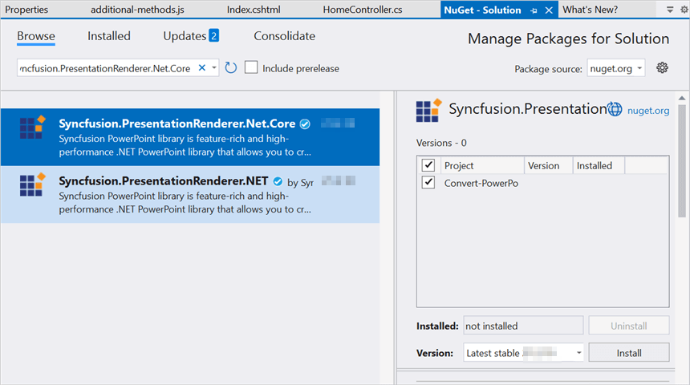
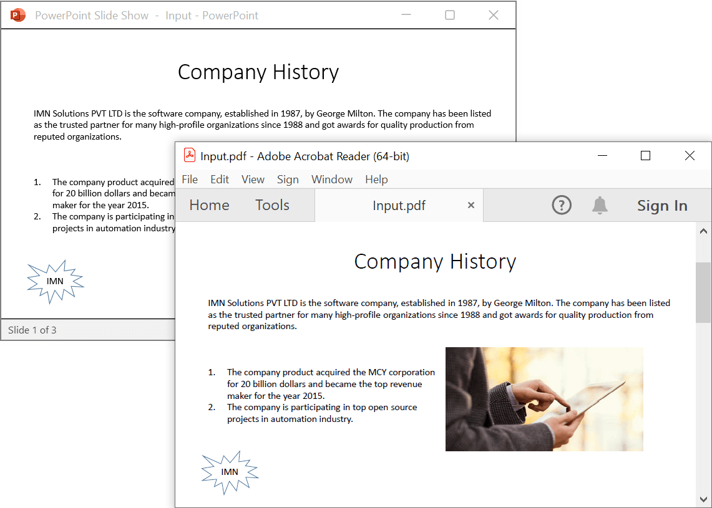

# Convert PowerPoint to PDF in ASP.NET Core

Syncfusion<sup>&reg;</sup> PowerPoint is a [.NET Core PowerPoint library](https://www.syncfusion.com/document-processing/powerpoint-framework/net-core) used to create, read, edit and **convert PowerPoint presentation** programmatically without **Microsoft PowerPoint** or interop dependencies. Using this library, you can **convert a PowerPoint to PDF in ASP.NET Core**.

**Prerequisites:**





* Visual Studio 2019 Preview or later
* Install [.NET 8 SDK](https://dotnet.microsoft.com/en-us/download/dotnet/8.0) or later.
  




* Visual Studio Code
* Install [.NET 8 SDK](https://dotnet.microsoft.com/en-us/download/dotnet/8.0) or later.
* Open Visual Studio Code and install the [C# for Visual Studio Code extension](https://marketplace.visualstudio.com/items?itemName=ms-dotnettools.csharp) from the Extensions Marketplace.
  




## Steps to convert PowerPoint to PDF programmatically





Step 1: Create a new C# ASP.NET Core web application project.


Step 2: Install the [Syncfusion.PresentationRenderer.Net.Core](https://www.nuget.org/packages/Syncfusion.PresentationRenderer.Net.Core) NuGet package as reference to your .NET Standard applications from [NuGet.org](https://www.nuget.org/).




 



Step 1: Create a new ASP.NET Core Web application project using the command palette.
1. Open the command palette by pressing `Ctrl+Shift+P` and type **.NET:New Project** and enter.
2. Choose the **ASP.NET Core Web App( Model-View-Controller) MVC** template.
3. Select the project location, type the project name and press enter.
4. Then choose **Create project**.

Alternatively, use the following command in the terminal(<kbd>Ctrl</kbd>+<kbd>`</kbd>).

```
dotnet new mvc -n Convert-PowerPoint-presentation-to-PDF
```

Run the following command to navigate to the project directory.

```
cd Convert-PowerPoint-presentation-to-PDF
```

Step 2: Run the following command to install [Syncfusion.PresentationRenderer.Net.Core](https://www.nuget.org/packages/Syncfusion.PresentationRenderer.Net.Core) to the .NET MAUI project.

```
dotnet add package Syncfusion.PresentationRenderer.Net.Core
```


 


N> Starting with v16.2.0.x, if you reference Syncfusion<sup>&reg;</sup> assemblies from trial setup or from the NuGet feed, you also have to add "Syncfusion.Licensing" assembly reference and include a license key in your projects. Please refer to this [link](https://help.syncfusion.com/common/essential-studio/licensing/overview) to know about registering Syncfusion<sup>&reg;</sup> license key in your application to use our components.
Step 3: Include the following namespaces in **HomeController.cs**.




using Syncfusion.Presentation;
using Syncfusion.PresentationRenderer;
using Syncfusion.Pdf;




Step 4: A default action method named Index will be present in **HomeController.cs**. Right click on Index method and select **Go To View** where you will be directed to its associated view page **Index.cshtml**.

Step 5: Add a new button in the **Index.cshtml** as shown below.




@{
    Html.BeginForm("ConvertPPTXtoPDF", "Home", FormMethod.Get);
    {
        <div>
            <input type="submit" value="Convert PPTX to PDF" style="width:200px;height:27px" />
        </div>
    }
    Html.EndForm();
}




Step 6: Add a new action method **ConvertPPTXtoPDF** in HomeController.cs and include the below code snippet to **convert a PowerPoint to PDF in ASP.NET Core**.




//Open the file as Stream
using (FileStream fileStream = new FileStream(Path.GetFullPath("Data/Input.pptx"), FileMode.Open, FileAccess.Read))
{
    //Open the existing PowerPoint presentation with loaded stream.
    using (IPresentation pptxDoc = Presentation.Open(fileStream))
    {
        //Convert the PowerPoint presentation to PDF document.
        using (PdfDocument pdfDocument = PresentationToPdfConverter.Convert(pptxDoc))
        {
            //Create the MemoryStream to save the converted PDF.      
            MemoryStream pdfStream = new MemoryStream();
            //Save the converted PDF document to MemoryStream.
            pdfDocument.Save(pdfStream);
            pdfStream.Position = 0;
            //Download PDF document in the browser.
            return File(pdfStream, "application/pdf", "Sample.pdf");
        }
    }
}




Step 7: Build the project.





Click on Build → Build Solution or press Ctrl + Shift + B to build the project.


 


Run the following command in terminal to build the project.

```
dotnet build
```


 


Step 8: Run the project.





Click the Start button (green arrow) or press F5 to run the app.





Run the following command in terminal to build the project.

```
dotnet run
```




You can download a complete working sample from [GitHub](https://github.com/SyncfusionExamples/PowerPoint-Examples/tree/master/PPTX-to-PDF-conversion/Convert-PowerPoint-presentation-to-PDF/ASP.NET-Core).

By executing the program, you will get the **PDF document** as follows.



Click [here](https://www.syncfusion.com/document-processing/powerpoint-framework/net-core) to explore the rich set of Syncfusion<sup>&reg;</sup> PowerPoint Library (Presentation) features. 

An online sample link to [convert PowerPoint Presentation to PDF](https://ej2.syncfusion.com/aspnetcore/PowerPoint/PPTXToPDF#/material3) in ASP.NET Core. 
