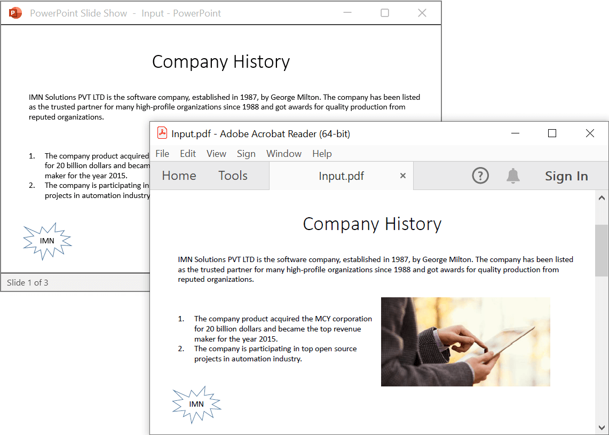
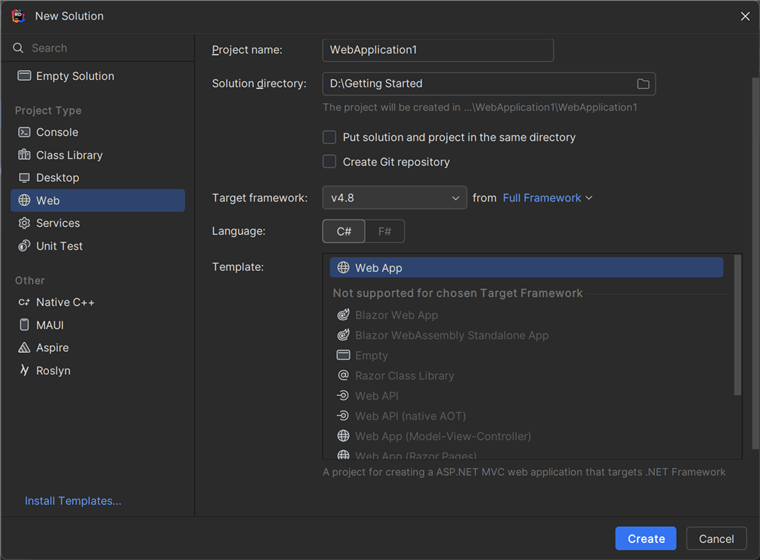

# Convert PowerPoint to PDF in ASP.NET MVC

Syncfusion&reg; PowerPoint is a [.NET PowerPoint library](https://www.syncfusion.com/document-processing/powerpoint-framework/net) used to create, read, edit and convert PowerPoint presentation programmatically without **Microsoft PowerPoint** or interop dependencies. Using this library, you can **convert a PowerPoint to PDF in ASP.NET MVC**.

## Steps to convert PowerPoint to PDF programmatically





**Prerequisites:**

* Visual Studio 2022.
* Install **.NET desktop development** workload with necessary .NET Framework SDK.

Step 1: Create a new C# ASP.NET MVC application project.

Step 2: Select the **MVC** template to create the project.

Step 3: Install the [Syncfusion.PresentationToPdfConverter.AspNet.Mvc5](https://www.nuget.org/packages/Syncfusion.PresentationToPdfConverter.AspNet.Mvc5) NuGet package as reference to your .NET Standard applications from [NuGet.org](https://www.nuget.org/).

N> Starting with v16.2.0.x, if you reference Syncfusion&reg; assemblies from trial setup or from the NuGet feed, you also have to add "Syncfusion.Licensing" assembly reference and include a license key in your projects. Please refer to this [link](https://help.syncfusion.com/common/essential-studio/licensing/overview) to know about registering Syncfusion&reg; license key in your application to use our components.

Step 4: Include the following namespace in that **HomeController.cs** file.




using Syncfusion.Presentation;
using Syncfusion.PresentationToPdfConverter;
using Syncfusion.Pdf;




Step 5: A default action method named **Index** will be present in HomeController.cs. Right click on this action method and select **Go To View** where you will be directed to its associated view page **Index.cshtml**.

Step 6: Add a new button in the Index.cshtml as shown below.




@{
    Html.BeginForm("ConvertPPTXtoPDF", "Home", FormMethod.Get);
    {
         
        

            <input type="submit" value="Convert PPTX to PDF" style="width:200px;height:27px" />
        

    }
    Html.EndForm();
}




Step 7: Add a new action method **ConvertPPTXtoPDF** in HomeController.cs and include the below code snippet to **convert a PowerPoint to PDF in ASP.NET MVC**.




//Open the file as Stream
using (FileStream pathStream = new FileStream(Server.MapPath("~/App_Data/Input.pptx"), FileMode.Open, FileAccess.Read))
{
    //Opens a PowerPoint Presentation
    using (IPresentation pptxDoc = Presentation.Open(pathStream))
    {     
        //Converts the PowerPoint Presentation into PDF document
        using (PdfDocument pdfDocument = PresentationToPdfConverter.Convert(pptxDoc))
        {
            //Saves the PDF document to MemoryStream.
            MemoryStream stream = new MemoryStream();
            pdfDocument.Save(stream);
            stream.Position = 0;
            //Download PDF document in the browser.
            return File(stream, "application/pdf", "Sample.pdf");
        }                    
    }
}




Step 8: Build the project.

Click on Build → Build Solution or press <kbd>Ctrl</kbd>+<kbd>Shift</kbd>+<kbd>B</kbd> to build the project.

Step 9: Run the project.

Click the Start button (green arrow) or press <kbd>F5</kbd> to run the app.

You can download a complete working sample from [GitHub](https://github.com/SyncfusionExamples/PowerPoint-Examples/tree/master/PPTX-to-PDF-conversion/Convert-PowerPoint-presentation-to-PDF/ASP.NET-MVC)

By executing the program, you will get the **PDF** as follows.





**Prerequisites:**

* JetBrains Rider.
* Install .NET Framework Developer Pack.

Step 1. Open JetBrains Rider and create a new ASP.NET MVC web application project.
* Launch JetBrains Rider.
* Click **New Solution** on the welcome screen.

* In the New Solution dialog, select **Project Type** as **Web**.
* Enter a project name and specify the location.
* Select the target framework as Full Framework and choose the desired version.
* Select **Template** as **Web App**.
* Click create.

Step 2: Install the NuGet package from [NuGet.org](https://www.nuget.org/).
* Click the NuGet icon in the Rider toolbar and type [Syncfusion.PresentationToPdfConverter.AspNet.Mvc5](https://www.nuget.org/packages/Syncfusion.PresentationToPdfConverter.AspNet.Mvc5/) in the search bar.
* Ensure that nuget.org is selected as the package source.
* Select the latest Syncfusion.PresentationToPdfConverter.AspNet.Mvc5 NuGet package from the list.
* Click the + (Add) button to add the package.

* Click the Install button to complete the installation.

N> Starting with v16.2.0.x, if you reference Syncfusion assemblies from trial setup or from the NuGet feed, you also have to add "Syncfusion.Licensing" assembly reference and include a license key in your projects. Please refer to this [link](https://help.syncfusion.com/common/essential-studio/licensing/overview) to know about registering Syncfusion license key in your application to use our components.

Step 3: Include the following namespace in that **HomeController.cs** file.




using Syncfusion.Presentation;
using Syncfusion.PresentationToPdfConverter;
using Syncfusion.Pdf;




Step 4: A default action method named **Index** will be present in HomeController.cs. Right click on this action method and select **Go To View** where you will be directed to its associated view page **Index.cshtml**.

Step 5: Add a new button in the Index.cshtml as shown below.




@{
    Html.BeginForm("ConvertPPTXtoPDF", "Home", FormMethod.Get);
    {
         
        

            <input type="submit" value="Convert PPTX to PDF" style="width:200px;height:27px" />
        

    }
    Html.EndForm();
}




Step 6: Add a new action method **ConvertPPTXtoPDF** in HomeController.cs and include the below code snippet to **convert a PowerPoint to PDF in ASP.NET MVC**.




//Open the file as Stream
using (FileStream pathStream = new FileStream(Server.MapPath("~/App_Data/Input.pptx"), FileMode.Open, FileAccess.Read))
{
    //Opens a PowerPoint Presentation
    using (IPresentation pptxDoc = Presentation.Open(pathStream))
    {     
        //Converts the PowerPoint Presentation into PDF document
        using (PdfDocument pdfDocument = PresentationToPdfConverter.Convert(pptxDoc))
        {
            //Saves the PDF document to MemoryStream.
            MemoryStream stream = new MemoryStream();
            pdfDocument.Save(stream);
            stream.Position = 0;
            //Download PDF document in the browser.
            return File(stream, "application/pdf", "Sample.pdf");
        }                    
    }
}




Step 7: Build the project.

Click the **Build** button in the toolbar or press <kbd>Ctrl</kbd>+<kbd>Shift</kbd>+<kbd>B</kbd> to build the project.

Step 8: Run the project.

Click the **Run** button (green arrow) in the toolbar or press <kbd>F5</kbd> to run the app.

You can download a complete working sample from [GitHub](https://github.com/SyncfusionExamples/PowerPoint-Examples/tree/master/PPTX-to-PDF-conversion/Convert-PowerPoint-presentation-to-PDF/ASP.NET-MVC)

By executing the program, you will get the **PDF** as follows.





Click [here](https://www.syncfusion.com/document-processing/powerpoint-framework/net) to explore the rich set of Syncfusion&reg; PowerPoint Library (Presentation) features. 