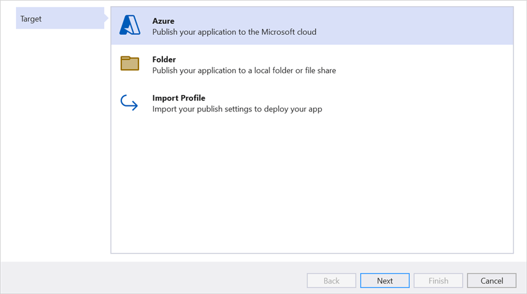
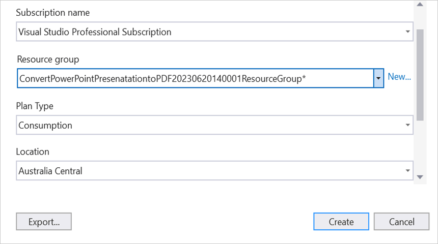

# Convert PowerPoint Presentation to PDF in Azure Functions v4

Syncfusion PowerPoint is a [.NET Core PowerPoint library](https://www.syncfusion.com/document-processing/powerpoint-framework/net-core) used to create, read, edit and **convert PowerPoint documents** programmatically without **Microsoft PowerPoint** or interop dependencies. Using this library, you can **convert a PowerPoint Presentation to PDF in Azure Functions v4**.

## Steps to convert a PowerPoint Presentation to PDF in Azure Functions v4

Step 1: Create a new Azure Functions project.

Step 2: Create a project name and select the location.

Step 3: Select function worker as **.NET 6.0 (Long Term Support)**. 

Step 4: Install the [Syncfusion.PresentationRenderer.Net.Core](https://www.nuget.org/packages/Syncfusion.PresentationRenderer.Net.Core) NuGet package as a reference to your project from [NuGet.org](https://www.nuget.org/).

N> Starting with v16.2.0.x, if you reference Syncfusion assemblies from trial setup or from the NuGet feed, you also have to add "Syncfusion.Licensing" assembly reference and include a license key in your projects. Please refer to this [link](https://help.syncfusion.com/common/essential-studio/licensing/overview) to know about registering Syncfusion license key in your application to use our components.

Step 4: Include the following namespaces in the **Function1.cs** file.



using Syncfusion.Presentation;
using Syncfusion.PresentationRenderer;
using Syncfusion.Pdf;




Step 5: Add the following code snippet in **Run** method of **Function1** class to perform **PowerPoint Presentation to PDF conversion** in Azure Functions and return the resultant **PDF document** to client end.




//Gets the input PowerPoint document as stream from request.
Stream stream = req.Content.ReadAsStreamAsync().Result;
//Loads an existing PowerPoint document
using (IPresentation pptxDoc = Presentation.Open(stream))
{
    //Creates an instance of the DocToPDFConverter.
    using (PdfDocument pdfDocument = PresentationToPdfConverter.Convert(pptxDoc))
    {
        MemoryStream memoryStream = new MemoryStream();
        //Saves the PDF file .
        pdfDocument.Save(memoryStream);
        //Reset the memory stream position.
        memoryStream.Position = 0;
        //Create the response to return.
        HttpResponseMessage response = new HttpResponseMessage(HttpStatusCode.OK);
        //Set the PDF document saved stream as content of response.
        response.Content = new ByteArrayContent(memoryStream.ToArray());
        //Set the contentDisposition as attachment.
        response.Content.Headers.ContentDisposition = new ContentDispositionHeaderValue("attachment")
        {
            FileName = "Sample.Pdf"
        };
        //Set the content type as PDF document mime type.
        response.Content.Headers.ContentType = new System.Net.Http.Headers.MediaTypeHeaderValue("application/pdf");
        //Return the response with output PDF document stream.
        return response;
    }
}



Step 6: Right click the project and select **Publish**. Then, create a new profile in the Publish Window.

Step 7: Select the target as **Azure** and click **Next** button.

Step 8: Select the **Create new** button.

Step 9: Click **Create** button. 

Step 10: After creating app service then click **Finish** button. 

Step 11: Click the **Publish** button.

Step 12: Publish has been succeed.

Step 13: Now, go to Azure portal and select the App Services. After running the service, click **Get function URL by copying it**. Then, paste it in the below client sample (which will request the Azure Functions, to perform **PowerPoint Presentation to PDF conversion** using the template PowerPoint document). You will get the output PDF document as follows.

## Steps to post the request to Azure Functions

Step 1: Create a console application to request the Azure Functions API.

Step 2: Add the following code snippet into **Main** method to post the request to Azure Functions with template PowerPoint document and get the resultant PDF document.




//Reads the template PowerPoint document.
FileStream fs = new FileStream("Input.pptx", FileMode.Open, FileAccess.ReadWrite, FileShare.ReadWrite);
fs.Position = 0;
//Saves the PowerPoint document in memory stream.
MemoryStream inputStream = new MemoryStream();
fs.CopyTo(inputStream);
inputStream.Position = 0;
try
{
    Console.WriteLine("Please enter your Azure Functions URL :");
    string functionURL = Console.ReadLine();
    //Create HttpWebRequest with hosted azure functions URL.                
    HttpWebRequest req = (HttpWebRequest)WebRequest.Create(functionURL);
    //Set request method as POST.
    req.Method = "POST";
    //Get the request stream to save the PowerPoint document stream
    Stream stream = req.GetRequestStream();
    //Write the PowerPoint document stream into request stream.
    stream.Write(inputStream.ToArray(), 0, inputStream.ToArray().Length);
    //Gets the responce from the Azure Functions.
    HttpWebResponse res = (HttpWebResponse)req.GetResponse();
    //Saves the PDF stream.
    FileStream fileStream = File.Create("Sample.pdf");
    res.GetResponseStream().CopyTo(fileStream);
    //Dispose the streams.
    inputStream.Dispose();
    fileStream.Dispose();
}
catch (Exception ex)
{
    throw;
}




From GitHub, you can download the [console application](https://github.com/SyncfusionExamples/PowerPoint-Examples/tree/master/PPTX-to-PDF-conversion/Convert-PowerPoint-presentation-to-PDF/Azure/Azure_Functions/Console_Application) and [Azure Functions v4](https://github.com/SyncfusionExamples/PowerPoint-Examples/tree/master/PPTX-to-PDF-conversion/Convert-PowerPoint-presentation-to-PDF/Azure/Azure_Functions/Azure_Functions_v4).

Click [here](https://www.syncfusion.com/document-processing/powerpoint-framework/net-core) to explore the rich set of Syncfusion PowerPoint Library (Presentation) features. 

An online sample link to [convert PowerPoint Presentation to PDF](https://ej2.syncfusion.com/aspnetcore/PowerPoint/PPTXToPDF#/material3) in ASP.NET Core. 

