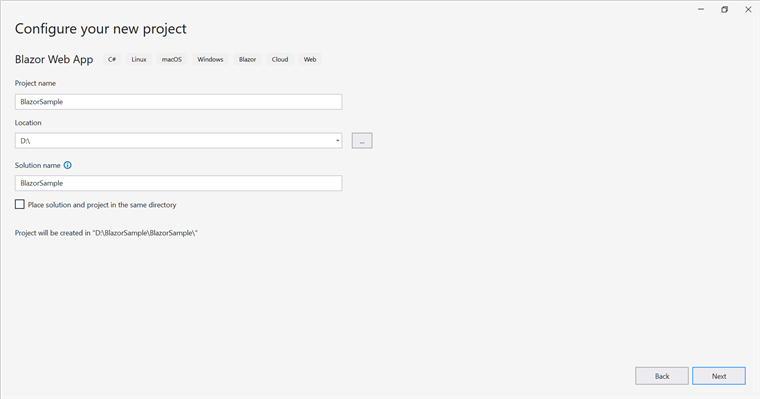
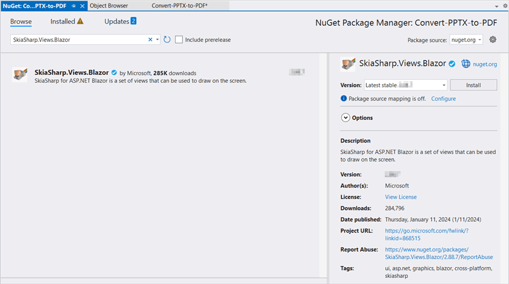

# Convert PowerPoint to PDF in Blazor

Syncfusion&reg; PowerPoint is a [.NET Core PowerPoint library](https://www.syncfusion.com/document-processing/powerpoint-framework/net-core) used to create, read, edit and convert PowerPoint presentation programmatically without **Microsoft PowerPoint** or interop dependencies. Using this library, a  **convert a PowerPoint to PDF in Blazor**.

## Blazor Web App Server Application

**Prerequisites:**

*   Visual Studio 2022.
*   Install [.NET 8 SDK](https://dotnet.microsoft.com/en-us/download/dotnet/8.0) or later.

Step 1: Create a new C# Blazor Web app project.
*   Select "Blazor Web App" from the template and click **Next**.

*   Name the project and click **Next**.

*   Select the framework and click **Create** button.

Step 2: Install the `Syncfusion.PresentationRenderer.Net.Core` NuGet package.
To convert a **PowerPoint presentation to PDF in a Web App Server**, install the [Syncfusion.PresentationRenderer.Net.Core](https://www.nuget.org/packages/Syncfusion.PresentationRenderer.Net.Core) NuGet package as reference to the project from [NuGet.org](https://www.nuget.org/).

N> 1. If you're deploying the application in a Linux environment, refer to the [documentation](https://help.syncfusion.com/document-processing/powerpoint/conversions/powerpoint-to-pdf/net/nuget-packages-required-for-pptxtopdf-conversion#additional-nuget-packages-required-for-linux) for the required additional NuGet packages.
N> 2. Starting with v16.2.0.x, if Syncfusion&reg; assemblies are referenced from trial setup or from the NuGet feed, the "Syncfusion.Licensing" assembly reference must also be added and a license key included in projects. Please refer to this [link](https://help.syncfusion.com/common/essential-studio/licensing/overview) to know about registering Syncfusion&reg; license key in an application to use Syncfusion components.

Step 3: Create a Razor file named `Presentation.razor` in the `Pages` folder, which is located inside the `Components` folder.
Add the following namespaces in the file.




@rendermode InteractiveServer
@page "/Presentation"
@using System.IO;
@using Convert_PowerPoint_Presentation_to_PDF;
@inject Convert_PowerPoint_Presentation_to_PDF.Data.PowerPointService service
@inject Microsoft.JSInterop.IJSRuntime JS




Step 4: Add a button to `Presentation.razor`.
Include the following code to create a new button that triggers the PowerPoint to PDF conversion:




<h2>Syncfusion PowerPoint Library (Essential Presentation)</h2>

The Syncfusion Blazor PowerPoint library (Essential Presentation) used to create, read, edit, and convert PowerPoint files in applications without Microsoft Office dependencies.

<button class="btn btn-primary" @onclick="@ConvertPPTXtoPDF">Convert PPTX to PDF</button>




Step 5: Implement the method in `Presentation.razor`.
Add the following code to **convert PowerPoint to PDF** and download the **PDF document**.



@code {
    MemoryStream documentStream;
    /// 

    /// Download the PDF document.
    /// 

    protected async void ConvertPPTXtoPDF()
    {
        documentStream = service.ConvertPPTXtoPDF();
        await JS.SaveAs("Sample.pdf", documentStream.ToArray());
    }
}




Step 6: Create a new cs file `PowerPointService` in the `Data` folder.
Include the following namespaces in the file.




using Syncfusion.Presentation;
using Syncfusion.PresentationRenderer;
using Syncfusion.Pdf;




Step 7: Implement the method in `PowerPointService.cs`.
Create a new `MemoryStream` method in the `PowerPointService` and include the following code snippet to **convert a PowerPoint to PDF in Blazor Web App Server**.




// Open the file as Stream
using (FileStream sourceStreamPath = new FileStream(@"wwwroot/Input.pptx", FileMode.Open, FileAccess.Read, FileShare.ReadWrite))
{
    // Open the existing PowerPoint presentation with loaded stream.
    using (IPresentation pptxDoc = Presentation.Open(sourceStreamPath))
    {
        // Convert the PowerPoint presentation to PDF document.
        using (PdfDocument pdfDocument = PresentationToPdfConverter.Convert(pptxDoc))
        {
            // Create the MemoryStream to save the converted PDF.      
            MemoryStream pdfStream = new MemoryStream();
            // Save the converted PDF document to MemoryStream.
            pdfDocument.Save(pdfStream);
            pdfStream.Position = 0;

            // Download PDF document in the browser.
            return pdfStream;
        }
    }
} 




Step 8: Add the service in `Program.cs`. 
Add the following line to the `Program.cs` file to register `PowerPointService` as a scoped service in your Blazor application.




builder.Services.AddScoped<Convert_PowerPoint_Presentation_to_PDF.Data.PowerPointService>();



            
Step 9: Create `FileUtils.cs` for JavaScript interoperability.
Create a new class file named `FileUtils` in the project and add the following code to invoke the JavaScript action for file download in the browser.




public static class FileUtils
{
    public static ValueTask<object> SaveAs(this IJSRuntime js, string filename, byte[] data)
        => js.InvokeAsync<object>(
            "saveAsFile",
            filename,
            Convert.ToBase64String(data));
}




Step 10: Add the following JavaScript function to `App.razor`.
Add this function in the `App.razor` file located in the `Pages` folder.







Step 11: Add the navigation link.
Add the following code snippet to the Navigation menu's Razor file in the `Layout` folder.





 

    <NavLink class="nav-link" href="presentation">
         Generate Presentation
    </NavLink>





Step 12: Build the project.

Click on **Build** → **Build Solution** or press <kbd>Ctrl</kbd>+<kbd>Shift</kbd>+<kbd>B</kbd> to build the project.

Step 13: Run the project.

Click the Start button (green arrow) or press <kbd>F5</kbd> to run the application.

A complete working sample is available on [GitHub](https://github.com/SyncfusionExamples/PowerPoint-Examples/tree/master/PPTX-to-PDF-conversion/Convert-PowerPoint-presentation-to-PDF/Blazor/Blazor-Web-App-Server).

Upon executing the program, the **PDF** will be generated as follows.

Click [here](https://www.syncfusion.com/document-processing/powerpoint-framework/blazor) to explore the rich set of Syncfusion PowerPoint Library (Presentation) features. 

## WASM Standalone Application

**Prerequisites:**

*   Visual Studio 2022.
*   Install [.NET 8 SDK](https://dotnet.microsoft.com/en-us/download/dotnet/8.0) or later.

Step 1: Create a new C# Blazor WASM Standalone app project.
Select "Blazor WebAssembly Standalone App" from the template and click the Next button.

Step 2: Install the following **Nuget packages** in the application from [Nuget.org](https://www.nuget.org/).

*  [Syncfusion.PresentationRenderer.Net.Core](https://www.nuget.org/packages/Syncfusion.PresentationRenderer.Net.Core) 
*  [SkiaSharp.Views.Blazor v3.116.1](https://www.nuget.org/packages/SkiaSharp.Views.Blazor/3.116.1)

N> 1. If you're deploying the application in a Linux environment, refer to the [documentation](https://help.syncfusion.com/document-processing/powerpoint/conversions/powerpoint-to-pdf/net/nuget-packages-required-for-pptxtopdf-conversion#additional-nuget-packages-required-for-linux) for the required additional NuGet packages.
N> 2. Starting with v16.2.0.x, if Syncfusion&reg; assemblies are referenced from trial setup or from the NuGet feed, the "Syncfusion.Licensing" assembly reference must also be added and a license key included in projects. Please refer to this [link](https://help.syncfusion.com/common/essential-studio/licensing/overview) to know about registering Syncfusion&reg; license key in an application to use Syncfusion components.
N> 3. Install this wasm-tools and wasm-tools-net6 by using the "dotnet workload install wasm-tools" and "dotnet workload install wasm-tools-net6" commands in your command prompt respectively if you are facing issues related to Skiasharp during runtime. After installing wasm tools using the above commands, please restart your machine.

Step 3: Create a Razor file named `Presentation.razor` in the `Pages` folder.
Add the following namespaces in the file.





@page "/presentation"
@inject Microsoft.JSInterop.IJSRuntime JS
@inject HttpClient client
@using System.IO
@using Syncfusion.Presentation
@using Syncfusion.PresentationRenderer
@using Syncfusion.Pdf




Step 4: Add a button to `Presentation.razor`.
Include the following code to create a new button that triggers the PowerPoint to PDF conversion:




<h2>Syncfusion PowerPoint Library (Essential Presentation)</h2>

The Syncfusion Blazor PowerPoint library (Essential Presentation) used to create, read, edit, and convert PowerPoint files in applications without Microsoft Office dependencies.

<button class="btn btn-primary" @onclick="@PPTXToPDF">Convert PPTX to PDF</button>




Step 5: Implement `PPTXToPDF` method in `Presentation.razor`.
Create a new `async` method named `PPTXToPDF` and include the following code snippet to **convert a PowerPoint to PDF in Blazor WASM Standalone app**.




//Input data file is inside the wwwroot folder.
using (Stream inputStream = await client.GetStreamAsync("sample-data/Input.pptx"))
{
    //Open an existing PowerPoint Presentation file.
    using (IPresentation pptxDoc = Syncfusion.Presentation.Presentation.Open(inputStream))
    {
        //Convert PowerPoint into PDF document.
        using (PdfDocument pdfDocument = PresentationToPdfConverter.Convert(pptxDoc))
        {
            //Save the PDF document to MemoryStream.
            using (MemoryStream outputStream = new MemoryStream())
            {
                pdfDocument.Save(outputStream);
                outputStream.Position = 0;
                //Download PDF file in the browser.
                await JS.SaveAs("Output.pdf", outputStream.ToArray());
            }
        }
    }
}




Step 6: Create `FileUtils.cs` for JavaScript interoperability.
Create a new class file named `FileUtils` in the project and add the following code to invoke the JavaScript action for file download in the browser.




public static class FileUtils
{
    public static ValueTask<object> SaveAs(this IJSRuntime js, string filename, byte[] data)
         => js.InvokeAsync<object>(
            "saveAsFile",
            filename,
            Convert.ToBase64String(data));
}




Step 7: Add the following JavaScript function to `index.html`.
Add this function in the `index.html` file located in `wwwroot`.







Step 8: Add the navigation link.
Add the following code snippet to the Navigation menu's Razor file in the `Layout` folder.





 

    <NavLink class="nav-link" href="presentation">
         Generate Presentation
    </NavLink>





Step 9: Build the project.

Click on **Build** → **Build Solution** or press <kbd>Ctrl</kbd>+<kbd>Shift</kbd>+<kbd>B</kbd> to build the project.

Step 10: Run the project.

Click the Start button (green arrow) or press <kbd>F5</kbd> to run the application.

A complete working sample is available on [GitHub](https://github.com/SyncfusionExamples/PowerPoint-Examples/tree/master/PPTX-to-PDF-conversion/Convert-PowerPoint-presentation-to-PDF/Blazor/WASM-Standalone-app).

Upon executing the program, the **PDF** will be generated as follows.

N> Even though PowerPoint library works in WASM Standalone app, server-side deployment is recommended. WASM Standalone app deployment increases the application payload size.

Click [here](https://www.syncfusion.com/document-processing/powerpoint-framework/blazor) to explore the rich set of Syncfusion&reg; PowerPoint Library (Presentation) features. 

