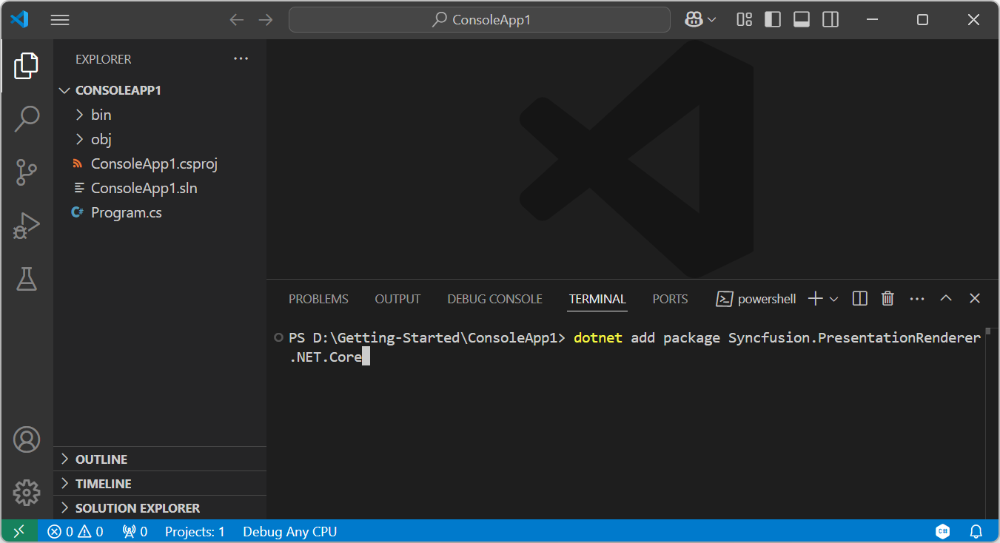
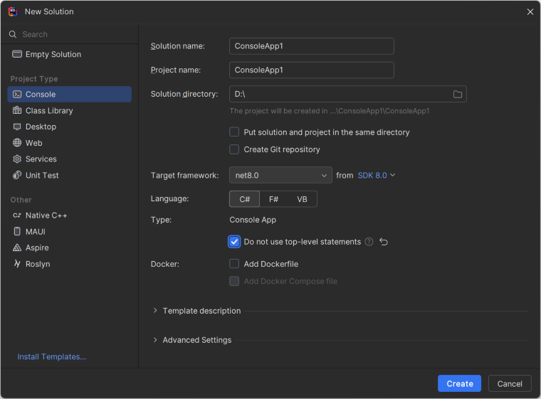
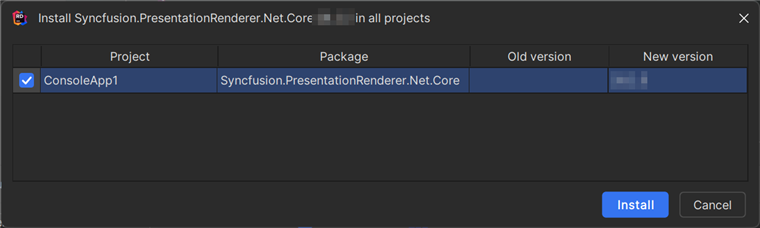
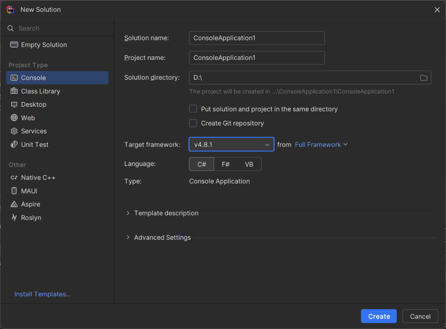

# Convert PowerPoint to PDF in Console application

Syncfusion<sup>&reg;</sup> PowerPoint is a [.NET PowerPoint library](https://www.syncfusion.com/document-processing/powerpoint-framework/net) used to create, read, edit and **convert PowerPoint presentation** programmatically without **Microsoft PowerPoint** or interop dependencies. Using this library, you can **convert a PowerPoint to PDF in Console application**.

## Convert PowerPoint to PDF using .NET Core and Latest





**Prerequisites:**

* Visual Studio 2022.
* Install [.NET 8 SDK](https://dotnet.microsoft.com/en-us/download/dotnet/8.0) or later.

Step 1: Create a new **.NET Core console application** project.


Step 2: Install the [Syncfusion.PresentationRenderer.Net.Core](https://www.nuget.org/packages/Syncfusion.PresentationRenderer.Net.Core) NuGet package as a reference to your project from [NuGet.org](https://www.nuget.org/).


N> Starting with v16.2.0.x, if you reference Syncfusion<sup>&reg;</sup> assemblies from trial setup or from the NuGet feed, you also have to add "Syncfusion.Licensing" assembly reference and include a license key in your projects. Please refer to this [link](https://help.syncfusion.com/common/essential-studio/licensing/overview) to know about registering Syncfusion<sup>&reg;</sup> license key in your application to use our components.

Step 3: Include the following namespaces in **Program.cs** file.




using Syncfusion.Presentation;
using Syncfusion.PresentationRenderer;
using Syncfusion.Pdf;




Step 4: Include the below code snippet in **Program.cs** to **convert PowerPoint to PDF**.




//Open the file as Stream.
using (FileStream fileStream = new FileStream(Path.GetFullPath("Data/Input.pptx"), FileMode.Open, FileAccess.Read))
{
    //Open the existing PowerPoint presentation with loaded stream.
    using (IPresentation pptxDoc = Presentation.Open(fileStream))
    {
        //Convert the PowerPoint presentation to PDF document.
        using (PdfDocument pdfDocument = PresentationToPdfConverter.Convert(pptxDoc))
        {
            //Save the converted PDF.      
            using(FileStream pdfStream = new FileStream("Sample.pdf", FileMode.Create, FileAccess.Write))
            {
                pdfDocument.Save(pdfStream);
            }           
        }
    }
}




Step 6: Build the project.

Click on Build → Build Solution or press <kbd>Ctrl</kbd>+<kbd>Shift</kbd>+<kbd>B</kbd> to build the project.

Step 7: Run the project.

Click the Start button (green arrow) or press <kbd>F5</kbd> to run the app.

You can download a complete working sample from [GitHub](https://github.com/SyncfusionExamples/PowerPoint-Examples/tree/master/PPTX-to-PDF-conversion/Convert-PowerPoint-presentation-to-PDF/.NET).

By executing the program, you will get the **PDF** as follows.



 


**Prerequisites:**

* Visual Studio Code.
* Install [.NET 8 SDK](https://dotnet.microsoft.com/en-us/download/dotnet/8.0) or later.
* Open Visual Studio Code and install the [C# for Visual Studio Code extension](https://marketplace.visualstudio.com/items?itemName=ms-dotnettools.csharp) from the Extensions Marketplace.

Step 1: Create a new .NET Core console application project.
* Open the command palette by pressing <kbd>Ctrl</kbd>+<kbd>Shift</kbd>+<kbd>P</kbd> and type **.NET:New Project** and enter.
* Choose the **Console App** template.


* Select the project location, type the project name and press enter.
* Then choose **Create project**.

Step 2: To **convert a PowerPoint document to PDF in console app**, install [Syncfusion.PresentationRenderer.Net.Core](https://www.nuget.org/packages/Syncfusion.PresentationRenderer.Net.Core) to the project.
* Press <kbd>Ctrl</kbd> + <kbd>`</kbd> (backtick) to open the integrated terminal in Visual Studio Code.
* Ensure you're in the project root directory where your .csproj file is located.
* Run the command `dotnet add package Syncfusion.PresentationRenderer.NET.Core` to install the NuGet package.

 

N> Starting with v16.2.0.x, if you reference Syncfusion<sup>&reg;</sup> assemblies from trial setup or from the NuGet feed, you also have to add "Syncfusion.Licensing" assembly reference and include a license key in your projects. Please refer to this [link](https://help.syncfusion.com/common/essential-studio/licensing/overview) to know about registering Syncfusion<sup>&reg;</sup> license key in your application to use our components.

Step 3: Include the following namespaces in **Program.cs** file.




using Syncfusion.Presentation;
using Syncfusion.PresentationRenderer;
using Syncfusion.Pdf;




Step 4: Include the below code snippet in **Program.cs** to **convert PowerPoint to PDF**.




//Open the file as Stream.
using (FileStream fileStream = new FileStream(Path.GetFullPath("Data/Input.pptx"), FileMode.Open, FileAccess.Read))
{
    //Open the existing PowerPoint presentation with loaded stream.
    using (IPresentation pptxDoc = Presentation.Open(fileStream))
    {
        //Convert the PowerPoint presentation to PDF document.
        using (PdfDocument pdfDocument = PresentationToPdfConverter.Convert(pptxDoc))
        {
            //Save the converted PDF.      
            using(FileStream pdfStream = new FileStream("Sample.pdf", FileMode.Create, FileAccess.Write))
            {
                pdfDocument.Save(pdfStream);
            }           
        }
    }
}




Step 5: Build the project.

Run the following command in terminal to build the project.

```
dotnet build
```

Step 6: Run the project.

Run the following command in terminal to run the project.

```
dotnet run
```

You can download a complete working sample from [GitHub](https://github.com/SyncfusionExamples/PowerPoint-Examples/tree/master/PPTX-to-PDF-conversion/Convert-PowerPoint-presentation-to-PDF/.NET).

By executing the program, you will get the **PDF** as follows.






**Prerequisites:**

* JetBrains Rider.
* Install .NET 8 SDK or later.

Step 1. Open JetBrains Rider and create a new .NET Core console application project.
* Launch JetBrains Rider.
* Click new solution on the welcome screen.


* In the new Solution dialog, select Project Type as Console.
* Enter a project name and specify the location.
* Select the target framework (e.g., .NET 8.0, .NET 9.0).
* Click create.



Step 2: Install the NuGet package from [NuGet.org](https://www.nuget.org/).
* Click the NuGet icon in the Rider toolbar and type [Syncfusion.PresentationRenderer.Net.Core](https://www.nuget.org/packages/Syncfusion.PresentationRenderer.Net.Core) in the search bar.
* Ensure that "nuget.org" is selected as the package source.
* Select the latest Syncfusion.PresentationRenderer.Net.Core NuGet package from the list.
* Click the + (Add) button to add the package.


* Click the Install button to complete the installation.



N> Starting with v16.2.0.x, if you reference Syncfusion assemblies from trial setup or from the NuGet feed, you also have to add "Syncfusion.Licensing" assembly reference and include a license key in your projects. Please refer to this [link](https://help.syncfusion.com/common/essential-studio/licensing/overview) to know about registering Syncfusion license key in your application to use our components.

Step 3: Include the following namespaces in **Program.cs** file.




using Syncfusion.Presentation;
using Syncfusion.PresentationRenderer;
using Syncfusion.Pdf;




Step 4: Include the below code snippet in **Program.cs** to **convert PowerPoint to PDF**.




//Open the file as Stream.
using (FileStream fileStream = new FileStream(Path.GetFullPath("Data/Input.pptx"), FileMode.Open, FileAccess.Read))
{
    //Open the existing PowerPoint presentation with loaded stream.
    using (IPresentation pptxDoc = Presentation.Open(fileStream))
    {
        //Convert the PowerPoint presentation to PDF document.
        using (PdfDocument pdfDocument = PresentationToPdfConverter.Convert(pptxDoc))
        {
            //Save the converted PDF.      
            using(FileStream pdfStream = new FileStream("Sample.pdf", FileMode.Create, FileAccess.Write))
            {
                pdfDocument.Save(pdfStream);
            }           
        }
    }
}




Step 5: Build the project.

Click the **Build** button in the toolbar or press <kbd>Ctrl</kbd>+<kbd>Shift</kbd>+<kbd>B</kbd> to build the project.

Step 6: Run the project.

Click the **Run** button (green arrow) in the toolbar or press <kbd>F5</kbd> to run the app.

You can download a complete working sample from [GitHub](https://github.com/SyncfusionExamples/PowerPoint-Examples/tree/master/PPTX-to-PDF-conversion/Convert-PowerPoint-presentation-to-PDF/.NET).

By executing the program, you will get the **PDF** as follows.






## Convert PowerPoint to PDF in .NET Framework





**Prerequisites:**

* Visual Studio 2022.
* Install **.NET desktop development** workload with necessary .NET Framework SDK.

Step 1: Create a new **.NET FrameWork console application** project.


Step 2: Install [Syncfusion.PresentationToPdfConverter.WinForms](https://www.nuget.org/packages/Syncfusion.PresentationToPdfConverter.WinForms) NuGet package as a reference to your Windows Forms application from the [NuGet.org](https://www.nuget.org/).


N> 1. The [Syncfusion.PresentationToPdfConverter.WinForms](https://www.nuget.org/packages/Syncfusion.DocToPDFConverter.WinForms) is a dependency for Syncfusion<sup>&reg;</sup> Windows Forms GUI controls and is named with the suffix "WinForms". It contains platform-independent .NET Framework assemblies (compatible with versions 4.0, 4.5, 4.5.1, and 4.6) for the PowerPoint library and does not include any Windows Forms-related references or code. Therefore, we recommend using this package for .NET Framework Console applications.
N> 2. Starting with v16.2.0.x, if you reference Syncfusion<sup>&reg;</sup> assemblies from trial setup or from the NuGet feed, you also have to add "Syncfusion.Licensing" assembly reference and include a license key in your projects. Please refer to this [link](https://help.syncfusion.com/common/essential-studio/licensing/overview) to know about registering Syncfusion<sup>&reg;</sup> license key in your application to use our components.

Step 3: Include the following namespaces in **Program.cs** file.




using Syncfusion.Pdf;
using Syncfusion.Presentation;
using Syncfusion.PresentationToPdfConverter;




Step 4: Include the below code snippet in **Program.cs** to **convert PowerPoint to PDF**.




//Open a PowerPoint Presentation.
using (IPresentation pptxDoc = Presentation.Open("Data/Input.pptx"))
{
    //Convert the PowerPoint Presentation into PDF document.
    using (PdfDocument pdfDocument = PresentationToPdfConverter.Convert(pptxDoc))
    {
        //Save the PDF document.
        pdfDocument.Save("Sample.pdf");
    }
}




Step 5: Build the project.

Click on Build → Build Solution or press <kbd>Ctrl</kbd>+<kbd>Shift</kbd>+<kbd>B</kbd> to build the project.

Step 6: Run the project.

Click the Start button (green arrow) or press <kbd>F5</kbd> to run the app.

You can download a complete working sample from [GitHub](https://github.com/SyncfusionExamples/PowerPoint-Examples/tree/master/PPTX-to-PDF-conversion/Convert-PowerPoint-presentation-to-PDF/.NET-FrameWork).

By executing the program, you will get the **PDF** as follows.






**Prerequisites:**

* JetBrains Rider.
* Install .NET Framework Developer Pack.

Step 1. Open JetBrains Rider and create a new .NET Framework console application project.
* Launch JetBrains Rider.
* Click new solution on the welcome screen.


* In the new Solution dialog, select Project Type as Console.
* Enter a project name and specify the location.
* Select the target framework as Full Framework and choose the desired version.
* Click create.



Step 2: Install the NuGet package from [NuGet.org](https://www.nuget.org/).
* Click the NuGet icon in the Rider toolbar and type [Syncfusion.PresentationToPdfConverter.WinForms](https://www.nuget.org/packages/Syncfusion.PresentationToPdfConverter.WinForms/) in the search bar.
* Ensure that "nuget.org" is selected as the package source.
* Select the latest Syncfusion.PresentationToPdfConverter.WinForms NuGet package from the list.
* Click the + (Add) button to add the package.


* Click the Install button to complete the installation.


N> Starting with v16.2.0.x, if you reference Syncfusion assemblies from trial setup or from the NuGet feed, you also have to add "Syncfusion.Licensing" assembly reference and include a license key in your projects. Please refer to this [link](https://help.syncfusion.com/common/essential-studio/licensing/overview) to know about registering Syncfusion license key in your application to use our components.

Step 3: Include the following namespaces in **Program.cs** file.




using Syncfusion.Pdf;
using Syncfusion.Presentation;
using Syncfusion.PresentationToPdfConverter;




Step 4: Include the below code snippet in **Program.cs** to **convert PowerPoint to PDF**.




//Open a PowerPoint Presentation.
using (IPresentation pptxDoc = Presentation.Open("Data/Input.pptx"))
{
    //Convert the PowerPoint Presentation into PDF document.
    using (PdfDocument pdfDocument = PresentationToPdfConverter.Convert(pptxDoc))
    {
        //Save the PDF document.
        pdfDocument.Save("Sample.pdf");
    }
}




Step 5: Build the project.

Click the **Build** button in the toolbar or press <kbd>Ctrl</kbd>+<kbd>Shift</kbd>+<kbd>B</kbd> to build the project.

Step 6: Run the project.

Click the **Run** button (green arrow) in the toolbar or press <kbd>F5</kbd> to run the app.

You can download a complete working sample from [GitHub](https://github.com/SyncfusionExamples/PowerPoint-Examples/tree/master/PPTX-to-PDF-conversion/Convert-PowerPoint-presentation-to-PDF/.NET-FrameWork).

By executing the program, you will get the **PDF** as follows.



 
