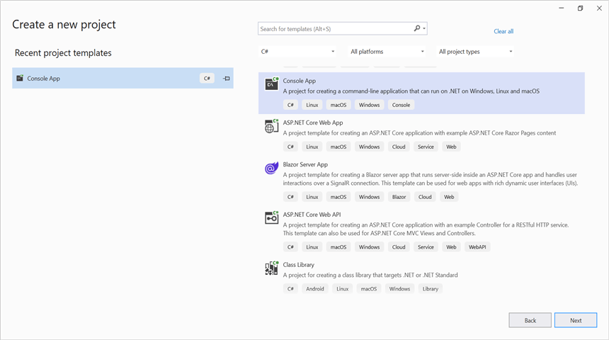

# Convert PowerPoint to PDF in Console application

Syncfusion<sup>&reg;</sup> PowerPoint is a [.NET PowerPoint library](https://www.syncfusion.com/document-processing/powerpoint-framework/net) used to create, read, edit and **convert PowerPoint presentation** programmatically without **Microsoft PowerPoint** or interop dependencies. Using this library, you can **convert a PowerPoint to PDF in Console application**.

## Convert PowerPoint to PDF using .NET Core and Latest


**Prerequisites:**





* Visual Studio 2019 Preview or later.
* Install [.NET 8 SDK](https://dotnet.microsoft.com/en-us/download/dotnet/8.0) or later.





* Visual Studio Code.
* Install [.NET 8 SDK](https://dotnet.microsoft.com/en-us/download/dotnet/8.0) or later.
* Open Visual Studio Code and install the [C# for Visual Studio Code extension](https://marketplace.visualstudio.com/items?itemName=ms-dotnettools.csharp) from the Extensions Marketplace.





The below steps illustrates **convert PowerPoint to PDF** in console application using **.NET Core**.

Step 1: Create a new **.NET Core console application** project.


Step 2: Install the [Syncfusion.PresentationRenderer.Net.Core](https://www.nuget.org/packages/Syncfusion.PresentationRenderer.Net.Core) NuGet package as a reference to your project from [NuGet.org](https://www.nuget.org/).






 



Step 1: Create a new .NET Core console application project using the command palette
1. Open the command palette by pressing `Ctrl+Shift+P` and type **.NET:New Project** and enter.
2. Choose the **Console App** template.
3. Select the project location, type the project name and press enter.
4. Then choose **Create project**.

Alternatively, use the following command in the terminal(<kbd>Ctrl</kbd>+<kbd>`</kbd>).

```
dotnet new console -n Convert-PowerPoint-presentation-to-PDF
```

Run the following command to navigate to the project directory.

```
cd Convert-PowerPoint-presentation-to-PDF
```

Step 2: Run the following command to install [Syncfusion.PresentationRenderer.Net.Core](https://www.nuget.org/packages/Syncfusion.PresentationRenderer.Net.Core) to the console project.

```
dotnet add package Syncfusion.PresentationRenderer.NET.Core
```


 


N> Starting with v16.2.0.x, if you reference Syncfusion<sup>&reg;</sup> assemblies from trial setup or from the NuGet feed, you also have to add "Syncfusion.Licensing" assembly reference and include a license key in your projects. Please refer to this [link](https://help.syncfusion.com/common/essential-studio/licensing/overview) to know about registering Syncfusion<sup>&reg;</sup> license key in your application to use our components.

Step 3: Include the following namespaces in **Program.cs** file.




using Syncfusion.Presentation;
using Syncfusion.PresentationRenderer;
using Syncfusion.Pdf;




Step 4: Include the below code snippet in **Program.cs** to **convert PowerPoint to PDF**.




//Open the file as Stream.
using (FileStream fileStream = new FileStream(Path.GetFullPath("Data/Input.pptx"), FileMode.Open, FileAccess.Read))
{
    //Open the existing PowerPoint presentation with loaded stream.
    using (IPresentation pptxDoc = Presentation.Open(fileStream))
    {
        //Convert the PowerPoint presentation to PDF document.
        using (PdfDocument pdfDocument = PresentationToPdfConverter.Convert(pptxDoc))
        {
            //Save the converted PDF.      
            using(FileStream pdfStream = new FileStream("Sample.pdf", FileMode.Create, FileAccess.Write))
            {
                pdfDocument.Save(pdfStream);
            }           
        }
    }
}




Step 5: Build the project.





Click on Build → Build Solution or press Ctrl + Shift + B to build the project.


 


Run the following command in terminal to build the project.

```
dotnet build
```


 


Step 6: Run the project.





Click the Start button (green arrow) or press F5 to run the app.





Run the following command in terminal to build the project.

```
dotnet run
```




You can download a complete working sample from [GitHub](https://github.com/SyncfusionExamples/PowerPoint-Examples/tree/master/PPTX-to-PDF-conversion/Convert-PowerPoint-presentation-to-PDF/.NET).

By executing the program, you will get the **PDF** as follows.


## Convert PowerPoint to PDF in .NET Framework

The below steps illustrates **convert PowerPoint to PDF** in console application using **.NET Framework**.

Step 1: Create a new **.NET FrameWork console application** project.


Step 2: Install [Syncfusion.PresentationToPdfConverter.WinForms](https://www.nuget.org/packages/Syncfusion.PresentationToPdfConverter.WinForms) NuGet package as a reference to your Windows Forms application from the [NuGet.org](https://www.nuget.org/).


N> 1. The [Syncfusion.PresentationToPdfConverter.WinForms](https://www.nuget.org/packages/Syncfusion.DocToPDFConverter.WinForms) is a dependency for Syncfusion<sup>&reg;</sup> Windows Forms GUI controls and is named with the suffix "WinForms". It contains platform-independent .NET Framework assemblies (compatible with versions 4.0, 4.5, 4.5.1, and 4.6) for the PowerPoint library and does not include any Windows Forms-related references or code. Therefore, we recommend using this package for .NET Framework Console applications.
N> 2. Starting with v16.2.0.x, if you reference Syncfusion<sup>&reg;</sup> assemblies from trial setup or from the NuGet feed, you also have to add "Syncfusion.Licensing" assembly reference and include a license key in your projects. Please refer to this [link](https://help.syncfusion.com/common/essential-studio/licensing/overview) to know about registering Syncfusion<sup>&reg;</sup> license key in your application to use our components.

Step 3: Include the following namespaces in **Program.cs** file.




using Syncfusion.Pdf;
using Syncfusion.Presentation;
using Syncfusion.PresentationToPdfConverter;




Step 5: Include the below code snippet in **Program.cs** to **convert PowerPoint to PDF**.




//Open a PowerPoint Presentation.
using (IPresentation pptxDoc = Presentation.Open("Data/Input.pptx"))
{
    //Convert the PowerPoint Presentation into PDF document.
    using (PdfDocument pdfDocument = PresentationToPdfConverter.Convert(pptxDoc))
    {
        //Save the PDF document.
        pdfDocument.Save("Sample.pdf");
    }
}




You can download a complete working sample from [GitHub](https://github.com/SyncfusionExamples/PowerPoint-Examples/tree/master/PPTX-to-PDF-conversion/Convert-PowerPoint-presentation-to-PDF/.NET-FrameWork).

By executing the program, you will get the **PDF** as follows.


