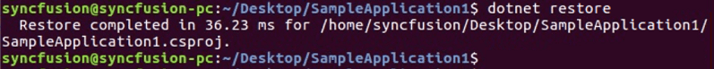
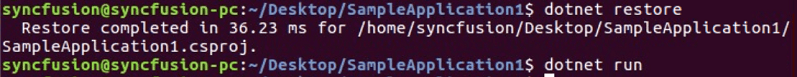
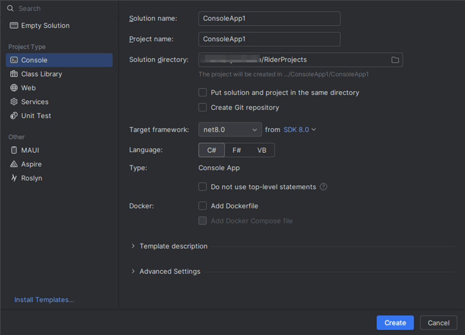
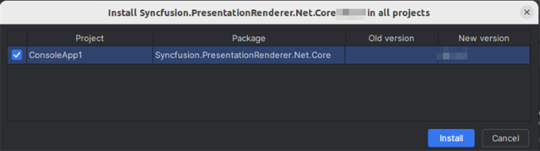

# Convert PowerPoint to PDF in Linux

Syncfusion&reg; PowerPoint is a [.NET Core PowerPoint library](https://www.syncfusion.com/document-processing/powerpoint-framework/net-core) used to create, read, edit and **convert PowerPoint presentation** programmatically without **Microsoft PowerPoint** or interop dependencies. Using this library, you can **convert a PowerPoint to PDF in .NET Core application on Linux**.

## Steps to convert PowerPoint to PDF in .NET Core application on Linux





**Prerequisites:**

* Visual Studio 2022.
* Install [.NET 8 SDK](https://dotnet.microsoft.com/en-us/download/dotnet/8.0) or later.

Step 1: Execute the following command in **Linux terminal** to create a new .NET Core Console application.




dotnet new console




Step 2: Install the following **Nuget packages** in your application from [Nuget.org](https://www.nuget.org/) by execute the following command.

* [Syncfusion.PresentationRenderer.Net.Core](https://www.nuget.org/packages/Syncfusion.PresentationRenderer.Net.Core) 
* [SkiaSharp.NativeAssets.Linux v3.116.1](https://www.nuget.org/packages/SkiaSharp.NativeAssets.Linux/3.116.1)
* [HarfBuzzSharp.NativeAssets.Linux v8.3.0.1](https://www.nuget.org/packages/HarfBuzzSharp.NativeAssets.Linux/8.3.0.1)




dotnet add package Syncfusion.PresentationRenderer.Net.Core -v 22.1.38 -s https://www.nuget.org/
dotnet add package SkiaSharp.NativeAssets.Linux -v 3.116.1 -s https://www.nuget.org/
dotnet add package HarfBuzzSharp.NativeAssets.Linux -v 8.3.0.1 -s https://www.nuget.org/




N> 1. Starting with v16.2.0.x, if you reference Syncfusion&reg; assemblies from trial setup or from the NuGet feed, you also have to add "Syncfusion.Licensing" assembly reference and include a license key in your projects. Please refer to this [link](https://help.syncfusion.com/common/essential-studio/licensing/overview) to know about registering Syncfusion&reg; license key in your applications to use our components.
N> 2. If you are using prior to v23.1.40 release, please refer [here](https://help.syncfusion.com/document-processing/word/word-library/net/faq#what-are-the-nuget-packages-to-be-installed-to-perform-word-to-pdf-conversion-in-linux-os) to know about how to perform Word to PDF conversion in Linux.

Step 3: Add the following Namespaces in **Program.cs** file.




using Syncfusion.Presentation;
using Syncfusion.PresentationRenderer;
using Syncfusion.Pdf;




Step 4: Add the following code snippet in **Program.cs** file.




//Open the file as Stream
using (FileStream fileStreamInput = new FileStream(Path.GetFullPath(@"../../../Data/Input.pptx"), FileMode.Open, FileAccess.Read))
{
    //Open the existing PowerPoint presentation with loaded stream.
    using (IPresentation pptxDoc = Presentation.Open(fileStreamInput))
    {
        //Convert the PowerPoint presentation to PDF document.
        using (PdfDocument pdfDocument = PresentationToPdfConverter.Convert(pptxDoc))
        {
            //Save the converted PDF document to MemoryStream.
            MemoryStream pdfStream = new MemoryStream();
            pdfDocument.Save(pdfStream);
            pdfStream.Position = 0;
            //Create FileStream to save the PDF file.
            using (FileStream outputStream = new FileStream("Sample.pdf", FileMode.Create, FileAccess.ReadWrite, FileShare.ReadWrite))
            {
                //Saves the PDF file.
                pdfDocument.Save(outputStream);
            }
        }
    }
}




Step 5: Execute the following command to **restore** the NuGet packages.




dotnet restore




Step 6: Execute the following command in **terminal** to **run the application**.




dotnet run




You can download a complete working sample from [GitHub](https://github.com/SyncfusionExamples/PowerPoint-Examples/tree/master/PPTX-to-PDF-conversion/Convert-PowerPoint-presentation-to-PDF/Linux).

By executing the program, you will get the **PDF** as follows. The output will be saved in **bin** folder.





**Prerequisites:**

* JetBrains Rider.
* Install .NET 8 SDK or later.

Step 1: Open JetBrains Rider and create a new .NET Core console application project.
* Launch JetBrains Rider.
* Click **New solution** on the welcome screen.

* In the New Solution dialog, select **Project Type** as **Console**.
* Select the target framework (e.g., .NET 8.0, .NET 9.0).
* Enter a project name and specify the location.
* Click create.

Step 2: Install the NuGet package from [NuGet.org](https://www.nuget.org/).
* Click the NuGet icon in the Rider toolbar and type [Syncfusion.PresentationRenderer.Net.Core](https://www.nuget.org/packages/Syncfusion.PresentationRenderer.Net.Core) in the search bar.
* Ensure that nuget.org is selected as the package source.
* Select the latest Syncfusion.PresentationRenderer.Net.Core NuGet package from the list.
* Click the + (Add) button to add the package.

* Click the **Install** button to complete the installation.

N> Starting with v16.2.0.x, if you reference Syncfusion assemblies from trial setup or from the NuGet feed, you also have to add "Syncfusion.Licensing" assembly reference and include a license key in your projects. Please refer to this [link](https://help.syncfusion.com/common/essential-studio/licensing/overview) to know about registering Syncfusion license key in your application to use our components.

Step 3: Add the following Namespaces in **Program.cs** file.




using Syncfusion.Presentation;
using Syncfusion.PresentationRenderer;
using Syncfusion.Pdf;




Step 4: Add the following code snippet in **Program.cs** file.




//Open the file as Stream
using (FileStream fileStreamInput = new FileStream(Path.GetFullPath(@"../../../Data/Input.pptx"), FileMode.Open, FileAccess.Read))
{
    //Open the existing PowerPoint presentation with loaded stream.
    using (IPresentation pptxDoc = Presentation.Open(fileStreamInput))
    {
        //Convert the PowerPoint presentation to PDF document.
        using (PdfDocument pdfDocument = PresentationToPdfConverter.Convert(pptxDoc))
        {
            //Save the converted PDF document to MemoryStream.
            MemoryStream pdfStream = new MemoryStream();
            pdfDocument.Save(pdfStream);
            pdfStream.Position = 0;
            //Create FileStream to save the PDF file.
            using (FileStream outputStream = new FileStream("Sample.pdf", FileMode.Create, FileAccess.ReadWrite, FileShare.ReadWrite))
            {
                //Saves the PDF file.
                pdfDocument.Save(outputStream);
            }
        }
    }
}




Step 5: Build the project.

Click the **Build** button in the toolbar or press <kbd>Ctrl</kbd>+<kbd>Shift</kbd>+<kbd>B</kbd> to build the project.

Step 6: Run the project.

Click the **Run** button (green arrow) in the toolbar or press <kbd>F5</kbd> to run the app.

You can download a complete working sample from [GitHub](https://github.com/SyncfusionExamples/PowerPoint-Examples/tree/master/PPTX-to-PDF-conversion/Convert-PowerPoint-presentation-to-PDF/Linux).

By executing the program, you will get the **PDF** as follows. The output will be saved in **bin** folder.





Click [here](https://www.syncfusion.com/document-processing/powerpoint-framework/net-core) to explore the rich set of Syncfusion&reg; PowerPoint Library (Presentation) features. 

An online sample link to [convert PowerPoint Presentation to PDF](https://ej2aspnetcore.azurewebsites.net/aspnetcore/powerpoint/pptxtopdf#/material3) in ASP.NET Core. 