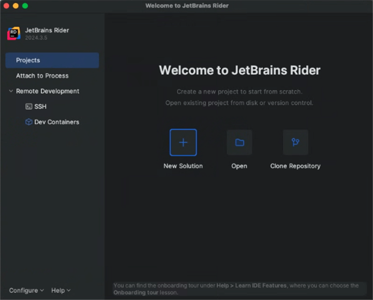

# Convert PowerPoint to PDF on macOS

Syncfusion<sup>&reg;</sup> PowerPoint is a [.NET Core PowerPoint library](https://www.syncfusion.com/document-processing/powerpoint-framework/net-core) used to create, read, edit and convert PowerPoint presentation programmatically without **Microsoft PowerPoint** or interop dependencies. Using this library, you can **convert a PowerPoint to PDF in .NET Core application on macOS**.

## Steps to convert PowerPoint to PDF programmatically





**Prerequisites:**

* Visual Studio 2022.
* Install [.NET 8 SDK](https://dotnet.microsoft.com/en-us/download/dotnet/8.0) or later.

Step 1: Create a new C# .NET Core console application.


Step 2: Select the project version.


Step 3: Install the [Syncfusion.PresentationRenderer.Net.Core](https://www.nuget.org/packages/Syncfusion.PresentationRenderer.Net.Core) NuGet package as reference to your .NET Standard applications from [NuGet.org](https://www.nuget.org/).


N> Starting with v16.2.0.x, if you reference Syncfusion<sup>&reg;</sup> assemblies from trial setup or from the NuGet feed, you also have to add "Syncfusion.Licensing" assembly reference and include a license key in your projects. Please refer to this [link](https://help.syncfusion.com/common/essential-studio/licensing/overview) to know about registering Syncfusion<sup>&reg;</sup> license key in your application to use our components.

Step 4: Include the following Namespaces in the **Program.cs** file.




using Syncfusion.Presentation;
using Syncfusion.PresentationRenderer;
using Syncfusion.Pdf;




Step 5: Add the following code snippet in **Program.cs** file to **convert a PowerPoint to PDF in .NET Core application on macOS**.




//Open the file as Stream
using (FileStream fileStreamInput = new FileStream(Path.GetFullPath(@"../../../Data/Input.pptx"), FileMode.Open, FileAccess.Read))
{
    //Open the existing PowerPoint presentation with loaded stream.
    using (IPresentation pptxDoc = Presentation.Open(fileStreamInput))
    {
        //Convert the PowerPoint presentation to PDF document.
        using (PdfDocument pdfDocument = PresentationToPdfConverter.Convert(pptxDoc))
        {
            //Save the converted PDF document to MemoryStream.
            MemoryStream pdfStream = new MemoryStream();
            pdfDocument.Save(pdfStream);
            pdfStream.Position = 0;
            //Save the stream as file.
            using (FileStream fileStreamOutput = File.Create("Sample.pdf"))
            {
                pdfStream.CopyTo(fileStreamOutput);
            }
        }                         
    }
}




Step 6: Build the project.

Click on Build → Build Solution or press <kbd>Ctrl</kbd>+<kbd>Shift</kbd>+<kbd>B</kbd> to build the project.

Step 7: Run the project.

Click the Start button (green arrow) or press <kbd>F5</kbd> to run the app.

You can download a complete working sample from [GitHub](https://github.com/SyncfusionExamples/PowerPoint-Examples/tree/master/PPTX-to-PDF-conversion/Convert-PowerPoint-presentation-to-PDF/Mac).

By executing the program, you will get the **PDF** as follows.






**Prerequisites:**

* Visual Studio Code.
* Install [.NET 8 SDK](https://dotnet.microsoft.com/en-us/download/dotnet/8.0) or later.
* Open Visual Studio Code and install the [C# for Visual Studio Code extension](https://marketplace.visualstudio.com/items?itemName=ms-dotnettools.csharp) from the Extensions Marketplace.

Step 1: Create a new .NET Core console application project.
* Open the command palette by pressing <kbd>Ctrl</kbd>+<kbd>Shift</kbd>+<kbd>P</kbd> and type **.NET:New Project** and enter.
* Choose the **Console App** template.


* Select the project location, type the project name and press enter.
* Then choose **Create project**.

Step 2: To **convert a PowerPoint document to PDF in console app**, install [Syncfusion.PresentationRenderer.Net.Core](https://www.nuget.org/packages/Syncfusion.PresentationRenderer.Net.Core) to the project.
* Press <kbd>Ctrl</kbd> + <kbd>`</kbd> (backtick) to open the integrated terminal in Visual Studio Code.
* Ensure you're in the project root directory where your .csproj file is located.
* Run the command `dotnet add package Syncfusion.PresentationRenderer.NET.Core` to install the NuGet package.

 

N> Starting with v16.2.0.x, if you reference Syncfusion<sup>&reg;</sup> assemblies from trial setup or from the NuGet feed, you also have to add "Syncfusion.Licensing" assembly reference and include a license key in your projects. Please refer to this [link](https://help.syncfusion.com/common/essential-studio/licensing/overview) to know about registering Syncfusion<sup>&reg;</sup> license key in your application to use our components.

Step 3: Include the following Namespaces in the **Program.cs** file.




using Syncfusion.Presentation;
using Syncfusion.PresentationRenderer;
using Syncfusion.Pdf;




Step 4: Add the following code snippet in **Program.cs** file to **convert a PowerPoint to PDF in .NET Core application on macOS**.




//Open the file as Stream
using (FileStream fileStreamInput = new FileStream(Path.GetFullPath(@"../../../Data/Input.pptx"), FileMode.Open, FileAccess.Read))
{
    //Open the existing PowerPoint presentation with loaded stream.
    using (IPresentation pptxDoc = Presentation.Open(fileStreamInput))
    {
        //Convert the PowerPoint presentation to PDF document.
        using (PdfDocument pdfDocument = PresentationToPdfConverter.Convert(pptxDoc))
        {
            //Save the converted PDF document to MemoryStream.
            MemoryStream pdfStream = new MemoryStream();
            pdfDocument.Save(pdfStream);
            pdfStream.Position = 0;
            //Save the stream as file.
            using (FileStream fileStreamOutput = File.Create("Sample.pdf"))
            {
                pdfStream.CopyTo(fileStreamOutput);
            }
        }                         
    }
}




Step 5: Build the project.

Run the following command in terminal to build the project.

```
dotnet build
```

Step 6: Run the project.

Run the following command in terminal to run the project.

```
dotnet run
```

You can download a complete working sample from [GitHub](https://github.com/SyncfusionExamples/PowerPoint-Examples/tree/master/PPTX-to-PDF-conversion/Convert-PowerPoint-presentation-to-PDF/Mac).

By executing the program, you will get the **PDF** as follows.






**Prerequisites:**

* JetBrains Rider.
* Install .NET 8 SDK or later.

Step 1. Open JetBrains Rider and create a new .NET Core console application project.
* Launch JetBrains Rider.
* Click **New solution** on the welcome screen.



* In the New Solution dialog, select **Project Type** as **Console**.
* Select the target framework (e.g., .NET 8.0, .NET 9.0).
* Enter a project name and specify the location.
* Click create.


Step 2: Install the NuGet package from [NuGet.org](https://www.nuget.org/).
* Click the NuGet icon in the Rider toolbar and type [Syncfusion.PresentationRenderer.Net.Core](https://www.nuget.org/packages/Syncfusion.PresentationRenderer.Net.Core) in the search bar.
* Ensure that nuget.org is selected as the package source.
* Select the latest Syncfusion.PresentationRenderer.Net.Core NuGet package from the list.
* Click the + (Add) button to add the package.


* Click the **Install** button to complete the installation.


N> Starting with v16.2.0.x, if you reference Syncfusion assemblies from trial setup or from the NuGet feed, you also have to add "Syncfusion.Licensing" assembly reference and include a license key in your projects. Please refer to this [link](https://help.syncfusion.com/common/essential-studio/licensing/overview) to know about registering Syncfusion license key in your application to use our components.

Step 3: Include the following Namespaces in the **Program.cs** file.




using Syncfusion.Presentation;
using Syncfusion.PresentationRenderer;
using Syncfusion.Pdf;




Step 4: Add the following code snippet in **Program.cs** file to **convert a PowerPoint to PDF in .NET Core application on macOS**.




//Open the file as Stream
using (FileStream fileStreamInput = new FileStream(Path.GetFullPath(@"../../../Data/Input.pptx"), FileMode.Open, FileAccess.Read))
{
    //Open the existing PowerPoint presentation with loaded stream.
    using (IPresentation pptxDoc = Presentation.Open(fileStreamInput))
    {
        //Convert the PowerPoint presentation to PDF document.
        using (PdfDocument pdfDocument = PresentationToPdfConverter.Convert(pptxDoc))
        {
            //Save the converted PDF document to MemoryStream.
            MemoryStream pdfStream = new MemoryStream();
            pdfDocument.Save(pdfStream);
            pdfStream.Position = 0;
            //Save the stream as file.
            using (FileStream fileStreamOutput = File.Create("Sample.pdf"))
            {
                pdfStream.CopyTo(fileStreamOutput);
            }
        }                         
    }
}




Step 5: Build the project.

Click the **Build** button in the toolbar or press <kbd>Ctrl</kbd>+<kbd>Shift</kbd>+<kbd>B</kbd> to build the project.

Step 6: Run the project.

Click the **Run** button (green arrow) in the toolbar or press <kbd>F5</kbd> to run the app.

You can download a complete working sample from [GitHub](https://github.com/SyncfusionExamples/PowerPoint-Examples/tree/master/PPTX-to-PDF-conversion/Convert-PowerPoint-presentation-to-PDF/Mac).

By executing the program, you will get the **PDF** as follows.






Click [here](https://www.syncfusion.com/document-processing/powerpoint-framework/net-core) to explore the rich set of Syncfusion<sup>&reg;</sup> PowerPoint Library (Presentation) features. 

An online sample link to [convert PowerPoint Presentation to PDF](https://document.syncfusion.com/demos/powerpoint/pptxtopdf#/tailwind) in ASP.NET Core. 