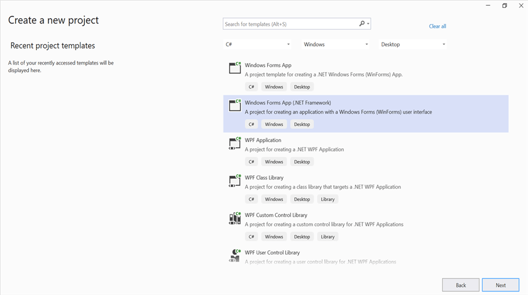
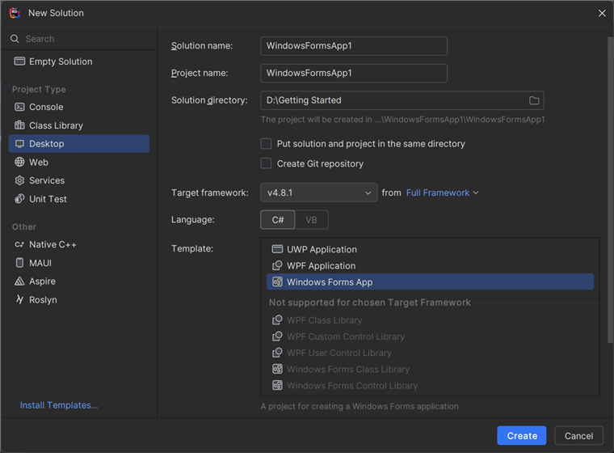
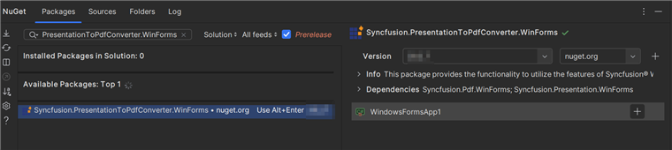
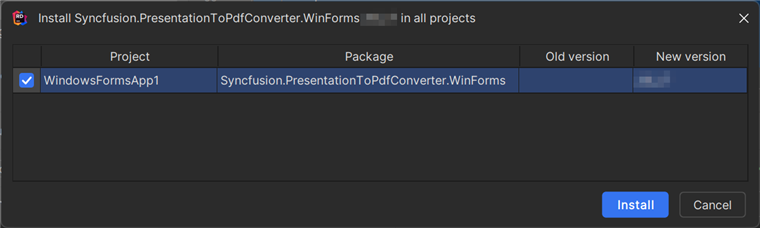

# Convert PowerPoint to PDF in Windows Forms

Syncfusion&reg; PowerPoint is a [.NET PowerPoint library](https://www.syncfusion.com/document-processing/powerpoint-framework/net) used to create, read, edit and convert PowerPoint presentation programmatically without **Microsoft PowerPoint** or interop dependencies. Using this library, you can **convert a PowerPoint to PDF in Windows Forms**.

## Steps to convert PowerPoint to PDF programmatically





**Prerequisites:**

* Visual Studio 2022.
* Install **.NET desktop development** workload with necessary .NET Framework SDK.

Step 1: Create a new C# Windows Forms application project.

Step 2: Install the [Syncfusion.PresentationToPdfConverter.WinForms](https://www.nuget.org/packages/Syncfusion.PresentationToPdfConverter.WinForms) NuGet package as reference to your .NET Standard applications from [NuGet.org](https://www.nuget.org/).

N> Starting with v16.2.0.x, if you reference Syncfusion&reg; assemblies from trial setup or from the NuGet feed, you also have to add "Syncfusion.Licensing" assembly reference and include a license key in your projects. Please refer to this [link](https://help.syncfusion.com/common/essential-studio/licensing/overview) to know about registering Syncfusion&reg; license key in your application to use our components.

Step 3: Include the following namespaces in the **Form1.cs** file.




using Syncfusion.Pdf;
using Syncfusion.Presentation;
using Syncfusion.PresentationToPdfConverter;




Step 4: Add a new button in **Form1.Designer.cs** file.




private Button btnCreate;
private Label label;
private void InitializeComponent()
{
    this.label = new System.Windows.Forms.Label();
    this.btnCreate = new System.Windows.Forms.Button();
    this.SuspendLayout();
    // 
    // label
    // 
    this.label.Location = new System.Drawing.Point(0, 40);
    this.label.Name = "label";
    this.label.Size = new System.Drawing.Size(426, 35);
    this.label.TabIndex = 0;
    this.label.Text = "Click the button to convert PowerPoint to PDF";
    this.label.TextAlign = System.Drawing.ContentAlignment.MiddleCenter;
    // 
    // btnCreate
    // 
    this.btnCreate.Location = new System.Drawing.Point(180, 110);
    this.btnCreate.Name = "btnCreate";
    this.btnCreate.Size = new System.Drawing.Size(85, 36);
    this.btnCreate.TabIndex = 1;
    this.btnCreate.Text = "Convert PPTX to PDF";
    this.btnCreate.Click += new System.EventHandler(this.btnConvert_Click);
}




Step 5: Add the following code in **btnConvert_Click** to **convert a PowerPoint to PDF in Windows Forms**.




//Opens a PowerPoint Presentation.
using (IPresentation pptxDoc = Presentation.Open("Data/Input.pptx"))
{
    //Converts the PowerPoint Presentation into PDF document.
    using (PdfDocument pdfDocument = PresentationToPdfConverter.Convert(pptxDoc))
    {
        //Saves the PDF document.
        pdfDocument.Save("Sample.pdf");
    }
}




Step 6: Build the project.

Click on Build → Build Solution or press <kbd>Ctrl</kbd>+<kbd>Shift</kbd>+<kbd>B</kbd> to build the project.

Step 7: Run the project.

Click the Start button (green arrow) or press <kbd>F5</kbd> to run the app.

You can download a complete working sample from [GitHub](https://github.com/SyncfusionExamples/PowerPoint-Examples/tree/master/PPTX-to-PDF-conversion/Convert-PowerPoint-presentation-to-PDF/WindowForms).

By executing the program, you will get the **PDF** as follows.





**Prerequisites:**

* JetBrains Rider.
* Install .NET Framework Developer Pack.

Step 1. Open JetBrains Rider and create a new Windows Forms Application project.
* Launch JetBrains Rider.
* Click **New Solution** on the welcome screen.

* In the New Solution dialog, select **Project Type** as **Desktop**.
* Enter a project name and specify the location.
* Select the target framework as Full Framework and choose the desired version.
* Select **Template** as **Windows Forms App**.
* Click create.

Step 2: Install the NuGet package from [NuGet.org](https://www.nuget.org/).
* Click the NuGet icon in the Rider toolbar and type [Syncfusion.PresentationToPdfConverter.WinForms](https://www.nuget.org/packages/Syncfusion.PresentationToPdfConverter.WinForms/) in the search bar.
* Ensure that nuget.org is selected as the package source.
* Select the latest Syncfusion.PresentationToPdfConverter.WinForms NuGet package from the list.
* Click the + (Add) button to add the package.

* Click the Install button to complete the installation.

N> Starting with v16.2.0.x, if you reference Syncfusion assemblies from trial setup or from the NuGet feed, you also have to add "Syncfusion.Licensing" assembly reference and include a license key in your projects. Please refer to this [link](https://help.syncfusion.com/common/essential-studio/licensing/overview) to know about registering Syncfusion license key in your application to use our components.

Step 3: Include the following namespaces in the **Form1.cs** file.




using Syncfusion.Pdf;
using Syncfusion.Presentation;
using Syncfusion.PresentationToPdfConverter;




Step 4: Add a new button in **Form1.Designer.cs** file.




private Button btnCreate;
private Label label;
private void InitializeComponent()
{
    this.label = new System.Windows.Forms.Label();
    this.btnCreate = new System.Windows.Forms.Button();
    this.SuspendLayout();
    // 
    // label
    // 
    this.label.Location = new System.Drawing.Point(0, 40);
    this.label.Name = "label";
    this.label.Size = new System.Drawing.Size(426, 35);
    this.label.TabIndex = 0;
    this.label.Text = "Click the button to convert PowerPoint to PDF";
    this.label.TextAlign = System.Drawing.ContentAlignment.MiddleCenter;
    // 
    // btnCreate
    // 
    this.btnCreate.Location = new System.Drawing.Point(180, 110);
    this.btnCreate.Name = "btnCreate";
    this.btnCreate.Size = new System.Drawing.Size(85, 36);
    this.btnCreate.TabIndex = 1;
    this.btnCreate.Text = "Convert PPTX to PDF";
    this.btnCreate.Click += new System.EventHandler(this.btnConvert_Click);
}




Step 5: Add the following code in **btnConvert_Click** to **convert a PowerPoint to PDF in Windows Forms**.




//Opens a PowerPoint Presentation.
using (IPresentation pptxDoc = Presentation.Open("Data/Input.pptx"))
{
    //Converts the PowerPoint Presentation into PDF document.
    using (PdfDocument pdfDocument = PresentationToPdfConverter.Convert(pptxDoc))
    {
        //Saves the PDF document.
        pdfDocument.Save("Sample.pdf");
    }
}




Step 6: Build the project.

Click the **Build** button in the toolbar or press <kbd>Ctrl</kbd>+<kbd>Shift</kbd>+<kbd>B</kbd> to build the project.

Step 7: Run the project.

Click the **Run** button (green arrow) in the toolbar or press <kbd>F5</kbd> to run the app.

You can download a complete working sample from [GitHub](https://github.com/SyncfusionExamples/PowerPoint-Examples/tree/master/PPTX-to-PDF-conversion/Convert-PowerPoint-presentation-to-PDF/WindowForms).

By executing the program, you will get the **PDF** as follows.





Click [here](https://www.syncfusion.com/document-processing/powerpoint-framework/net) to explore the rich set of Syncfusion&reg; PowerPoint Library (Presentation) features. 

An online sample link to [convert PowerPoint Presentation to PDF](https://ej2.syncfusion.com/aspnetcore/PowerPoint/PPTXToPDF#/material3) in ASP.NET Core. 