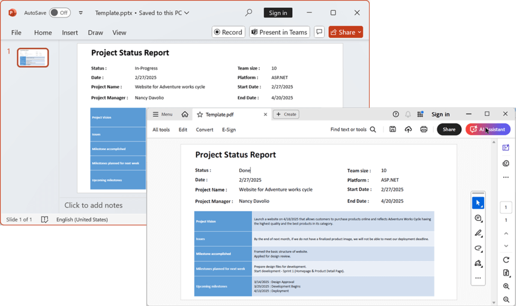

# Convert PowerPoint to PDF using Syncfusion&reg; PowerPoint library

Syncfusion&reg; PowerPoint library (Presentation) allows you to convert PowerPoint Presentation document to PDF within a few lines of code in .NET applications and also it does not require Adobe and Microsoft PowerPoint application to be installed in the machine. Using this, you can create an input PowerPoint Presentation document from scratch or load an existing PowerPoint Presentation document and then easily convert to PDF.

The Syncfusion&reg; PowerPoint to PDF converter offers high versatility and seamless performance across various .NET platforms, including [Windows Forms](https://help.syncfusion.com/document-processing/powerpoint/conversions/powerpoint-to-pdf/net/convert-powerpoint-to-pdf-in-windows-forms), [WPF](https://help.syncfusion.com/document-processing/powerpoint/conversions/powerpoint-to-pdf/net/convert-powerpoint-to-pdf-in-wpf), [ASP.NET](https://help.syncfusion.com/document-processing/powerpoint/conversions/powerpoint-to-pdf/net/convert-powerpoint-to-pdf-in-asp-net), [ASP.NET MVC](https://help.syncfusion.com/document-processing/powerpoint/conversions/powerpoint-to-pdf/net/convert-powerpoint-to-pdf-in-asp-net-mvc), [ASP.NET Core](https://help.syncfusion.com/document-processing/powerpoint/conversions/powerpoint-to-pdf/net/convert-powerpoint-to-pdf-in-asp-net-core), [Blazor](https://help.syncfusion.com/document-processing/powerpoint/conversions/powerpoint-to-pdf/net/convert-powerpoint-to-pdf-in-blazor), [Xamarin](https://help.syncfusion.com/document-processing/powerpoint/conversions/powerpoint-to-pdf/net/convert-powerpoint-to-pdf-in-xamarin), [WinUI](https://help.syncfusion.com/document-processing/powerpoint/conversions/powerpoint-to-pdf/net/convert-powerpoint-to-pdf-in-winui), [.NET MAUI](https://help.syncfusion.com/document-processing/powerpoint/conversions/powerpoint-to-pdf/net/convert-powerpoint-to-pdf-in-maui). Also, in different environments like [Azure](https://help.syncfusion.com/document-processing/powerpoint/conversions/powerpoint-to-pdf/net/convert-powerpoint-to-pdf-in-azure), [AWS](https://help.syncfusion.com/document-processing/powerpoint/conversions/powerpoint-to-pdf/net/convert-powerpoint-to-pdf-in-aws), [Google Cloud](https://help.syncfusion.com/document-processing/powerpoint/conversions/powerpoint-to-pdf/net/convert-powerpoint-to-pdf-in-google-cloud-platform), [Linux](https://help.syncfusion.com/document-processing/powerpoint/conversions/powerpoint-to-pdf/net/convert-powerpoint-to-pdf-in-linux), and [macOS](https://help.syncfusion.com/document-processing/powerpoint/conversions/powerpoint-to-pdf/net/convert-powerpoint-to-pdf-in-mac). 

## Key Features

* Ability to convert [entire PowerPoint Presentation document to PDF](https://help.syncfusion.com/document-processing/powerpoint/conversions/powerpoint-to-pdf/net/presentation-to-pdf#convert-powerpoint-to-pdf).
* Specify the number of slides per PDF page with [Handouts](https://help.syncfusion.com/document-processing/powerpoint/conversions/powerpoint-to-pdf/net/presentation-to-pdf#handouts) option.
* Convert slides with [notes pages](https://help.syncfusion.com/document-processing/powerpoint/conversions/powerpoint-to-pdf/net/presentation-to-pdf#notes-pages) to PDF.
* Embed fonts in a PowerPoint file into the converted PDF document to avoid font-related issues across different machines and different platforms.
* Convert a PowerPoint document to PDF with the [PDF-A1B](https://help.syncfusion.com/document-processing/powerpoint/conversions/powerpoint-to-pdf/net/presentation-to-pdf#pdf-conformance) conformance standards.
* Specify [fallback fonts](https://help.syncfusion.com/document-processing/powerpoint/conversions/powerpoint-to-pdf/net/fallback-fonts-in-pptxtopdf-conversion) to be used in place of missing fonts.
* Skip or include [hidden slides](https://help.syncfusion.com/document-processing/powerpoint/conversions/powerpoint-to-pdf/net/presentation-to-pdf#include-hidden-slides).
* Set the [quality of images](https://help.syncfusion.com/document-processing/powerpoint/conversions/powerpoint-to-pdf/net/presentation-to-pdf#optimizing-the-converted-pdf-document-size) in the PowerPoint slides to reduce the converted PDF document size.

## Assemblies and NuGet packages required

Refer to the following links for assemblies required based on platforms to convert the PowerPoint document to PDF.

* [PowerPoint to PDF conversion assemblies](https://help.syncfusion.com/document-processing/powerpoint/conversions/powerpoint-to-pdf/net/assembly-required-for-pptxtopdf-conversion)
* [PowerPoint to PDF conversion NuGet packages](https://help.syncfusion.com/document-processing/powerpoint/conversions/powerpoint-to-pdf/net/nuget-packages-required-for-pptxtopdf-conversion)

To quickly start converting a PowerPoint Presentation to a PDF using .NET PowerPoint library, please check out this video:


## Convert PowerPoint to PDF

The following namespaces are required to compile the code:




using Syncfusion.Pdf;
using Syncfusion.Presentation;
using Syncfusion.PresentationRenderer;



using Syncfusion.OfficeChartToImageConverter;
using Syncfusion.Presentation;
using Syncfusion.PresentationToPdfConverter;
using Syncfusion.Pdf;



Imports Syncfusion.OfficeChartToImageConverter
Imports Syncfusion.Presentation
Imports Syncfusion.PresentationToPdfConverter
Imports Syncfusion.Pdf




The following code example illustrates how to convert a PowerPoint document into PDF document.




//Load the PowerPoint presentation into stream.
using (FileStream fileStreamInput = new FileStream("Template.pptx", FileMode.Open, FileAccess.Read))
{
    //Open the existing PowerPoint presentation with loaded stream.
    using (IPresentation pptxDoc = Presentation.Open(fileStreamInput))
    {
        //Convert PowerPoint into PDF document. 
        using (PdfDocument pdfDocument = PresentationToPdfConverter.Convert(pptxDoc))
        {
            //Save the PDF file to file system. 
            pdfDocument.Save("PPTXToPDF.pdf");
        }
    }
}



//Opens a PowerPoint Presentation
IPresentation pptxDoc = Presentation.Open("Sample.pptx");
//Creates an instance of ChartToImageConverter and assigns it to ChartToImageConverter property of Presentation
pptxDoc.ChartToImageConverter = new ChartToImageConverter();
//Converts the PowerPoint Presentation into PDF document
PdfDocument pdfDocument = PresentationToPdfConverter.Convert(pptxDoc);
//Saves the PDF document
pdfDocument.Save("Sample.pdf");
//Closes the PDF document
pdfDocument.Close(true);
//Closes the Presentation
pptxDoc.Close();



'Opens a PowerPoint Presentation
Dim pptxDoc As IPresentation = Presentation.Open("Sample.pptx")
'Creates an instance of ChartToImageConverter and assigns it to ChartToImageConverter property of Presentation
pptxDoc.ChartToImageConverter = New ChartToImageConverter()
'Converts the PowerPoint Presentation into PDF document
Dim pdfDocument As PdfDocument = PresentationToPdfConverter.Convert(pptxDoc)
'Saves the PDF document
pdfDocument.Save("Sample.pdf")
'Closes the PDF document
pdfDocument.Close(True)
'Closes the Presentation
pptxDoc.Close()




You can download a complete working sample from [GitHub](https://github.com/SyncfusionExamples/PowerPoint-Examples/tree/master/PPTX-to-PDF-conversion/Convert-PowerPoint-presentation-to-PDF/.NET).

N> 1. Creating an instance of [ChartToImageConverter](https://help.syncfusion.com/cr/document-processing/Syncfusion.OfficeChartToImageConverter.ChartToImageConverter.html) class is mandatory to convert the charts present in the Presentation to PDF. Otherwise, the charts are not exported to the converted PDF
N> 2. The assembly "Syncfusion.SfChart.WPF" is non compliance with FIPS (Federal Information Processing Standard) algorithm policy.

## PowerPoint Presentation to PDF conversion in Linux OS

In Linux OS, you can perform the PowerPoint presentation to PDF conversion using .NET Core (Targeting .netcoreapp) application. For further information, click [here](https://help.syncfusion.com/document-processing/powerpoint/conversions/powerpoint-to-pdf/net/convert-powerpoint-to-pdf-in-linux).

## Font substitution

When a font used in a PowerPoint presentation is unavailable in the environment where it is converted to PDF, then the library substitutes the ‘Microsoft Sans Serif’ as a default font for text rendering. This leads to a difference in text layouts of PowerPoint presentation and the converted PDF document.  To avoid this, the Essential&reg; Presentation library allows you to set an alternate font for the missing font used in the PowerPoint presentation. For further information, click [here](https://help.syncfusion.com/document-processing/powerpoint/conversions/powerpoint-to-pdf/net/font-substitution-in-pptxtopdf-conversion).

## Fallback fonts

During PowerPoint to PDF conversions, if a glyph of the input text is unavailable in the specified font, the text will not be rendered properly. To address this, the Syncfusion PowerPoint (Presentation) library allows users to specify fallback fonts. When a glyph is missing, the library will use one of the fallback fonts to render the text correctly in the output PDF document. For further information, click [here](https://help.syncfusion.com/document-processing/powerpoint/conversions/powerpoint-to-pdf/net/fallback-fonts-in-pptxtopdf-conversion).

## Show Warning for unsupported elements

The Presentation library shows warning message about the unsupported elements such as Metafile images and charts (supported from .NET Standard 2.0) present in the input PowerPoint presentation, during PowerPoint to PDF conversion. It also allows you to cancel or continue the PowerPoint to PDF conversion, when any unsupported elements is present in the input PowerPoint presentation.

The following code example demonstrates how to cancel or continue the PowerPoint presentation to PDF conversion, when an unsupported elements (Metafile and Chart) are present in the input PowerPoint presentation.




// Open the file as Stream
using (FileStream pptStream = new FileStream("Template.pptx", FileMode.Open, FileAccess.Read))
{
    //Open the existing PowerPoint presentation with loaded stream.
    using (IPresentation pptxDoc = Presentation.Open(pptStream))
    {
        //Instantiation of PresentationToPdfConverterSettings
        PresentationToPdfConverterSettings settings = new PresentationToPdfConverterSettings();
        //Gets all the warnings into the collection
        settings.Warning = new DocumentWarning();
        //Converts the PowerPoint Presentation into PDF document
        using (PdfDocument pdfDocument = PresentationToPdfConverter.Convert(pptxDoc, settings))
        {
            //If the PowerPoint to Pdf conversion has been stopped, IsCanceled value will be True, otherwise false
            if (!PresentationToPdfConverter.IsCanceled)
            {
                //Saves the PDF file
                pdfDocument.Save("Output.pdf");
            }
            else
            {
                Console.WriteLine("PowerPoint to PDF conversion is stopped , please press any key to exit the application");
                Console.ReadKey();
            }
        }
    }
}
/// 

/// DocumentWarning class implements the IWarning interface
/// 

/// <seealso cref="IWarning" />
public class DocumentWarning : IWarning
{
    /// 

    /// Gets the Boolen value whether to continue conversion or not
    /// 

    /// <param name="warningInfo">Collection of warnings</param>
    /// <returns></returns>
    public bool ShowWarnings(List<WarningInfo> warningInfo)
    {
        //By default to perform the PowerPoint to PDF conversion by setting the isContinueConversion as true.
        bool isContinueConversion = true;
        foreach (WarningInfo warning in warningInfo)
        {
            //Since there are warnings in the PowerPoint presentation the value of isContinueConversion will be set as false.
            isContinueConversion = false;
            //Print the description of the Warining
            Console.WriteLine(warning.Description);
            if (warning.Description.Contains("Metafile") || warning.Description.Contains("Chart"))
            {
                Console.WriteLine("Type [Y] if you want Do you want to continue Presentation to Pdf conversion or Type [N] to cancel the conversion");
                String confrimation = Console.ReadLine();
                //Based on warning.WarningType enumeration, you can do your manipulation.
                //Skips the PowerPoint to Pdf conversion by setting isContinueConversion value as false.
                //Continue the PowerPoint to PDF conversion by setting the isContinueConversion as true.
                if (confrimation.ToLower().Equals("y"))
                    isContinueConversion = true;
                else
                    isContinueConversion = false;
            }
        }
        return isContinueConversion;
    }
}



//Essential Presentation library supports Show warning for unsupported elements feature in C# [Cross-platform], Blazor Server app application and Xamarin platforms alone.



//Essential Presentation supports library Show warning for unsupported elements feature in C# [Cross-platform], Blazor Server app application and Xamarin platforms alone.




You can download a complete working sample from [GitHub](https://github.com/SyncfusionExamples/PowerPoint-Examples/tree/master/PPTX-to-PDF-conversion/Show-warning-for-unsupported-elements).

## Handouts

The Presentation library allows you to convert a PowerPoint presentation to PDF document with [Handouts](https://help.syncfusion.com/cr/document-processing/Syncfusion.PresentationToPdfConverter.PublishOptions.html) option. Thus, the library allows selecting the number of slides to be included per PDF page. This helps converting multiple PowerPoint slides within a single PDF page. 
 
The following code sample demonstrates how to convert a PowerPoint presentation to PDF document with [Handouts](https://help.syncfusion.com/cr/document-processing/Syncfusion.PresentationToPdfConverter.PublishOptions.html) property.




//Load the PowerPoint presentation to convert.
IPresentation pptxDoc = Presentation.Open("Sample.pptx");
//Enable the handouts and number of pages per slide options in converter settings.
PresentationToPdfConverterSettings pdfConverterSettings = new PresentationToPdfConverterSettings();
pdfConverterSettings.PublishOptions = PublishOptions.Handouts;
pdfConverterSettings.SlidesPerPage = SlidesPerPage.Nine;
//Convert the documents by passing the PDF conversion settings as parameter.
PdfDocument pdfDoc = PresentationToPdfConverter.Convert(pptxDoc, pdfConverterSettings);
//Save the converted PDF document.
pdfDoc.Save("Sample.pdf");
//Close the presentation instance
pptxDoc.Close();
//Close the PDF instance
pdfDoc.Close();



'Load the PowerPoint presentation to convert.
Dim pptxDoc As IPresentation  = Presentation.Open("Sample.pptx")
'Enable the handouts and number of pages per slide options in converter settings.
Dim pdfConverterSettings As PresentationToPdfConverterSettings  = new PresentationToPdfConverterSettings()
pdfConverterSettings.PublishOptions = PublishOptions.Handouts
pdfConverterSettings.SlidesPerPage = SlidesPerPage.Nine
'Convert the documents by passing the PDF conversion settings as parameter.
Dim pdfDoc As PdfDocument  = PresentationToPdfConverter.Convert(pptxDoc, pdfConverterSettings)
'Save the converted PDF document.
pdfDoc.Save("Sample.pdf")
'Close the presentation instance
pptxDoc.Close()
'Close the PDF instance
pdfDoc.Close()




You can download a complete working sample from [GitHub](https://github.com/SyncfusionExamples/PowerPoint-Examples/tree/master/PPTX-to-PDF-conversion/Convert-PowerPoint-to-PDF-with-handouts).

## Notes pages

The Presentation library allows you to convert a PowerPoint presentation to PDF document with 'notes pages' option, which will includes the notes content while PDF conversion. 

The following code sample demonstrates how to convert a PowerPoint presentation to PDF with 'notes pages'.




//Load the PowerPoint presentation to convert.
IPresentation pptxDoc = Presentation.Open("Sample.pptx");
//Enable the include hidden slides option in converter settings.
PresentationToPdfConverterSettings pdfConverterSettings = new PresentationToPdfConverterSettings();
pdfConverterSettings.PublishOptions = PublishOptions.NotesPages;
//Convert the documents by passing the settings as parameter.
PdfDocument pdfDoc = PresentationToPdfConverter.Convert(pptxDoc, pdfConverterSettings);
//Save the converted PDF file.
pdfDoc.Save("Sample.pdf");
//Close the presentation instance
pptxDoc.Close();
//Close the PDF instance
pdfDoc.Close();



'Load the PowerPoint presentation to convert.
Dim pptxDoc As IPresentation = Presentation.Open("Sample.pptx")
'Enable the include hidden slides option in converter settings.
Dim pdfConverterSettings As PresentationToPdfConverterSettings pdfConverterSettings = new PresentationToPdfConverterSettings()
pdfConverterSettings.PublishOptions = PublishOptions.NotesPages
'Convert the documents by passing the settings as parameter.
Dim pdfDoc As PdfDocument = PresentationToPdfConverter.Convert(pptxDoc, pdfConverterSettings)
'Save the converted PDF file.
pdfDoc.Save("Sample.pdf")
'Close the presentation instance
pptxDoc.Close()
'Close the PDF instance
pdfDoc.Close()




You can download a complete working sample from [GitHub](https://github.com/SyncfusionExamples/PowerPoint-Examples/tree/master/PPTX-to-PDF-conversion/Convert-PowerPoint-to-PDF-with-notes).

## Include hidden slides

The PowerPoint presentation supports hiding the slides in a presentation document. The hidden slides will not be included in the converted PDF document, by default. The Presentation library provides support to include or exclude the hidden slides while converting a PowerPoint presentation to PDF document.

The following code sample demonstrates how to include the hidden slides while converting a PowerPoint presentation to PDF document. 




//Load the PowerPoint presentation to convert.
IPresentation pptxDoc = Presentation.Open("Sample.pptx");
//Enable or disable including the hidden slides option in converter settings.
PresentationToPdfConverterSettings pdfConverterSettings = new PresentationToPdfConverterSettings();
pdfConverterSettings.ShowHiddenSlides = true;
//Convert the documents by passing the settings as parameter.
PdfDocument pdfDoc = PresentationToPdfConverter.Convert(pptxDoc, pdfConverterSettings);
//Save the converted PDF file.
pdfDoc.Save("Sample.pdf");
//Close the presentation instance
pptxDoc.Close();
//Close the PDF instance
pdfDoc.Close();



'Load the PowerPoint presentation to convert.
Dim pptxDoc As IPresentation  = Presentation.Open("Sample.pptx")
'Enable or disable including the hidden slides option in converter settings.
Dim pdfConverterSettings As PresentationToPdfConverterSettings  = new PresentationToPdfConverterSettings()
pdfConverterSettings.ShowHiddenSlides = true
'Convert the documents by passing the settings as parameter.
Dim pdfDoc As PdfDocument  = PresentationToPdfConverter.Convert(pptxDoc, pdfConverterSettings)
'Save the converted PDF file.
pdfDoc.Save("Sample.pdf")
'Close the presentation instance
pptxDoc.Close()
'Close the PDF instance
pdfDoc.Close()




You can download a complete working sample from [GitHub](https://github.com/SyncfusionExamples/PowerPoint-Examples/tree/master/PPTX-to-PDF-conversion/PowerPoint-to-PDF-with-hidden-slides).

## Recreate Nested Metafile

This setting allows you to regenerate the nested EMF images in the PowerPoint presentation document during PDF conversion. This property is recommended to resolve the scaling problem of the nested metafile images by regenerating the nested metafile images present in the PowerPoint presentation document.

The following code sample shows how to use this property to regenerate the nested EMF images in the PowerPoint presentation document during PDF conversion.




//Open a PowerPoint Presentation.
using (IPresentation pptxDoc = Presentation.Open("Sample.pptx"))
{
    //Create an instance of the ChartToImageConverter and assign it to the ChartToImageConverter property of the Presentation.
    pptxDoc.ChartToImageConverter = new ChartToImageConverter();
    //Initialize the conversion settings.
    PresentationToPdfConverterSettings pdfConverterSettings = new PresentationToPdfConverterSettings();
    //Set the RecreateNestedMetafile property to true to recreate the nested metafile automatically.          
    pdfConverterSettings.RecreateNestedMetafile = true;
    //Convert the PowerPoint Presentation into a PDF document.
    using (PdfDocument pdfDocument = PresentationToPdfConverter.Convert(pptxDoc, pdfConverterSettings))
    {
        //Save a PDF document.
        pdfDocument.Save("Sample.pdf");
    }
}



'Open a PowerPoint Presentation.
Using pptxDoc As IPresentation = Presentation.Open("Sample.pptx")
    'Create an instance of the ChartToImageConverter and assign it to the ChartToImageConverter property of the Presentation.
    pptxDoc.ChartToImageConverter = New ChartToImageConverter()
    'Initialize the conversion settings.
    Dim pdfConverterSettings As PresentationToPdfConverterSettings = New PresentationToPdfConverterSettings()
    'Set the RecreateNestedMetafile property to true to recreate the nested metafile automatically.
    pdfConverterSettings.RecreateNestedMetafile = True
    'Convert the PowerPoint Presentation into a PDF document.
    Using pdfDocument As PdfDocument = PresentationToPdfConverter.Convert(pptxDoc, pdfConverterSettings)
        'Save a PDF document.
        pdfDocument.Save("Sample.pdf")
    End Using
End Using




You can download a complete working sample from [GitHub](https://github.com/SyncfusionExamples/PowerPoint-Examples/tree/master/PPTX-to-PDF-conversion/PowerPoint-to-PDF-with-nested-metafile).

## PDF Conformance

Essential&reg; Presentation currently supports following PDF conformances while converting a PowerPoint document to PDF.

* PDF/A-1b conformance
* PDF/X-1a conformance

N> 1. To know more details about PDF/A standard refer [https://en.wikipedia.org/wiki/PDF/A#Description](https://en.wikipedia.org/wiki/PDF/A#Description )
N> 2. To know more details about PDF/X standard refer [https://en.wikipedia.org/wiki/PDF/X](https://en.wikipedia.org/wiki/PDF/X)

The following code sample demonstrates how to set the PDF conformance level while PowerPoint presentation to PDF conversion.




//Load the PowerPoint document
IPresentation pptxDoc = Presentation.Open("Sample.pptx"));
//Initialize the conversion settings
PresentationToPdfConverterSettings pdfConverterSettings = new PresentationToPdfConverterSettings();
//Set the Pdf conformance level to A1B
pdfConverterSettings.PdfConformanceLevel = PdfConformanceLevel.Pdf_A1B;
//Convert the PowerPoint document to PDF
PdfDocument pdfDoc = PresentationToPdfConverter.Convert(pptxDoc,pdfConverterSettings);
//Save the converted PDF file.
pdfDoc.Save("Sample.pdf");
//Close the presentation instance
pptxDoc.Close();
//Close the PDF instance
pdfDoc.Close();



'Load the PowerPoint presentation to convert.
Dim pptxDoc As IPresentation  = Presentation.Open("Sample.pptx")
'Enable or disable including the hidden slides option in converter settings.
Dim pdfConverterSettings As PresentationToPdfConverterSettings  = new PresentationToPdfConverterSettings()
'Set the Pdf conformance level to A1B
pdfConverterSettings.PdfConformanceLevel = PdfConformanceLevel.Pdf_A1B
'Convert the documents by passing the settings as parameter.
Dim pdfDoc As PdfDocument  = PresentationToPdfConverter.Convert(pptxDoc, pdfConverterSettings)
'Save the converted PDF file.
pdfDoc.Save("Sample.pdf")
'Close the presentation instance
pptxDoc.Close()
'Close the PDF instance
pdfDoc.Close()




You can download a complete working sample from [GitHub](https://github.com/SyncfusionExamples/PowerPoint-Examples/tree/master/PPTX-to-PDF-conversion/Set-PDF-conformance-level).

## Accessible PDF document

This setting allows you to determine whether to preserve structured document tags in the converted PDF document for accessibility **(508 or PDF/UA compliance)** support. This property will set the title and description for images, diagrams, and other objects in the generated PDF document. This information will be helpful for **people with vision or cognitive impairments** who may not be able to see or understand the object.

The following code sample shows how to preserve structured document tags in the converted PDF document.




//Load the PowerPoint presentation into a stream.
using (FileStream fileStreamInput = new FileStream("Sample.pptx", FileMode.Open, FileAccess.Read))
{
    //Open the existing PowerPoint presentation with the loaded stream.
    using (IPresentation pptxDoc = Presentation.Open(fileStreamInput))
    {
        //Instantiation of the PresentationToPdfConverterSettings.
        PresentationToPdfConverterSettings pdfConverterSettings = new PresentationToPdfConverterSettings();
        //Enable a flag to preserve structured document tags in the converted PDF document.               
        pdfConverterSettings.AutoTag = true;
        //Convert the PowerPoint document to a PDF document.
        using (PdfDocument pdfDocument = PresentationToPdfConverter.Convert(pptxDoc, pdfConverterSettings))
        {
            //Save the converted PDF document.
            pdfDocument.Save("Sample.pdf");
        }
    }
}



//Open a PowerPoint Presentation.
using (IPresentation pptxDoc = Presentation.Open("Sample.pptx"))
{
    //Create an instance of the ChartToImageConverter and assign it to the ChartToImageConverter property of the Presentation.
    pptxDoc.ChartToImageConverter = new ChartToImageConverter();
    //Initialize the conversion settings.
    PresentationToPdfConverterSettings pdfConverterSettings = new PresentationToPdfConverterSettings();
    //Enable a flag to preserve structured document tags in the converted PDF document.               
    pdfConverterSettings.AutoTag = true;
    //Convert the PowerPoint Presentation into a PDF document.
    using (PdfDocument pdfDocument = PresentationToPdfConverter.Convert(pptxDoc, pdfConverterSettings))
    {
        //Save a PDF document.
        pdfDocument.Save("Sample.pdf");
    }
}



'Open a PowerPoint Presentation.
Using pptxDoc As IPresentation = Presentation.Open("Sample.pptx")
    'Create an instance of the ChartToImageConverter and assign it to the ChartToImageConverter property of the Presentation.
    pptxDoc.ChartToImageConverter = New ChartToImageConverter()
    'Initialize the conversion settings.
    Dim pdfConverterSettings As PresentationToPdfConverterSettings = New PresentationToPdfConverterSettings()
    'Enable a flag to preserve structured document tags in the converted PDF document.
    pdfConverterSettings.AutoTag = True
    'Convert the PowerPoint Presentation into a PDF document.
    Using pdfDocument As PdfDocument = PresentationToPdfConverter.Convert(pptxDoc, pdfConverterSettings)
        'Save a PDF document.
        pdfDocument.Save("Sample.pdf")
    End Using
End Using




You can download a complete working sample from [GitHub](https://github.com/SyncfusionExamples/PowerPoint-Examples/tree/master/PPTX-to-PDF-conversion/Convert-PowerPoint-into-accessible-PDF).

## PowerPoint shapes to PDF form field 

This setting allows you to **preserve PowerPoint shapes as PDF form fields** in the converted PDF document. Shapes with names starting with **FormField_** will be converted into **editable text form fields** in the resulting PDF. This feature helps in creating **interactive and fillable PDF forms** from PowerPoint presentations.

The following code sample shows how to preserve PowerPoint form fields as PDF form fields in the converted PDF document.




//Open the PowerPoint file stream. 
using (FileStream fileStream = new FileStream(Path.GetFullPath(@"Data/Template.pptx"), FileMode.Open, FileAccess.Read, FileShare.ReadWrite))
{
    //Load an existing PowerPoint Presentation. 
    using (IPresentation pptxDoc = Presentation.Open(fileStream))
    {
        // Create new instance for PresentationToPdfConverterSettings
        PresentationToPdfConverterSettings settings = new PresentationToPdfConverterSettings();
        //Enables a flag to preserve form fields by converting shapes with names starting with 'FormField_' into editable text form fields in the PDF.
        settings.PreserveFormFields = true;
        //Convert PowerPoint into PDF document. 
        using (PdfDocument pdfDocument = PresentationToPdfConverter.Convert(pptxDoc))
        {
            //Save the PDF file to file system. 
            pdfDocument.Save("Output.pdf");
        }
    }
}



//Open a PowerPoint Presentation.
using (IPresentation pptxDoc = Presentation.Open("Template.pptx"))
{
    // Create new instance for PresentationToPdfConverterSettings
    PresentationToPdfConverterSettings settings = new PresentationToPdfConverterSettings();
    //Enables a flag to preserve form fields by converting shapes with names starting with 'FormField_' into editable text form fields in the PDF.
    settings.PreserveFormFields = true;
    //Convert the PowerPoint Presentation into a PDF document.
    using (PdfDocument pdfDocument = PresentationToPdfConverter.Convert(pptxDoc, pdfConverterSettings))
    {
        //Save a PDF document.
        pdfDocument.Save("Result.pdf");
    }
}



'Open a PowerPoint Presentation.
Using pptxDoc As IPresentation = Presentation.Open("Template.pptx")
    'Create new instance for PresentationToPdfConverterSettings
    Dim settings As New PresentationToPdfConverterSettings()
    'Enables a flag to preserve form fields by converting shapes with names starting with 'FormField_' into editable text form fields in the PDF.
    settings.PreserveFormFields = True
    'Convert the PowerPoint Presentation into a PDF document.
    Using pdfDocument As PdfDocument = PresentationToPdfConverter.Convert(pptxDoc, settings)
        'Save a PDF document.
        pdfDocument.Save("Result.pdf")
    End Using
End Using





By running the above code, you will generate a **PDF with editable text form fields** as shown below.

You can download a complete working sample from [GitHub](https://github.com/SyncfusionExamples/PowerPoint-Examples/tree/master/PPTX-to-PDF-conversion/Create-fillable-PDF-from-PPTX).

## Chart quality

The Presentation library provides an option to decide the quality of the charts to optimize the converted PDF document size. 

N> 1. The default [ScalingMode](https://help.syncfusion.com/cr/document-processing/Syncfusion.OfficeChartToImageConverter.ChartToImageConverter.html#Syncfusion_OfficeChartToImageConverter_ChartToImageConverter_ScalingMode) for charts is [ScalingMode.Normal](https://help.syncfusion.com/cr/document-processing/Syncfusion.OfficeChart.ScalingMode.html). 
N> 2. Setting the [Best](https://help.syncfusion.com/cr/document-processing/Syncfusion.OfficeChart.ScalingMode.html) scaling mode will improve the quality of the converted charts and increase the converted PDF document size.

The following code sample demonstrates how to set the quality of the charts while PowerPoint presentation to PDF conversion.




//Load the PowerPoint presentation to convert.
IPresentation pptxDoc = Presentation.Open("Sample.pptx");
//Create an instance of ChartToImageConverter and assigns it to ChartToImageConverter property of Presentation
pptxDoc.ChartToImageConverter = new ChartToImageConverter();
//Sets the scaling mode of the chart to best. 
pptxDoc.ChartToImageConverter.ScalingMode = ScalingMode.Best;
//Convert the documents by passing the PDF conversion settings as parameter.
PdfDocument pdfDoc = PresentationToPdfConverter.Convert(pptxDoc);          
//Save the converted PDF document.
pdfDoc.Save("Sample.pdf");
//Close the presentation instance
pptxDoc.Close();
//Close the PDF instance
pdfDoc.Close();



'Load the PowerPoint presentation to convert.
Dim pptxDoc As IPresentation = Presentation.Open("Sample.pptx")
'Create an instance of ChartToImageConverter and assigns it to ChartToImageConverter property of Presentation
pptxDoc.ChartToImageConverter = new ChartToImageConverter()
'Sets the scaling mode of the chart to best. 
pptxDoc.ChartToImageConverter.ScalingMode = ScalingMode.Best
'Convert the documents by passing the PDF conversion settings as parameter.
Dim pdfDoc As PdfDocument = PresentationToPdfConverter.Convert(pptxDoc)          
'Save the converted PDF document.
pdfDoc.Save("Sample.pdf")
'Close the presentation instance
pptxDoc.Close()
'Close the PDF instance
pdfDoc.Close()




You can download a complete working sample from [GitHub](https://github.com/SyncfusionExamples/PowerPoint-Examples/tree/master/PPTX-to-PDF-conversion/Set-chart-quality).

## Optimizing the converted PDF document size

### Optimizing the identical images

The presentation library allows you to optimize the memory usage for the duplicate images while converting the PowerPoint presentation to PDF document to reduce the document size.
 
The following code sample demonstrates how to optimize the duplicate images while converting a PowerPoint presentation to PDF document. 




//Load the PowerPoint presentation to convert.
IPresentation pptxDoc = Presentation.Open("Sample.pptx");
//Enable the include hidden slides option in converter settings.
PresentationToPdfConverterSettings pdfConverterSettings = new PresentationToPdfConverterSettings();
//Set the flag to optimize the identical images
pdfConverterSettings.OptimizeIdenticalImages = true;
//Convert the documents by passing the settings as parameter.
PdfDocument pdfDoc = PresentationToPdfConverter.Convert(pptxDoc, pdfConverterSettings);
//Save the converted PDF file.
pdfDoc.Save("Sample.pdf");
//Close the presentation instance
pptxDoc.Close();
//Close the PDF instance
pdfDoc.Close();



'Load the PowerPoint presentation to convert.
Dim pptxDoc As IPresentation  = Presentation.Open("Sample.pptx")
'Enable the include hidden slides option in converter settings.
Dim pdfConverterSettings As PresentationToPdfConverterSettings  = new PresentationToPdfConverterSettings()
'Set the flag to optimize the identical images
pdfConverterSettings.OptimizeIdenticalImages = true
'Convert the documents by passing the settings as parameter.
Dim pdfDoc As PdfDocument = PresentationToPdfConverter.Convert(pptxDoc, pdfConverterSettings)
Save the converted PDF file.
pdfDoc.Save("Sample.pdf")
Close the presentation instance
pptxDoc.Close()
Close the PDF instance
pdfDoc.Close()




You can download a complete working sample from [GitHub](https://github.com/SyncfusionExamples/PowerPoint-Examples/tree/master/PPTX-to-PDF-conversion/Optimize-duplicate-images).

### Optimizing the image quality and resolution

You may have high resolution images in the PowerPoint slides which will impact the size of the converted PDF document. The Presentation library allows you to optimize the document size, by adjusting the quality and resolution of the images while converting the PowerPoint presentation to PDF document.
 
The following code sample demonstrates how to optimize the image quality and resolution while converting a PowerPoint presentation to PDF document. 




//Load the PowerPoint presentation to convert.
IPresentation pptxDoc = Presentation.Open("Sample.pptx");
//Enable the include hidden slides option in converter settings.
PresentationToPdfConverterSettings pdfConverterSettings = new PresentationToPdfConverterSettings();
//Set the image resolution
pdfConverterSettings.ImageResolution = 100;
//Set the image quality
pdfConverterSettings.ImageQuality = 100;
//Convert the documents by passing the settings as parameter.
PdfDocument pdfDoc = PresentationToPdfConverter.Convert(pptxDoc, pdfConverterSettings);
//Save the converted PDF file.
pdfDoc.Save("Sample.pdf");
//Close the presentation instance
pptxDoc.Close();
//Close the PDF instance
pdfDoc.Close();



'Load the PowerPoint presentation to convert.
Dim pptxDoc As IPresentation = Presentation.Open("Sample.pptx")
'Enable the include hidden slides option in converter settings.
Dim pdfConverterSettings As PresentationToPdfConverterSettings = new PresentationToPdfConverterSettings()
'Set the image resolution
pdfConverterSettings.ImageResolution = 100
'Set the image quality
pdfConverterSettings.ImageQuality = 100
'Convert the documents by passing the settings as parameter.
Dim pdfDoc As PdfDocument = PresentationToPdfConverter.Convert(pptxDoc, pdfConverterSettings)
'Save the converted PDF file.
pdfDoc.Save("Sample.pdf")
'Close the presentation instance
pptxDoc.Close()
'Close the PDF instance
pdfDoc.Close()




You can download a complete working sample from [GitHub](https://github.com/SyncfusionExamples/PowerPoint-Examples/tree/master/PPTX-to-PDF-conversion/Optimize-image-quality-and-resolution).

## Online Demo

* Explore how to convert a PowerPoint presentation to PDF using the .NET PowerPoint Library (Presentation) in a live demo [here](https://document.syncfusion.com/demos/powerpoint/pptxtopdf#/tailwind).
* See how to convert a PowerPoint presentation to PDF/UA using the .NET PowerPoint Library (Presentation) in a live demo [here](https://document.syncfusion.com/demos/powerpoint/pptxtopdfua#/tailwind).
* See how to convert a PowerPoint presentation to PDF/A using the .NET PowerPoint Library (Presentation) in a live demo [here](https://document.syncfusion.com/demos/powerpoint/pptxtopdfa#/tailwind).

## See Also

* [How to convert PPTX to PDF in Blazor WebAssembly (WASM)?](https://support.syncfusion.com/kb/article/12120/how-to-convert-pptx-to-pdf-in-blazor-webassembly-wasm)
* [How to resolve font problems during PowerPoint to PDF or image conversion?](https://support.syncfusion.com/kb/article/15472/how-to-resolve-font-problems-during-powerpoint-to-pdf-or-image-conversion)
* [How to convert and replace EMF image to PNG with same size during PowerPoint to PDF conversion?](https://support.syncfusion.com/kb/article/15641/how-to-convert-and-replace-emf-image-to-png-with-same-size-during-powerpoint-to-pdf-conversion)
* [How to convert shapes into PDF in ASP.NET Core PowerPoint?](https://support.syncfusion.com/kb/article/19542/how-to-convert-shapes-into-pdf-in-aspnet-core-powerpoint?)
