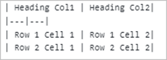

# Markdown to PowerPoint Conversion

Markdown is a lightweight markup language that adds formatting elements to plain text documents. The [.NET PowerPoint Library](https://www.syncfusion.com/document-sdk/net-powerpoint-library) supports the conversion of Markdown to PowerPoint Presentation document  (.PPTX, .PPTM, .POTX, .POTM) and vice versa, which mostly follows the CommonMark specification and GitHub-flavored syntax.


## Assemblies and NuGet packages required

Refer to the following links for assemblies and NuGet packages required based on platforms to convert a Markdown file to a PowerPoint Presentation document using the [.NET PowerPoint Library](https://www.syncfusion.com/document-sdk/net-powerpoint-library).

* [Markdown to PowerPoint assemblies](https://help.syncfusion.com/document-processing/powerpoint/powerpoint-library/net/assemblies-required)
* [Markdown to PowerPoint NuGet packages](https://help.syncfusion.com/document-processing/powerpoint/powerpoint-library/net/nuget-packages-required)

## Convert Markdown to PowerPoint

Convert an existing markdown file to a PowerPoint Presentation document using the [.NET PowerPoint Library](https://www.syncfusion.com/document-sdk/net-powerpoint-library).

The following code example shows how to convert Markdown to PowerPoint Presentation document.

N> Refer to the appropriate tabs in the code snippets section: ***C# [Cross-platform]*** for ASP.NET Core, Blazor, Xamarin, UWP, .NET MAUI, and WinUI; ***C# [Windows-specific]*** for WinForms and WPF; ***VB.NET [Windows-specific]*** for VB.NET applications.




 // Open an existing Markdown file.
 using (IPresentation presentation = Presentation.Open("Input.md"))
 {
     //Save as a PowerPoint document.
     presentation.Save("MarkdownToPPTX.pptx");
 }



//Open an existing Markdown file.
using (IPresentation presentation = Presentation.Open("Input.md"))
{
    //Save as a Presentation document.
    presentation.Save("MarkdownToPPTX.pptx");
}



'Open an existing Markdown file.
Using presentation As IPresentation = Presentation.Open("Input.md")
    ' Save as a Presentation document
    presentation.Save("MarkdownToPPTX.pptx")
End Using




T> You can also save the markdown file as [PDF](https://help.syncfusion.com/document-processing/powerpoint/conversions/powerpoint-to-pdf/overview), [Image](https://help.syncfusion.com/document-processing/powerpoint/conversions/powerpoint-to-image/overview), and [Word](https://help.syncfusion.com/document-processing/word/conversions/markdown-to-word-conversion)

N> 1. Hook the event handler before opening a PowerPoint presentation as per the below code example.
N> 2. In Markdown to PowerPoint Presentation conversion, invalid images are replaced with a red "X" image instead of the original image.

## Load Options

When opening an existing Markdown document, the [.NET PowerPoint Library](https://www.syncfusion.com/document-sdk/net-powerpoint-library) provides custom import settings through the **LoadOptions** class. This allows you to customize how the Markdown content is parsed and imported into a PowerPoint Presentation.

### Customize image data

The [.NET PowerPoint Library](https://www.syncfusion.com/document-sdk/net-powerpoint-library) provides an `ImageNodeVisited` event, which customizes image data while importing a Markdown file. Implement the logic to customize the image data by using this `ImageNodeVisited` event.

The following code example shows how to load image data based on the image source path when importing the Markdown files.




// Create load options.
LoadOptions loadOptions = new LoadOptions();
// Specify the format type as Markdown.
loadOptions.FormatType = FormatType.Markdown;
// Initialize Markdown import settings for the LoadOptions instance.
loadOptions.MdImportSettings = new Syncfusion.Office.Markdown.MdImportSettings();
// Hook the event to customize the image while importing Markdown document.
loadOptions.MdImportSettings.ImageNodeVisited += MdImportSettings_ImageNodeVisited;
// Open the Markdown file with load options.
using (IPresentation presentation = Presentation.Open(Path.GetFullPath("Data/Input.md"), loadOptions))
{
	// Save as a PowerPoint document.
    presentation.Save(Path.GetFullPath(@"Output/Output.pptx"));
}



// Create load options.
LoadOptions loadOptions = new LoadOptions();
// Specify the format type as Markdown.
loadOptions.FormatType = FormatType.Markdown;
// Initialize Markdown import settings for the LoadOptions instance.
loadOptions.MdImportSettings = new Syncfusion.Office.Markdown.MdImportSettings();
// Hook the event to customize the image while importing Markdown document.
loadOptions.MdImportSettings.ImageNodeVisited += MdImportSettings_ImageNodeVisited;
// Open the Markdown file with load options.
using (IPresentation presentation = Presentation.Open("Input.md", loadOptions))
{
    // Save as a PowerPoint document.
    presentation.Save("MarkdownToPPTX.pptx");
}



' Create load options.
Dim loadOptions As New LoadOptions()
' Specify the format type as Markdown.
loadOptions.FormatType = FormatType.Markdown
' Initialize Markdown import settings for the LoadOptions instance.
loadOptions.MdImportSettings = New Syncfusion.Office.Markdown.MdImportSettings()
' Hook the event to customize the image while importing Markdown document.
AddHandler loadOptions.MdImportSettings.ImageNodeVisited, AddressOf MdImportSettings_ImageNodeVisited
'Open the Markdown file with load options.
Using presentation As IPresentation = Presentation.Open("Input.md", loadOptions)
    'Save as a PowerPoint document.
    presentation.Save("MarkdownToPPTX.pptx")
End Using




The following code examples show the event handler to customize the image based on the source path.




private static void MdImportSettings_ImageNodeVisited(object sender, Syncfusion.Office.Markdown.MdImageNodeVisitedEventArgs args)
{
    //Set the image stream based on the image name from the input Markdown.
    if (args.Uri == "Image_1.png")
        args.ImageStream = new FileStream("Image_1.png", FileMode.Open);
    else if (args.Uri == "Image_2.png")
        args.ImageStream = new FileStream("Image_2.png", FileMode.Open);
    //Retrieve the image from the website and use it.
    else if (args.Uri.StartsWith("https://"))
    {
        WebClient client = new WebClient();
        //Download the image as a stream.
        byte[] image = client.DownloadData(args.Uri);
        Stream stream = new MemoryStream(image);
        //Set the retrieved image from the input Markdown.
        args.ImageStream = stream;
    }
}



private static void MdImportSettings_ImageNodeVisited(object sender, Syncfusion.Office.Markdown.MdImageNodeVisitedEventArgs args)
{
    //Set the image stream based on the image name from the input Markdown.
    if (args.Uri == "Image_1.png")
        args.ImageStream = new FileStream("Image_1.png", FileMode.Open);
    else if (args.Uri == "Image_2.png")
        args.ImageStream = new FileStream("Image_2.png", FileMode.Open);
    //Retrieve the image from the website and use it.
    else if (args.Uri.StartsWith("https://"))
    {
        WebClient client = new WebClient();
        //Download the image as a stream.
        byte[] image = client.DownloadData(args.Uri);
        Stream stream = new MemoryStream(image);
        //Set the retrieved image from the input Markdown.
        args.ImageStream = stream;
    }
}



Private Shared Sub MdImportSettings_ImageNodeVisited(ByVal sender As Object, ByVal args As Syncfusion.Office.Markdown.MdImageNodeVisitedEventArgs)
    'Set the image stream based on the image name from the input Markdown.
    If args.Uri Is "Image_1.png" Then
        args.ImageStream = New FileStream("Image_1.png", FileMode.Open)
    ElseIf args.Uri Is "Image_2.png" Then
        args.ImageStream = New FileStream("Image_2.png", FileMode.Open)
    'Retrieve the image from the website and use it.
    ElseIf args.Uri.StartsWith("https://") Then
        Dim client As WebClient = New WebClient()
        'Download the image as a stream.
        Dim image As Byte() = client.DownloadData(args.Uri)
        Dim stream As Stream = New MemoryStream(image)
        'Set the retrieved image from the input Markdown.
        args.ImageStream = stream
    End If
End Sub




N> Hook the event handler before opening a PowerPoint Presentation as per the above code example.
 
### Encoding

The [.NET PowerPoint Library](https://www.syncfusion.com/document-sdk/net-powerpoint-library) provides an `Encoding` property to specify the character encoding to use when opening a Markdown file. This property is useful when you need to open Markdown files that are saved with specific character encodings such as UTF-8, UTF-16, ASCII, or other encodings.

The following code example shows how to open a Markdown file with a specific encoding.




// Create load options.
LoadOptions loadOptions = new LoadOptions();
// Specify the format type as Markdown.
loadOptions.FormatType = FormatType.Markdown;
// Initialize Markdown import settings for the LoadOptions instance.
loadOptions.MdImportSettings = new Syncfusion.Office.Markdown.MdImportSettings();
//Set the encoding for the Markdown file.
loadOptions.MdImportSettings.Encoding = Encoding.UTF8;
// Open the Markdown file with load options.
using (IPresentation presentation = Presentation.Open("Input.md", loadOptions))
{
    //Save as a PowerPoint document.
    presentation.Save("MarkdownToPPTX.pptx");
}



// Create load options.
LoadOptions loadOptions = new LoadOptions();
// Specify the format type as Markdown.
loadOptions.FormatType = FormatType.Markdown;
// Initialize Markdown import settings for the LoadOptions instance.
loadOptions.MdImportSettings = new Syncfusion.Office.Markdown.MdImportSettings();
// Set the encoding for the Markdown file.
loadOptions.MdImportSettings.Encoding = Encoding.UTF8;
// Open the Markdown file with load options.
using (IPresentation presentation = Presentation.Open("Input.md", loadOptions))
{
    //Save as a PowerPoint document.
    presentation.Save("MarkdownToPPTX.pptx");
}



'Create load options.
Dim loadOptions As New LoadOptions()
'Specify the format type as Markdown.
loadOptions.FormatType = FormatType.Markdown
' Initialize Markdown import settings for the LoadOptions instance.
loadOptions.MdImportSettings = New Syncfusion.Office.Markdown.MdImportSettings()
'Set the encoding for the Markdown file.
loadOptions.MdImportSettings.Encoding = Encoding.UTF8
' Open the Markdown file with load options.
Using presentation As IPresentation = Presentation.Open("Input.md", loadOptions)
    'Save as a PowerPoint document.
    presentation.Save("MarkdownToPPTX.pptx")
End Using




N> Provide the encoding values before opening a PowerPoint Presentation as per the above code example.

### Use Thematic Break As ContentBreak

The [.NET PowerPoint Library](https://www.syncfusion.com/document-sdk/net-powerpoint-library) provides a `UseThematicBreakAsContentBreak` property to control how thematic breaks (horizontal lines) in Markdown are handled during conversion. When set to `true`, each thematic break is treated as a content boundary that splits the Markdown content into separate slides in the PowerPoint Presentation.

The following code example shows how to use thematic breaks to split content into multiple slides.




// Create load options.
LoadOptions loadOptions = new LoadOptions();
// Specify the format type as Markdown.
loadOptions.FormatType = FormatType.Markdown;
// Initialize Markdown import settings for the LoadOptions instance.
loadOptions.MdImportSettings = new Syncfusion.Office.Markdown.MdImportSettings();
// Set UseThematicBreakAsContentBreak to split slides based on thematic breaks.
loadOptions.MdImportSettings.UseThematicBreakAsContentBreak = true;
// Open the Markdown file with load options.
using (IPresentation presentation = Presentation.Open(Path.GetFullPath("Data/Input.md"), loadOptions))
{
    // Save as a PowerPoint document.
    presentation.Save(Path.GetFullPath("Output/MarkdownToPPTX.pptx"));
}



// Create load options.
LoadOptions loadOptions = new LoadOptions();
// Specify the format type as Markdown.
loadOptions.FormatType = FormatType.Markdown;
// Initialize Markdown import settings for the LoadOptions instance.
loadOptions.MdImportSettings = new Syncfusion.Office.Markdown.MdImportSettings();
// Set UseThematicBreakAsContentBreak to split slides based on thematic breaks.
loadOptions.MdImportSettings.UseThematicBreakAsContentBreak = true;
// Open the Markdown file with load options.
using (IPresentation presentation = Presentation.Open("Input.md", loadOptions))
{
    // Save as a PowerPoint document.
    presentation.Save("MarkdownToPPTX.pptx");
}



' Create load options.
Dim loadOptions As New LoadOptions()
'Specify the format type as Markdown.
loadOptions.FormatType = FormatType.Markdown
' Initialize Markdown import settings for the LoadOptions instance.
loadOptions.MdImportSettings = New Syncfusion.Office.Markdown.MdImportSettings()
' Set UseThematicBreakAsContentBreak to split slides based on thematic breaks.
loadOptions.MdImportSettings.UseThematicBreakAsContentBreak = True
' Open the Markdown file with load options.
Using presentation As IPresentation = Presentation.Open("Input.md", loadOptions)
    ' Save as a PowerPoint document.
    presentation.Save("MarkdownToPPTX.pptx")
End Using




## Supported Markdown Syntax

<table style="width: 85.7072%;">
<tbody>
<tr>
<td style="width: 16%;">
<p><strong>Element</strong></p>
</td>
<td style="width: 26%;">
<p><strong>Syntax</strong></p>
</td>
<td style="width: 41.7072%;">
<p><strong>Description</strong></p>
</td>
</tr>
<tr>
<td style="width: 16%;">
<p>Bold</p>
</td>
<td style="width: 26%;">
<p>Sample content for **bold text**.</p>
</td>
<td style="width: 41.7072%;">
<p>For bold, add ** to front and back of the text.</p>
</td>
</tr>
<tr>
<td style="width: 16%;">
<p>Italic</p>
</td>
<td style="width: 26%;">
<p>Sample content for *Italic text*.</p>
</td>
<td style="width: 41.7072%;">
<p>For Italic, add * to front and back of the text.</p>
</td>
</tr>
<tr>
<td style="width: 16%;">
<p>Bold and Italics</p>
</td>
<td style="width: 26%;">
<p>Sample content for ***bold and Italic text***.</p>
</td>
<td style="width: 41.7072%;">
<p>For bold and Italics, add *** to the front and back of the text.</p>
</td>
</tr>
<tr>
<td style="width: 16%;">
<p>Strikethrough</p>
</td>
<td style="width: 26%;">
<p>Sample content for ~~strike through text~~.</p>
</td>
<td style="width: 41.7072%;">
<p>For strike through, add ~~ to front and back of the text.</p>
</td>
</tr>
<tr>
<td style="width: 16%;">
<p>Subscript</p>
</td>
<td style="width: 26%;">
<p>&lt;sub&gt;Subscript text&lt;/sub&gt;</p>
</td>
<td style="width: 41.7072%;">
<p>For subscript, add &lt;sub&gt; to the front and &lt;/sub&gt; to the back of the text.</p>
</td>
</tr>
<tr>
<td style="width: 16%;">
<p>Superscript</p>
</td>
<td style="width: 26%;">
<p>&lt;sup&gt;Superscript text&lt;/sup&gt;</p>
</td>
<td style="width: 41.7072%;">
<p>For superscript, add &lt;sup&gt; to the front and &lt;/sup&gt; to the back of the text.</p>
</td>
</tr>
<tr>
<td style="width: 16%;">
<p>Heading 1</p>
</td>
<td style="width: 26%;">
<p>#Heading 1 content</p>
</td>
<td style="width: 41.7072%;">
<p>For heading 1, add # to start of the line.</p>
</td>
</tr>
<tr>
<td style="width: 16%;">
<p>Heading 2</p>
</td>
<td style="width: 26%;">
<p>##Heading 2 content</p>
</td>
<td style="width: 41.7072%;">
<p>For heading 2, add ## to start of the line.</p>
</td>
</tr>
<tr>
<td style="width: 16%;">
<p>Heading 3</p>
</td>
<td style="width: 26%;">
<p>###Heading 3 content</p>
</td>
<td style="width: 41.7072%;">
<p>For heading 3, add ### to start of the line.</p>
</td>
</tr>
<tr>
<td style="width: 16%;">
<p>Heading 4</p>
</td>
<td style="width: 26%;">
<p>####Heading 4 content</p>
</td>
<td style="width: 41.7072%;">
<p>For heading 4, add #### to start of the line.</p>
</td>
</tr>
<tr>
<td style="width: 16%;">
<p>Heading 5</p>
</td>
<td style="width: 26%;">
<p>#####Heading 5 content</p>
</td>
<td style="width: 41.7072%;">
<p>For heading 5, add ##### to start of the line.</p>
</td>
</tr>
<tr>
<td style="width: 16%;">
<p>Heading 6</p>
</td>
<td style="width: 26%;">
<p>######Heading 6 content</p>
</td>
<td style="width: 41.7072%;">
<p>For heading 6, add ###### to start of the line.</p>
</td>
</tr>
<tr>
<td style="width: 16%;">
<p>Block quotes</p>
</td>
<td style="width: 26%;">
<p>&gt;Block quotes text</p>
</td>
<td style="width: 41.7072%;">
<p>For block quotes, add&gt;to start of the line.</p>
</td>
</tr>
<tr>
<td style="width: 16%;">
<p>Code span</p>
</td>
<td style="width: 26%;">
<p>`Code span text`</p>
</td>
<td style="width: 41.7072%;">
<p>For code span, add ` to front and back of the text.</p>
</td>
</tr>
<tr>
<td style="width: 16%;">
<p>Indented code block</p>
</td>
<td style="width: 26%;">
<p>4 spaces</p>
</td>
<td style="width: 41.7072%;">
<p>For indented code block, add 4 spaces at the beginning of line.</p>
</td>
</tr>
<tr>
<td style="width: 16%;">
<p>Fenced code block</p>
</td>
<td style="width: 26%;">
<p>```<br /> Multi line code text<br /> Multi line code text<br /> ```</p>
</td>
<td style="width: 41.7072%;">
<p>For fenced code block, add ``` in the new line before and after the content.</p>
</td>
</tr>
<tr>
<td style="width: 16%;">
<p>Ordered List</p>
</td>
<td style="width: 26%;">
<p>1. First<br /> 2. Second</p>
</td>
<td style="width: 41.7072%;">
<p>For ordered list, preceding the text with 1. (number with dot and one space)</p>
</td>
</tr>
<tr>
<td style="width: 16%;">
<p>Unordered List</p>
</td>
<td style="width: 26%;">
<p>- First<br /> - second</p>
</td>
<td style="width: 41.7072%;">
<p>For unordered list, preceding the text with &ndash; (hyphen and space).</p>
</td>
</tr>
<tr>
<td style="width: 16%;">
<p>Links</p>
</td>
<td style="width: 26%;">
<p><strong>Link text without title text</strong> :<br /> [Link text](URL)<br /> <strong>Link text with title text</strong> :<br /> [Link text](URL , &ldquo;title text&rdquo;)</p>
</td>
<td style="width: 41.7072%;">
<p>For hyperlink, enclose the link text within the brackets [ ], and then enclose the URL as first parameter and title as second parameter within the parentheses().<br /> <strong>Note:</strong>The title text is optional.</p>
</td>
</tr>
<tr>
<td style="width: 16%;">
<p>Table</p>
</td>
<td style="width: 26%;"></td>
<td style="width: 41.7072%;">
<p>Create a table using the pipes and underscores as given in the syntax to create 2 x 2 table.</p>
<p></p>
<p>You can also set column alignments using the syntax below, default it is left aligned.</p>
<p>Right alignment:<br/><br /> <br /> Center alignment:<br/></p>
</td>
</tr>
<tr>
<td style="width: 16%;">
<p>Horizontal Line</p>
</td>
<td style="width: 26%;">
<p>--- (three hyphen characters)</p>
</td>
<td style="width: 41.7072%;">
<p>For horizontal line, add --- (three hyphens) in a new line.</p>
</td>
</tr>
<tr>
<td style="width: 16%;">
<p>Image</p>
</td>
<td style="width: 26%;">
<p>![Alternate text] (URL path)</p>
</td>
<td style="width: 41.7072%;">
<p>For image, enclose an alternative text within the brackets [], and then link of the image source within parentheses ().</p>
<p>If URL path is base64string, then it will be preserved properly in PowerPoint Presentation document.</p>
</td>
</tr>
<tr>
<td style="width: 16%;">
<p>Escape Character</p>
</td>
<td style="width: 26%;">
<p>\(any syntax)</p>
</td>
<td style="width: 41.7072%;">
<p>Escape any markdown syntax by adding \ as prefix to the syntax.<br /> Example:<br /> \**non-bold text**</p>
</td>
</tr>
</tbody>
</table>
