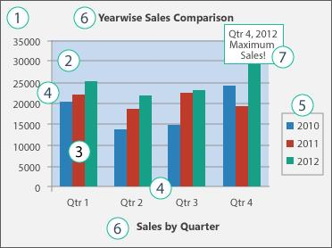

# Working with Charts in JavaScript PowerPoint

The `JavaScript PowerPoint Library` facilitates creating and editing charts in PowerPoint presentations. A chart is composed of various elements such as legends, axes, series, plot area, chart area, title, and data labels. Each chart element corresponds to an object that can be configured programmatically.

## Creating a chart from scratch

An instance of `Chart` can be used to create or modify the charts in a PowerPoint Presentation. The following code example demonstrates how to create a simple chart by adding data from scratch.




import { Presentation } from '@syncfusion/ej2-pptx';
import { detectCharts, enableCharts, loadXlsxRoot, addChart } 
from '@syncfusion/ej2-pptx/charts';

// Enables classic chart authoring (optional charts module + xlsx root).
detectCharts();
await enableCharts();
await loadXlsxRoot();
// Creates a Presentation instance.
const pptxDoc = Presentation.create();
// Adds a blank slide to the Presentation.
const slide = pptxDoc.slides.add();
const PT = 12700;
// Adds chart with type.
const chart = await addChart(slide, {
    type: 'ColumnClustered',
    name: 'Sales Chart',
    bounds: { x: 100 * PT, y: 10 * PT, width: 700 * PT, height: 500 * PT }
});
// Sets the chart title.
chart.hasTitle = true;
await chart.applyHasTitle(true);
await chart.applyChartTitle('Sales Analysis');
await chart.setSeriesCategoryCells(0, [2010, 2011, 2012]);
await chart.replaceSeriesFormulas(0, { title: 'Jan' });
await chart.setSeriesValueCells(0, [60, 80, 60]);
await chart.addSeries({
    title: 'Feb',
    categoryLabels: 'Sheet1!$A$2:$A$4',
    values: 'Sheet1!$C$2:$C$4',
});
await chart.setSeriesValueCells(1, [70, 70, 70]);
// Adds a March series.
await chart.addSeries({
    title: 'March',
    categoryLabels: 'Sheet1!$A$2:$A$4',
    values: 'Sheet1!$D$2:$D$4',
});
await chart.setSeriesValueCells(2, [80, 60, 80]);
// Sets the category axis labels.
const categoryAxis = chart.primaryCategoryAxis;
categoryAxis.categoryLabels = 'Sheet1!$A$2:$A$4';
categoryAxis.title = 'Year';
await chart.commitPrimaryCategoryAxis(categoryAxis);
await chart.commitPrimaryValueAxis({
    title: 'Sales',
    numberFormat: '0.0',
});
await chart.refresh();
// Saves the Presentation to a file.
await pptxDoc.save('Output.pptx');




## Creating charts from excel sheet

A chart can also be created with the data from an existing excel worksheet. The following code example demonstrates the same.







## Refreshing the chart

Sometimes the charts in a PowerPoint Presentation do not represent the actual data. In those cases, the charts should be refreshed to reflect the latest data values.

The following code example demonstrates how to refresh the charts in a PowerPoint Presentation.







## Editing the Chart Data

The data of an existing chart can be modified programmatically. The following code example demonstrates how to edit the chart data in a slide.







## Customizing the chart

A chart is composed of various elements such as legends, axes, series, etc. Each chart element corresponds to an object. The following image illustrates the basic elements of a chart.

1. Chart area — the background area of the chart.
2. Plot area — the area where the data series are plotted.
3. Data points — the individual values that make up a data series.
4. Axes — the horizontal (category) and vertical (value) axes along which data is plotted.
5. Legend — the key that identifies each data series by color or pattern.
6. Title — the chart and axis titles that describe the chart.
7. Data labels — labels that identify the details of a data point in a data series.

### Chart Title

Customize the **chart title** by modifying its name and appearance using the **JavaScript PowerPoint Library**. For more information, click [here](charts/chart-title).

### Chart Area

Customize the **chart area** by changing its border, colors, transparency, and more using the **JavaScript PowerPoint Library**. For further information, click [here](charts/chart-area).

### Chart Plot Area

Customize the **chart plot area** by changing its border, colors, transparency, position, and adding an image using the **JavaScript PowerPoint Library**. For further information, click [here](charts/chart-plot-area).

### Chart Series

Customize the **chart series** by changing the series name, type, color, border, and more using the **JavaScript PowerPoint Library**. For further information, click [here](charts/chart-series).

### Chart Legend

Customize the **chart legend** by changing the position, border, and modifying the legend entry using the **JavaScript PowerPoint Library**. For further information, click [here](charts/chart-legend).

### Chart Data Labels

Customize the **chart data labels** by changing the position, size, and more using the **JavaScript PowerPoint Library**. For further information, click [here](charts/chart-data-labels).

### Chart Axis

Customize the **chart axes** by changing the title, border, font, rotation angle, and more using the **JavaScript PowerPoint Library**. For further information, click [here](charts/chart-axis).

## Removing the chart from slide

The following code example demonstrates how to remove a chart from a slide.





