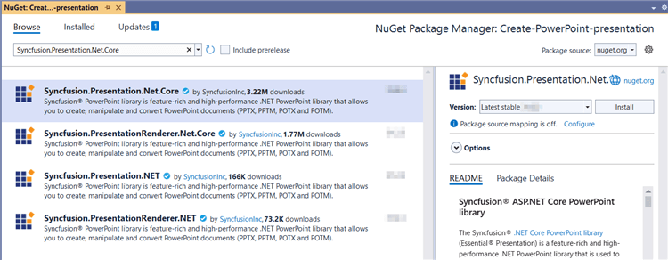
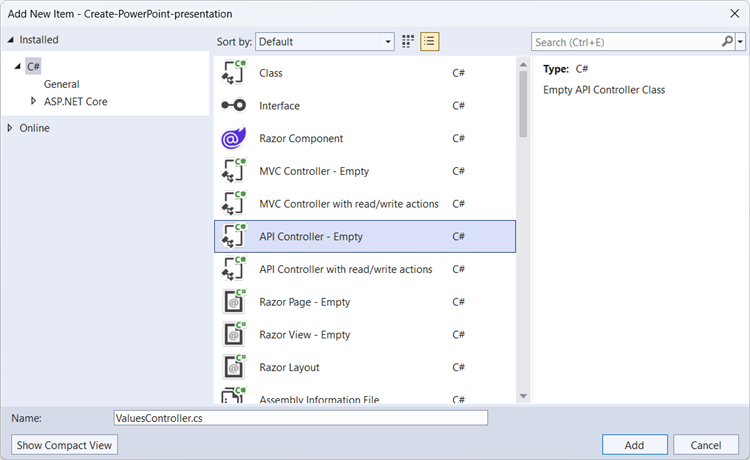
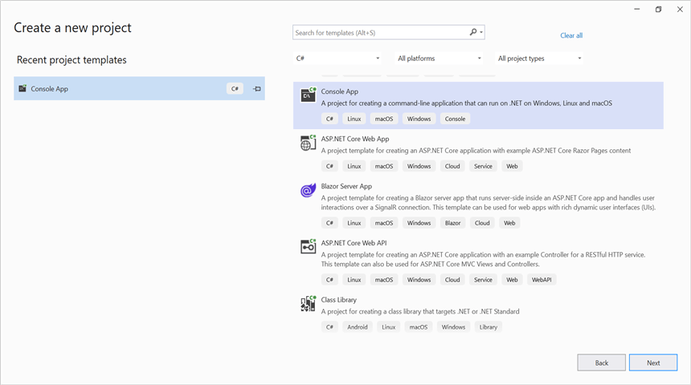
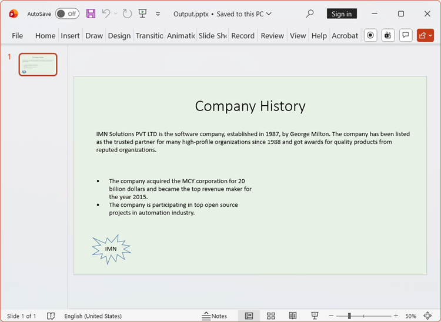

# Create a PowerPoint file using ASP.NET Core Web API

Syncfusion&reg; PowerPoint is a [.NET PowerPoint library](https://www.syncfusion.com/document-processing/powerpoint-framework/net) used to create, read, edit and convert PowerPoint documents programmatically without **Microsoft PowerPoint** or interop dependencies. Using this library, you can **create PowerPoint document in ASP.NET Core Web API**.

## Steps to Create a PowerPoint file in ASP.NET Core Web API:

The below steps illustrate creating a simple PowerPoint Presentation in ASP.NET Core Web API.

Step 1: Create a new C# ASP.NET Core Web API project.

Step 2: Install the [Syncfusion.Presentation.Net.Core](https://www.nuget.org/packages/Syncfusion.Presentation.Net.Core) NuGet package as a reference to your project from [NuGet.org](https://www.nuget.org).

N> Starting with v16.2.0.x, if you reference Syncfusion&reg; assemblies from trial setup or from the NuGet feed, you also have to add "Syncfusion.Licensing" assembly reference and include a license key in your projects. Please refer to this [link](https://help.syncfusion.com/common/essential-studio/licensing/overview) to know about registering Syncfusion&reg; license key in your application to use our components.

Step 3: Add a new API controller empty file in the project.

Step 4: Include the following namespaces in the **ValuesController.cs** file.





using Microsoft.AspNetCore.Mvc;
using Syncfusion.Presentation;





Step 5: Add a new action method CreatePresentation in **ValuesController.cs** and include the below code snippet to create an PowerPoint presentation and download it.





 [HttpGet]
[Route("api/PowerPoint")]
public IActionResult CreatePresentation()
{
    try
    {
        var fileDownloadName = "Output.pptx";
        const string contentType = "application/vnd.openxmlformats-officedocument.presentationml.presentation";
        var stream = GeneratePresentation();
        stream.Position = 0;
        return File(stream, contentType, fileDownloadName);
    }
    catch (Exception ex)
    {
        return BadRequest("Error occurred while creating PowerPoint file: " + ex.Message);
    }
}
 
 



Step 6: Implement the `GeneratePresentation` method in `ValuesController.cs`.
 




 public static MemoryStream GeneratePresentation()
{
    // Create a new instance of PowerPoint Presentation file           
    IPresentation pptxDoc = Presentation.Create();
    // Add a new slide to file and apply background color 
    ISlide slide = pptxDoc.Slides.Add(SlideLayoutType.TitleOnly);
    // Specify the fill type and fill color for the slide background         
    slide.Background.Fill.FillType = FillType.Solid;
    slide.Background.Fill.SolidFill.Color = ColorObject.FromArgb(232, 241, 229);
    // Add title content to the slide by accessing the title placeholder of the  TitleOnly layout-slide 
    IShape titleShape = slide.Shapes[0] as IShape;
    titleShape.TextBody.AddParagraph("Company History").HorizontalAlignment = HorizontalAlignmentType.Center;
    // Add description content to the slide by adding a new TextBox IShape  
    IShape descriptionShape = slide.AddTextBox(53.22, 141.73, 874.19, 77.70);
    descriptionShape.TextBody.Text = "IMN Solutions PVT LTD is the software company, established in 1987, by George Milton. The company has been listed as the trusted partner for many high-profile organizations since 1988 and got awards for quality products from reputed organizations.";
    // Add bullet points to the slide 
    IShape bulletPointsShape = slide.AddTextBox(53.22, 270, 437.90, 116.32);
    // Add a paragraph for a bullet point 
    IParagraph firstPara = bulletPointsShape.TextBody.AddParagraph("The company acquired the MCY corporation for 20 billion dollars and became the top revenue maker for the year 2015.");
    // Format how the bullets should be displayed 
    firstPara.ListFormat.Type = ListType.Bulleted;
    firstPara.LeftIndent = 35;
    firstPara.FirstLineIndent = -35;
    // Add another paragraph for the next bullet point 
    IParagraph secondPara = bulletPointsShape.TextBody.AddParagraph("The company is participating in top open source projects in automation industry.");
    // Format how the bullets should be displayed 
    secondPara.ListFormat.Type = ListType.Bulleted;
    secondPara.LeftIndent = 35;
    secondPara.FirstLineIndent = -35;
    // Add an auto-shape to the slide 
    IShape stampShape = slide.Shapes.AddShape(AutoShapeType.Explosion1, 48.93, 430.71, 104.13, 80.54);
    // Format the auto-shape color by setting the fill type and text   
    stampShape.Fill.FillType = FillType.None;
    stampShape.TextBody.AddParagraph("IMN").HorizontalAlignment = HorizontalAlignmentType.Center;
    // Save the PowerPoint Presentation as stream
    MemoryStream stream = new MemoryStream();
    pptxDoc.Save(stream);
    pptxDoc.Close();
    stream.Position = 0;
    return stream;
}





Step 7: Build the project.

Click on Build → Build Solution or press <kbd>Ctrl</kbd>+<kbd>Shift</kbd>+<kbd>B</kbd> to build the project.

Step 8: Run the project.

Click the Start button (green arrow) or press <kbd>F5</kbd> to run the app.

A complete working sample is available on [GitHub](https://github.com/SyncfusionExamples/DocIO-Examples/tree/main/Getting-Started/ASP.NET-Core-Web-API/Create-Word-Document).

## Steps for accessing the Web API using HTTP requests

Step 1: Create a console application.

N> Ensure your ASP.NET Core Web API is running on the specified port before running this client. Adjust the port number if your Web API runs on a different port (check the ASP.NET Core app's launch settings).

Step 2: Add the below code snippet in the **Program.cs** file for accessing the Web API using HTTP requests. 

This method sends a GET request to the Web API endpoint to retrieve and save the generated Word document.





 // Create an HttpClient instance
using (HttpClient client = new HttpClient())
{
    try
    {
        // Send a GET request to a URL
        HttpResponseMessage response = await client.GetAsync("https://localhost:7073/api/Values/api/PowerPoint");

        // Check if the response is successful
        if (response.IsSuccessStatusCode)
        {
            // Read the content as a string
            Stream responseBody = await response.Content.ReadAsStreamAsync();
            FileStream fileStream = File.Create("../../../Output/Output.pptx");
            responseBody.CopyTo(fileStream);
            fileStream.Close();
        }
        else
        {
            Console.WriteLine("HTTP error status code: " + response.StatusCode);
        }
    }
    catch (HttpRequestException e)
    {
        Console.WriteLine("Request exception: " + e.Message);
    }
}





Step 3: Build the project.

Click on Build → Build Solution or press <kbd>Ctrl</kbd>+<kbd>Shift</kbd>+<kbd>B</kbd> to build the project.

Step 4: Run the project.

Click the Start button (green arrow) or press <kbd>F5</kbd> to run the app.

A complete working sample is available on [GitHub](https://github.com/SyncfusionExamples/DocIO-Examples/tree/main/Getting-Started/ASP.NET-Core-Web-API/Client%20Application).

Upon executing the program, the **PowerPoint Presentation** will be generated as follows.

Click [here](https://www.syncfusion.com/document-processing/word-framework/net) to explore the rich set of Syncfusion&reg; Word library (DocIO) features.

An online sample link to [create a Word document](https://document.syncfusion.com/demos/word/helloworld#/tailwind) in ASP.NET Core. 
