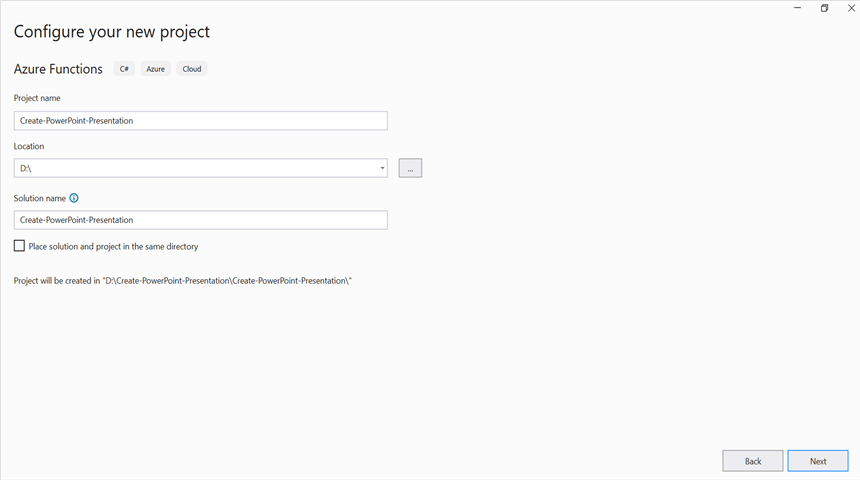
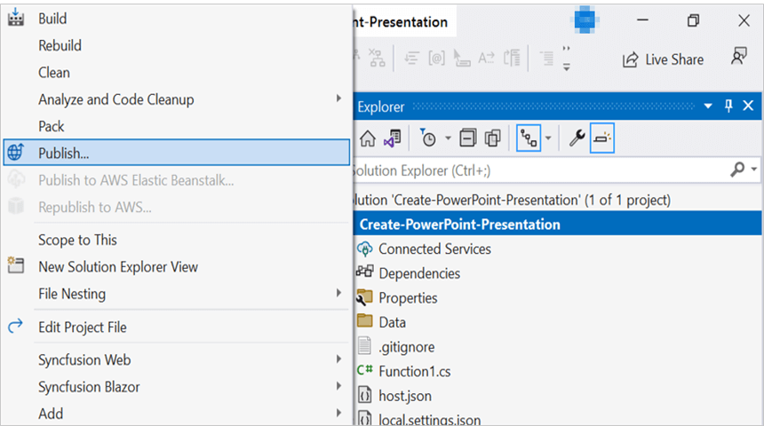
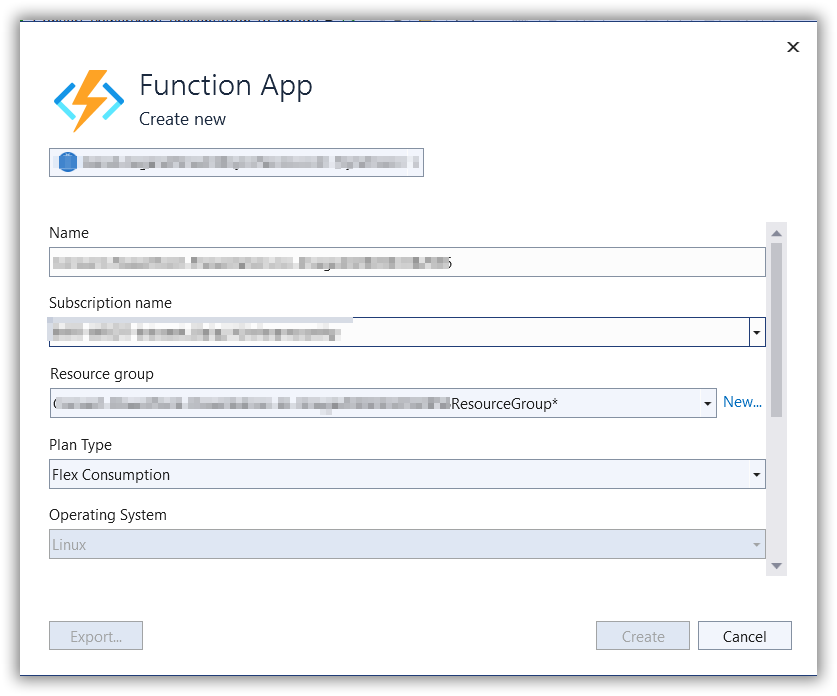

# Create PowerPoint Presentation in Azure Functions (Flex Consumption)

Syncfusion&reg; PowerPoint is a [.NET Core PowerPoint library](https://www.syncfusion.com/document-sdk/net-powerpoint-library) used to create, read, edit and convert PowerPoint documents programmatically without **Microsoft PowerPoint** or interop dependencies. Using this library, you can **create a PowerPoint Presentation in Azure Functions deployed on a Flex (Consumption) plan**.

## Steps to create a PowerPoint Presentation in Azure Functions (Flex Consumption)

N> Prerequisites: An active [Azure subscription](https://azure.microsoft.com/en-us/free/) and Visual Studio with the **Azure development** workload installed.

Step 1: Create a new Azure Functions project.

Step 2: Create a project name and select the location.

Step 3: Select function worker as **.NET 8.0 (Long Term Support)** (isolated worker) and target Flex/Consumption hosting suitable for isolated worker.

Step 4: Install the [Syncfusion.Presentation.Net.Core](https://www.nuget.org/packages/Syncfusion.Presentation.Net.Core) NuGet package as a reference to your project from [NuGet.org](https://www.nuget.org/).

N> Starting with v16.2.0.x, if you reference Syncfusion&reg; assemblies from trial setup or from the NuGet feed, you also have to add "Syncfusion.Licensing" assembly reference and include a license key in your projects. Please refer to this [link](https://help.syncfusion.com/common/essential-studio/licensing/overview) to know about registering Syncfusion&reg; license key in your application to use our components.

Register the Syncfusion license key once at startup, for example in **Program.cs** of the Azure Functions project:




Syncfusion.Licensing.SyncfusionLicenseProvider.RegisterLicense("YOUR_LICENSE_KEY");




Step 5: Include the following namespaces in the **Function1.cs** file.




using System.IO;
using System.Reflection;
using Microsoft.AspNetCore.Mvc;
using Microsoft.Azure.Functions.Worker;
using Microsoft.Azure.Functions.Worker.Http;
using Microsoft.Extensions.Logging;
using Syncfusion.Presentation;




Step 6: Add a folder named **Data** inside the project, place an image (for example, `Image.jpg`) into it, and set its **Build Action** to **Embedded Resource**. The sample code in the next step loads this image as a manifest resource stream from `Create_PowerPoint_Presentation.Data.Image.jpg` (replace `Create_PowerPoint_Presentation` with your project's default namespace).

Step 7: Add the following code snippet in **Run** method of **Function1** class to create a PowerPoint document in Azure Functions and return the resultant **PowerPoint document** to the client end.




public class Function1
{
    private readonly ILogger<Function1> _logger;

    public Function1(ILogger<Function1> logger)
    {
        _logger = logger;
    }

     [Function("CreatePowerPointPresentation")]
    public async Task<IActionResult> Run([HttpTrigger(AuthorizationLevel.Function, "post")] HttpRequest req)
    {
        try
        {
            //Create a new instance of PowerPoint Presentation file.
            using IPresentation pptxDoc = Presentation.Create();
            //Add a new slide to file and apply background color.
            ISlide slide = pptxDoc.Slides.Add(SlideLayoutType.TitleOnly);
            //Specify the fill type and fill color for the slide background.
            slide.Background.Fill.FillType = FillType.Solid;
            slide.Background.Fill.SolidFill.Color = ColorObject.FromArgb(232, 241, 229);
            //Add title content to the slide by accessing the title placeholder of the TitleOnly layout-slide.
            IShape titleShape = slide.Shapes[0] as IShape;
            titleShape.TextBody.AddParagraph("Company History").HorizontalAlignment = HorizontalAlignmentType.Center;
            //Add description content to the slide by adding a new TextBox.
            IShape descriptionShape = slide.AddTextBox(53.22, 141.73, 874.19, 77.70);
            descriptionShape.TextBody.Text = "IMN Solutions PVT LTD is the software company, established in 1987, by George Milton. The company has been listed as the trusted partner for many high-profile organizations since 1988 and got awards for quality products from reputed organizations.";
            //Add bullet points to the slide.
            IShape bulletPointsShape = slide.AddTextBox(53.22, 270, 437.90, 116.32);
            //Add a paragraph for a bullet point.
            IParagraph firstPara = bulletPointsShape.TextBody.AddParagraph("The company acquired the MCY corporation for 20 billion dollars and became the top revenue maker for the year 2015.");
            //Format how the bullets should be displayed.
            firstPara.ListFormat.Type = ListType.Bulleted;
            firstPara.LeftIndent = 35;
            firstPara.FirstLineIndent = -35;
            // Add another paragraph for the next bullet point.
            IParagraph secondPara = bulletPointsShape.TextBody.AddParagraph("The company is participating in top open source projects in automation industry.");
            //Format how the bullets should be displayed.
            secondPara.ListFormat.Type = ListType.Bulleted;
            secondPara.LeftIndent = 35;
            secondPara.FirstLineIndent = -35;
            //Get a picture as stream.
            var assembly = Assembly.GetExecutingAssembly();
            var pictureStream = assembly.GetManifestResourceStream("Create_PowerPoint_Presentation.Data.Image.jpg");
            //Add the picture to a slide by specifying its size and position.
            slide.Shapes.AddPicture(pictureStream, 499.79, 238.59, 364.54, 192.16);
            //Add an auto-shape to the slide.
            IShape stampShape = slide.Shapes.AddShape(AutoShapeType.Explosion1, 48.93, 430.71, 104.13, 80.54);
            //Format the auto-shape color by setting the fill type and text.
            stampShape.Fill.FillType = FillType.None;
            stampShape.TextBody.AddParagraph("IMN").HorizontalAlignment = HorizontalAlignmentType.Center;
            using MemoryStream memoryStream = new MemoryStream();
            //Saves the PowerPoint document file.
            pptxDoc.Save(memoryStream);
            memoryStream.Position = 0;
            var bytes = memoryStream.ToArray();
            return new FileContentResult(bytes, "application/vnd.openxmlformats-officedocument.presentationml.presentation")
            {
                FileDownloadName = "presentation.pptx"
            };
        }
        catch (Exception ex)
        {
            // Log the error with details for troubleshooting
            _logger.LogError(ex, "Error creating PPTX");
            // Prepare error message including exception details
            var msg = $"Exception: {ex.Message}\n\n{ex}";
            // Return a 500 Internal Server Error response with the message
            return new ContentResult { StatusCode = 500, Content = msg, ContentType = "text/plain; charset=utf-8" };
        }
    }
}




Step 8: Right-click the project and select **Publish**. Then, create a new profile in the Publish Window.

Step 9: Select the target as **Azure** and click the **Next** button.

Step 10: Select the specific target as **Azure Function App** and click the **Next** button.

Step 11: Select the **Create new** button.

Step 12: Click the **Create** button.

Step 13: After creating the Function App, click the **Finish** button.

Step 14: Click the **Publish** button.

Step 15: Publish succeeded.

Step 16: Now, go to the Azure portal and select the Function App. After running the function, click **Get Function URL** and copy it. Then, paste it in the client sample below (which will request the Azure Function to **create a PowerPoint Presentation**). You will get the output **PowerPoint Presentation** as follows.

## Steps to post the request to Azure Functions

Step 1: Create a console application to request the Azure Functions API.

Step 2: Create a folder named **Output** inside the project to store the generated PowerPoint file.

Step 3: Add the following code snippet into the **Main** method to post the request to the Azure Function and get the resultant PowerPoint Presentation. Include the following namespaces at the top of the **Program.cs** file: `System`, `System.IO`, `System.Net.Http`, and `System.Threading.Tasks`.




    static async Task Main()
    {
        try
        {
            Console.Write("Please enter your Azure Function URL: ");
            string url = Console.ReadLine();
            if (string.IsNullOrWhiteSpace(url)) return;
            // Create a new HttpClient instance for sending HTTP requests
            using var http = new HttpClient();
            using var content = new StringContent(string.Empty);
            using var res = await http.PostAsync(url, content);
            // Read the response body as a byte array
            var resBytes = await res.Content.ReadAsByteArrayAsync();
            // Extract the media type from the response headers
            string mediaType = res.Content.Headers.ContentType?.MediaType ?? string.Empty;
            // Decide the output file path: the response is a pptx or txt
            string outputPath = mediaType.Contains("presentation", StringComparison.OrdinalIgnoreCase)
                || mediaType.Contains("powerpoint", StringComparison.OrdinalIgnoreCase)
                || mediaType.Equals("application/vnd.openxmlformats-officedocument.presentationml.presentation", StringComparison.OrdinalIgnoreCase)
                ? Path.GetFullPath("../../../Output/Output.pptx")
                : Path.GetFullPath("../../../Output/function-error.txt");
            // Write the response bytes to the output file
            await File.WriteAllBytesAsync(outputPath, resBytes);
            Console.WriteLine($"Saved: {outputPath}");
        }
        catch (Exception ex)
        {
            throw;
        }
    }




From GitHub, you can download the [console application](https://github.com/SyncfusionExamples/PowerPoint-Examples/tree/master/Getting-started/Azure/Azure_Functions/Console_App_Flex_Consumption) and [Azure Functions Flex Consumption](https://github.com/SyncfusionExamples/PowerPoint-Examples/tree/master/Getting-started/Azure/Azure_Functions/Azure_Functions_Flex_Consumption).

Looking for the full .NET PowerPoint Library component overview, features, pricing, and documentation? Visit the  [.NET PowerPoint Library](https://www.syncfusion.com/document-sdk/net-powerpoint-library) page. 

