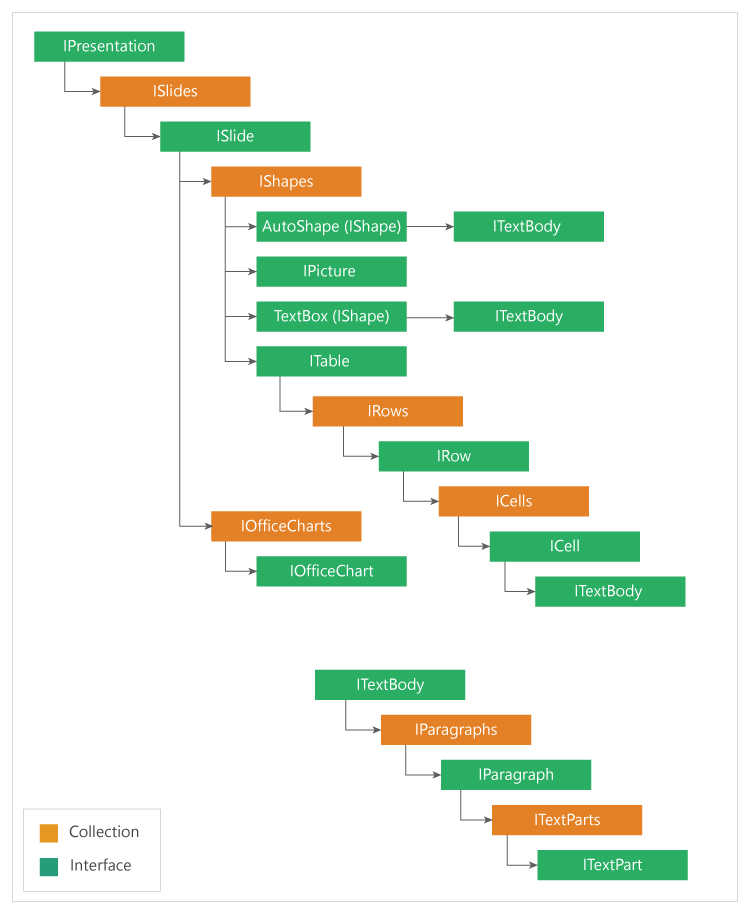

# Document Object Model

To create or modify a PowerPoint Presentation, you need to understand how elements are organized in the Essential&reg; Presentation Document Object Model (DOM). The following figure illustrates the hierarchy of the major DOM elements.

## DOM hierarchy
| Element | Type | Description |
|---------|------|-------------|
| `IPresentation` | Root | Represents the entire PowerPoint presentation file. |
| `ISlide` | Collection member | Represents a single slide within a presentation. |
| `NotesSlide` | Associated element | Stores the speaker notes for a slide. |
| `IShape` | Collection member | Represents a shape, picture, table, chart, or placeholder inside a slide. |
| `ITextBody` | Shape child | Holds the formatted text content of a shape. |
| `IParagraph` | TextBody child | Represents a paragraph within a text body. |
| `ITextPart` | Paragraph child | Represents a run of text within a paragraph. |
| `IPlaceholder` | Shape variant | Represents a layout placeholder on a slide. |

## See also

* [Loading and Saving the Presentation](Loading-and-Saving-the-Presentation)
* [Create, Read, and Edit PowerPoint Files in ASP.NET Core](create-read-edit-powerpoint-files-in-asp-net-core-c-sharp)
* [Open and Save PowerPoint in a Console Application](Open-and-Save-PowerPoint-in-Console-application)

