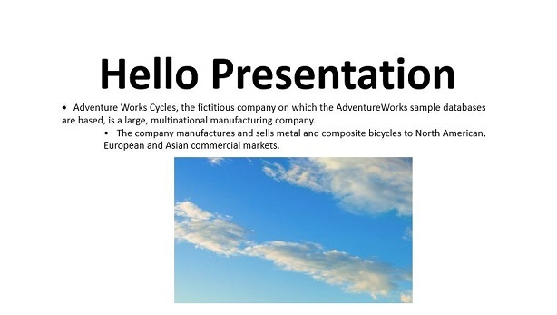

# Getting Started with Essential&reg; Presentation Library

## Creating a simple PowerPoint Presentation with basic elements from scratch

In this page, you can learn how to create a simple [.NET PowerPoint Presentation](https://www.syncfusion.com/document-sdk/net-powerpoint-library) by using Essential&reg; Presentation API.

To quickly get started on creating a PowerPoint presentation, please check out this video:


To create a PowerPoint Presentation, start by creating a new .NET console application and installing the required NuGet package. For cross-platform projects, install the [`Syncfusion.Presentation.NET.Core`](https://www.nuget.org/packages/Syncfusion.Presentation.NET.Core) package. For Windows-specific projects targeting .NET Framework, reference the assemblies listed below instead.

For creating and manipulating a PowerPoint Presentation, include the following assemblies in the .NET Framework (Windows-specific) application.

<table>
    <thead>
        <tr>
            <th>
                Assembly Name
            </th>
            <th>
                Short Description
            </th>
        </tr>
    </thead>
    <tbody>
        <tr>
            <td>
                Syncfusion.Presentation.Base
            </td>
            <td>
                This assembly contains the core features required for creating, reading, manipulating a Presentation file.
            </td>
        </tr>
        <tr>
            <td>
                Syncfusion.Compression.Base
            </td>
            <td>
                This assembly is used to package the Presentation contents.
            </td>
        </tr>
        <tr>
            <td>
                Syncfusion.OfficeChart.Base
            </td>
            <td>
                This assembly contains the office chart object model and core features needed for chart creation.
            </td>
        </tr>
    </tbody>
</table>

N> Starting with v16.2.0.x, if you reference Syncfusion&reg; assemblies from trial setup or from the NuGet feed, you also have to include a license key in your projects. Please refer to this [link](https://help.syncfusion.com/common/essential-studio/licensing/overview) to know about registering Syncfusion&reg; license key in your applications to use our components.

Register the license key once per application before using any Syncfusion Presentation APIs. The following example shows how to register the license key at application startup.




//Register the Syncfusion license key (place this in Program.cs before any Presentation API call)
Syncfusion.Licensing.SyncfusionLicenseProvider.RegisterLicense("YOUR_LICENSE_KEY");



//Register the Syncfusion license key (place this in Program.cs / Application_Start before any Presentation API call)
Syncfusion.Licensing.SyncfusionLicenseProvider.RegisterLicense("YOUR_LICENSE_KEY");



'Register the Syncfusion license key (place this in Application_Start before any Presentation API call)
Syncfusion.Licensing.SyncfusionLicenseProvider.RegisterLicense("YOUR_LICENSE_KEY")




Include the following namespace in your .cs or .vb code as shown below




using Syncfusion.Presentation;



using Syncfusion.Presentation;



Imports Syncfusion.Presentation




An entire PowerPoint Presentation is represented by an instance of [IPresentation](https://help.syncfusion.com/cr/document-processing/Syncfusion.Presentation.IPresentation.html) interface and it is the root element of Essential&reg; Presentation’s DOM.

The following code example demonstrates how to create an instance of [IPresentation](https://help.syncfusion.com/cr/document-processing/Syncfusion.Presentation.IPresentation.html) interface.




//Creates a new instance of PowerPoint presentation
IPresentation pptxDoc = Presentation.Create();



//Creates a new instance of PowerPoint presentation
IPresentation pptxDoc = Presentation.Create();



'Creates a new instance of PowerPoint presentation
Dim pptxDoc As IPresentation = Presentation.Create()




[IPresentation](https://help.syncfusion.com/cr/document-processing/Syncfusion.Presentation.IPresentation.html) instance has a slide collection that represents the individual slides present within a PowerPoint presentation. A slide may contain textual and other graphics contents like shapes, images, charts etc.

The following code example demonstrates how to add a blank slide to a PowerPoint Presentation.




//Adds a slide to the PowerPoint Presentation
ISlide firstSlide = pptxDoc.Slides.Add(SlideLayoutType.Blank);



//Adds a slide to the PowerPoint Presentation
ISlide firstSlide = pptxDoc.Slides.Add(SlideLayoutType.Blank);



'Adds a slide to the PowerPoint Presentation
Dim firstSlide As ISlide = pptxDoc.Slides.Add(SlideLayoutType.Blank)




N> The 'Point' typographic units are used to add or manipulate any element in a Presentation. Position and size values passed to methods such as `AddTextBox` and `AddPicture` are specified in points.

All the textual contents in a Presentation document are represented by paragraphs. Within the paragraph, textual contents are grouped into one or more child elements as [TextParts](https://help.syncfusion.com/cr/document-processing/Syncfusion.Presentation.ITextParts.html). Each [TextPart](https://help.syncfusion.com/cr/document-processing/Syncfusion.Presentation.ITextParts.html) represents a region of text with a common set of formatted text.

The following code example demonstrates how to add text into a presentation.




//Adds a textbox in a slide by specifying its position and size
IShape textShape = firstSlide.AddTextBox(100, 75, 756, 200);
//Adds a paragraph into the textShape
IParagraph paragraph = textShape.TextBody.AddParagraph();
//Set the horizontal alignment of paragraph
paragraph.HorizontalAlignment = HorizontalAlignmentType.Center;
//Adds a textPart in the paragraph
ITextPart textPart = paragraph.AddTextPart("Hello Presentation");
//Applies font formatting to the text
textPart.Font.FontSize = 80;
textPart.Font.Bold = true;



//Adds a textbox in a slide by specifying its position and size
IShape textShape = firstSlide.AddTextBox(100, 75, 756, 200);
//Adds a paragraph into the textShape
IParagraph paragraph = textShape.TextBody.AddParagraph();
//Set the horizontal alignment of paragraph
paragraph.HorizontalAlignment = HorizontalAlignmentType.Center;
//Adds a textPart in the paragraph
ITextPart textPart = paragraph.AddTextPart("Hello Presentation");
//Applies font formatting to the text
textPart.Font.FontSize = 80;
textPart.Font.Bold = true;



'Adds a textbox in a slide by specifying its position and size
Dim textShape As IShape  = firstSlide.AddTextBox(100, 75, 756, 200)
'Adds a paragraph into the textShape
Dim paragraph As IParagraph  = textShape.TextBody.AddParagraph()
'Set the horizontal alignment of paragraph 
paragraph.HorizontalAlignment = HorizontalAlignmentType.Center
'Add a textPart in the paragraph
Dim textPart As ITextPart  = paragraph.AddTextPart("Hello Presentation")
'Applies font formatting to the text
textPart.Font.FontSize = 80
textPart.Font.Bold = True




Essential&reg; Presentation allows you to create simple and multi-level lists that make the content easier to read. The following code example demonstrates how to add a bulleted list in a paragraph.




//Adds a new paragraph with text.
paragraph = textShape.TextBody.AddParagraph("AdventureWorks Cycles, the fictitious company on which the AdventureWorks sample databases are based, is a large, multinational manufacturing company.");
//Sets the list type as bullet
paragraph.ListFormat.Type = ListType.Bulleted;
//Sets the bullet character for this list
paragraph.ListFormat.BulletCharacter = Convert.ToChar(183);
//Sets the font of the bullet character
paragraph.ListFormat.FontName = "Symbol";
//Sets the hanging value as 20
paragraph.FirstLineIndent = -20;



//Adds a new paragraph with text.
paragraph = textShape.TextBody.AddParagraph("AdventureWorks Cycles, the fictitious company on which the AdventureWorks sample databases are based, is a large, multinational manufacturing company.");
//Sets the list type as bullet
paragraph.ListFormat.Type = ListType.Bulleted;
//Sets the bullet character for this list
paragraph.ListFormat.BulletCharacter = Convert.ToChar(183);
//Sets the font of the bullet character
paragraph.ListFormat.FontName = "Symbol";
//Sets the hanging value as 20
paragraph.FirstLineIndent = -20;



'Adds a new paragraph with text.
paragraph = textShape.TextBody.AddParagraph("AdventureWorks Cycles, the fictitious company on which the AdventureWorks sample databases are based, is a large, multinational manufacturing company.")
'Sets the list type as bullet
paragraph.ListFormat.Type = ListType.Bulleted
'Sets the bullet character for this list
paragraph.ListFormat.BulletCharacter = Convert.ToChar(183)
'Sets the font of the bullet character
paragraph.ListFormat.FontName = "Symbol"
'Sets the hanging value as 20
paragraph.FirstLineIndent = -20




In PowerPoint Presentation, the multilevel lists are used for presenting the content in a hierarchy. You can create a multi-level list by setting the indentation levels. By default, the level begins at 0 and increments by 1 for each level. The following code example demonstrates how to add multi-level list in a paragraph.




//Adds a new paragraph  
paragraph = textShape.TextBody.AddParagraph("The company manufactures and sells metal and composite bicycles to North American, European and Asian commercial markets.");
//Sets the list type as bullet
paragraph.ListFormat.Type = ListType.Bulleted;
//Sets the list level as 2. Possible values can range from 0 to 8
paragraph.IndentLevelNumber = 2;



//Adds a new paragraph  
paragraph = textShape.TextBody.AddParagraph("The company manufactures and sells metal and composite bicycles to North American, European and Asian commercial markets.");
//Sets the list type as bullet
paragraph.ListFormat.Type = ListType.Bulleted;
//Sets the list level as 2. Possible values can range from 0 to 8
paragraph.IndentLevelNumber = 2;



'Adds a new paragraph  
paragraph = textShape.TextBody.AddParagraph("The company manufactures and sells metal and composite bicycles to North American, European and Asian commercial markets.")
'Sets the list type as bullet
paragraph.ListFormat.Type = ListType.Bulleted
'Sets the list level as 2. Possible values can range from 0 to 8
paragraph.IndentLevelNumber = 2




You can add images to the Presentation by adding them in the picture collection of a slide. The following code example demonstrates how to add an image in a presentation.




//Gets the image from file path
FileStream imageStream = new FileStream(@"Image.png", FileMode.Open, FileAccess.Read);
// Adds the image to the slide by specifying position and size
firstSlide.Pictures.AddPicture(imageStream, 300, 270, 410, 250);



//Gets the image from file path
Image image = Image.FromFile(@"image.jpg");
// Adds the image to the slide by specifying position and size
firstSlide.Pictures.AddPicture(new MemoryStream(image.ImageData), 300, 270, 410, 250);



'Gets the image from file path
Dim image__1 As Image = Image.FromFile("image.jpg")
' Adds the image to the slide by specifying position and size 
firstSlide.Pictures.AddPicture(New MemoryStream (image__1.ImageData), 300, 270, 410, 250)




Finally, save the Presentation in file system and close its instance.




//Saving the PowerPoint Presentation as stream
FileStream stream = new FileStream("Sample.pptx", FileMode.Create, FileAccess.ReadWrite);
pptxDoc.Save(stream);
//Dispose stream
stream.Dispose();
//Close the presentation
pptxDoc.Close();



//Saves the Presentation in the given name 
pptxDoc.Save("Output.pptx");
//Releases the resources occupied
pptxDoc.Close();



'Saves the Presentation in the given name
pptxDoc.Save("Output.pptx")
'Releases the resources occupied
pptxDoc.Close()




You can download a complete working sample from [GitHub](https://github.com/SyncfusionExamples/PowerPoint-Examples/tree/master/Getting-started/Create-PowerPoint-with-basic-elements).

The resultant PowerPoint Presentation looks as follows.

## Converting PowerPoint Presentation to PDF

Essential&reg; Presentation allows you to convert a PowerPoint Presentation into PDF document. The following assemblies are required for the Presentation to PDF conversion.

<table>
    <thead>
        <tr>
            <th>
                Assembly Name
            </th>
            <th>
                Short Description
            </th>
        </tr>
    </thead>
    <tbody>
        <tr>
            <td>
                Syncfusion.Presentation.Base
            </td>
            <td>
                This assembly contains the core features required for creating, reading, manipulating a Presentation file.
            </td>
        </tr>
        <tr>
            <td>
                Syncfusion.Compression.Base
            </td>
            <td>
                This assembly is used to pack the Presentation contents.
            </td>
        </tr>
        <tr>
            <td>
                Syncfusion.OfficeChart.Base
            </td>
            <td>
                This assembly contains the office chart object model and core features needed for chart creation.
            </td>
        </tr>
        <tr>
            <td>
                Syncfusion.OfficeChartToImageConverter.WPF
            </td>
            <td>
                This assembly is used to convert Office Chart into Image. 
            </td>
        </tr>
        <tr>
            <td>
                Syncfusion.Pdf.Base
            </td>
            <td>
                This assembly is used for PDF file creation. 
            </td>
        </tr>
        <tr>
            <td>
                Syncfusion.PresentationToPDFConverter.Base
            </td>
            <td>
                This assembly is used to convert Presentation file into PDF. 
            </td>
        </tr>
        <tr>
            <td>
                Syncfusion.SfChart.WPF
            </td>
            <td>
                Supporting assembly for Syncfusion.OfficeChartToImageConverter.WPF
            </td>
        </tr>
    </tbody>
</table>

Include the following namespaces in your .cs or .vb code as shown below




using Syncfusion.Pdf;
using Syncfusion.Presentation;
using Syncfusion.PresentationRenderer;
using System.IO;



using Syncfusion.Presentation;
using Syncfusion.OfficeChartToImageConverter;
using Syncfusion.Pdf;
using Syncfusion.PresentationToPdfConverter;



Imports Syncfusion.Presentation
Imports Syncfusion.OfficeChartToImageConverter
Imports Syncfusion.Pdf
Imports Syncfusion.PresentationToPdfConverter




[PresentationToPdfConverter](https://help.syncfusion.com/cr/document-processing/Syncfusion.PresentationToPdfConverter.PresentationToPdfConverter.html) class is responsible for converting an entire Presentation or a slide into PDF. The following code example demonstrates how to convert the PowerPoint presentation to PDF.




//Opens an existing PowerPoint presentation from file path.
string basePath = _hostingEnvironment.WebRootPath;
FileStream fileStreamInput = new FileStream(basePath + @"/Presentation/ConversionTemplate.pptx", FileMode.Open, FileAccess.Read);
IPresentation pptxDoc = Presentation.Open(fileStreamInput);
//Convert the PowerPoint document to PDF document.
PdfDocument pdfDocument = PresentationToPdfConverter.Convert(pptxDoc);
//Save the converted PDF document to Memory stream.
MemoryStream pdfStream = new MemoryStream();
pdfDocument.Save(pdfStream);
pdfStream.Position = 0;
//Close the PDF document.
pdfDocument.Close(true);
//Close the PowerPoint Presentation.
pptxDoc.Close();



//Opens a PowerPoint Presentation file
IPresentation pptxDoc = Presentation.Open(fileName);
//Creates an instance of ChartToImageConverter and assigns it to ChartToImageConverter property of Presentation
pptxDoc.ChartToImageConverter = new ChartToImageConverter();
//Converts the PowerPoint Presentation into PDF document
PdfDocument pdfDocument = PresentationToPdfConverter.Convert(pptxDoc);
//Saves the PDF document
pdfDocument.Save(@"SampleWithoutSetting.pdf");
//Closes the PDF document
pdfDocument.Close(true);
//Closes the Presentation
pptxDoc.Close();



'Opens a PowerPoint Presentation
Dim pptxDoc As IPresentation = Presentation.Open(fileName)

'Creates an instance of ChartToImageConverter and assigns it to ChartToImageConverter property of Presentation
pptxDoc.ChartToImageConverter = New ChartToImageConverter ()
'Converts the PowerPoint Presentation into PDF document
Dim pdfDocument As PdfDocument = PresentationToPdfConverter.Convert(pptxDoc)
'Saves the PDF document
pdfDocument.Save("SampleWithoutSetting.pdf")
'Closes the PDF document
pdfDocument.Close(True)
'Closes the Presentation
pptxDoc.Close()




N> * Creating an instance of [ChartToImageConverter](https://help.syncfusion.com/cr/document-processing/Syncfusion.OfficeChartToImageConverter.ChartToImageConverter.html) class is mandatory to convert the charts in the PowerPoint presentation to PDF/Image format. Otherwise, the charts are not exported to the converted PDF/Image.
N> * [ChartToImageConverter](https://help.syncfusion.com/cr/document-processing/Syncfusion.OfficeChartToImageConverter.ChartToImageConverter.html) is supported from .NET Framework 4.0 onwards.
N> * The Essential Presentation Library supports PowerPoint presentation to PDF conversion in UWP applications using PresentationRenderer. For further information, please refer [here](https://help.syncfusion.com/document-processing/powerpoint/conversions/powerpoint-to-pdf/net/convert-powerpoint-to-pdf-in-uwp).

[PresentationToPdfConverterSettings](https://help.syncfusion.com/cr/document-processing/Syncfusion.PresentationToPdfConverter.PresentationToPdfConverterSettings.html) can be used to customize the conversion of Presentation to PDF document. For more information about Presentation to PDF conversion settings and chart image quality options, see [PowerPoint to PDF conversion](https://help.syncfusion.com/document-processing/powerpoint/conversions/powerpoint-to-pdf/net/).

N> You can refer to our [.NET PowerPoint framework](https://www.syncfusion.com/document-sdk/net-powerpoint-library) webpage to see the product’s groundbreaking features. You can also explore our [.NET PowerPoint framework demo](https://www.syncfusion.com/demos/fileformats/powerpoint-library) that shows how to create and modify PowerPoint files from C# with just five lines of code on different platforms.

## Online Demo

* Explore how to create slides with simple text in a PowerPoint presentation using the [.NET PowerPoint Library](https://www.syncfusion.com/document-sdk/net-powerpoint-library) (Presentation) in a live demo [here](https://document.syncfusion.com/demos/powerpoint/default#/tailwind).

N> Looking for the full .NET PowerPoint Library component overview, features, pricing, and documentation? Visit the [.NET PowerPoint Library](https://www.syncfusion.com/document-sdk/net-powerpoint-library) page.